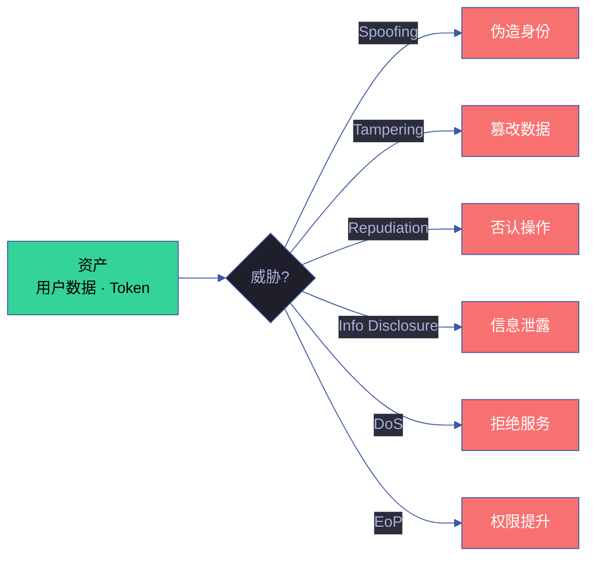

# Security Policy

## 威胁模型

YrY CDN 是纯静态前端资源库，攻击面主要分布在以下四层：

| 层级 | 威胁类型 | 风险等级 | 影响范围 |
|------|---------|---------|---------|
| **传输层** | CDN 劫持 · 中间人攻击 · DNS 污染 | 高 | 所有消费页面 |
| **资源层** | 供应链投毒 · npm 包篡改 · 依赖漏洞 | 高 | 所有消费页面 |
| **代码层** | XSS · CSS 注入 · 原型链污染 · DOM Clobbering | 中 | 单个组件/页面 |
| **数据层** | 设计令牌覆盖 ·  localStorage 泄漏 · 敏感信息暴露 | 低 | 特定功能 |

## Supported Versions

| 版本范围 | 支持状态 | 安全更新 |
|---------|---------|---------|
| `1.2.x` (最新) | 积极维护 | 7 天内发布补丁 |
| `1.1.x` | 仅严重漏洞 | 建议升级到 1.2.x |
| `1.0.x` | 已停止维护 | 必须升级 |
| `< 1.0.0` | 不支持 | — |

## 报告漏洞

**请勿在 GitHub Issues 公开报告安全问题。**

### 上报渠道 (按优先级)

1. **GitHub Security Advisories** (推荐): https://github.com/effiyichengliang/YrY/security/advisories/new
2. **邮件**: 在 GitHub 个人资料 (`@effiyichengliang`) 查找联系方式
3. **PGP 加密**: 如需加密通信，请在上述渠道索取 PGP 公钥

### 上报需包含

- 漏洞描述与影响范围 (哪些组件/版本受影响)
- 复现步骤 (最小化 PoC，优先提供 HTML 单文件复现)
- 潜在影响评估 (XSS? CSS 注入? 资源加载劫持? 供应链?)
- 是否已公开 / 是否被利用
- 建议修复方案 (可选)

### 处理流程与时间承诺

| 阶段 | 时限 | 动作 |
|------|------|------|
| 确认收到 | 48 小时内 | 分配 CVE/GHSA 编号，确认复现 |
| 初步评估 | 7 天内 | 给出严重等级、受影响版本范围、修复计划 |
| 修复发布 | 严重 72h / 高 7d / 中 14d / 低 30d | 发布补丁版本 + 安全公告 |
| 事后复盘 | 修复后 14 天内 | 根因分析、测试补充、流程改进 |

修复发布后在 [CHANGELOG.md](./CHANGELOG.md) 与安全公告中致谢 (除非你希望匿名)。

## Content Security Policy (CSP)

消费 YrY CDN 的页面建议配置以下 CSP 头部：

```html
<!-- 推荐: 严格 CSP (适用于纯静态页面) -->
<meta http-equiv="Content-Security-Policy"
      content="default-src 'self';
               style-src 'self' 'unsafe-inline' https://cdn.jsdelivr.net;
               script-src 'self' 'unsafe-inline' https://unpkg.com https://cdn.jsdelivr.net;
               font-src 'self' https://cdn.jsdelivr.net;
               img-src 'self' data:;
               connect-src 'self';
               frame-ancestors 'none';
               base-uri 'self';
               form-action 'self';">
```

| 指令 | 推荐值 | 说明 |
|------|--------|------|
| `script-src` | `'self' 'unsafe-inline' https://unpkg.com https://cdn.jsdelivr.net` | Vue 3 运行时 + CDN 组件 JS |
| `style-src` | `'self' 'unsafe-inline' https://cdn.jsdelivr.net` | CDN CSS + 内联样式 |
| `font-src` | `'self' https://cdn.jsdelivr.net` | woff2 字体文件 |
| `frame-ancestors` | `'none'` | 禁止被 iframe 嵌入 |
| `base-uri` | `'self'` | 防止 base 标签注入 |

> **注意**: `'unsafe-inline'` 是 Vue 3 模板编译的必要条件。如使用构建工具预编译，可移除该指令。

## Subresource Integrity (SRI)

### 生成 SRI Hash

```bash
# 方法 1: openssl (推荐)
cat shared/index.js | openssl dgst -sha384 -binary | openssl base64 -A

# 方法 2: shasum
shasum -b -a 384 shared/index.js | awk '{ print $1 }' | xxd -r -p | base64

# 方法 3: Node.js 脚本
node -e "
const crypto = require('crypto');
const fs = require('fs');
const hash = crypto.createHash('sha384').update(fs.readFileSync('shared/index.js')).digest('base64');
console.log('sha384-' + hash);
"
```

### 使用 SRI

```html
<!-- jsDelivr 自动提供 SRI (推荐) -->
<script src="https://cdn.jsdelivr.net/npm/yry-cdn@1.2.0/shared/index.js"
        integrity="sha384-..."
        crossorigin="anonymous"></script>

<!-- 自托管: 锁定版本号 + SRI -->
<link rel="stylesheet" href="/cdn/shared/index.css?v=1.2.0"
      integrity="sha384-..."
      crossorigin="anonymous">
```

> **SRI 版本锁定**: 每次版本升级后，必须重新生成并更新所有 `integrity` 属性。建议在 CI 中自动化此流程。

## 供应链安全

### npm 发布安全

```bash
# 发布前安全检查
npm audit                    # 依赖漏洞扫描
npm audit signatures         # 验证 registry 签名
npm pack --dry-run           # 预览将发布的文件
```

### 依赖锁定

```json
// package.json — 锁定所有依赖版本
{
  "dependencies": {},
  "devDependencies": {
    "eslint": "9.37.0",
    "stylelint": "16.10.0",
    "prettier": "3.6.0"
  }
}
```

### jsDelivr 缓存风险

| 风险 | 缓解 |
|------|------|
| npm 发布后 jsDelivr 延迟 (最长 24h) | 使用 `purge.jsdelivr.net` API 手动刷新 |
| CDN 边缘节点缓存不一致 | 版本化 URL (禁止 `@latest`) |
| jsDelivr 服务不可用 | 自托管 fallback + 本地静态降级版本 |

### 自托管 Fallback 策略

```html
<!-- 主 CDN (jsDelivr) -->
<link rel="stylesheet" href="https://cdn.jsdelivr.net/npm/yry-cdn@1.2.0/shared/index.css"
      onerror="this.onerror=null;this.href='/cdn/shared/index.css'">
<!-- 自托管 fallback: 同目录下的静态副本 -->
```

## 依赖漏洞扫描

### CI 集成 (GitHub Actions)

```yaml
# .github/workflows/security.yml
name: Security Audit
on:
  schedule:
    - cron: '0 7 * * 1'  # 每周一早 7 点
  push:
    branches: [main]
jobs:
  audit:
    runs-on: ubuntu-latest
    steps:
      - uses: actions/checkout@v4
      - uses: actions/setup-node@v4
        with: { node-version: '20' }
      - run: npm ci
      - run: npm audit --audit-level=high
      - run: npx socket security scan
```

### 本地扫描

```bash
npm audit                  # npm 内置审计
npx socket security scan   # Socket.dev 供应链分析
npx snyk test              # Snyk 漏洞扫描
```

## 已知风险面与缓解

| 类型 | 描述 | 严重度 | 缓解措施 | 状态 |
|------|------|--------|---------|------|
| **XSS via `YrY.toast`** | `esc()` 转义不含 `<script>` 过滤 | 中 | 消费方自行 sanitize | 监控中 |
| **HTML 模板 XSS** | Vue `v-html` 可绕过转义 | 高 | 组件内禁止 `v-html` 渲染外部数据 | 已缓解 |
| **CSS 注入 via `data-*`** | 属性覆盖设计令牌 | 低 | `:root` 声明为只读 | 已缓解 |
| **外部字体劫持** | fonts/index.css 通过 jsDelivr 加载 | 中 | 启用 SRI / 自托管字体 | 可选 |
| **原型链污染** | `Object.assign` 未过滤 `__proto__` | 中 | 使用 `Object.create(null)` 或 Map | 监控中 |
| **DOM Clobbering** | 组件内 `id` 属性冲突 | 低 | 组件 ID 使用 `yry-` 命名空间前缀 | 已缓解 |

## 安全编码规范

### Vue 组件

```javascript
// 禁止: v-html 渲染外部数据
template: '<div v-html="userInput"></div>'

// 允许: 使用 textContent 或 {{ }} 插值
template: '<div>{{ sanitizedInput }}</div>'

// 禁止: 动态构造 <script> 标签
const s = document.createElement('script');
s.src = userProvidedUrl;  // 不可接受

// 允许: 使用已知白名单
const ALLOWED_SCRIPTS = ['shared/index.js', 'theme/index.js'];
if (ALLOWED_SCRIPTS.includes(scriptName)) { /* 加载 */ }
```

### CSS 组件

```css
/* 禁止: expression() (IE 遗留) */
.yry-foo { width: expression(document.body.offsetWidth); }

/* 禁止: url() 引用外部不受信资源 */
.yry-bg { background-image: url('https://untrusted.com/bg.png'); }

/* 允许: 使用设计令牌变量 */
.yry-bg { background: var(--yry-color-bg, #1a1b26); }
```

## 事件响应

### 安全事件分级

| 等级 | 定义 | 响应时间 | 通知方式 |
|------|------|---------|---------|
| **P0 严重** | 远程代码执行、大规模 XSS、供应链投毒 | 4 小时内 | 全渠道 (GitHub + npm + 邮件) |
| **P1 高** | 认证绕过、数据泄漏、权限提升 | 24 小时内 | GitHub Advisory + npm |
| **P2 中** | 受限 XSS、CSS 注入、信息泄漏 | 7 天内 | GitHub Advisory |
| **P3 低** | 理论攻击向量、需特定条件 | 30 天内 | CHANGELOG 记录 |

### 响应步骤

1. **确认** — 验证漏洞可复现，确认影响范围
2. **遏制** — 如为 npm 包，考虑标记为 deprecated 或 yank 受影响版本
3. **修复** — 开发补丁，通过 CI 全量验证
4. **发布** — 发布新版本，更新安全公告
5. **通知** — 通过 GitHub Advisory + npm 通知用户升级
6. **复盘** — 根因分析，补充测试用例，更新安全编码规范

## 安全测试

### 自动化测试

```bash
# ESLint 安全插件
npm run lint          # 含 no-eval · no-implied-eval · no-script-url

# 架构合规检查 (含安全维度)
node lib/arch-check.mjs

# HTML 验证
npx html-validate cdn/**/*.html
```

### 手动检查清单

- [ ] 所有用户输入经过 sanitize
- [ ] 无 `eval()` / `new Function()` / `setTimeout(string)`
- [ ] 无 `innerHTML` / `v-html` 渲染外部数据
- [ ] 无外部不受信 URL 引用 (CSS url() / script src)
- [ ] 所有 npm 依赖无高危 CVE
- [ ] SRI hash 与当前版本一致
- [ ] CSP 头部覆盖所有资源类型

### SAST 工具集成矩阵

| 工具 | 覆盖 | 集成 | 频率 | 严重度阈值 |
|------|------|------|:---:|:---:|
| `scripts/security-scan.mjs` | 密钥/XSS/依赖 | npm run | 每次提交 | P0 |
| `npm audit` | 依赖漏洞 | npm 内置 | 每日 | high+ |
| ESLint security | 代码模式 | lint 阶段 | 每次提交 | error |
| Semgrep | 多语言 SAST | CI runner | PR | high+ |
| GitHub Dependabot | 依赖更新 | GitHub | 周 | critical |
| Socket | 供应链 | npm | 每安装 | high+ |

### 威胁建模模板



### 安全审计清单

| # | 审计项 | 频率 | 责任人 | 工具 |
|---|--------|:---:|------|------|
| 1 | 密钥扫描 | 每次提交 | CI | security-scan.mjs |
| 2 | 依赖漏洞 | 每日 | Dependabot | npm audit |
| 3 | 代码模式 | 每次提交 | ESLint | eslint-plugin-security |
| 4 | CSP 合规 | 每周 | 运维 | CSP Evaluator |
| 5 | SRI 有效性 | 每次发布 | CI | openssl dgst |
| 6 | 权限审查 | 季度 | 安全负责人 | 手动 |
| 7 | 渗透测试 | 年度 | 外部团队 | OWASP ZAP |
| 8 | 供应链审计 | 月度 | Socket | socket.dev |

### 漏洞披露政策

| 阶段 | 时效 | 动作 |
|------|:---:|------|
| 接收 | 0h | 确认收到报告 |
| 验证 | 4h | 复现漏洞 |
| 评估 | 24h | 分级 P0-P3 |
| 修复 | P0: 4h / P1: 24h / P2: 7d / P3: 30d | 开发补丁 |
| 发布 | 修复后 1h | npm publish + 公告 |
| 通知 | 发布后 1h | 全渠道通知 |
| 复盘 | 发布后 7d | 根因 + 改进 |

### 安全 metrics 与 KPI

| 指标 | 目标 | 当前 | 度量 |
|------|:---:|:---:|------|
| 平均修复时间 (MTTR) | P0 ≤ 4h | — | 历史数据 |
| 漏洞复现率 | ≤ 5% | — | 同类漏洞统计 |
| 安全测试覆盖率 | ≥ 90% | — | 代码审计 |
| 依赖漏洞数 | 0 high+ | 0 | npm audit |
| 密钥泄露事件 | 0 | 0 | security-scan |
| CSP 违规 | 0 | 0 | CSP 报告 |
| SRI 失败率 | 0 | 0 | CDN 日志 |

---

> **安全联系**: GitHub Security Advisories · 详见 [COMPONENTS.md](./COMPONENTS.md) 各组件安全章节 · 架构安全审查见 [../docs/项目分析/](../docs/项目分析/)