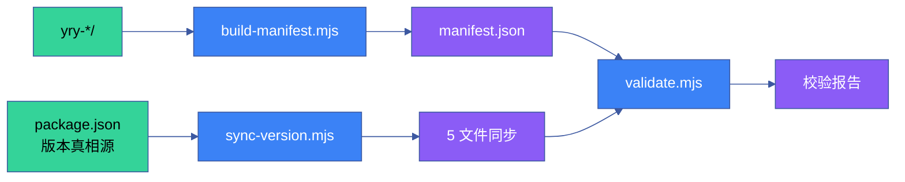

# YrY CDN · Scripts 构建脚本

> CDN 组件库的维护工具链：**清单生成 · 版本同步 · 开发检查 · 完整性验证**。
> 对应 CLAUDE.md [自托管一致性](../../CLAUDE.md#项目不可妥协底线) 底线：`plugin.json` 版本号必须与实际 skills 内容一致。

## 文件

```
scripts/
├── build-manifest.mjs  # 组件清单生成器 (→ components-manifest/index.json)
├── sync-version.mjs    # 版本号同步 (package.json ↔ 各组件)
├── dev-check.mjs       # 开发环境检查 (npm run self-check)
└── validate.mjs        # 组件完整性验证 (4 维度)
```

## npm run 命令速查

| 命令 | 作用 | 对应脚本 |
|------|------|---------|
| `npm run lint` | ESLint + Stylelint（0 warning） | — |
| `npm run lint:js` | `eslint "**/*.js" --max-warnings 0` | — |
| `npm run lint:css` | `stylelint "**/*.css"` | — |
| `npm run format` | Prettier --write | — |
| `npm run format:check` | Prettier --check（CI 友好） | — |
| `npm run build:manifest` | 生成 components.manifest.json | `build-manifest.mjs` |
| `npm run sync:version` | 同步版本号到所有引用点 | `sync-version.mjs` |
| `npm run validate` | 4 维度全量校验 | `validate.mjs` |
| `npm run validate:manifest` | 仅校验清单 | `validate.mjs --only=manifest` |
| `npm run validate:version` | 仅校验版本 | `validate.mjs --only=version` |
| `npm run validate:components` | 仅校验组件 | `validate.mjs --only=components` |
| `npm run self-check` | 开发环境自检 | `dev-check.mjs` |

## 直接执行

```bash
node scripts/build-manifest.mjs      # 生成清单
node scripts/sync-version.mjs        # 同步版本
node scripts/dev-check.mjs           # 开发检查
node scripts/validate.mjs            # 4 维度全量验证
node scripts/validate.mjs --only=manifest    # 仅清单
node scripts/validate.mjs --only=version     # 仅版本
node scripts/validate.mjs --only=components  # 仅组件
```

## build-manifest.mjs

扫描所有 `yry-*` 目录，生成 `components-manifest/index.json`，每组件记录：

| 字段 | 说明 |
|------|------|
| `name` | 组件名（去 `yry-` 前缀） |
| `type` | `vue` · `vanilla` · `unknown`（依据 `index.js` 内容判定） |
| `status` | `complete`（html+css+js 齐全）· `incomplete`（缺失文件） |
| `files` | `index.html` / `index.css` / `index.js` 存在性 |
| `tokens` | CSS 设计令牌使用情况 |
| `runtime` | 运行时依赖（Vue 等） |
| `exports` | 全局导出变量名 |

## validate.mjs — 4 维度校验

对应 CONTRIBUTING.md "🧪 校验维度" 的自动化实现：

| 维度 | 函数 | 检查项 | 失败信号 |
|------|------|--------|---------|
| **D0 组件完整性** | `validateComponents()` | `yry-*/` 同时具备 `index.{html,css,js}`；自定义元素注册代码完整 | `❌` 阻断合并 |
| **D1 清单元数据** | `validateManifest()` | `components-manifest/index.json` 与文件系统一致 | `❌` 重新 build:manifest |
| **D7 版本同步** | `validateVersion()` | `package.json` / `index.html` / `README.md` 版本号一致 | `❌` 重新 sync:version |
| **D4 令牌覆盖** | `validateTokens()` | `tokens/index.css` 包含 14 基础令牌 | `⚠️` 警告 |

输出格式：`✓ 通过` / `⚠️ 警告` / `❌ 错误` / `ℹ️ 信息`

## sync-version.mjs

将 `package.json` 中的版本号单向同步到所有需要版本引用的文件：

- `cdn/index.html`（scene-header meta）
- `cdn/README.md`（版本徽章）
- `cdn/COMPONENTS.md`（版本徽章）
- 各组件 `index.html` 的 `<meta name="version">`（若存在）

**单向数据流**：`package.json` 是唯一版本真相源，其他文件只读取同步。

## dev-check.mjs

开发环境自检（`npm run self-check`）：

- Node.js 版本（≥ 18）
- 必要目录存在（`yry-*` · `theme` · `tokens` · `fonts`）
- package.json 与 lockfile 一致
- 关键文件未缺失

## 提交流程

```bash
# 1. 新增组件后
npm run build:manifest        # 重新生成清单
npm run sync:version          # 同步版本（若有版本变更）

# 2. 本地校验
npm run validate              # 4 维度全量
npm run lint                  # 0 warning
npm run format:check          # CI 友好检查

# 3. 提交（Conventional Commits）
git commit -m "feat(cdn): add yry-xxx component"
```

## 脚本性能基线

| 脚本 | 输入规模 | 耗时 | 内存 | 输出 |
|------|------|:---:|:---:|:---:|
| build-manifest.mjs | 125 组件 | ≤ 500ms | ≤ 20MB | manifest.json |
| sync-version.mjs | 5 文件 | ≤ 50ms | ≤ 5MB | 文件更新 |
| validate.mjs | 全量 | ≤ 1s | ≤ 30MB | 校验报告 |
| dev-check.mjs | 开发环境 | ≤ 200ms | ≤ 10MB | 通过/失败 |
| lint | 全量 | ≤ 5s | ≤ 50MB | lint 报告 |
| format:check | 全量 | ≤ 3s | ≤ 30MB | diff 报告 |

## CI 集成矩阵

| 阶段 | 触发 | 脚本 | 阻断 | 时效要求 |
|------|------|------|:---:|:---:|
| pre-commit | git commit | lint + format:check | ✅ | ≤ 10s |
| pre-push | git push | validate | ✅ | ≤ 30s |
| CI build | PR | validate + lint + test | ✅ | ≤ 5min |
| 发布前 | git tag | build:manifest + sync:version + validate | ✅ | ≤ 1min |
| 定时 | Cron 每日 | validate + security-scan | ⚠️ | ≤ 10min |

## 脚本依赖关系



## 脚本输出格式

### 成功输出
```
✓ D0 组件完整性 (111/125 完整 + 14 待完善)
✓ D1 清单元数据 (manifest 一致)
✓ D7 版本同步 (package.json = index.html = README.md)
✓ D4 令牌覆盖 (14/14)
ℹ️ 总计: 4 通过 · 0 警告 · 0 错误
```

### 失败输出
```
❌ D0 组件完整性
   - yry-xxx 缺少 index.js
   - yry-yyy 缺少 index.css
⚠️ D4 令牌覆盖
   - 缺少 --yry-color-info
ℹ️ 总计: 2 通过 · 1 警告 · 1 错误
修复建议: npm run build:manifest && npm run sync:version
```

## 脚本扩展指南

新增校验脚本时遵循：

| # | 步骤 | 实现 | 示例 |
|---|------|------|------|
| 1 | 命名 | `validate-<name>.mjs` | validate-a11y.mjs |
| 2 | 入口 | shebang + cli 解析 | `#!/usr/bin/env node` |
| 3 | 函数 | 导出 `validate<Name>()` | `export function validateA11y()` |
| 4 | 输出 | 统一格式 (✓/⚠️/❌/ℹ️) | 4 级符号 |
| 5 | 集成 | 添加到 validate.mjs | `import { validateA11y }` |
| 6 | 文档 | 更新本 README | 脚本说明 |
| 7 | 测试 | 添加 fixtures | 通过/失败场景 |

## 故障排查

| 问题 | 根因 | 修复 |
|------|------|------|
| `manifest.json` 过时 | 新增组件未 build | `npm run build:manifest` |
| 版本不一致 | 手动改了 index.html | `npm run sync:version` |
| `yry-*/` 缺文件 | 手动删除 | 从 git 恢复 |
| lint 失败 | 格式不规范 | `npm run format` |
| Node 版本低 | 不满足 engines | 升级 Node ≥ 18 |
| 权限错误 | 脚本无执行权限 | `chmod +x scripts/*.mjs` |

## 相关文档

- [CONTRIBUTING.md](../CONTRIBUTING.md) — 贡献指南与 7 维校验门禁
- [COMPONENTS.md](../COMPONENTS.md) — 125 组件速查索引（由 build-manifest 生成）
- [CHANGELOG.md](../CHANGELOG.md) — 版本变更日志（由 sync-version 驱动）
- [架构宪法](../../skills/rui/rules/architecture-principles.md) — 内核体积约束与扩展隔离
