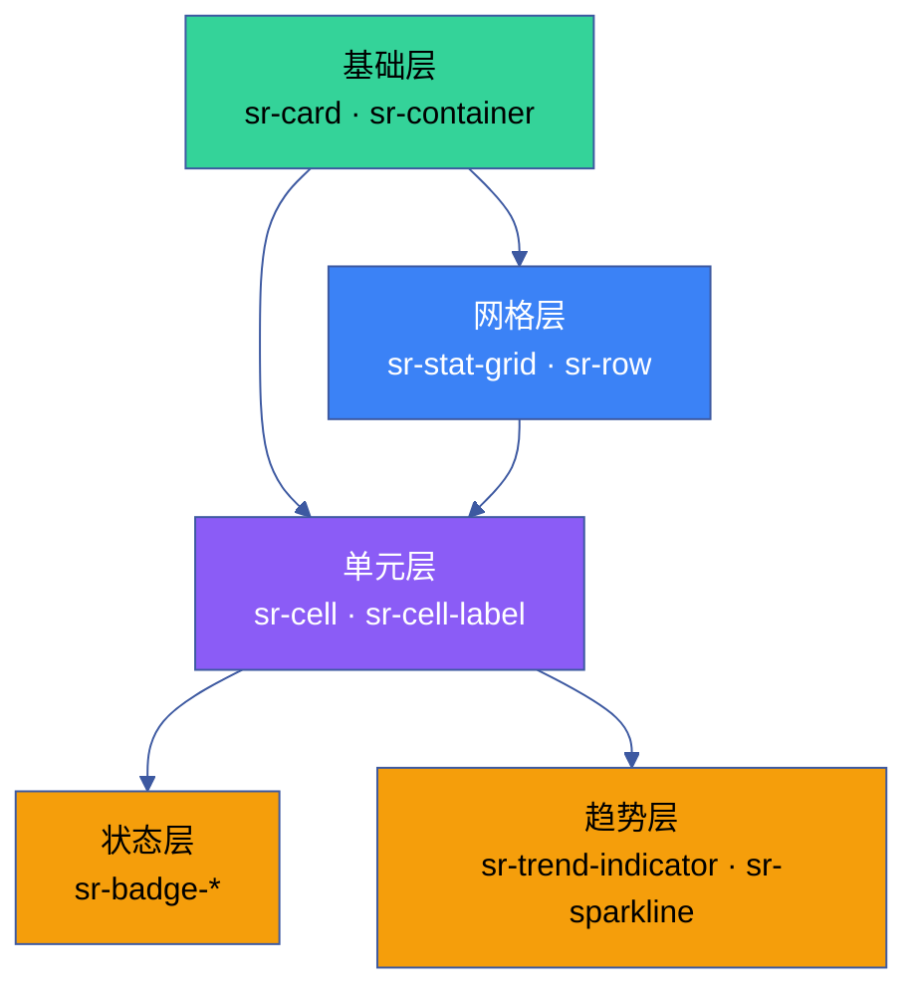

# YrY CDN · Shared Reports 报告共享

> 报告页面公共样式 + JS 工具库，为 10 个报告 index 页提供统一的视觉风格、统计函数和渲染工具。
> 对应 CLAUDE.md [表达优先](../../CLAUDE.md#铁律) 铁律：统一深色主题 + 统一数据格式，避免跨报告视觉漂移。

## 文件

```
shared-reports/
├── index.html    # 报告样式预览 + API 参考页
├── index.css     # 报告页公共样式 (14 个 CSS 工具类 · 一致深色主题)
├── index.js      # 报告页公共脚本 (YrYReports 命名空间 · 22 个 API)
└── README.md     # 本文件
```

## 加载

```html
<!-- 在 shared/index.css + theme/index.css 之后，页面专属样式之前加载 -->
<link rel="stylesheet" href="../../cdn/shared-reports/index.css">
<script src="../../cdn/shared-reports/index.js"></script>
```

加载后 `window.YrYReports` 命名空间提供 22 个函数。

## YrYReports API 参考（22 个）

### 评分与等级（5）

| API | 签名 | 返回值 | 用途 |
|-----|------|--------|------|
| `scoreClr(score)` | `(number) → string` | CSS 颜色变量名 | 分数 → 颜色 (`#4ade80` / `#60a5fa` / `#fbbf24` / `#f87171`) |
| `scoreGrade(score)` | `(number) → string` | `'A'` / `'B'` / `'C'` / `'D'` | 分数 → 字母等级 |
| `scoreCls(score)` | `(number) → string` | CSS 类名 | 分数 → `grade-a` / `grade-b` / `grade-c` / `grade-d` |
| `gradeClass(grade)` | `(string) → string` | CSS 类名 | 等级字母 → 类名（`'A'` → `'grade-a'`） |
| `badge(text, variant?)` | `(string, string?) → string` | HTML 字符串 | 彩色 badge (`A`/`B`/`C`/`D`/`info`/`warn`) |

### 新鲜度与时间（4）

| API | 签名 | 返回值 | 用途 |
|-----|------|--------|------|
| `fmtMinutesAgo(min)` | `(number) → string` | `"5 分钟前"` / `"2 小时前"` / `"3 天前"` | 人性化时间差 |
| `freshnessClass(date)` | `(Date) → string` | CSS 类名 | 新鲜度 → `fresh` / `stale` / `expired` |
| `freshnessLabel(date)` | `(Date) → string` | emoji + 文本 | 新鲜度 → `🟢 新鲜` / `🟡 1h前` / `🔴 过期` |
| `renderFreshnessBadge(date)` | `(Date) → string` | HTML 字符串 | 完整新鲜度 badge（class + label 组合） |

### 趋势与统计（7）

| API | 签名 | 返回值 | 用途 |
|-----|------|--------|------|
| `renderScoreSparkline(scores)` | `(number[]) → string` | SVG 字符串 | 迷你趋势图（宽 80px · 高 20px · 填充区域） |
| `trendDelta(curr, prev)` | `(number, number) → object` | `{ dir, delta, pct }` | 趋势方向 `↑`/`↓`/`→` + 变化量 + 百分比 |
| `mean(arr)` | `(number[]) → number` | — | 算术平均值 |
| `stddev(arr)` | `(number[]) → number` | — | 标准差 |
| `cv(arr)` | `(number[]) → number` | — | 变异系数（stddev / mean） |
| `median(arr)` | `(number[]) → number` | — | 中位数 |
| `linearSlope(arr)` | `(number[]) → number` | — | 线性回归斜率（正=上升，负=下降） |

### 渲染与 DOM（4）

| API | 签名 | 返回值 | 用途 |
|-----|------|--------|------|
| `statCard(val, label, cls?)` | `(string, string, string?) → string` | HTML 字符串 | 统计卡片（值 + 标签 + 可选颜色类） |
| `setHTML(el, html)` | `(Element, string) → void` | — | 安全设置 innerHTML（先清空） |
| `setText(el, text)` | `(Element, string) → void` | — | 设置 textContent（防 XSS） |
| `toggle(el, force?)` | `(Element, boolean?) → void` | — | 切换元素显隐（`.yry-hidden` 类） |

### 数据抓取（2）

| API | 签名 | 返回值 | 用途 |
|-----|------|--------|------|
| `fetchCrossRefData()` | `() → Promise<object>` | `{ health, scores, trends }` | 跨仪表板并行抓取（健康 + 评分 + 趋势） |
| `freshnessStat(date)` | `(Date) → object` | `{ cls, label, minutes }` | 新鲜度统计对象（聚合 class · label · 分钟数） |

### 使用示例

```javascript
// 评分 → 颜色 + 等级 + CSS 类
var score = 85;
var color = YrYReports.scoreClr(score);   // '#60a5fa'
var grade = YrYReports.scoreGrade(score);  // 'B'
var cls   = YrYReports.scoreCls(score);    // 'grade-b'

// 趋势计算
var trend = YrYReports.trendDelta(92, 86);
// { dir: '↑', delta: 6, pct: 7.0 }

// 统计
var scores = [78, 86, 92];
var slope = YrYReports.linearSlope(scores); // 7.0 (上升趋势)
var volatility = YrYReports.cv(scores);     // 变异系数

// 渲染
var badge = YrYReports.badge('A', 'A');     // '<span class="yry-badge A">A</span>'
var card = YrYReports.statCard('92', '综合评分', 'grade-A');
var sparkline = YrYReports.renderScoreSparkline([78, 82, 86, 88, 92]);

// DOM 操作（防 XSS）
YrYReports.setText(document.getElementById('score'), String(score));
YrYReports.setHTML(document.getElementById('card'), card);
YrYReports.toggle(document.getElementById('detail-panel'));

// 跨仪表板数据
YrYReports.fetchCrossRefData().then(function(data) {
  console.log(data.health, data.scores, data.trends);
});
```

## CSS 工具类 (index.css)

| 类名 | 用途 |
|------|------|
| `.sr-card` | 报告卡片容器 — 圆角 · 边框 · 背景 |
| `.sr-stat-grid` | 统计网格布局 — `auto-fill, minmax(180px, 1fr)` |
| `.sr-dim-bar` | 维度评分进度条 — 6px 高 · 圆角 · 过渡动画 |
| `.sr-trend-indicator` | 趋势指示器 — ↑ (绿色) / ↓ (红色) / → (灰色) |
| `.sr-badge-a` / `.sr-badge-b` / `.sr-badge-c` / `.sr-badge-d` | A/B/C/D 等级徽章 — 绿/蓝/黄/红色 |
| `.sr-sparkline` | 迷你趋势图容器 — 内联 SVG |
| `.sr-freshness` | 数据新鲜度指示器 — 绿/黄/红三色 |
| `.sr-dim-label` | 维度标签 — 最小宽度 90px · 右对齐 |
| `.sr-dim-score` | 维度评分值 — 等宽字体 · 粗体 |
| `.sr-cell` | 统计单元格 — 内边距 · 圆角 · 边框 · 背景 |
| `.sr-cell-label` | 单元格标签 — 大写 · 小字 · 灰色 |
| `.sr-cell-value` | 单元格数值 — 大号 · 粗体 · 等宽字体 |
| `.sr-cell-sub` | 单元格副文本 — 极小 · 灰色 |

## 适用页面

| 页面类型 | 路径示例 | 使用的 CSS 类 |
|---------|---------|-------------|
| **审查报告** | `scenes/场景-*/审查.html` | sr-card · sr-stat-grid · sr-dim-bar |
| **测试报告** | `docs/测试报告/index.html` | sr-card · sr-cell · sr-badge-* |
| **健康报告** | `docs/健康报告/index.html` | sr-card · sr-stat-grid · sr-dim-bar · sr-trend-indicator · sr-sparkline |
| **计划清单** | `scenes/场景-*/计划清单.html` | sr-card · sr-stat-grid |
| **源码报告** | `scenes/场景-*/源码.html` | sr-card · sr-cell |

## 消费者页面

| 页面 | 路径 | 用途 |
|------|------|------|
| 项目健康报告 | `docs/健康报告/` | 项目级健康仪表板 (9 核心 + 7 工程维度) |
| 趋势报告 | `docs/趋势报告/` | 技术趋势分析 (GitHub Trending · OSS Insight · TrendShift) |
| 自循环报告 | `docs/自循环报告/` | 12 技能定时巡检结果 |
| 自我改进 | `docs/自我改进/` | D0-D8 诊断详情 · 改进优先级矩阵 |
| 项目分析 | `docs/项目分析/` | 架构合规与代码质量 |
| 评分报告 | `docs/评分报告/` | 八维加权评分详情 |
| 技能报告 | `docs/技能报告/` | 20 技能四维健康评估 |
| 组件报告 | `docs/组件报告/` | 107 CDN 组件质量分析 |
| 测试报告 | `docs/测试报告/` | 测试质量指数 (7 维工程成熟度) |
| CDN 健康报告 | `cdn/health-report/` | CDN 专属 D0-D8 健康数据 |

## 关联

- 共享基线: `cdn/shared/index.css` + `cdn/shared/index.js`

## 设计原则

| 原则 | 实现 | 优势 |
|------|------|------|
| 一致深色主题 | 14 设计令牌统一 | 视觉一致 |
| BEM 命名 | `.sr-card` · `.sr-cell` | 低特异性 |
| 零依赖 | 纯 CSS + 原生 JS | 无外部依赖 |
| 响应式 | 5 断点适配 | 移动端友好 |
| a11y 合规 | WCAG AA 对比度 | 可访问 |
| 模块化 | 按需引用 CSS 类 | 无冗余 |

## CSS 类层级



## 性能基线

| 资源 | 体积 (未压缩) | 体积 (gzip) | 加载优先级 |
|------|:---:|:---:|:---:|
| index.css | ~15KB | ~4KB | P1 |
| index.js | ~10KB | ~3KB | P1 |
| 总计 | ~25KB | ~7KB | — |

## 跨报告一致性校验

| 校验项 | 方法 | 阈值 | 频率 |
|--------|------|:---:|:---:|
| CSS 类引用 | grep `sr-` 全部报告 | 100% | CI |
| 设计令牌使用 | grep `var(--yry-` | ≥ 90% | CI |
| 硬编码颜色 | grep `#[0-9a-f]{3,8}` | 0 | CI |
| BEM 命名 | linter 校验 | 100% | CI |
| a11y 对比度 | axe-core | AA 合规 | 周报 |

## 报告类型与样式映射

| 报告类型 | 必需 CSS 类 | 可选 CSS 类 | 页面数 |
|---------|-----------|-----------|:---:|
| 健康报告 | sr-card · sr-stat-grid · sr-dim-bar | sr-trend-indicator · sr-sparkline | 5+ |
| 审查报告 | sr-card · sr-stat-grid · sr-dim-bar | sr-badge-* | 29+ |
| 测试报告 | sr-card · sr-cell · sr-badge-* | sr-stat-grid | 8+ |
| 计划清单 | sr-card · sr-stat-grid | sr-cell | 29+ |
| 源码报告 | sr-card · sr-cell | — | 29+ |
| 趋势报告 | sr-card · sr-cell · sr-sparkline | sr-trend-indicator | 5+ |

## 扩展指南

| # | 步骤 | 实现 | 示例 |
|---|------|------|------|
| 1 | 命名 | `.sr-<name>` 前缀 | `.sr-progress` |
| 2 | BEM | Block__Element--Modifier | `.sr-card__title--accent` |
| 3 | 令牌 | 使用 `var(--yry-*)` | `color: var(--yry-text)` |
| 4 | Fallback | 双值降级 | `var(--yry-text, #a9b1d6)` |
| 5 | 响应式 | 5 断点适配 | `@media (max-width: 720px)` |
| 6 | a11y | WCAG AA 对比度 | ≥ 4.5:1 |
| 7 | 测试 | 添加 fixtures | 通过/失败场景 |
- 主题系统: `cdn/theme/index.css` (Cat B) · `cdn/theme-mono/index.css` (Cat A)
- 组件库: `cdn/COMPONENTS.md`
- 教程: `cdn/TUTORIAL.md`