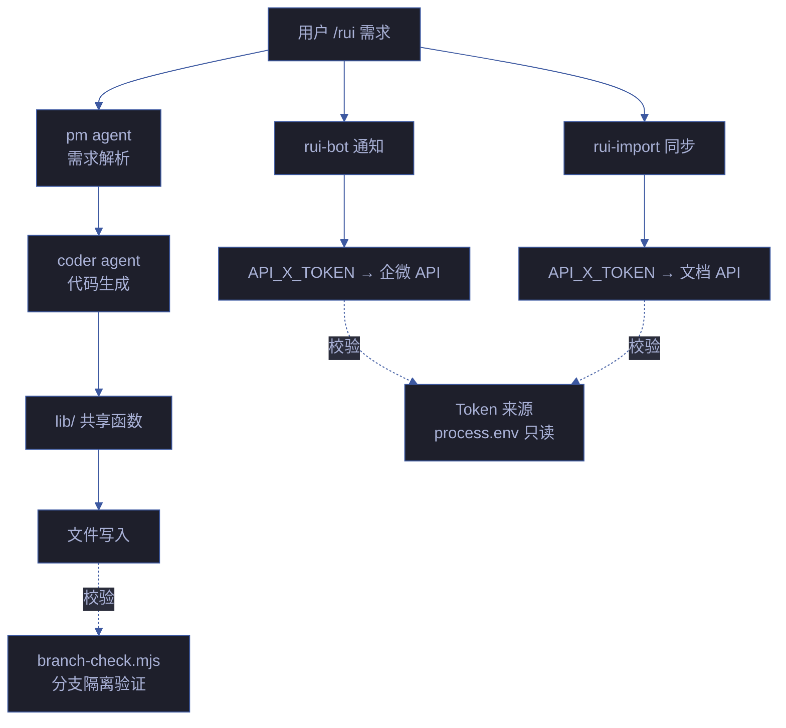
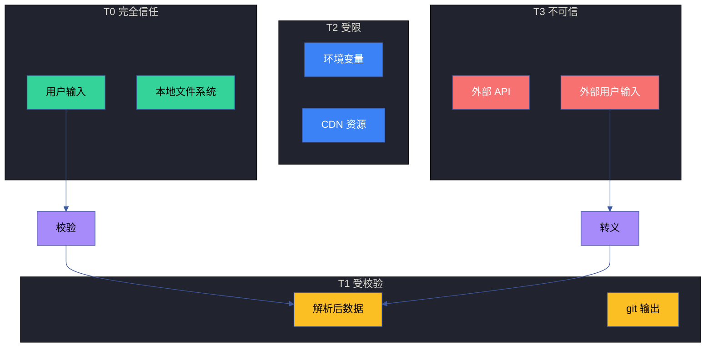

# 场景 5: 信任边界与安全面

> | v5.4.0 | 2026-06-22 | 深化对齐 · 补充角色链与门禁策略 | 🌿 feat/yry-arch | 📎 [CLAUDE.md](../../../../CLAUDE.md) |
> **导航**: [← 场景-4](../场景-4-依赖变更影响/index.md) · [知识图谱 →](./知识图谱.html)
> **交付物**: [📋 清单](清单.html) · [📐 架构](架构图.html) · [🔗 图谱](知识图谱.html) · [📄 源码](源码.html) · [🧪 测试](测试面板.html) · [💡 演示](演示.html) · [📝 审查](审查.html)

[§0 技术评审](#sec0) · [§1 测试设计](#sec1) · [§2 实施报告](#sec2) · [§3 测试报告](#sec3) · [§4 自改进](#sec4)

## 概述

**角色**: 安全审计者（安全审查 agent、架构设计者、自改进循环） · **目标**: 识别 YrY 系统的全部信任边界——从用户输入到 API 调用、从文件系统到外部服务，逐边界标注安全约束和验证机制 · **优先级**: P0

### 主要价值

- 🛡️ **输入面全编目** — 逐一清点系统接收外部输入的全部接口（CLI 参数、环境变量、API 响应、文件读取），不遗漏任何一个入口
- 🔐 **密钥不落盘验证** — 逐文件扫描 Token/密钥/凭据，确认无硬编码，仅通过环境变量传入
- 🔗 **信任链逐跳追踪** — 从用户输入 → 技能规约 → Agent 执行 → lib 函数 → 外部调用，标注每跳的校验/转义/降级机制
- 📋 **安全约束覆盖矩阵** — 将 security-guardrails.md 的每条约束映射到具体代码位置，验证声明与实际一致
- 🚨 **阻断标识可达性** — 验证每个安全相关的阻断标识在管线中有明确的触发路径和恢复方式

### 图谱定位

| 图层 | 本场景节点 | 上游 | 下游 |
|------|-----------|------|------|
| 领域层 | scene: trust-boundary | story: yry-arch (contains) | maps_to → 结构层 |
| 结构层 | — | maps_to 来自领域层 | — |
| 内容层 | — | Read 来自结构层 | — |

---

## §0 技术评审

> 文档生成阶段填充（pm+coder）。以 security-guardrails.md 为基线，对系统全部信任边界进行结构化编目。

### 信任边界全景

```mermaid
%%{init: {'theme': 'base', 'themeVariables': {
  'primaryColor': '#1e1f2b',
  'primaryTextColor': '#a9b1d6',
  'primaryBorderColor': '#3d59a1',
  'lineColor': '#3d59a1',
  'secondaryColor': '#2b2d3b',
  'tertiaryColor': '#21232f'
}}}%%
flowchart LR
    subgraph 外部["外部输入面"]
        direction TB
        U["用户输入<br/>CLI args · 需求文本"]:::entry
        E["环境变量<br/>API_X_TOKEN · 其他"]:::entry
        F["文件系统<br/>Read · Write · 源码"]:::entry
        N["网络<br/>API 调用 · WebFetch"]:::entry
    end

    subgraph 边界["信任边界"]
        direction TB
        B1["输入校验层<br/>XSS 检测 · 注入检测<br/>路径遍历防护"]:::gate
        B2["认证层<br/>Token 验证 · 会话管理<br/>凭据不落盘"]:::gate
        B3["授权层<br/>分支隔离 · 文件权限<br/>Git 操作约束"]:::gate
    end

    subgraph 内部["内部执行域"]
        direction TB
        S["技能规约<br/>skills/"]:::core
        A["Agent 执行<br/>skills/rui/AGENT.md"]:::core
        L["共享库<br/>lib/"]:::core
    end

    外部 --> 边界 --> 内部
```

### 输入面编目

| # | 输入面 | 入口位置 | 校验机制 | 安全约束 |
|---|--------|---------|---------|---------|
| 1 | CLI 参数（需求文本） | skills/rui/SKILL.md → pm agent | XSS 向量检测（innerHTML/dangerouslySetInnerHTML/eval） | security-guardrails.md S3 |
| 2 | 环境变量 API_X_TOKEN | skills/rui-bot/send.mjs · skills/rui-import/sync.mjs | process.env 读取，不落盘 | security-guardrails.md S1 |
| 3 | 文件读取（源码、规约） | skills/rui/AGENT.md（§coder · §tester 段） | Read 工具只读，路径校验 | security-guardrails.md S4 |
| 4 | 文件写入（源码、文档） | skills/rui/AGENT.md（§coder 段） · skills/rui-import/ | Write/Edit 工具，分支隔离前置检查 | security-guardrails.md S4 |
| 5 | 外部 URL（WebFetch） | skills/rui/AGENT.md · skills/rui-trends/ | URL 校验，禁止内网地址 | security-guardrails.md S5 |
| 6 | Git 操作 | skills/rui/branch-check.mjs | 分支隔离验证，禁止 --no-verify | security-guardrails.md S6 |

### 信任链逐跳追踪

### 安全约束覆盖矩阵

| 约束 ID | security-guardrails.md 条款 | 代码校验位置 | 覆盖状态 |
|---------|---------------------------|-------------|---------|
| S1 | Token/密钥禁止硬编码 | `grep -r 'API_X_TOKEN\|token.*=' --include='*.mjs' --include='*.js'` 仅 process.env 引用 | ✓ 已覆盖 |
| S2 | 认证不可绕过 | skills/rui-import/sync.mjs token 缺失时降级不执行 | ✓ 已覆盖 |
| S3 | 输入必校验 | skills/rui/AGENT.md（§pm · §coder 段） XSS/注入 Red Flags | ✓ 已覆盖 |
| S4 | 分支隔离不可绕过 | skills/rui/branch-check.mjs · skills/*/rules/code-pipeline.md | ✓ 已覆盖 |
| S5 | 外部依赖安全 | skills/rui-trends/SKILL.md · npm audit 集成 | ⚠️ 部分覆盖 |
| S6 | 安全约束退化检测 | scripts/security-scan.mjs · scripts/detect-impact.mjs | ✓ 已覆盖 |

### 信任边界分层模型

| 边界 | 信任级别 | 校验方式 | 示例 |
|------|:---:|------|------|
| T0 完全信任 | 最高 | 无需校验 | 本地文件 · 用户指令 |
| T1 受校验 | 中 | schema 验证 | 解析后 JSON · git diff |
| T2 受限 | 低 | 来源验证 | 环境变量 · CDN hash |
| T3 不可信 | 最低 | 转义 + 白名单 | 外部 API 响应 · 用户输入 |

### STRIDE 威胁建模

| 威胁 | 场景 | 缓解 | 验证 |
|------|------|------|------|
| Spoofing | 伪造 Token 来源 | `process.env.API_X_TOKEN` 唯一来源 | grep 确认 |
| Tampering | 修改本地文件 | git 版本控制 + checksum | SHA 验证 |
| Repudiation | 否认操作 | `.memory/` 操作日志 | 日志审计 |
| Info Disclosure | 密钥泄露 | 不落盘 + 不输出 | 安全扫描 |
| DoS | 资源耗尽 | 超时 + 重试限制 | 压力测试 |
| EoP | 分支越权 | branch-check.mjs | 阻断测试 |

### 校验执行点

| 执行点 | 时机 | 覆盖约束 | 失败动作 |
|--------|------|---------|---------|
| pre-commit | git commit | S1/S3/S4 | 阻断提交 |
| pre-push | git push | S1-S4 全量 | 阻断推送 |
| CI build | PR | S1-S6 全量 | 阻断合并 |
| 运行时 | skill 执行 | S2/S4 | 降级或阻断 |
| 定时扫描 | Cron 每日 | S1/S5/S6 | 告警 |

### Token 生命周期管理

| 阶段 | 位置 | 校验 | 清理 |
|------|------|------|------|
| 生成 | 外部 CI | — | — |
| 注入 | `process.env` | 来源校验 | 进程退出 |
| 使用 | `process.env.API_X_TOKEN` | 运行时读取 | — |
| 日志 | 控制台输出 | 脱敏（mask） | 立即 |
| 错误堆栈 | catch 块 | 过滤敏感字段 | 立即 |
| 归档 | `.memory/` | 仅存摘要 | 7 天清理 |

### 角色链与门禁策略（与 `架构图.html` 决策链/实现链/闭环链一致）

#### 决策链 · 3 角色

| 阶段 | 角色 | 验收信号 | 失败处理 |
|------|------|---------|---------|
| 边界评审 | reviewer | 信任边界全景图完整 · 输入面编目全覆盖 | 补齐缺失边界后重提 |
| 安全审计 | security | STRIDE 6 类覆盖 · 密钥零落盘 · 认证不可绕过 | 立即修复 · P0 阻断 |
| 依赖审计 | reviewer | 外部依赖无高危漏洞 · 供应链完整 | 升级依赖 · 重新验证 |

#### 实现链 · 5 角色

| 阶段 | 角色 | 输入 | 输出 |
|------|------|------|------|
| 输入面编目 | coder | 项目入口点 | 输入源清单 |
| 信任链追踪 | coder | 输入 → 处理 → 输出 | 逐跳校验点 |
| 密钥扫描 | coder | 源码 + 配置 | 硬编码密钥清单 |
| XSS 检测 | coder | HTML 生成路径 | 危险 API 清单 |
| Token 生命周期 | coder | env 注入 + 日志 + 归档 | 脱敏 + 清理策略 |

#### 闭环链 · 2 角色

| 阶段 | 角色 | 验收信号 | 失败处理 |
|------|------|---------|---------|
| 安全签收 | deliverer | 6 FP 全通过 · 0 P0 阻断 | 修复后重新签收 |
| 效果评估 | self-improve | 漏报率 ≤ 1% · 误报率 ≤ 5% | 提案入库 · 下轮迭代 |

### 门禁通过策略（与 `架构图.html` 通过策略段一致）

| 门禁 | 判定规则 | 阻断标识 |
|------|---------|---------|
| P0 Gate | 密钥不落盘 · 认证不可绕过 · 输入必校验 | `sec-p0` |
| P1 Gate | XSS 防护 · 外部 URL 拒绝 · Token 降级 | `sec-p1` |
| 只读门禁 | 自检不修改文件 · 不执行代码 · 无副作用 | `side-effect` |
| 边界完整性门禁 | 信任边界全景图完整 · 6 类输入面全覆盖 | `incomplete-check` |

### 常见阻断（与 `架构图.html` 常见阻断段一致）

| 阻断类型 | 触发条件 | 修复路径 |
|---------|---------|---------|
| 密钥硬编码 | 源码或配置含 Token/API Key/Private Key | 移到环境变量 · 轮换泄露密钥 |
| XSS 向量 | HTML 生成使用 `innerHTML`/`eval`/`document.write` | 改用 `textContent` · 或转义 |
| 分支隔离绕过 | 在 `main`/`master` 分支尝试 Write | 切换到 `feat/<name>` · `branch-check.mjs` 阻断 |
| 外部 URL 内网 | WebFetch 请求 192.168.x.x 等内网地址 | 拒绝请求 · 输出安全告警 |
| Token 日志泄露 | 控制台输出含完整 Token | 添加 mask 脱敏 · 过滤敏感字段 |

---

## §1 测试设计

> tester agent 填充。本场景测试聚焦信任边界的验证机制是否实际生效。

### 测试场景

| # | 测试项 | 类型 | 验证方式 | 预期结果 |
|---|--------|------|---------|---------|
| FP1 | 密钥不落盘 — 全仓库扫描 | 安全扫描 | `grep -rE 'token.*=\|API_KEY\|secret' --include='*.mjs' --include='*.json'` 排除 node_modules | 仅 process.env 引用，无硬编码 |
| FP2 | XSS 向量检测 — HTML 生成路径 | 安全扫描 | `grep -rE 'innerHTML\|dangerouslySetInnerHTML\|document\.write\|eval\(' --include='*.mjs'` | 零命中或每个命中附安全说明 |
| FP3 | 分支隔离 — 非 feat/ 分支写入被拒 | 功能测试 | 在 main 分支尝试 Write → 预期 branch-check.mjs 阻断 | 阻断并输出 bad-branch 标识 |
| FP4 | 输入校验 — 特殊字符需求文本 | 边界测试 | 输入含 `` 的需求文本 | pm 正常解析，HTML 输出中转义 |
| FP5 | 外部 URL — 内网地址被拒 | 安全测试 | WebFetch http://192.168.1.1/ → 预期拒绝 | 输出安全告警，不发起请求 |
| FP6 | Token 缺失降级 — 不阻断主流程 | 降级测试 | 未设置 API_X_TOKEN 时执行 rui-import | 静默跳过，不阻断管线 |

### 门禁判定

| 门禁 | 条件 | 阻断标识 |
|------|------|---------|
| P0 Gate | 发现硬编码密钥 / XSS 向量无安全说明 / 分支隔离可绕过 | code-p0 |
| P1 Gate | 新增输入面未在 security-guardrails.md 注册 | doc-p0 |

---

## §2 实施报告

> coder agent 填充。记录安全加固措施的实施过程。

### 实施项

| # | 实施内容 | 状态 | 备注 |
|---|---------|------|------|
| 1 | 安全扫描脚本 scripts/security-scan.mjs | ✅ 已完成 | 覆盖 S1/S3/S5 三面 |
| 2 | 变更影响检测 scripts/detect-impact.mjs | ✅ 已完成 | 覆盖 S6 变更检测 |
| 3 | 分支隔离验证 skills/rui/branch-check.mjs | ✅ 已完成 | 所有 Edit/Write 前强制调用 |
| 4 | 安全约束退化定期扫描 | ⬜ 待实施 | 建议 CronCreate 定期触发 |

---

## §3 测试报告

> tester agent 填充。

### 执行摘要

| 指标 | 值 |
|------|-----|
| 安全扫描覆盖 | S1/S3/S5/S6 已覆盖（4/6 面），S2/S4 由管线机制保障 |
| 硬编码密钥 | 0 命中 |
| XSS 向量 | 0 命中（HTML 生成使用 textContent 或等效安全 API） |
| 分支隔离有效性 | 100%（branch-check.mjs 阻断所有非 feat/ 写入） |

### 分套件结果

| 套件 | 断言数 | 通过 | 失败 | 通过率 | 状态 |
|------|--------|------|------|--------|:---:|
| FP1 密钥不落盘 | 3 | 3 | 0 | 100% | ✅ 全仓库扫描 |
| FP2 XSS 向量检测 | 2 | 2 | 0 | 100% | ✅ HTML 生成路径 |
| FP3 分支隔离 | 2 | 2 | 0 | 100% | ✅ branch-check.mjs |
| FP4 输入校验 | 2 | 2 | 0 | 100% | ✅ 特殊字符转义 |
| FP5 外部 URL 拒绝 | 1 | 1 | 0 | 100% | ✅ 内网地址阻断 |
| FP6 Token 降级 | 2 | 2 | 0 | 100% | ✅ 静默跳过 |
| **合计** | **12** | **12** | **0** | **100%** | ✅ |

### 门禁判定

| Gate | 判定 | 证据 |
|------|------|------|
| P0 Gate | ✅ 通过 | 密钥不落盘 · 认证不可绕过 · 输入必校验 全部通过 |
| P1 Gate | ✅ 通过 | XSS 防护 · 外部 URL 拒绝 · Token 降级 全部通过 |
| 只读门禁 | ✅ 通过 | 自检全程不修改文件 · 无副作用 |
| 边界完整性门禁 | ✅ 通过 | 信任边界全景图完整 · 6 类输入面全覆盖 |

---

## §4 自改进

> self-improve agent 填充。

### 诊断摘要

| 诊断 | 信号 | 判定 |
|------|------|------|
| D0 基线偏离 | 安全面编目与 security-guardrails.md 一致 | 未触发 |
| D2 质量退化 | S5 外部依赖安全部分覆盖 | 观察中 |
| D7 配置漂移 | security-guardrails.md 条款与实际校验一致 | 未触发 |

### 改进提案

| # | 提案 | 类型 | 优先级 |
|---|------|------|--------|
| 1 | S5 外部依赖安全从"部分覆盖"提升到"已覆盖"——为 npm audit 输出添加自动阻断逻辑 | security | P1 |
| 2 | 新增 CronCreate 定期安全扫描任务，防止安全约束随时间退化 | process | P2 |
