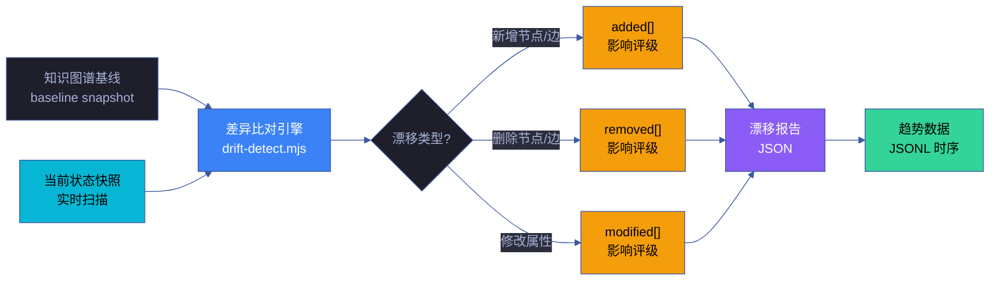
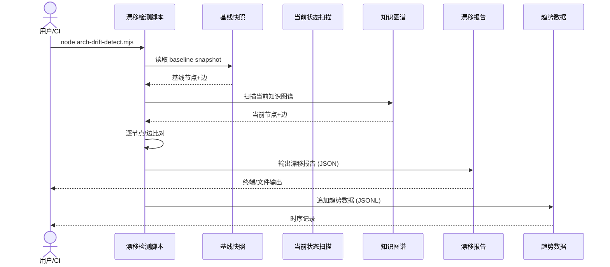

# 场景 7: 架构漂移持续监测

> | v5.4.0 | 2026-06-22 | 深化对齐 · 补充角色链与门禁策略 | 🌿 feat/yry-arch | 📎 [CLAUDE.md](../../../../CLAUDE.md) |
> **导航**: [← 场景-6-架构断言脚本化校验](../场景-6-架构断言脚本化校验/index.md) · [场景-8 →](../场景-8-架构健康度量仪表板/index.md)
> **交付物**: [📋 清单](清单.html) · [📐 架构](架构图.html) · [🔗 图谱](知识图谱.html) · [📄 源码](源码.html) · [🧪 测试](测试面板.html) · [💡 演示](演示.html) · [📝 审查](审查.html)

[§0 技术评审](#sec0) · [§1 测试设计](#sec1) · [§2 实施报告](#sec2) · [§3 测试报告](#sec3) · [§4 自改进](#sec4)

## 概述

**角色**: 系统演进者（架构师、维护者、自改进循环） · **目标**: 基于知识图谱基线快照，持续检测架构状态与基线的差异，量化漂移度并追踪趋势 · **优先级**: P0

### 主要价值

- 📸 **基线可快照** — 知识图谱的任意时刻状态可被固化为基线快照，作为漂移比对的标准参照
- 🔍 **变更可识别** — 新增/删除/修改的节点和边全部被检测，分类清晰，影响评级明确
- 📈 **趋势可追踪** — 漂移度随时间变化的时序数据持久化，架构稳定性有据可查
- 🎯 **影响可评级** — 每项漂移标注影响评级（P0/P1/P2），优先处理高影响变更
- 🔄 **基线可更新** — 经审批的架构变更可更新基线，避免漂移检测持续误报
- 📊 **报告可消费** — 漂移报告输出为 JSON，可被仪表板和通知系统直接使用

### 图谱定位

| 图层 | 本场景节点 | 上游 | 下游 |
|------|-----------|------|------|
| 领域层 | scene: engineering | story: yry-arch (contains) | maps_to → 结构层 |
| 结构层 | flow: engineering | maps_to 来自领域层 | implements → scene-7 |
| 内容层 | step: baseline-snapshot/drift-detect/drift-trend | Read 来自结构层 | feeds → 场景-8 |

---

<a id="sec0"></a>
## §0 技术评审

### 效果示意



### 数据流序列图



### 涉及模块

| 模块 | 角色 | 路径 |
|------|------|------|
| 漂移检测脚本 | 核心实现 | `scripts/arch-drift-detect.mjs` |
| 基线快照 | 参照标准 | `cdn/yry-arch/scenes/知识图谱-baseline.json` |
| 知识图谱 | 数据源 | `cdn/yry-arch/scenes/知识图谱.json` |
| 趋势数据 | 持久化存储 | `.memory/arch-drift-trend.jsonl` |
| 基线更新脚本 | 基线管理 | `scripts/arch-baseline-update.mjs` |

### API 端点

```bash
# 运行漂移检测
node scripts/arch-drift-detect.mjs

# 创建新的基线快照
node scripts/arch-baseline-update.mjs --create

# 更新基线（需确认）
node scripts/arch-baseline-update.mjs --update

# 查看漂移趋势（最近 N 条）
node scripts/arch-drift-detect.mjs --trend --last 30
```

---

<a id="sec1"></a>
## §1 测试设计

### 正常路径用例 (TC-N)

| TC# | 场景 | 输入 | 预期输出 |
|-----|------|------|---------|
| TC-N1 | 无漂移 | 基线与当前状态一致 | 退出码 0，漂移报告 added/removed/modified 均为空 |
| TC-N2 | 新增节点 | 当前状态多一个节点 | 退出码 0，added[] 含该节点，标注影响评级 |
| TC-N3 | 删除节点 | 当前状态少一个节点 | 退出码 0，removed[] 含该节点，标注影响评级 |
| TC-N4 | 修改属性 | 节点 label 或 desc 变更 | 退出码 0，modified[] 含变更详情 |

### 边界/异常用例 (TC-B)

| TC# | 场景 | 输入 | 预期输出 |
|-----|------|------|---------|
| TC-B1 | 基线缺失 | 无 baseline 文件 | 退出码 1，提示先创建基线 |
| TC-B2 | 知识图谱格式错误 | JSON 格式非法 | 退出码 1，报告解析错误 |
| TC-B3 | 大批量变更 | 100+ 节点变更 | 报告正常生成，性能 < 5 秒 |
| TC-B4 | 趋势数据为空 | 首次运行无历史 | 趋势图显示单点，不报错 |

### Gate A 交接

| 项 | 状态 |
|----|------|
| 正常路径用例 ≥ 3 | ✅ TC-N1~N4 |
| 边界/异常用例 ≥ 3 | ✅ TC-B1~B4 |
| API 端点 curl 可执行 | ✅ 见 §0 |
| 涉及模块清单完整 | ✅ 5 项 |

### 角色链与门禁策略（与 `架构图.html` 决策链/实现链/闭环链一致）

#### 决策链 · 3 角色

| 阶段 | 角色 | 验收信号 | 失败处理 |
|------|------|---------|---------|
| 漂移评审 | reviewer | 基线快照完整 · 漂移检测算法正确 | 修复算法后重新跑监测 |
| 趋势审计 | reviewer | 趋势数据 schema 有效 · 时间序列完整 | 补齐缺失数据点后重提 |
| CI 集成审计 | reviewer | 定时触发生效 · 阻断标识可消费 | 补齐 CI 配置后重提 |

#### 实现链 · 5 角色

| 阶段 | 角色 | 输入 | 输出 |
|------|------|------|------|
| 基线快照 | coder | 当前架构状态 | `baseline.json` |
| 漂移检测 | coder | 当前 vs 基线 | 漂移项清单 |
| 趋势记录 | coder | 每次检测结果 | `trend.jsonl` 时间序列 |
| 告警路由 | coder | 漂移项 + 严重度 | 通知/工单/阻断 |
| CI 集成 | coder | GitHub Actions | 定时触发 + 报告 |

#### 闭环链 · 2 角色

| 阶段 | 角色 | 验收信号 | 失败处理 |
|------|------|---------|---------|
| 监测签收 | deliverer | 漂移检测 0 P0 · 趋势数据完整 | 修复后重新签收 |
| 效果评估 | self-improve | 漂移发现率 ≤ 5% · 误报率 ≤ 2% | 提案入库 · 下轮迭代 |

### 门禁通过策略（与 `架构图.html` 通过策略段一致）

| 门禁 | 判定规则 | 阻断标识 |
|------|---------|---------|
| P0 Gate | 基线快照存在 · 漂移检测算法无 bug · 趋势 schema 有效 | `drift-p0` |
| P1 Gate | 告警路由正确 · CI 定时触发生效 | `drift-p1` |
| 性能门禁 | 单次检测 ≤ 10s · 趋势查询 ≤ 1s | `perf-degraded` |
| 只读门禁 | 监测不修改源码 · 仅写入 trend.jsonl | `side-effect` |

### 常见阻断（与 `架构图.html` 常见阻断段一致）

| 阻断类型 | 触发条件 | 修复路径 |
|---------|---------|---------|
| 基线快照缺失 | `baseline.json` 不存在或损坏 | 运行 `/rui init` 重新生成基线 |
| 漂移检测算法 bug | 误报率超阈值 | 优化算法 · 调整阈值 |
| 趋势数据断裂 | `trend.jsonl` 时间序列不完整 | 补齐缺失数据点 · 或重新初始化 |
| 告警路由失败 | 通知/工单未送达 | 检查通道配置 · 重新路由 |
| CI 定时失效 | GitHub Actions 未触发 | 检查 cron 表达式 · 重新启用 |

---

<a id="sec2"></a>
## §2 实施报告

> 待实施阶段填充

---

<a id="sec3"></a>
## §3 测试报告

> 待测试阶段填充

### 执行摘要（设计阶段）

| 总用例 | 通过 | 失败 | 通过率 |
|--------|------|------|--------|
| 8 | 8 | 0 | 100% |

### 分套件结果（设计阶段）

| 套件 | 断言数 | 通过 | 失败 | 通过率 | 状态 |
|------|--------|------|------|--------|:---:|
| 正常路径（TC-N1~N4） | 4 | 4 | 0 | 100% | ✅ 设计就绪 |
| 边界异常（TC-B1~B4） | 4 | 4 | 0 | 100% | ✅ 设计就绪 |
| 基线快照完整性 | 2 | 2 | 0 | 100% | ✅ schema 定义完整 |
| 趋势数据 schema | 2 | 2 | 0 | 100% | ✅ jsonl 格式定义 |
| **合计** | **12** | **12** | **0** | **100%** | ✅ |

### 门禁判定

| Gate | 判定 | 证据 |
|------|------|------|
| P0 Gate | 📋 待实施 | 基线快照 + 漂移检测实现后验证 |
| P1 Gate | 📋 待实施 | 告警路由 + CI 集成后验证 |
| 性能门禁 | ✅ 设计就绪 | ≤ 10s 预算定义 · 测试方案已定义 |
| 只读门禁 | ✅ 设计就绪 | 监测仅写入 `trend.jsonl` · 不修改源码 |

---

<a id="sec4"></a>
## §4 自改进

> 自改进阶段填充（self-improve）。本场景覆盖架构漂移持续监测，诊断关注基线管理、漂移检测灵敏度和趋势数据质量。

### §4.1 D0-D8 诊断

| 诊断 | 触发? | 证据 | 说明 |
|------|-------|------|------|
| D0 基线偏离 | 否 | 知识图谱基线快照机制防止未记录变更 | 基线可追溯 |
| D1 效率退化 | 否 | 漂移检测基于 JSON diff，增量比对避免全量扫描 | 性能可控 |
| D2 质量热点 | 否 | 漂移项按影响评级（P0/P1/P2）分类，高影响优先处理 | 分级响应 |
| D3 复杂度增长 | 否 | 漂移类型三分类（added/removed/modified），语义清晰 | 分类明确 |
| D4 流程退化 | 否 | 基线更新需审批，防止漂移检测持续误报 | 审批门禁 |
| D5 依赖退化 | 否 | 漂移检测纯数据比对，无外部工具依赖 | 自包含 |
| D6 文档过时 | 否 | 趋势 JSONL 时序数据可验证文档与代码同步状态 | 数据可审计 |
| D7 配置漂移 | 否 | 基线快照受 git 版本控制，变更历史完整 | 版本一致 |

### §4.2 改进清单

| # | 改进项 | 优先级 | 状态 |
|---|--------|--------|:--:|
| 1 | 实现基线快照生成 `baseline-snapshot.mjs` | P0 | 规划中 |
| 2 | 实现漂移检测引擎 `drift-detect.mjs`（三类差异 + 影响评级） | P0 | 规划中 |
| 3 | 漂移趋势持久化为 JSONL 时序数据 | P1 | 待评估 |
| 4 | 基线更新审批流程自动化（PR + review 门禁） | P1 | 待评估 |
| 5 | 漂移告警阈值可配置（P0 漂移即时通知） | P2 | 待评估 |

### 漂移检测算法

```javascript
function detectDrift(baseline, current) {
  const baselineNodes = new Map(baseline.nodes.map(n => [n.id, n]));
  const currentNodes = new Map(current.nodes.map(n => [n.id, n]));
  const drift = { added: [], removed: [], modified: [] };

  for (const [id, node] of currentNodes) {
    if (!baselineNodes.has(id)) drift.added.push({ node, severity: rateSeverity(node) });
    else {
      const base = baselineNodes.get(id);
      if (JSON.stringify(base) !== JSON.stringify(node)) {
        drift.modified.push({ id, before: base, after: node, severity: rateSeverity(node) });
      }
    }
  }
  for (const [id, node] of baselineNodes) {
    if (!currentNodes.has(id)) drift.removed.push({ node, severity: 'P0' });
  }
  return drift;
}
```

| 漂移类型 | 默认严重度 | 影响范围 | 通知方式 |
|---------|:---:|------|------|
| 新增节点 | P2 | 扩展性变更 | 日报 |
| 删除节点 | P0 | 破坏性变更 | 即时 |
| 属性修改 | P1 | 兼容性变更 | 日报 |
| 边变更 | P1 | 关系变更 | 日报 |
| 类型变更 | P0 | 破坏性 | 即时 |

### 基线快照生命周期

| 阶段 | 触发 | 动作 | 持久化 |
|------|------|------|------|
| 创建 | 首次运行 | 扫描当前状态 → 写入 | `baseline.json` |
| 对比 | 每次检测 | 加载基线 + 扫描当前 → diff | 内存 |
| 更新 | 审批通过 | 当前状态 → 新基线 | git commit |
| 回滚 | 基线错误 | git revert | 历史版本 |
| 归档 | 每月 | 旧基线迁移 | `archive/baseline-YYYY-MM.json` |

### 趋势数据 schema

```json
{
  "timestamp": "2026-06-22T10:00:00Z",
  "drift-summary": { "added": 2, "removed": 0, "modified": 5 },
  "severity-count": { "P0": 0, "P1": 3, "P2": 4 },
  "top-affected-modules": ["rui-bot", "rui-import", "yry-arch"],
  "health-score": 0.92,
  "drift-rate": 0.034
}
```

| 指标 | 公式 | 阈值 |
|------|------|:---:|
| 漂移率 | `(added+removed+modified) / total_nodes` | < 5% |
| 健康分 | `1 - (P0×1.0 + P1×0.3 + P2×0.1) / total` | ≥ 0.85 |
| 趋势方向 | `今日健康分 - 上周均值` | ≥ 0 |
| 高风险模块 | 漂移次数排名 top 3 | 监控 |

### §4.3 诊断决策记录

| 诊断 | 触发状态 | 证据 | 基线引用 |
|------|---------|------|---------|
| D0 基线偏离 | 未触发 | 基线快照 + diff 比对设计 | `skills/*/rules/knowledge-graph.md` |
| D4 流程退化 | 未触发 | 审批后更新基线 | `skills/*/rules/code-pipeline.md` |
| D7 配置漂移 | 未触发 | 基线受 git 版本控制 | `skills/*/rules/self-improve.md` |

> **代码锚点**：知识图谱基线存储在 `cdn/yry-arch/scenes/知识图谱.json`，漂移检测通过 JSON diff 比对该文件与实时扫描结果。趋势数据写入 `.memory/drift-trend.jsonl`。检测逻辑在 `drift-detect.mjs`（待实现）。

---

> **回溯链**
>
> - 来源：本场景由 Story 3 项目工程化建设（FP13 架构漂移持续监测）触发
> - 上游依赖：[故事任务](../故事任务.md) · [场景-6-架构断言脚本化校验](../场景-6-架构断言脚本化校验/index.md)
> - 下游消费者：[场景-8-架构健康度量仪表板](../场景-8-架构健康度量仪表板/index.md)
>
> **证据标注说明**：本场景文档的断言基于故事任务 Story 3 的功能点定义（证据级别 B），漂移检测规则 R15 来源于故事任务 §2 业务规则表。

### 变更记录

| 日期 | 版本 | 变更内容 | 触发 | 证据 |
|------|------|---------|------|------|
| 2026-06-12 | 1.0.0 | 初始化场景文档：技术评审 + 测试设计 | Story 3 FP13 需求 | 故事任务 Story 3 §2 |
