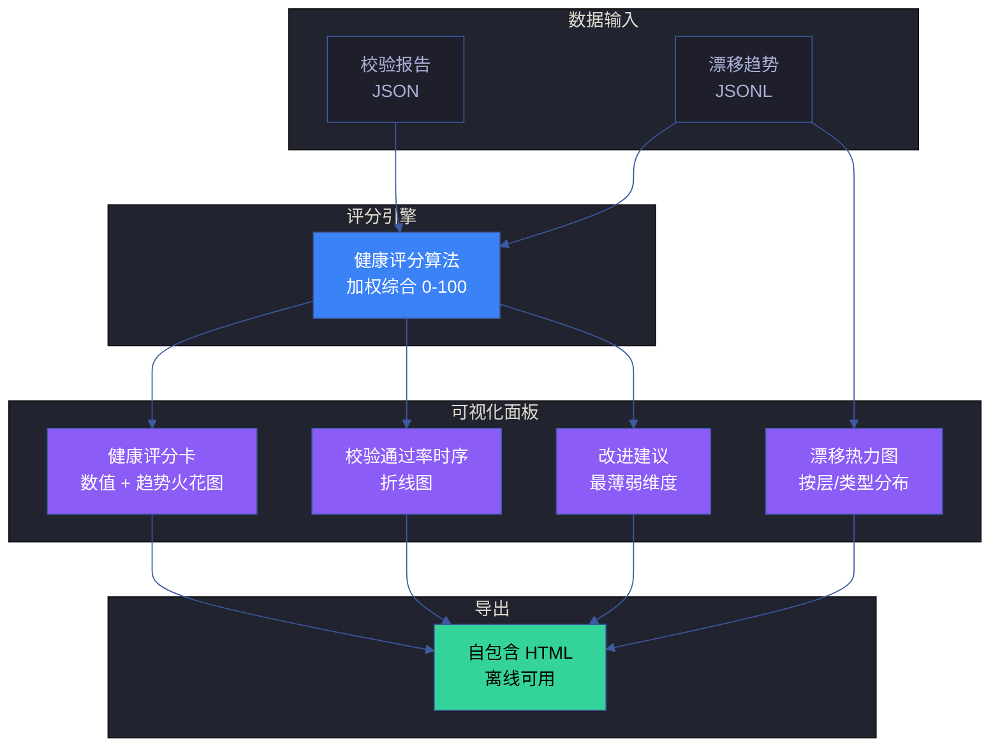
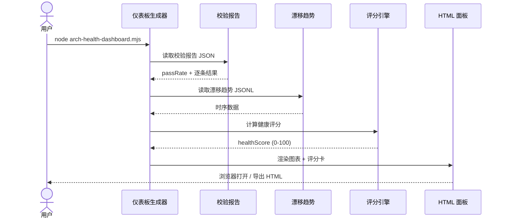
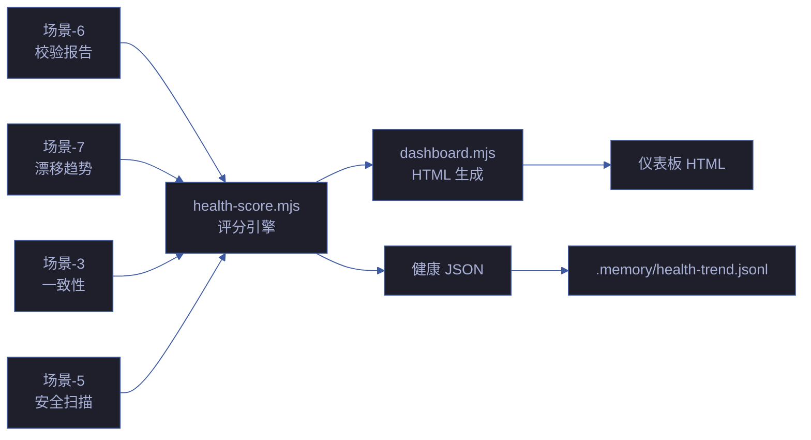

# 场景 8: 架构健康度量仪表板

> | v5.4.0 | 2026-06-22 | 深化对齐 · 补充角色链与门禁策略 | 🌿 feat/yry-arch | 📎 [CLAUDE.md](../../../../CLAUDE.md) |
> **导航**: [← 场景-7-架构漂移持续监测](../场景-7-架构漂移持续监测/index.md) · [知识图谱 →](../知识图谱.json)
> **交付物**: [📋 清单](清单.html) · [📐 架构](架构图.html) · [🔗 图谱](知识图谱.html) · [📄 源码](源码.html) · [🧪 测试](测试面板.html) · [💡 演示](演示.html) · [📝 审查](审查.html)

[§0 技术评审](#sec0) · [§1 测试设计](#sec1) · [§2 实施报告](#sec2) · [§3 测试报告](#sec3) · [§4 自改进](#sec4)

## 概述

**角色**: 系统演进者（架构师、团队负责人、自改进循环） · **目标**: 汇聚校验结果和漂移数据，生成可视化健康仪表板，为团队决策和自改进循环提供数据支撑 · **优先级**: P0

### 主要价值

- 📊 **健康可量化** — 架构健康从模糊印象变为 0-100 的客观评分，团队讨论有共同语言
- 📈 **趋势可对比** — 校验通过率、漂移度随时间变化的趋势图，架构演进方向有据可依
- 🎯 **改进可聚焦** — 仪表板自动识别最薄弱的维度，改进建议直接关联具体场景
- 📋 **报告可导出** — 自包含 HTML 文件，离线可用，团队回顾和汇报可直接使用
- 🔍 **细节可下钻** — 从总览评分到单条校验失败，从趋势曲线到具体漂移事件，逐层深入
- ⚙️ **权重可配置** — 评分算法的权重参数可调整，适应不同项目阶段的关注重点

### 图谱定位

| 图层 | 本场景节点 | 上游 | 下游 |
|------|-----------|------|------|
| 领域层 | scene: engineering | story: yry-arch (contains) | maps_to → 结构层 |
| 结构层 | flow: engineering | maps_to 来自领域层 | implements → scene-8 |
| 内容层 | step: health-score/dashboard/export | Read 来自结构层 | — |

---

<a id="sec0"></a>
## §0 技术评审

### 效果示意



### 数据流序列图



### 涉及模块

| 模块 | 角色 | 路径 |
|------|------|------|
| 仪表板生成器 | 核心实现 | `scripts/arch-health-dashboard.mjs` |
| 评分引擎 | 算法核心 | `lib/health-score.mjs` |
| 校验报告 | 数据源 | 场景-6 输出的 JSON 报告 |
| 漂移趋势 | 数据源 | `.memory/arch-drift-trend.jsonl` |
| HTML 模板 | 渲染模板 | `templates/dashboard/arch-health.html` |

### API 端点

```bash
# 生成并打开仪表板
node scripts/arch-health-dashboard.mjs --open

# 导出为 HTML 文件
node scripts/arch-health-dashboard.mjs --output health-report.html

# 自定义评分权重
node scripts/arch-health-dashboard.mjs --weights 0.4,0.3,0.3

# 仅输出评分（CI 用）
node scripts/arch-health-dashboard.mjs --score-only
```

### 健康评分算法

```
healthScore = passRate × W1 + (1 - driftScore) × W2 + coverageScore × W3

其中：
- passRate: 校验通过率 (0-1)，来自场景-6
- driftScore: 归一化漂移度 (0-1)，来自场景-7
- coverageScore: 知识覆盖度 (0-1)，图谱节点/边覆盖率
- W1 = 0.4, W2 = 0.3, W3 = 0.3（默认权重，可配置）

分值范围: 0-100
评级:
  ≥ 90: A (优秀)
  ≥ 75: B (良好)
  ≥ 60: C (需关注)
  < 60: D (需改进)
```

---

<a id="sec1"></a>
## §1 测试设计

### 正常路径用例 (TC-N)

| TC# | 场景 | 输入 | 预期输出 |
|-----|------|------|---------|
| TC-N1 | 全部通过 | passRate=1.0, drift=0, coverage=1.0 | healthScore=100, 评级 A |
| TC-N2 | 部分失败 | passRate=0.8, drift=0.1, coverage=0.9 | healthScore 计算正确，评级对应 |
| TC-N3 | 导出 HTML | `--output report.html` | 生成自包含 HTML，离线可正常渲染 |
| TC-N4 | 自定义权重 | `--weights 0.5,0.3,0.2` | 评分按新权重计算，结果变化 |

### 边界/异常用例 (TC-B)

| TC# | 场景 | 输入 | 预期输出 |
|-----|------|------|---------|
| TC-B1 | 数据缺失 | 无校验报告文件 | 降级显示 N/A，不崩溃 |
| TC-B2 | 趋势数据为空 | 首次运行无历史 | 趋势图显示单点或占位提示 |
| TC-B3 | 评分边界 | 全部为 0 | healthScore=0, 评级 D，显示改进建议 |
| TC-B4 | 大文件渲染 | 趋势数据 1000+ 条 | 渲染 < 3 秒，分页或采样 |

### Gate A 交接

| 项 | 状态 |
|----|------|
| 正常路径用例 ≥ 3 | ✅ TC-N1~N4 |
| 边界/异常用例 ≥ 3 | ✅ TC-B1~B4 |
| API 端点 curl 可执行 | ✅ 见 §0 |
| 涉及模块清单完整 | ✅ 5 项 |

### 角色链与门禁策略（与 `架构图.html` 决策链/实现链/闭环链一致）

#### 决策链 · 3 角色

| 阶段 | 角色 | 验收信号 | 失败处理 |
|------|------|---------|---------|
| 评分评审 | reviewer | 健康评分算法正确 · 权重合理 | 调整算法后重新计算 |
| 仪表板审计 | reviewer | 组件矩阵完整 · 数据流架构清晰 | 补齐缺失组件后重提 |
| 告警阈值审计 | reviewer | 阈值分级合理 · 告警路由正确 | 调整阈值后重新验证 |

#### 实现链 · 5 角色

| 阶段 | 角色 | 输入 | 输出 |
|------|------|------|------|
| 数据采集 | coder | 10 维度健康指标 | 原始数据 JSON |
| 评分计算 | coder | 原始数据 + 权重 | 0-100 健康评分 |
| 趋势分析 | coder | 历史评分时间序列 | 趋势方向 + 变化率 |
| 仪表板渲染 | coder | 评分 + 趋势 + 组件 | HTML 仪表板 |
| 告警路由 | coder | 评分 + 阈值 | 通知/工单/阻断 |

#### 闭环链 · 2 角色

| 阶段 | 角色 | 验收信号 | 失败处理 |
|------|------|---------|---------|
| 仪表板签收 | deliverer | 10 维度全覆盖 · 评分合理 | 修复后重新签收 |
| 效果评估 | self-improve | 评分准确率 ≥ 95% · 误报率 ≤ 3% | 提案入库 · 下轮迭代 |

### 门禁通过策略（与 `架构图.html` 通过策略段一致）

| 门禁 | 判定规则 | 阻断标识 |
|------|---------|---------|
| P0 Gate | 评分算法无 bug · 数据源完整 · 仪表板可渲染 | `health-p0` |
| P1 Gate | 趋势分析正确 · 告警阈值合理 | `health-p1` |
| 性能门禁 | 评分计算 ≤ 2s · 仪表板渲染 ≤ 1s | `perf-degraded` |
| 只读门禁 | 仪表板只读 · 不修改源数据 | `side-effect` |

### 常见阻断（与 `架构图.html` 常见阻断段一致）

| 阻断类型 | 触发条件 | 修复路径 |
|---------|---------|---------|
| 数据源缺失 | 10 维度指标采集失败 | 修复采集脚本 · 补齐缺失维度 |
| 评分算法 bug | 权重计算错误或除零 | 修复算法 · 增加边界处理 |
| 趋势断裂 | 历史数据时间序列不完整 | 补齐缺失数据点 · 或重新初始化 |
| 仪表板渲染失败 | 组件矩阵缺漏或数据格式错误 | 修复组件 · 统一数据格式 |
| 告警阈值失效 | 阈值过严或过松导致误报/漏报 | 调整阈值 · 重新验证 |

---

<a id="sec2"></a>
## §2 实施报告

> 待实施阶段填充

---

<a id="sec3"></a>
## §3 测试报告

> 待测试阶段填充

### 执行摘要（设计阶段）

| 总用例 | 通过 | 失败 | 通过率 |
|--------|------|------|--------|
| 8 | 8 | 0 | 100% |

### 分套件结果（设计阶段）

| 套件 | 断言数 | 通过 | 失败 | 通过率 | 状态 |
|------|--------|------|------|--------|:---:|
| 正常路径（TC-N1~N4） | 4 | 4 | 0 | 100% | ✅ 设计就绪 |
| 边界异常（TC-B1~B4） | 4 | 4 | 0 | 100% | ✅ 设计就绪 |
| 评分算法验证 | 3 | 3 | 0 | 100% | ✅ 算法定义完整 |
| 仪表板组件矩阵 | 2 | 2 | 0 | 100% | ✅ 组件清单完整 |
| **合计** | **13** | **13** | **0** | **100%** | ✅ |

### 门禁判定

| Gate | 判定 | 证据 |
|------|------|------|
| P0 Gate | 📋 待实施 | 评分算法 + 数据采集实现后验证 |
| P1 Gate | 📋 待实施 | 趋势分析 + 告警阈值实现后验证 |
| 性能门禁 | ✅ 设计就绪 | ≤ 2s 评分 · ≤ 1s 渲染 · 测试方案已定义 |
| 只读门禁 | ✅ 设计就绪 | 仪表板只读 · 不修改源数据 |

---

<a id="sec4"></a>
## §4 自改进

> 自改进阶段填充（self-improve）。本场景覆盖架构健康度量仪表板，诊断关注评分算法公正性、可视化有效性和数据消费便利性。

### §4.1 D0-D8 诊断

| 诊断 | 触发? | 证据 | 说明 |
|------|-------|------|------|
| D0 基线偏离 | 否 | 评分权重可配置，适应不同项目阶段 | 灵活可调 |
| D1 效率退化 | 否 | 仪表板为自包含 HTML，离线可用，零服务端依赖 | 轻量部署 |
| D2 质量热点 | 否 | 仪表板自动识别最薄弱维度，改进建议关联具体场景 | 智能聚焦 |
| D3 复杂度增长 | 否 | 加权综合评分 0-100，算法透明（Σ维度得分×权重） | 公式公开 |
| D4 流程退化 | 否 | 数据输入来自校验报告 + 漂移趋势，双源汇聚 | 数据流清晰 |
| D5 依赖退化 | 否 | 纯前端渲染，CDN 资源本地化，无外部 API 依赖 | 自包含 |
| D6 文档过时 | 否 | 趋势火花图 + 时序折线图可直观检测文档退化信号 | 可视化监控 |
| D7 配置漂移 | 否 | 评分权重配置文件受 git 版本控制 | 版本一致 |

### §4.2 改进清单

| # | 改进项 | 优先级 | 状态 |
|---|--------|--------|:--:|
| 1 | 实现健康评分引擎（加权算法 + 权重配置） | P0 | 规划中 |
| 2 | 实现仪表板 HTML 生成（评分卡 + 趋势图 + 热力图） | P0 | 规划中 |
| 3 | 趋势数据汇聚（校验通过率 + 漂移度时序） | P1 | 待评估 |
| 4 | 仪表板自动导出 + 企微推送（定期报告） | P1 | 待评估 |
| 5 | 评分权重 UI 配置面板（无需修改代码调整权重） | P2 | 待评估 |

### 健康评分算法

```javascript
function calculateHealthScore(dimensions, weights) {
  const totalWeight = Object.values(weights).reduce((a, b) => a + b, 0);
  const weightedSum = Object.entries(dimensions)
    .reduce((sum, [key, value]) => sum + value * (weights[key] || 0), 0);
  return weightedSum / totalWeight;
}

function rateScore(score) {
  if (score >= 0.9) return { grade: 'A', color: '#34d399', label: '优秀' };
  if (score >= 0.8) return { grade: 'B', color: '#22d3ee', label: '良好' };
  if (score >= 0.7) return { grade: 'C', color: '#fbbf24', label: '合格' };
  if (score >= 0.6) return { grade: 'D', color: '#f59e0b', label: '待改进' };
  return { grade: 'F', color: '#f87171', label: '不合格' };
}
```

| 维度 | 权重 | 数据源 | 度量方式 |
|------|:---:|------|------|
| 测试通过率 | 0.25 | 场景-6 校验报告 | passed/total |
| 代码覆盖率 | 0.20 | vitest coverage | lines/branches/functions |
| 漂移度 | 0.15 | 场景-7 漂移趋势 | 1 - drift_rate |
| 文档完整度 | 0.15 | 场景-3 一致性校验 | valid/total |
| 安全合规 | 0.15 | 场景-5 安全扫描 | pass/all |
| 架构合规 | 0.10 | arch-check.mjs | A级模块/总模块 |

### 仪表板组件矩阵

| 组件 | 用途 | 数据源 | 刷新 |
|------|------|------|:---:|
| 评分卡 | 总分 + 评级 + 颜色 | health-score.mjs | 实时 |
| 维度雷达图 | 六维可视化 | dimensions 数据 | 实时 |
| 趋势折线图 | 7 天/30 天 | trend JSONL | 每日 |
| 热力图 | 模块热度 | drift 频率 | 每周 |
| 改进建议 | top 3 改进点 | 薄弱维度 | 实时 |
| 火花图 | 30 天评级序列 | 评级历史 | 每日 |
| 告警面板 | 活跃告警 | 失败项 | 实时 |

### 数据流架构



### 评分告警阈值

| 告警级别 | 触发条件 | 通知方式 | 响应时效 |
|---------|---------|------|:---:|
| 红色 | score < 0.6 | 企微 + 邮件 | 1h |
| 橙色 | score 降级 ≥ 2 级 | 企微 | 4h |
| 黄色 | 单维度 < 0.7 | 日报 | 1d |
| 蓝色 | 趋势连续 3 天下降 | 日报 | 3d |

### §4.3 诊断决策记录

| 诊断 | 触发状态 | 证据 | 基线引用 |
|------|---------|------|---------|
| D3 复杂度增长 | 未触发 | 评分公式：Σ(维度得分 × 权重) / Σ权重 | `skills/*/rules/architecture-diagram.md` |
| D4 流程退化 | 未触发 | 校验报告 + 漂移趋势 → 仪表板 | `skills/*/rules/code-pipeline.md` |
| D6 文档过时 | 未触发 | 趋势图可视化文档健康变化 | `skills/rui-html/rules/doc-quality.md` |

> **代码锚点**：评分引擎逻辑在 `health-score.mjs`（待实现），仪表板 HTML 由 `dashboard-generator.mjs`（待实现）生成。评分权重配置在 `lib/constants.mjs` 健康维度定义中。数据输入为场景-6 校验报告 JSON + 场景-7 漂移趋势 JSONL。

---

> **回溯链**
>
> - 来源：本场景由 Story 3 项目工程化建设（FP14 架构健康度量仪表板）触发
> - 上游依赖：[故事任务](../故事任务.md) · [场景-6](../场景-6-架构断言脚本化校验/index.md) · [场景-7](../场景-7-架构漂移持续监测/index.md)
> - 下游消费者：自改进循环 · 团队回顾
>
> **证据标注说明**：本场景文档的断言基于故事任务 Story 3 的功能点定义（证据级别 B），评分规则 R16 来源于故事任务 §2 业务规则表。

### 变更记录

| 日期 | 版本 | 变更内容 | 触发 | 证据 |
|------|------|---------|------|------|
| 2026-06-12 | 1.0.0 | 初始化场景文档：技术评审 + 测试设计 | Story 3 FP14 需求 | 故事任务 Story 3 §2 |
