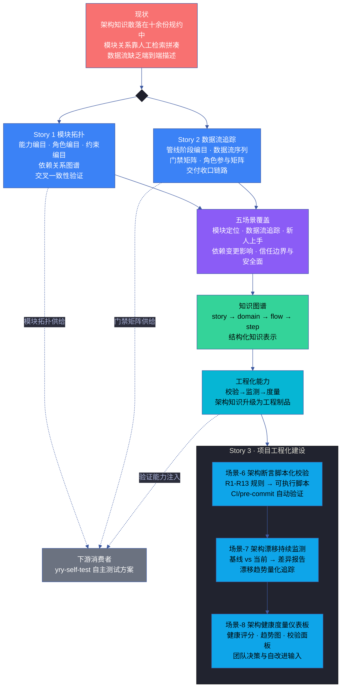
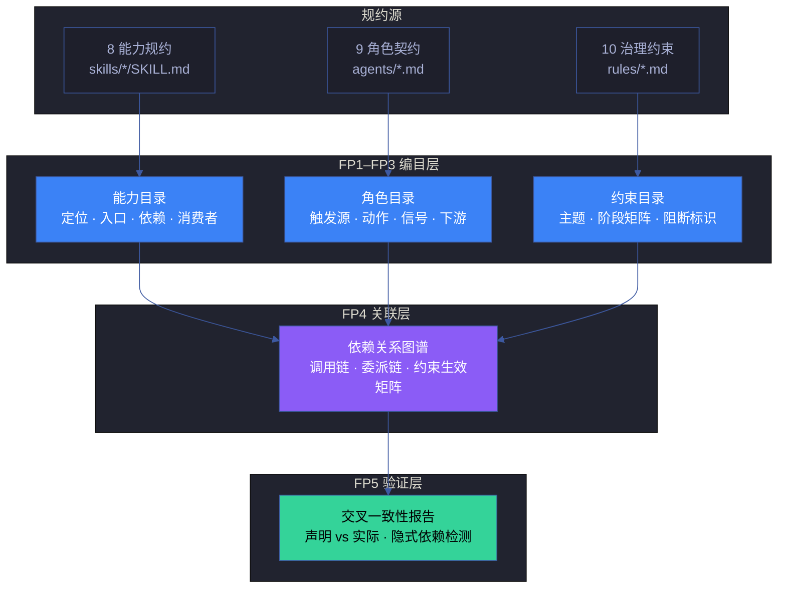
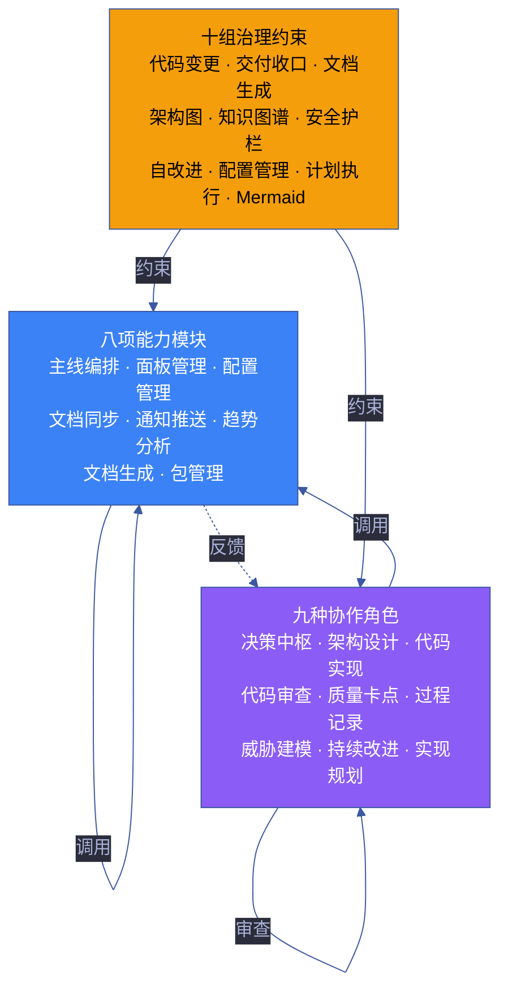
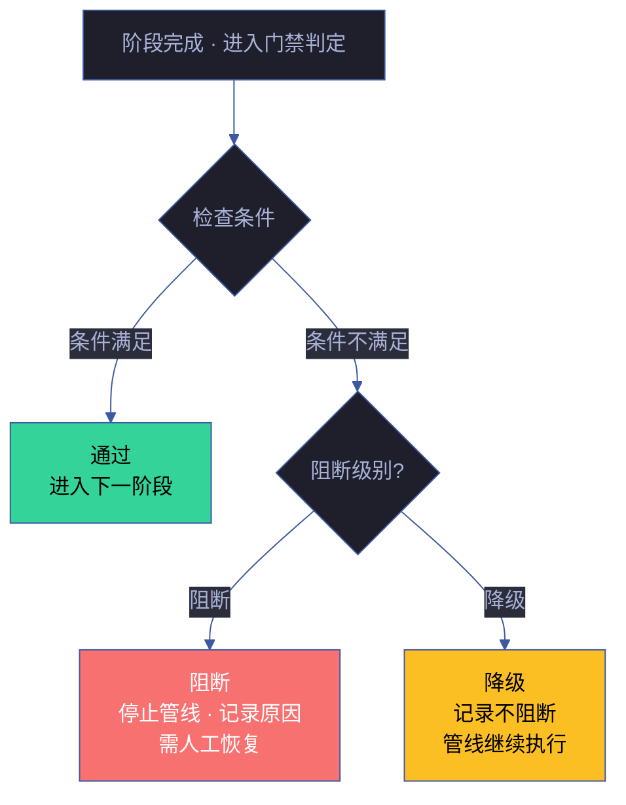
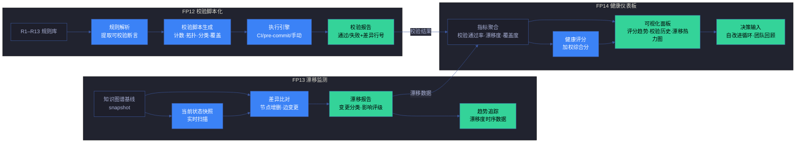
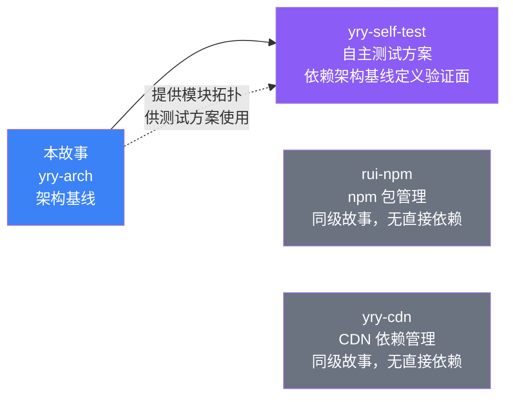

# 故事任务

> | v1.3.0 | 2026-06-12 | qwen3.7-plus | 🌿 master | 📎 [CLAUDE.md](../../../CLAUDE.md) |

[概述](#概述) · [§1 Story 1](#s-1-story) · [§1 Story 2](#s-1-story-2) · [§1 Story 3](#s-1-story-3) · [§7 跨文档索引](#s-7-跨文档索引) · [§R 关联故事](#s-r-关联故事)

## 概述

YrY 由 8 项能力模块、9 种协作角色、10 组治理约束构成，但架构知识分散在各规约文件中——能力规约只管自己的执行逻辑，角色契约只管自己的职责边界，治理约束只管自己的规则生效点。缺少一份统一的架构参照：模块间谁调用谁、角色间谁委派谁、数据在每个管线阶段以何种形态流转。

本故事通过两份并行分析补齐这份参照：

- **Story 1** 绘制模块拓扑：能力编目 → 角色编目 → 约束编目 → 依赖图谱 → 交叉验证
- **Story 2** 追踪数据流：阶段编目 → 流转序列 → 门禁矩阵 → 角色参与 → 交付收口

两份分析汇聚为五个场景文档和一份知识图谱，成为后续故事规划、影响分析和架构决策的唯一事实参照——但它不止于文档：编目规则可脚本化校验（R1–R3 计数断言）、依赖链路可拓扑排序验证（R7 无循环）、门禁判定可自动化执行（R11 阻断/降级分类），使架构基线从"人读的参照"升级为"机验的工程制品"。

### 效果示意

### 主要价值

- 🗺️ **架构地形可导航** — 无论新成员还是自改进循环，都能在三十秒内找到任一模块在系统中的位置、上下游关系和职责边界
- 🔗 **依赖链路透明化** — 能力之间的调用链、角色之间的委派链、约束在各阶段的生效点，全部显式标注，影响分析有据可依
- 📊 **数据流可追踪** — 用户指令从进入系统到交付收口，每个阶段的输入、输出、触发条件和门禁判定，形成完整的流转地图
- 🔍 **交叉引用可回源** — 每个架构断言都可追溯到具体的规约来源，变更时能快速定位受影响的文档
- ⚙️ **架构断言可机验** — 模块计数、依赖无循环、门禁分类等关键约束（R1–R3, R7, R11）均可脚本化自动校验，不依赖人工审查
- ♻️ **漂移可检测可度量** — 基线建立后，自改进循环可对比当前状态检测架构漂移、量化知识缺口，使架构演进有数据而非靠印象

---

## §1 Story

### Story 1: 模块地图与拓扑

作为 系统演进者，我想要 一张完整的、可机验的模块地图——列出全部八项能力、九种角色、十组约束，显式标注调用链、委派链和约束生效点，以便 变更任何一个模块时都能机械追溯其影响面（而非靠记忆或 grep 拼凑），新增模块时能自动检测是否引入循环依赖或孤立节点。

优先级 **P0**。范围边界：覆盖本项目的全部能力模块、协作角色和治理约束，绘制调用/委派/约束三类关系图谱及交叉一致性验证。不涉及各模块内部实现细节，不涉及外部系统。依赖：系统规约文件（skills/*/SKILL.md · agents/*.md · rules/*.md）。

#### §1.1 User Operations

| # | 操作 | 触发条件 | 操作步骤 | 预期结果 |
|---|------|---------|---------|---------|
| 1 | 检索能力模块 | 用户需要了解某项能力的功能边界和依赖关系 | 查阅模块拓扑表 → 定位目标能力 → 查看该能力的入口位置、依赖项和下游消费者 | 获得该能力在系统中的完整位置信息 |
| 2 | 检索协作角色 | 用户需要了解某个角色的职责和交接信号 | 查阅角色拓扑表 → 定位目标角色 → 查看触发源、核心动作和下游依赖方 | 获得该角色的完整职责描述和交接契约 |
| 3 | 检索治理约束 | 用户需要了解某条约束在管线各阶段的生效点 | 查阅约束生效矩阵 → 定位目标约束 → 查看适用的阶段、执行者和违反阻断标识 | 获得该约束的完整适用范围和阻断条件 |
| 4 | 追踪影响链路 | 用户计划变更某项能力，需要评估影响面 | 从目标能力出发 → 沿下游消费者链逐层追踪 → 标记所有受影响的角色和约束 | 获得完整的影响传播链 |
| 5 | 验证拓扑完整性 | 新增能力或角色后，验证是否与现有拓扑正确集成 | 对照拓扑图检查新模块是否正确注册到依赖链 → 检查是否引入了循环依赖 | 确认集成无冲突 |
| 6 | 自动化架构校验 | 用户需要在 CI 或 pre-commit 中自动验证架构约束 | 运行架构校验脚本 → 检查模块计数（R1–R3）· 依赖无循环（R7）· 消费者覆盖（R4）| 零误报，所有 P0 约束均被机检覆盖 |

#### §2 Requirements

##### 功能点

**P0**
- **FP1 能力模块编目** — 列出全部八项能力，标注核心功能、入口位置、前置依赖和下游消费者。输入：能力规约文件集合。输出：能力目录表（定位描述 · 入口索引 · 依赖列表 · 消费者列表）。阻断：能力数量不符或入口不可达。
- **FP2 协作角色编目** — 列出全部九种角色，标注触发源、核心动作、交接信号和下游接收方。输入：角色契约文件集合。输出：角色目录表（定位 · 触发源 · 核心动作 · 交接信号 · 下游）。阻断：角色数量不符或触发源缺失。
- **FP3 治理约束编目** — 列出全部十组约束，标注适用阶段、执行者、违反阻断标识。输入：治理约束文件集合。输出：约束目录表（约束主题 · 适用阶段矩阵 · 执行者 · 阻断标识）。阻断：约束数量不符或适用阶段缺失。
- **FP4 依赖关系图谱** — 绘制能力间调用链、角色间委派和反馈链、约束在管线各阶段的生效矩阵。输入：FP1–FP3 的产出。输出：mermaid 拓扑图 + 依赖矩阵表。阻断：任一模块无法定位上下游。
- **FP5 交叉验证与可脚本化校验** — 验证能力目录中声称的消费者与实际规约中声明的调用关系一致；校验 R1–R3 计数断言和 R7 无循环约束可脚本化自动执行。输入：FP1–FP4 的产出。输出：一致性报告 + 可复现的校验脚本输出。阻断：存在隐式依赖、计数偏差或循环依赖。

##### 业务规则

| R# | 描述 | 校验方式 | 证据级别 |
|----|------|---------|---------|
| R1 | 能力模块的总数必须为八项，不重不漏 | 统计能力目录条目数，与系统规约中的能力清单交叉校验 | A |
| R2 | 协作角色的总数必须为九种，不重不漏 | 统计角色目录条目数，与系统规约中的角色清单交叉校验 | A |
| R3 | 治理约束的总数必须为十组，不重不漏 | 统计约束目录条目数，与系统规约中的约束清单交叉校验 | A |
| R4 | 每项能力必须至少被一个角色所调用或关联 | 检查能力→角色的引用关系是否全覆盖 | B |
| R5 | 每个角色必须至少关联一项约束（或通过交接信号隐式关联） | 检查角色→约束的关联矩阵是否全覆盖 | B |
| R6 | 约束的生效阶段必须覆盖管线的全生命周期 | 检查约束生效矩阵的列覆盖是否覆盖所有管线阶段 | B |
| R7 | 依赖关系图中不得出现循环依赖（A→B→...→A） | 拓扑排序算法验证 | B |
| R8 | R1–R3 计数约束和 R7 无循环约束必须可脚本化自动校验，输出通过/失败和差异行号 | 运行校验脚本，检查退出码和输出格式 | A |

##### 数据约束

| 约束 | 类型 | 范围/格式 | 来源 |
|------|------|----------|------|
| 能力模块名 | 枚举 | 八项已注册能力（主线编排器 · 面板管理器 · 配置管理器 · 文档同步器 · 通知推送器 · 趋势分析器 · 文档生成器 · 包管理器） | 系统能力清单 |
| 协作角色名 | 枚举 | 九种已注册角色（决策中枢 · 架构设计 · 代码实现 · 代码审查 · 质量卡点 · 过程记录 · 威胁建模 · 持续改进 · 实现规划） | 角色契约清单 |
| 治理约束名 | 枚举 | 十组已注册约束（代码变更治理 · 交付收口 · 文档生成 · 架构图规范 · 知识图谱规范 · 安全护栏 · 自改进流程 · 配置管理约束 · 计划执行 · Mermaid 统一配色） | 治理约束清单 |
| 依赖关系方向 | 枚举 | 调用 · 委派 · 反馈 · 约束 · 通知 · 审查 | 关系语义约定 |
| 管线阶段 | 枚举 | 需求解析 · 自适应规划 · 影响分析 · 架构设计 · 文档生成 · 分支隔离 · 测试先行 · 逐模块实现 · 闭环验证 · 复盘改进 · 交付收口 | 系统管线定义 |
| 阻断标识 | 枚举 | 阻断（不可继续）· 降级（记录不阻断） | 系统阻断标识汇总 |

#### §3 成功标准

**P0**
- **SC1** 用户可以在三十秒内找到任一模块在系统中的位置和关系。度量：随机抽查三个模块，计时从打开文档到找到完整上下游信息。目标：全部三十秒内完成。→ FP1–FP4
- **SC2** 模块总数与系统实际清单一致。度量：逐项比对能力目录、角色目录、约束目录与规约文件。目标：完全一致，无遗漏无多余。→ FP1–FP3
- **SC3** 依赖关系图中每一条边都有对应的规约来源佐证。度量：追踪每条关系到规约中的具体段落。目标：全部边可溯源。→ FP4,FP5
- **SC4** 交叉验证未发现隐式依赖或虚假声明。度量：运行一致性检查，统计未对齐项数量。目标：零未对齐项。→ FP5
- **SC6** 架构校验脚本可在 5 秒内完成 R1–R3 计数校验和 R7 无循环校验。度量：运行校验脚本，计时并检查退出码。目标：5 秒内完成，退出码 0，差异定位到行。→ FP5

**P1**
- **SC5** 新成员阅读拓扑图后能正确回答变更某个功能会影响到哪些角色。度量：给定三个变更场景，验证影响链判断与基线一致。目标：全部正确。→ FP4

#### §4 范围边界

**范围内**
- 八项能力模块的完整编目 (FP1) — 每项含功能定位、入口索引、依赖项、消费者列表
- 九种协作角色的完整编目 (FP2) — 每项含触发源、核心动作、交接信号、下游接收方
- 十组治理约束的完整编目 (FP3) — 每项含适用阶段矩阵、执行者、阻断标识
- 能力间调用链路图谱 (FP4) — mermaid 拓扑图 + 依赖矩阵表
- 角色间委派与反馈链路图谱 (FP4) — 含四种协作模式的标注
- 约束在各管线阶段的生效矩阵 (FP4) — 含阻断标识的触发条件
- 交叉一致性验证 (FP5) — 逐模块验证声明与实际的一致性

**范围外**
- 各能力模块的详细实现逻辑 — 属于各能力规约自身的范畴，通过入口索引链接
- 各角色内部的执行流程细节 — 属于各角色契约自身的范畴，通过入口索引链接
- 数据在各阶段的具体转换规则 — 属于 Story 2（数据流与管线集成）的范畴
- 外部系统的集成架构 — 本项目为自包含系统，通知推送器等对外接口在 FP1 中标注但不展开
- 模块性能或容量评估 — 架构基线关注结构而非运行时指标

#### §5 AC

| AC# | Given | When | Then | 门禁 |
|-----|-------|------|------|------|
| AC1 | 用户打开架构基线文档 | 查看能力模块目录 | 看到八项能力的完整清单，每项有定位描述、依赖和消费者 | Gate A |
| AC2 | 用户打开架构基线文档 | 查看协作角色目录 | 看到九种角色的完整清单，每项有触发源、核心动作和交接信号 | Gate A |
| AC3 | 用户打开架构基线文档 | 查看治理约束目录 | 看到十组约束的完整清单，每项有适用阶段和执行者 | Gate A |
| AC4 | 用户查阅依赖关系图 | 追踪任意一条关系路径 | 能从源模块追踪到目标模块，路径上的每个节点都有明确的关系类型标注 | Gate A |
| AC5 | 用户指定一项能力模块 | 查询该能力被哪些角色所调用 | 返回完整的消费者列表，不遗漏不虚假 | Gate A |
| AC6 | 新增一项能力模块后 | 用户参照拓扑图找到正确的嵌入位置 | 知道该能力的前置依赖和下游消费者，能正确注册到调用链中 | Gate B |
| AC7 | 用户计划变更某项角色的职责边界 | 通过影响链路追踪 | 获知所有可能受影响的依赖方和关联约束 | Gate B |

#### §6 风险与假设

**高影响风险**

- **隐式依赖未声明** (M·H → FP4,FP5) — 规约文件中可能存在未在合同中显式声明的依赖关系。缓解：交叉验证 FP5 逐模块比对声明与实际引用，偏差标记为待确认。
- **拓扑图过期** (H·M → FP1–FP4) — 未来新增能力或角色时基线可能滞后。缓解：架构基线作为活文档，新增模块时同步更新；自改进循环定期校验。

**中影响风险**

- **弱耦合不可见** (M·M → FP4) — 模块间通过命名约定而非显式引用的弱耦合容易被忽略。缓解：关系图谱区分强依赖（显式引用）和弱耦合（命名约定），后者标注为可观察依赖。
- **消费关系歧义** (M·L → FP1,FP4) — 间接引用可能被错误标注为直接依赖。缓解：关系图谱标注关系强度（直接/间接）。

**低影响风险**

- **横切关系过于复杂** (L·M → FP4) — 角色间横切约束关系过多时图谱可读性下降。缓解：按协作模式分层展示——委派、流水、横切、审查四模式分图呈现。

**假设**

- 当前的八项能力清单准确反映系统边界 → 扫描规约目录验证 (FP1)
- 当前的九种角色清单准确反映协作拓扑 → 扫描角色契约目录验证 (FP2)
- 当前的十组约束清单准确反映治理范围 → 扫描治理约束目录验证 (FP3)

---

### Story 2: 数据流与管线集成

作为 系统演进者，我想要 一份端到端的数据流全貌——从用户指令进入系统到交付收口，逐阶段标注输入源、触发动作、产出物、参与者角色和门禁判定，以便 交付异常时能从收口端逆向逐阶段排查到根因，新增管线阶段时能精确知道嵌入点的前后契约，以及每个门禁判定逻辑可脚本化复现而非依赖人工记忆。

优先级 **P0**。范围边界：覆盖管线的全部十一个阶段（需求解析 → 交付收口），含门禁矩阵、角色参与矩阵和交付收口链路。不涉及各阶段内部执行逻辑。依赖：Story 1 的模块编目结果（FP1–FP3）、管线规约、交付收口规约。

#### §1.1 User Operations

| # | 操作 | 触发条件 | 操作步骤 | 预期结果 |
|---|------|---------|---------|---------|
| 1 | 追踪用户指令流转 | 用户需要了解一条指令如何从输入变为交付 | 查阅管线流转图 → 逐阶段追踪输入/动作/输出 → 查看每个阶段的门禁判断 | 获得指令的完整生命周期轨迹 |
| 2 | 定位问题发生阶段 | 用户发现交付异常，需要定位是哪个阶段出了问题 | 从交付端逆向逐阶段排查 → 对比每阶段的门禁判定规则 → 定位首个未达标的阶段 | 精确锁定问题阶段的触发条件和阻断原因 |
| 3 | 新增管线阶段 | 用户需要了解在哪个环节嵌入新阶段 | 查阅管线阶段之间的数据传递约定 → 确定新阶段的输入来源和输出去向 → 确认不与现有门禁冲突 | 获得新阶段的正确嵌入位置和契约要求 |
| 4 | 理解门禁判定 | 用户需要了解某个阻断标识的具体触发条件 | 查阅门禁矩阵 → 找到目标阻断标识 → 查看触发条件、执行者和恢复方式 | 获得该阻断标识的完整判定和恢复流程 |
| 5 | 验证数据一致性 | 用户需要确认两个阶段之间的数据传递是否正确 | 从上游阶段产出的数据格式 → 对照下游阶段的输入要求 → 检查是否存在格式转换缺失 | 确认数据传递链闭合 |
| 6 | 自动化门禁校验 | 用户需要在 CI 或交付前自动验证门禁矩阵完整性 | 运行门禁校验脚本 → 检查门禁分类（R11）· 阶段覆盖（R6）· 触发条件完整性（R9）| 所有门禁条目均有可编程判定逻辑，零主观项 |

#### §2 Requirements

##### 功能点

**P0**
- **FP6 管线阶段编目** — 列出全部十一个管线阶段，标注每阶段的输入、核心动作、产出和参与者。输入：管线规约文件集合。输出：管线阶段表（阶段名 · 输入源 · 动作摘要 · 产出物 · 参与者角色 · 门禁条件）。阻断：阶段数量不符或产出缺失。
- **FP7 数据流序列** — 绘制从用户指令进入到交付收口的完整数据流转路径。输入：FP6 的产出。输出：mermaid 流程图，展示各阶段间的数据传递关系和转换节点。阻断：任一阶段间数据传递路径不可追踪。
- **FP8 门禁矩阵** — 列出所有阻断点和降级点，标注触发条件、执行者、恢复方式。输入：管线规约 + 治理约束。输出：门禁矩阵表（阻断标识 · 触发阶段 · 条件 · 执行者 · 恢复方式 · 阻断级别）。阻断：阻断标识缺失或触发条件模糊。
- **FP9 角色参与矩阵** — 标注每个管线阶段哪些角色必须参与、哪些可选参与。输入：FP6 的产出 + 角色契约。输出：阶段-角色矩阵（必须参与 · 可选参与）。阻断：必须参与角色遗漏。

**P1**
- **FP10 交付收口链路** — 描述文档同步和通知推送的触发方式和数据流向。输入：交付收口规约。输出：交付收口流程图 + 触发条件表 + 降级策略。阻断：收口链路缺失或降级条件未标注。
- **FP11 门禁可编程性校验** — 验证每个门禁条目的判定逻辑可脚本化执行，无主观判断项。输入：FP8 的产出。输出：门禁可编程性报告（逐条标注判定方式脚本/人工和自动化状态）。阻断：存在不可编程的阻断判定时标记为需人工降级。

##### 业务规则

| R# | 描述 | 校验方式 | 证据级别 |
|----|------|---------|---------|
| R8 | 管线阶段总数为十一个，按顺序排列不可跳越 | 逐阶段检查进出条件是否覆盖全部阶段 | A |
| R9 | 每个阶段必须有明确的进入条件（前一阶段完成）和退出条件（门禁通过） | 逐阶段验证进出条件的存在性和可判定性 | B |
| R10 | 数据在相邻阶段间的传递格式必须兼容，无隐式转换 | 检查上游产出格式与下游输入格式的兼容性 | B |
| R11 | 阻断标识必须分为两类：阻断（不可继续）和降级（记录不阻断） | 遍历所有阻断标识验证分类正确性 | A |
| R12 | 交付收口的文档同步和通知推送必须独立于主流程触发 | 验证收口阶段的触发条件不依赖管线内其他阶段的中间状态 | B |
| R13 | R11 阻断/降级分类和 R8 阶段计数必须可脚本化自动校验，每个门禁条目的判定逻辑不得依赖主观判断 | 运行门禁校验脚本，检查所有阻断标识均有可编程判定条件 | A |

##### 数据约束

| 约束 | 类型 | 范围/格式 | 来源 |
|------|------|----------|------|
| 管线阶段顺序 | 有序列表 | 固定十一个阶段，前驱后继关系确定 | 系统管线规约 |
| 阶段产出类型 | 枚举 | 问题空间基线（意愿和边界）· 场景层文档（评审和报告）· 知识层（结构化知识）· 执行记录 | 文档生成约束 |
| 门禁判定结果 | 枚举 | 通过（继续下一阶段）· 阻断（停止并记录原因）· 降级（记录但不停止） | 治理约束 |
| 角色参与级别 | 枚举 | 必须参与 · 可选参与 | 角色拓扑规约 |
| 阻断标识格式 | 字符串 | kebab-case，不可重复 | 阻断标识汇总表 |
| 交付收口触发方式 | 枚举 | 手动触发 · 自动触发 | 交付收口规约 |

#### §3 成功标准

**P0**
- **SC7** 用户可以在六十秒内追踪一条指令的完整生命周期。度量：给定一条典型指令，计时从查阅文档到完整理解每个阶段的输入/输出/门禁。目标：六十秒内完成。→ FP6,FP7
- **SC8** 每个管线阶段都有明确的参与者标注。度量：逐阶段检查参与角色的标注完整性。目标：全部十一个阶段完成标注。→ FP6,FP9
- **SC9** 所有阻断标识都有触发条件和恢复方式。度量：遍历门禁矩阵逐条验证。目标：全部阻断标识完整。→ FP8
- **SC10** 数据流图中相邻阶段间无数据格式断裂。度量：逐条检查上游产出与下游输入的兼容性。目标：零断裂。→ FP7
- **SC13** 门禁校验脚本可自动验证 R11 分类和 R8 阶段计数，零人工判断项。度量：运行门禁校验脚本，检查所有阻断标识均有可编程判定条件。目标：全部阻断标识可编程判定，退出码 0。→ FP11

**P1**
- **SC11** 用户给定一个阻断标识，能在一个检索动作内找到其完整的判定和恢复流程。度量：随机抽查三个阻断标识。目标：全部在一次检索内完成。→ FP8
- **SC12** 交付收口的触发链路和降级策略清晰可操作。度量：对照收口规约验证描述完整性。目标：链路全覆盖，降级条目齐备。→ FP10

#### §4 范围边界

**范围内**
- 十一个管线阶段的完整编目 (FP6) — 含阶段名、输入源、动作摘要、产出、参与者
- 端到端数据流序列图 (FP7) — 展示指令从进入到交付的完整流转
- 全部阻断标识的门禁矩阵 (FP8) — 含触发条件、执行者、恢复方式、阻断级别
- 阶段-角色参与矩阵 (FP9) — 标注每个阶段必须参与和可选参与的角色
- 交付收口触发链路和降级策略 (FP10) — 文档同步、通知推送的触发方式和故障处理
- 门禁判定规则与传递约定 (FP8) — 阶段间的进入退出条件
- 门禁可编程性校验 (FP11) — 逐条验证每个阻断标识的判定逻辑可脚本化执行

**范围外**
- 各阶段内部的具体执行逻辑 — 属于各能力规约和角色契约的范畴，通过入口索引链接
- 模块间的静态拓扑关系 — 属于 Story 1（模块地图与拓扑）的范畴，通过导航链接
- 具体阻断标识的代码级实现细节 — 数据流关注阶段级逻辑而非实现细节
- 外部系统的数据格式 — 本项目为自包含系统，通知推送的契约在能力规约中定义
- 历史数据的迁移或兼容 — 本故事聚焦当前管线设计

#### §5 AC

| AC# | Given | When | Then | 门禁 |
|-----|-------|------|------|------|
| AC8 | 用户打开数据流与管线集成章节 | 查看管线阶段表 | 看到全部十一个阶段的清单，每个阶段有输入、动作、产出和参与者 | Gate A |
| AC9 | 用户查阅数据流序列图 | 从用户指令进入开始逐阶段追踪 | 能完整追踪到交付收口，每个阶段的数据转换清晰可见 | Gate A |
| AC10 | 用户查阅门禁矩阵 | 查看某个阻断标识 | 看到该标识的触发阶段、触发条件、执行者和恢复方式 | Gate A |
| AC11 | 用户查阅阶段-角色参与矩阵 | 定位到任一管线阶段 | 知道哪些角色必须参与该阶段，哪些角色可选参与 | Gate A |
| AC12 | 用户需要定位交付异常 | 从交付端逆向逐阶段排查门禁 | 找到第一个未达标门禁的触发条件和阻断原因 | Gate B |
| AC13 | 系统新增一个管线阶段 | 用户查阅数据流找到正确嵌入位置 | 知道新阶段的前驱阶段、后驱阶段和必须满足的数据传递约定 | Gate B |
| AC14 | 交付收口的通知推送失败 | 用户查阅降级策略 | 知道系统不会因推送失败而阻断主流程，有明确的降级处理路径 | Gate B |

#### §6 风险与假设

**高影响风险**

- **管线阶段定义与实际不一致** (M·H → FP6,FP7) — 规约中描述的管线阶段可能与实际执行路径存在偏差。缓解：交叉比对管线规约、角色契约和能力规约中对同一阶段的描述，不一致处标记。
- **门禁依赖主观判断** (L·H → FP8) — 阻断条件若依赖人工主观判断则无法自动化执行，低概率但影响大。缓解：主观判定项标注为需人工判断，优先推动可编程化（FP11）。

**中影响风险**

- **数据传递存在隐式约定** (M·M → FP7) — 相邻阶段间的数据转化规则可能未被任何规约显式定义。缓解：逐对验证相邻阶段的数据转化规则是否在至少一份规约中有定义。
- **阶段粒度未来调整** (M·L → FP6) — 管线阶段划分粒度可能随系统演进而变化。缓解：数据流描述按当前管线定义，调整时同步更新本基线。

**低影响风险**

- **降级策略故障覆盖不全** (L·M → FP10) — 特定故障模式（网络不可达、凭据缺失、远端服务异常）下交付收口降级策略可能遗漏。缓解：枚举已知故障模式，逐验证降级策略覆盖。

**假设**

- 所有阶段的进入退出条件在规约中都有明确定义 → 遍历规约验证每个阶段的进出条件 (FP6,FP8)
- 交付收口的手动触发方式不会在自动化演进中意外变为自动触发 → 当前约定为手动触发，变更时同步更新收口链路 (FP10)

---

### Story 3: 项目工程化建设

作为 系统演进者，我想要 将架构知识从静态文档升级为可执行、可监测、可度量的工程制品——把 R1–R13 规则变成脚本化校验、把知识图谱基线变成漂移监测的数据源、把校验结果和健康指标汇聚为可视化仪表板，以便 架构约束不再依赖人工记忆和审查，任何架构变更都能被自动验证和持续追踪，团队对架构健康的认知有据可查而非凭印象。

优先级 **P0**。范围边界：覆盖架构校验脚本化（FP12）、架构漂移持续监测（FP13）、架构健康度量仪表板（FP14）。不涉及各校验脚本的内部算法细节（仅提供接口契约和输入输出），不涉及仪表板的具体 UI 实现。依赖：Story 1 的模块拓扑与规则定义（R1–R8）、Story 2 的管线数据流与门禁规则（R9–R13）、知识图谱基线。

#### §1.1 User Operations

| # | 操作 | 触发条件 | 操作步骤 | 预期结果 |
|---|------|---------|---------|---------|
| 1 | 运行架构校验 | 用户需要在提交前或 CI 中验证架构约束 | 运行校验脚本（`node scripts/arch-validate.mjs`）→ 查看校验报告 | 退出码 0 表示通过，非 0 列出所有失败项及差异行号 |
| 2 | 新增校验规则 | 系统新增架构约束时，需要将其纳入自动校验 | 在规则配置中添加新断言 → 重新运行校验 → 确认新规则被覆盖 | 新规则出现在校验报告中，缺失时报告标记为未覆盖 |
| 3 | 检测架构漂移 | 用户需要了解当前架构与基线的差异 | 运行漂移检测命令 → 查看漂移报告 → 确认漂移类型和影响评级 | 获得差异清单（新增/删除/修改的节点和边），每项标注影响评级 |
| 4 | 追踪漂移趋势 | 用户需要了解架构稳定性随时间的变化 | 查看趋势数据 → 对比不同时间点的漂移度 | 获得漂移度时序图，可识别架构不稳定期 |
| 5 | 查看健康仪表板 | 团队需要了解架构整体健康状况 | 打开仪表板 → 查看健康评分、校验通过率、漂移趋势 | 获得架构健康的全景视图，含评分、趋势和改进建议 |
| 6 | 导出健康报告 | 用户需要将架构健康数据用于回顾或汇报 | 点击导出 → 选择格式（HTML/PDF）→ 下载 | 获得自包含的健康报告文件，含评分、趋势和关键指标 |

#### §2 Requirements

##### 功能点

**P0**
- **FP12 架构校验脚本化** — 将 R1–R13 规则转换为可执行校验脚本。输入：规则定义 + 规约文件。输出：校验脚本（`arch-validate.mjs`）+ 校验报告（JSON/终端格式）。报告含逐条规则通过/失败状态、差异定位（行号或节点 ID）、总体通过率。阻断：任一 P0 规则不可脚本化。
- **FP13 架构漂移持续监测** — 基于知识图谱基线快照，检测当前架构状态与基线的差异。输入：基线快照（`knowledge-graph-baseline.json`）+ 当前状态快照。输出：漂移报告（差异节点/边清单 + 影响评级）+ 趋势数据（时序漂移度）。阻断：基线快照缺失或格式不兼容。
- **FP14 架构健康度量仪表板** — 汇聚校验结果和漂移数据，生成可视化健康仪表板。输入：校验报告 + 漂移趋势数据。输出：HTML 仪表板（健康评分 · 校验通过率时序 · 漂移热力图 · 改进建议）。阻断：输入数据缺失或评分算法未定义。

##### 业务规则

| R# | 描述 | 校验方式 | 证据级别 |
|----|------|---------|---------|
| R14 | 校验脚本必须在 5 秒内完成全量校验（R1–R13），输出退出码和结构化报告 | 计时运行校验脚本，验证退出码和报告格式 | A |
| R15 | 漂移检测必须覆盖知识图谱中所有节点和边类型（domain/flow/step/scene），变更分类为新增/删除/修改 | 运行漂移检测，验证输出覆盖全部类型 | A |
| R16 | 健康评分必须基于校验通过率（权重 0.4）、漂移度（权重 0.3）和知识覆盖度（权重 0.3）的加权计算，分值范围 0–100 | 验证评分算法输入输出，对比预期分值 | A |

##### 数据约束

| 约束 | 类型 | 范围/格式 | 来源 |
|------|------|----------|------|
| 校验报告格式 | JSON | `{rules: [{id, status, diff}], passRate, timestamp}` | FP12 输出规范 |
| 漂移报告格式 | JSON | `{added: [], removed: [], modified: [], driftScore, timestamp}` | FP13 输出规范 |
| 健康评分范围 | 数值 | 0–100，整数 | FP14 评分算法 |
| 基线快照格式 | JSON | 知识图谱 JSON v2.0.0 子集，含 nodes + edges | 知识图谱规范 |
| 趋势数据格式 | JSONL | 每行 `{timestamp, healthScore, driftScore, passRate}` | 仪表板数据源 |

#### §3 成功标准

**P0**
- **SC14** 架构校验脚本可在 5 秒内完成全量校验并输出结构化报告。度量：运行脚本计时，验证退出码和报告格式。目标：5 秒内完成，退出码 0，报告含逐条规则结果。→ FP12
- **SC15** 校验脚本覆盖 R1–R13 全部规则，无遗漏。度量：统计报告中规则数与 R1–R13 总数。目标：13/13 覆盖。→ FP12
- **SC16** 漂移检测可识别知识图谱中所有类型的变更（新增/删除/修改）。度量：构造已知变更样本，运行漂移检测，验证全部被识别。目标：零漏报。→ FP13
- **SC17** 漂移趋势数据可追溯至少 30 天的历史。度量：检查趋势数据存储量。目标：≥ 30 条记录。→ FP13
- **SC18** 健康仪表板展示评分、校验通过率和漂移趋势三项核心指标。度量：打开仪表板验证指标展示。目标：三项指标全部可见且数据正确。→ FP14

**P1**
- **SC19** 健康评分算法透明可审计，输入权重可配置。度量：检查评分算法源码和配置文件。目标：权重可调整，算法可复现。→ FP14
- **SC20** 仪表板可导出为自包含 HTML 文件（无外部依赖）。度量：离线打开导出的 HTML，验证所有图表正常渲染。目标：离线可用。→ FP14

#### §4 范围边界

**范围内**
- R1–R13 规则的脚本化校验 (FP12) — 含校验脚本、执行引擎和报告格式
- 知识图谱基线快照管理 (FP13) — 含基线创建、比对和漂移报告
- 漂移趋势数据持久化 (FP13) — JSONL 时序数据存储
- 健康评分算法 (FP14) — 加权计算和分值范围定义
- 可视化仪表板 (FP14) — HTML 自包含面板

**范围外**
- 校验脚本的内部算法实现细节 — 属于脚本开发阶段范畴，本故事定义接口契约
- 仪表板的 CSS/UI 框架选型 — 属于前端实现范畴，遵循架构图规范即可
- 校验失败的自动修复 — 本故事聚焦检测和度量，修复属于自改进循环范畴
- CI/CD 管线的具体配置 — 提供脚本和接口，CI 集成由各环境自行配置
- 实时告警推送 — 仪表板展示数据，告警属于通知推送器范畴

#### §5 AC

| AC# | Given | When | Then | 门禁 |
|-----|-------|------|------|------|
| AC15 | 用户运行架构校验脚本 | 查看终端输出 | 看到逐条规则通过/失败状态和总体通过率，退出码 0 表示全部通过 | Gate A |
| AC16 | 某条规则校验失败 | 查看校验报告 | 看到失败规则的具体差异定位（行号或节点 ID）和预期值 | Gate A |
| AC17 | 系统规约发生变更 | 用户重新运行校验 | 校验脚本自动检测变更并更新规则覆盖，未覆盖的新约束被标记 | Gate B |
| AC18 | 用户运行漂移检测 | 查看漂移报告 | 看到与基线相比新增/删除/修改的节点和边清单，每项含影响评级 | Gate A |
| AC19 | 连续多次运行漂移检测 | 查看趋势数据 | 看到漂移度随时间变化的时序图，可识别不稳定期 | Gate A |
| AC20 | 用户打开健康仪表板 | 查看面板概览 | 看到健康评分（0–100）、校验通过率时序和漂移热力图三项核心指标 | Gate A |
| AC21 | 用户导出健康报告 | 离线打开 HTML 文件 | 所有图表和数据正常渲染，无外部依赖 | Gate B |

#### §6 风险与假设

**高影响风险**

- **校验脚本维护成本** (M·M → FP12) — 规约变更频繁时校验脚本需同步更新，维护负担增加。缓解：校验脚本从规则配置自动生成，减少手写维护；规约变更触发校验脚本重生成。
- **基线快照过期** (H·M → FP13) — 基线创建后未及时更新导致漂移检测误报。缓解：基线更新与故事交付收口绑定，每次交付自动刷新基线。

**中影响风险**

- **健康评分权重争议** (M·L → FP14) — 不同角色对评分权重（校验通过率 vs 漂移度 vs 覆盖度）可能有不同偏好。缓解：权重可配置，默认值基于项目阶段调整，团队可协商。
- **漂移检测粒度** (M·M → FP13) — 过细的粒度导致噪声过多，过粗遗漏关键变更。缓解：漂移报告支持分级过滤（仅 P0 变更 / 全部变更 / 按层过滤）。

**低影响风险**

- **仪表板渲染性能** (L·L → FP14) — 数据量大时仪表板渲染变慢。缓解：数据采样和分页，趋势数据仅保留最近 90 天。

**假设**

- 知识图谱 JSON 格式稳定，可作为基线快照的标准格式 → 知识图谱规范已定义 v2.0.0 schema (FP13)
- 校验脚本运行环境有 Node.js 支持 → 项目已有 root package.json 含 vitest 依赖，Node.js 环境可用 (FP12)
- 团队接受健康评分作为架构健康的参考指标而非绝对标准 → 评分定位为辅助决策工具，不替代专业判断 (FP14)

---

## §7 跨文档索引

| 本文档章节 | 基线内容 | 下游文档编号 | 预期覆盖 | 状态 |
|-----------|---------|-------------|---------|------|
| Story 1 FP1–FP3 | 能力模块、协作角色、治理约束的编目 | 场景-2-模块定位/index.md | 任一模块在系统中的完整位置信息，含入口索引和依赖链 | ✓ 已覆盖 |
| Story 1 FP4 | 模块依赖关系图谱 | 场景-2-模块定位/index.md | mermaid 拓扑图 + 依赖矩阵表 | ✓ 已覆盖 |
| Story 1 FP5 | 交叉一致性验证 | 场景-2-模块定位/index.md | 逐模块验证声明与实际的一致性 | ✓ 已覆盖 |
| Story 2 FP6–FP7 | 管线阶段编目和数据流序列 | 场景-3-数据流追踪/index.md | 端到端数据流图 + 阶段输入/输出/门禁 | ✓ 已覆盖 |
| Story 2 FP8 | 门禁矩阵 | 场景-3-数据流追踪/index.md | 全部阻断标识的触发条件和恢复方式 | ✓ 已覆盖 |
| Story 2 FP9 | 阶段-角色参与矩阵 | 场景-3-数据流追踪/index.md | 每阶段的角色参与标注 | ✓ 已覆盖 |
| Story 1 + Story 2 全部 FP | 模块拓扑 + 数据流完整知识 | 场景-1-新人上手/index.md | 新成员可操作的导航路线，从零了解系统架构 | ✓ 已覆盖 |
| Story 1 FP4 + Story 2 FP7 | 模块关系和阶段流转的综合影响 | 场景-4-变更影响分析/index.md | 给定一个变更点，追踪其影响链（模块→角色→阶段→约束） | ✓ 已覆盖 |
| Story 1 FP1–FP4 + Story 2 FP6–FP9 | 模块拓扑与数据流的信任边界和安全约束 | 场景-5-信任边界与安全面/index.md | 输入面全编目 · 信任链逐跳追踪 · 安全约束覆盖矩阵 · 阻断标识可达性 | ✓ 已覆盖 |
| Story 3 FP12 | R1–R13 规则脚本化校验 | 场景-6-架构断言脚本化校验/index.md | 校验脚本 · 执行引擎 · 结构化报告 · CI/pre-commit 集成 | 待生成 |
| Story 3 FP13 | 架构漂移持续监测 | 场景-7-架构漂移持续监测/index.md | 基线快照 · 差异比对 · 漂移报告 · 趋势数据 | 待生成 |
| Story 3 FP14 | 架构健康度量仪表板 | 场景-8-架构健康度量仪表板/index.md | 健康评分 · 可视化面板 · 导出报告 | 待生成 |
| Story 1 全部 + Story 2 全部 + Story 3 全部 | 架构全貌的结构化知识（含工程化） | 知识图谱.json | domain/flow/step 节点 + 工程化 flow + 层次 + 边 | ✓ 已覆盖 |

---

## §R 关联故事

| 关联故事 | 关系类型 | 说明 |
|---------|---------|------|
| `yry-self-test` | 数据供给 | 本故事定义的模块拓扑和数据流为自主测试方案提供验证对象——测试方案需要知道哪些模块需要自检、哪些阶段需要门禁校验。架构基线是测试方案的输入依赖。 |
| `rui-npm` | 同级故事 | 同为 YrY 系统的顶层故事。rui-npm 管理 npm 包的搜索/安装/发布，与架构基线无直接数据依赖，但共享系统规约和管线约束。 |
| `yry-cdn` | 同级故事 | 同为 YrY 系统的顶层故事。yry-cdn 管理 CDN 框架依赖，与架构基线无直接数据依赖，但共享系统规约和管线约束。 |

---

> **回溯链**
>
> - 来源：本故事由 `/rui init` 管线的架构故事生成步骤触发，需求来源于系统自托管演进中对架构知识固化的内生要求。分析基线来源于 [CLAUDE.md](../../../CLAUDE.md)（项目约束与自约束）、[README.md](../../../README.md)（系统全景与领域语言）以及以下规约文件。
> - 能力规约：[主线编排器](../../../skills/rui/SKILL.md) · [面板管理器](../../../skills/rui-story/SKILL.md) · [配置管理器](../../../skills/rui-claude/SKILL.md) · [文档同步器](../../../skills/rui-import/SKILL.md) · [通知推送器](../../../skills/rui-bot/SKILL.md) · [趋势分析器](../../../skills/rui-trends/SKILL.md) · [文档生成器](../../../skills/rui-docs/SKILL.md) · [包管理器](../../../skills/rui-npm/SKILL.md)
> - 角色契约：[角色拓扑与共用底线](../../../skills/rui/AGENT.md)，以及九个专项角色契约（决策中枢 · 架构设计 · 代码实现 · 代码审查 · 质量卡点 · 过程记录 · 威胁建模 · 持续改进 · 实现规划）
> - 治理约束：[代码变更治理](../../../skills/rui-code/rules/code-pipeline.md) · [交付收口](../../../skills/rui/rules/delivery-gate.md) · [文档生成](../../../skills/rui-html/rules/doc-generation.md) · [架构图规范](../../../skills/rui-html/rules/architecture-diagram.md) · [知识图谱规范](../../../skills/rui-story/rules/knowledge-graph.md) · [安全护栏](../../../skills/rui/rules/security-guardrails.md) · [自改进流程](../../../skills/rui-yry/rules/self-improve.md) · [配置管理约束](../../../skills/rui-claude/rules/rui-claude.md) · [计划执行](../../../skills/rui-plan/rules/plan-execution.md) · [Mermaid 统一配色](../../../skills/rui/rules/mermaid-theme.md)
> - 文档公式：[公式规约](../../../skills/rui/formulas.md) — 定义故事文档的结构化产出规范
>
> **证据标注说明**：本 Story 文档的断言基于以上规约文件的分析推导（证据级别 B），证据可追溯到具体规约章节。能力总数、角色总数、约束总数的统计基于对应规约目录的文件枚举（证据级别 A）。管线阶段数量基于主线编排器规约中管线一览的显式定义（证据级别 A）。

### 变更记录

| 日期 | 版本 | 变更内容 | 触发 | 证据 |
|------|------|---------|------|------|
| 2026-06-05 | 1.0.0 | 初始化，从架构基线需求创建：Story 1 模块地图与拓扑 + Story 2 数据流与管线集成 | `/rui init` arch 步骤 | 24 份规约文件分析，commit `10b6f75` |
| 2026-06-08 | 1.1.0 | 新增场景-5：信任边界与安全面 | `/rui version-update` | scene-5 文档生成 |
| 2026-06-09 | 1.2.0 | 修正模块计数（8技能/9Agent/10规则）· 补全数据约束表 · 扩展§7和§R · 修复F.toc | `/rui version-update` | CLAUDE.md profile + 文件枚举 |
| 2026-06-12 | 1.3.0 | 新增 Story 3: 项目工程化建设（FP12 架构校验脚本化 · FP13 漂移持续监测 · FP14 健康度量仪表板）· 新增场景-6/7/8 · 更新效果示意 · 更新§7跨文档索引 | 用户请求：工程化建设场景 | Story 3 需求分析 |

---

> **导航**: [场景-2-模块定位 →](./场景-2-模块定位/index.md)
