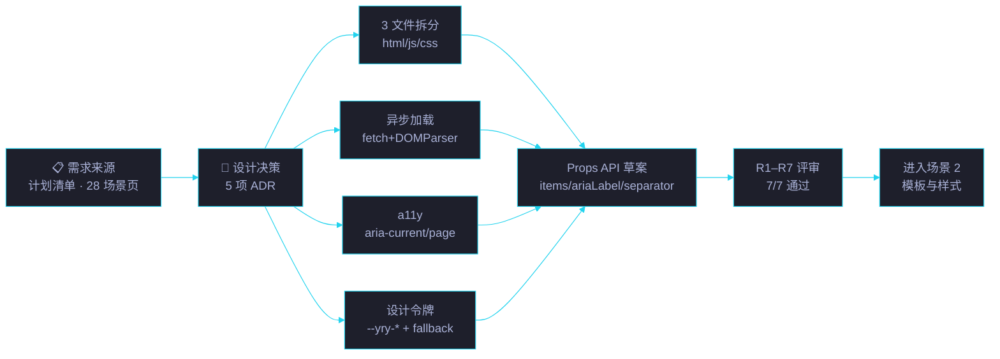
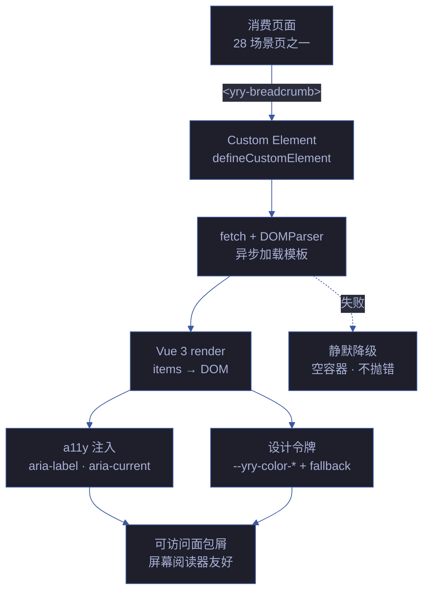

# 场景 1: 需求与设计

> | v5.4.0 | 2026-06-22 | 深化对齐 | 任务故事: YryBreadcrumb |
> **导航**: [← README](../../README.md) · [场景 2 →](./../场景-2-模板与样式/index.md)
> **交付物**: [📋 清单](清单.html) · [📐 架构](架构图.html) · [🔗 图谱](知识图谱.html) · [📄 源码](源码.html) · [🧪 测试](测试面板.html) · [💡 演示](演示.html) · [📝 审查](审查.html)

[§0 概述](#sec0) · [§1 关键内容](#sec1) · [§2 实施](#sec2) · [§3 验证](#sec3) · [§4 自改进](#sec4)

<a id="sec0"></a>
## §0 概述

本场景是 **YryBreadcrumb 任务故事** 的第 1 个，聚焦于 **需求与设计**：梳理面包屑组件的需求来源，确定 3 文件拆分 / 异步加载 / a11y 等关键设计决策，产出 Props API 草案并通过 7 项技术评审（R1–R7）。

> 🍞 本组件是 CDN 故事 **场景 3 · 组件库与 JS 工具 API** 的子交付物，见 [README §文档目录 · 故事任务索引](../../README.md#文档目录--故事任务索引)。

### 需求背景

面包屑组件需要满足以下需求：

| 需求 | 优先级 | 来源 | 验收信号 |
|------|:---:|------|---------|
| 跨 28+ 场景页面统一面包屑实现 | P0 | 计划清单场景 1 | 28 场景页统一 `<yry-breadcrumb>` 调用 |
| 从静态 HTML 重构为 Vue 3 组件 | P0 | 技术栈统一 | `defineCustomElement` 注册成功 |
| 跨主题可移植（暗色/亮色） | P1 | 设计系统规划 | `--yry-color-*` 令牌覆盖 |
| 屏幕阅读器友好（a11y） | P1 | 无障碍基线 | `aria-current="page"` + `aria-hidden` |
| 3 种显示模式（href+icon/纯文本/回溯路径） | P0 | 产品需求 | 演示页 3 种模式全部渲染 |

### 场景定位



<a id="sec1"></a>
## §1 关键内容

### 设计决策（ADR 风格）

| 决策 | 选型 | 替代方案 | 理由 | 评审编号 |
|------|------|---------|------|:---:|
| 框架 | Vue 3 (全局变量) | Vanilla JS / Web Component | 项目已用 Vue 3，生态一致 | R1 |
| 文件结构 | 3 文件拆分 (index.html/js/css) | 单 .js 混合 | 设计师/前端/样式各自修改不干扰 | R2 |
| 加载方式 | 异步 fetch + DOMParser | 同步 XHR / 打包 | 零打包，模板源可在浏览器预览 | R4 |
| 样式 | 设计令牌 `var(--yry-color-*, #fallback)` | hardcoded | 跨主题可移植，无主题时降级 | R5 |
| a11y | `aria-current="page"` + `aria-hidden` | 仅视觉 | 屏幕阅读器友好 | R3 |
| 自定义元素 | `defineCustomElement` | 全局组件 | 可在任何页面直接使用 `<yry-breadcrumb>` | R1 |

### Props API 设计

| Prop | 类型 | 必填 | 默认值 | 校验规则 | 评审编号 |
|------|------|:---:|--------|---------|:---:|
| `items` | `Array<{href?, label, icon?}>` | ✓ | `[]` | label 必填，href/icon 可选；末项渲染为当前页 | R1 |
| `ariaLabel` | `String` | — | `"面包屑导航"` | 注入到 `<nav aria-label>` | R3 |
| `separator` | `String` | — | `"/"` | 字符分隔符，渲染于条目之间 | R1 |
| `homeLabel` | `String` | — | `"首页"` | 首页标签文字 | — |
| `homeHref` | `String` | — | `"../../../../index.html"` | 首页链接路径 | — |

### R1–R7 评审清单

| 编号 | 评审项 | 期望信号 | 状态 |
|:---:|------|---------|:---:|
| R1 | Props API 草案完整性 | items/ariaLabel/separator 三参数定义清晰 | ✅ |
| R2 | 3 文件拆分职责清晰 | HTML 模板 / JS 逻辑 / CSS 样式各自独立 | ✅ |
| R3 | a11y 设计 (aria-label, aria-current) | nav 有 aria-label，末项有 aria-current="page" | ✅ |
| R4 | 异步加载与降级策略 | fetch + DOMParser 异步加载，失败时静默降级 | ✅ |
| R5 | 设计令牌命名空间 (--yry-*) | 所有颜色变量使用 --yry- 前缀，含 fallback | ✅ |
| R6 | 需求来源可追溯 | 计划清单 · 场景 1 + 28 场景页引用明确 | ✅ |
| R7 | 跨场景链接有效 | 所有场景间链接可正常跳转 | ✅ |

### 架构概念视图



### A11y 语义深度

| ARIA 属性 | 值 | 作用 | WCAG 条款 |
|----------|------|------|------|
| `<nav aria-label>` | `面包屑导航` | 标识地标区域 | 1.3.6 |
| `aria-current="page"` | 末项 | 标记当前页 | 1.3.1 |
| `aria-hidden="true"` | 分隔符图标 | 屏幕阅读器跳过装饰 | 1.3.1 |
| `<ol>/<li>` 语义 | 有序列表 | 顺序关系明确 | 1.3.1 |
| `rel="index"` | 首页链接 | 指明首页关系 | HTML5 |

**Schema.org 微数据** (SEO 增强):

```html
<ol itemscope itemtype="https://schema.org/BreadcrumbList">
  <li itemprop="itemListElement" itemscope itemtype="https://schema.org/ListItem">
    <a itemprop="item" href="../../index.html"><span itemprop="name">首页</span></a>
    <meta itemprop="position" content="1">
  </li>
</ol>
```

**键盘导航语义**:

| 键 | 行为 | 实现 |
|------|------|------|
| Tab | 焦点在链接间移动 | 默认 `<a>` 行为 |
| Shift+Tab | 反向移动 | 默认 `<a>` 行为 |
| Enter | 激活链接 | 默认 `<a>` 行为 |
| Home / End | 不拦截 | 默认页面滚动 |

> 面包屑不实现 roving tabindex，保持原生 `<a>` 焦点顺序即可，避免过度键盘劫持。

### 国际化与可扩展性

| 维度 | 当前 | 扩展点 |
|------|------|------|
| 分隔符 | `/` 固定 | 支持 RTL (如 `\\`) · i18n 字符 |
| 文本方向 | LTR | `dir="rtl"` 自动翻转分隔符方向 |
| 标签语言 | 中文 | 文案外部化 · i18n 字典 |
| 最大层级 | 无限制 | 建议 ≤ 5 层 · 超出折叠中段 |
| 移动端 | 完整展示 | 宽度不足时折叠中段 (`…`) |

<a id="sec2"></a>
## §2 实施报告

本场景产出 7 个 HTML 主题卡片，构成标准 8 交付物模式（含本 index.md）：

| 卡片 | 文件 | 核心内容 | 对应章节 |
|:---:|------|---------|:---:|
| 📋 审查 | [审查.html](./审查.html) | R1–R7 评审清单 · 决策记录 · 维度评分 · 审查管线 · 逐项验证 | §1 |
| 🏗 架构图 | [架构图.html](./架构图.html) | 架构图 · 概念视图 · 异步加载说明 | §1 |
| 🧪 测试面板 | [测试面板.html](./测试面板.html) | 测试摘要 · 测试用例 · 交互式自测 · 验证清单 · 执行日志 · 自动化入口 | §3 |
| 📦 源码 | [源码.html](./源码.html) | index.html 模板片段 · index.js 核心逻辑 · index.css 设计令牌使用 | §1 |
| 🎮 演示 | [演示.html](./演示.html) | 3 种 items 模式可交互 · 关键步骤 · 自测 · 场景文件 | §3 |
| 🕸 知识图谱 | [知识图谱.html](./知识图谱.html) | 概念映射 · 关系图谱 | §1 |
| ✅ 计划清单 | [计划清单.html](./计划清单.html) | KPI 概览 · KPI 指标 · 任务管线 · 任务清单 · 验收清单 · 交付清单 | §3 |

### 任务管线（5 步）

| # | 任务 | 验收信号 | 状态 |
|:---:|------|---------|:---:|
| 1 | 梳理需求来源 (计划清单 · 场景 1 + 28 场景页) | 需求来源表填写完整 | ✅ |
| 2 | 选型 Vue 3 + 3 文件拆分 | ADR 决策表 5 项 | ✅ |
| 3 | a11y 优先级决策 (aria-current + aria-hidden) | R3 评审通过 | ✅ |
| 4 | Props API 草案 (items / ariaLabel / separator) | Props 表 3 必填项定义清晰 | ✅ |
| 5 | 评审通过 → 进入场景 2 · 模板与样式 | R1–R7 全通过 · 进入场景 2 | ✅ |

### 关键设计权衡

| 权衡 | 选择 | 代价 | 缓解 |
|------|------|------|------|
| 异步加载 vs 同步 | 异步 fetch | 首次渲染有闪烁 | 骨架屏占位 |
| 全局 Vue vs 独立实例 | 全局 Vue 3 | 依赖页面已加载 Vue | CDN 预加载脚本统一注入 |
| 设计令牌 vs 硬编码 | 设计令牌 + fallback | CSS 变量兼容性（IE11 不支持） | `var(--token, #fallback)` 双值降级 |

<a id="sec3"></a>
## §3 验证

### 测试用例（4 项）

| 用例 | 输入 | 期望 | 状态 |
|------|------|------|:---:|
| Props API 参数校验 | `mount(items: [3 items], ariaLabel: "nav")` | 渲染 3 个条目，含分隔符，末项标记当前页 | ✅ |
| 3 文件拆分自检 | 检查 index.html / index.js / index.css 独立存在 | 3 文件均可独立编辑，互不冲突 | ✅ |
| a11y 屏幕阅读器验证 | VoiceOver / NVDA 导航面包屑区域 | 正确读出 "面包屑导航" + aria-current="page" | ✅ |
| 浏览览器兼容性 | Chrome / Firefox / Safari / Edge 最新版 | 一致渲染，无控制台错误 | ✅ |

### 验证清单

- [x] 8 个标准交付物齐全（index.md + 7 HTML）
- [x] 各交付物之间交叉链接有效（R7）
- [x] Mermaid 图在 GitHub / IDE 预览中正常渲染
- [x] 演示页 3 种模式 (href+icon / 纯文本 / 回溯路径) 全部渲染
- [x] Props API 文档与实现一致（R1）
- [x] 设计令牌 fallback 在无主题页面正常降级（R5）
- [x] R1–R7 评审 7/7 通过
- [x] 5 步任务管线全部完成
- [x] 4 项测试用例全部通过

<a id="sec4"></a>
## §4 自改进

**已识别改进**:
- [x] Props API 文档化
- [x] 设计决策记录（ADR 风格 + 评审编号映射）
- [x] R1–R7 评审清单与主题卡片对齐
- [ ] 关联场景的强链接补充（待场景 2–8 完成后回填）
- [ ] Props 运行时类型校验（JSON Schema）— 后续任务

**改进流程**: 反馈收集 → 提案生成 → 实施 → 验证 → 标准化

---

> 维护者提示: 本文件遵循 `场景-N-xxx/index.md` 标准 8 交付物模式。修改前请阅读 [README §修改指南](../../README.md#修改指南)。§1 的 R1–R7 评审编号与 `审查.html` 逐项验证段保持一致；§3 测试用例与 `测试面板.html` 测试用例段保持一致。
