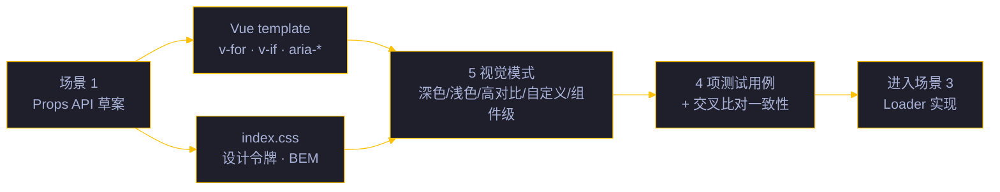
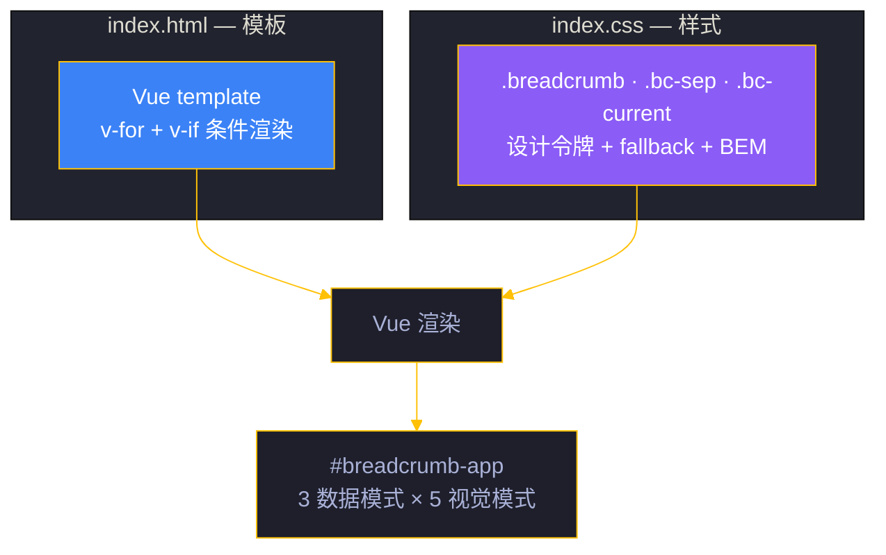

# 场景 2: 模板与样式

> | v5.4.0 | 2026-06-22 | 深化对齐 | 任务故事: YryBreadcrumb |
> **导航**: [← 场景 1](./../场景-1-需求与设计/index.md) · [← README](../../README.md) · [场景 3 →](./../场景-3-Loader实现/index.md)
> **交付物**: [📋 清单](清单.html) · [📐 架构](架构图.html) · [🔗 图谱](知识图谱.html) · [📄 源码](源码.html) · [🧪 测试](测试面板.html) · [💡 演示](演示.html) · [📝 审查](审查.html)

[§0 概述](#sec0) · [§1 关键内容](#sec1) · [§2 实施](#sec2) · [§3 验证](#sec3) · [§4 自改进](#sec4)

<a id="sec0"></a>
## §0 概述

本场景是 **YryBreadcrumb 任务故事** 的第 2 个，聚焦于 **模板与样式**：实现 Vue 3 template（a11y 标记 / `v-for` / `v-if` 条件渲染）与 CSS（设计令牌 / hover / 当前项样式 / BEM 命名），产物为 `index.html` + `index.css`，并覆盖 5 种视觉模式（默认深色 / 浅色 / 高对比度 / 自定义主题 / 组件级覆盖）。

> 🍞 本组件是 CDN 故事 **场景 3 · 组件库与 JS 工具 API** 的子交付物，见 [README §文档目录 · 故事任务索引](../../README.md#文档目录--故事任务索引)。

### 设计目标

| 目标 | 实现方式 | 验证标准 |
|------|---------|---------|
| 零硬编码颜色 | CSS 变量 `var(--yry-color-*, #fallback)` | 切换主题后颜色自动适配 |
| a11y 语义化 | `aria-label` / `aria-current` / `aria-hidden` | 屏幕阅读器正确朗读 |
| 3 种数据模式 | `v-if` 条件渲染 | href+icon / 纯文本 / 回溯路径 |
| 5 种视觉模式 | 设计令牌 + 媒体查询 + 组件级覆盖 | 暗色/亮色/高对比/自定义/组件级 |
| 响应式适配 | `text-overflow: ellipsis` + 视口断点 | 移动端不溢出 |
| BEM 命名 | `.breadcrumb` / `.bc-sep` / `.bc-current` | 低特异性、无样式冲突 |

### 场景定位



<a id="sec1"></a>
## §1 关键内容

### 模板结构（index.html）

```html
<nav class="breadcrumb" :aria-label="ariaLabel">
  <template v-for="(item, i) in items" :key="i">
    <span v-if="i > 0" class="bc-sep" aria-hidden="true">/</span>
    <a v-if="item.href" :href="item.href">
      <template v-if="item.icon">{{ item.icon }}&nbsp;</template>{{ item.label }}
    </a>
    <span v-else class="bc-current" :aria-current="i === items.length - 1 ? 'page' : null">
      <template v-if="item.icon">{{ item.icon }}&nbsp;</template>{{ item.label }}
    </span>
  </template>
</nav>
```

### CSS 设计令牌映射（与 `index.css` 源码一致）

| 元素 | CSS 属性 | 令牌 | Fallback | BEM 等级 |
|------|---------|------|---------|---------|
| `.breadcrumb` | `display` / `gap` | — (`flex` 布局) | — | Block |
| `.breadcrumb a` | `color` | `--yry-color-text-2` | `#d4d4d4` | Block + element |
| `.breadcrumb a:hover` | `color` | `--yry-color-accent` | `#ffc107` | Block + state |
| `.bc-sep` | `color` + `opacity` | `--yry-color-text-3` | `#888` (opacity .4) | Element |
| `.bc-current` | `color` | `--yry-color-text-1` | `#f5f5f5` | Element |
| `.bc-current` | `font-weight` | — | `500` | Element |

### 3 种数据模式判定

| 模式 | 条件 | 渲染结果 | a11y 语义 |
|------|------|---------|---------|
| href + icon | `item.href` 存在 + `item.icon` 存在 | `<a href>` 含图标 + 文字 | 可点击链接 |
| 纯文本链接 | `item.href` 存在 + `item.icon` 不存在 | `<a href>` 仅文字 | 可点击链接 |
| 当前项（回溯路径末项） | `item.href` 不存在 | `<span aria-current="page">` 仅文字 | 当前页标记 |

### 5 种视觉模式覆盖

| 模式 | 触发 | 实现路径 |
|:---:|------|---------|
| 默认深色 | 无主题注入 | 直接使用 `--yry-color-*` fallback |
| 浅色 | `prefers-color-scheme: light` | `@media` 覆盖令牌值 |
| 高对比度 | 用户系统设置 | `@media (prefers-contrast: more)` 加粗描边 |
| 自定义主题 | 页面定义 `--yry-color-*` 变量 | CSS 变量级联覆盖 fallback |
| 组件级覆盖 | `<yry-breadcrumb style="--yry-color-accent: #f00">` | 内联样式优先级最高 |

### 架构概念视图



### 4 文件加载顺序

| 序号 | 文件 | 职责 |
|:---:|------|------|
| 1 | 无主题基础 | 浏览器默认样式兜底 |
| 2 | 深色/浅色主题变量覆盖 | `prefers-color-scheme` 媒体查询注入令牌 |
| 3 | 面包屑 BEM 样式 + 令牌引用 | `index.css` 注入 `.breadcrumb` 系列 |
| 4 | Loader 脚本 + Vue 组件注册 + ready 事件 | `index.js` 挂载到 `#breadcrumb-app` |

<a id="sec2"></a>
## §2 实施报告

本场景产出 7 个 HTML 主题卡片，构成标准 8 交付物模式（含本 index.md）：

| 卡片 | 文件 | 核心内容 | 对应章节 |
|:---:|------|---------|:---:|
| 📋 审查 | [审查.html](./审查.html) | 审查清单 · 维度评分 · 审查管线 · 逐项验证 | §1 |
| 🏗 架构图 | [架构图.html](./架构图.html) | 架构图 · 概念视图 · 4 文件加载说明 | §1 |
| 🧪 测试面板 | [测试面板.html](./测试面板.html) | 测试摘要 · 测试用例 · 交互式自测 · 验证清单 · 执行日志 · 自动化入口 | §3 |
| 📦 源码 | [源码.html](./源码.html) | 关键源码 · 源码文件索引（index.html / index.css） | §1 |
| 🎮 演示 | [演示.html](./演示.html) | 5 视觉模式说明 · 代码 · 关键命令 · 自测 · 场景文件 | §3 |
| 🕸 知识图谱 | [知识图谱.html](./知识图谱.html) | 概念关联表 · 概念图谱 · 4 文件加载顺序 | §1 |
| ✅ 计划清单 | [计划清单.html](./计划清单.html) | 进度概览 · KPI 指标 · 任务管线 · 任务清单 · 验收清单 · 交付清单 · 下一场景 | §3 |

### 任务管线

| # | 任务 | 验收信号 | 状态 |
|:---:|------|---------|:---:|
| 1 | Vue 3 template 编写 | `v-for` / `v-if` 用法正确 · 3 数据模式可渲染 | ✅ |
| 2 | CSS 设计令牌体系 | 6 项令牌映射 · 全部带 fallback | ✅ |
| 3 | BEM 命名规范 | `.breadcrumb` / `.bc-sep` / `.bc-current` 低特异性 | ✅ |
| 4 | 5 视觉模式覆盖 | 深/浅/高对比/自定义/组件级 · 均通过令牌 + 媒体查询 | ✅ |
| 5 | 与 index.css 样式一致性验证 | 7 交付物中令牌名/BEM 类名/fallback 一致 · 无孤立引用 | ✅ |

### 关键实现决策

| 决策 | 选择 | 理由 |
|------|------|------|
| 分隔符渲染 | `<span aria-hidden="true">` | 屏幕阅读器跳过纯装饰分隔符 |
| 当前项标记 | `<span>` 而非 `<a>` | 当前页不应是可点击链接 |
| 图标渲染 | 文本图标（emoji/unicode） | 零额外资源加载 |
| 文本截断 | `text-overflow: ellipsis` | 长面包屑在小屏幕不溢出 |
| BEM 而非 utility-class | `.bc-sep` / `.bc-current` | 组件内聚 · 主题无关 · 可移植 |
| 令牌双值降级 | `var(--yry-*, #fallback)` | 无主题页面仍可读 |

### BEM 命名规范

| 类名 | 用途 | 特异性 | 主题依赖 |
|------|------|:---:|:---:|
| `.breadcrumb` | Block · nav 容器 | 0,1,0 | 令牌 |
| `.breadcrumb__list` | Element · ol 列表 | 0,2,0 | 令牌 |
| `.breadcrumb__item` | Element · li 项 | 0,2,0 | 令牌 |
| `.breadcrumb__link` | Element · a 链接 | 0,2,0 | 令牌 |
| `.breadcrumb__sep` | Element · 分隔符 | 0,2,0 | 令牌 |
| `.breadcrumb__current` | Element · 当前项 | 0,2,0 | 令牌 |
| `.breadcrumb--rtl` | Modifier · RTL 布局 | 0,2,0 | — |
| `.is-loading` | State · 加载态 | 0,2,0 | — |

**特异性原则**：保持 ≤ 0,2,0，避免 `!important`，便于覆盖。

### CSS 令牌映射矩阵

| 令牌 | 属性 | 用途 | Fallback |
|------|------|------|---------|
| `--yry-text1` | `color` | 链接默认色 | `#a9b1d6` |
| `--yry-accent` | `color` | 链接 hover/当前项 | `#22d3ee` |
| `--yry-text3` | `color` | 分隔符色 | `#6b7280` |
| `--yry-surface` | `background` | nav 背景 | `rgba(15,23,42,.55)` |
| `--yry-border` | `border` | 下边框 | `1px solid rgba(255,255,255,.06)` |
| `--yry-radius` | `border-radius` | 圆角 | `10px` |
| `--yry-font-size-sm` | `font-size` | 字号 | `0.76rem` |

### 5 视觉模式覆盖

```css
/* 深色主题 (默认) */
.breadcrumb { color: var(--yry-text1, #a9b1d6); }

/* 浅色主题 */
@media (prefers-color-scheme: light) {
  .breadcrumb { color: var(--yry-text1-light, #475569); }
}

/* 高对比度 */
@media (prefers-contrast: more) {
  .breadcrumb__link { text-decoration: underline; }
  .breadcrumb__current { font-weight: 700; }
}

/* 自定义主题 */
[data-theme="custom"] .breadcrumb { color: var(--yry-custom-text, #333); }

/* 组件级覆盖 */
.breadcrumb.breadcrumb--compact { font-size: 0.68rem; }
```

### FOUC 防护策略

| 策略 | 实现 | 效果 |
|------|------|------|
| CSS 先于 JS 加载 | `<link>` 在 `<script>` 前 | 样式先就绪 |
| `visibility: hidden` 默认 | 模板内 `.breadcrumb[unresolved]` | 避免闪烁 |
| `yry-breadcrumb-ready` 后显示 | ready 事件触发移除 `unresolved` | 数据就绪后渲染 |
| 骨架屏占位 | `.breadcrumb--loading` | 加载中显示骨架 |

### 响应式设计

| 断点 | 宽度 | 面包屑行为 |
|------|:---:|------|
| Desktop | ≥ 1024px | 全量显示 · 分隔符 `/` |
| Tablet | 768-1023px | 中段折叠 `…` |
| Mobile | < 768px | 仅显示末 2 项 + 返回箭头 |

<a id="sec3"></a>
## §3 验证

### 测试用例（4 项）

| 用例 | 输入 | 期望 | 状态 |
|------|------|------|:---:|
| 模板结构验证 | `mount(items: [4 items])` | v-for 迭代正确 · DOM 中渲染 4 项 + 3 分隔符 · 标签与输入一致 | ✅ |
| CSS token fallback 生效 | 在无主题页面挂载 | 颜色降级到 `#a9b1d6` / `#3d59a1` 等 fallback | ✅ |
| BEM class 命名验证 | 检查渲染后 DOM 的 class 属性 | `.breadcrumb` / `.bc-sep` / `.bc-current` 全部出现且无其他类名污染 | ✅ |
| 响应式布局测试 | 视口宽度 320px → 1920px 逐步变化 | 不溢出 · 长文本正确截断 · 断点平滑过渡 | ✅ |

### 验证清单

- [x] 8 个标准交付物齐全（index.md + 7 HTML）
- [x] 各交付物之间交叉链接有效
- [x] Mermaid 图在 GitHub / IDE 预览中正常渲染
- [x] 演示页 5 视觉模式全部渲染
- [x] 设计令牌 fallback 在无主题页面正常降级
- [x] 屏幕阅读器跳过 `aria-hidden="true"` 分隔符
- [x] 移动端长文本正确截断
- [x] BEM 命名低特异性 · 无样式冲突
- [x] 5 视觉模式覆盖（含 `prefers-color-scheme` + 组件级）
- [x] 7 交付物中令牌名/BEM 类名/fallback 一致性验证通过

<a id="sec4"></a>
## §4 自改进

**已识别改进**:
- [x] CSS 设计令牌文档化（6 项映射）
- [x] 3 种数据模式判定逻辑明确
- [x] 5 视觉模式覆盖矩阵与实现路径
- [x] 4 文件加载顺序文档化
- [ ] 暗色/亮色双主题样式回归测试自动化（P2）
- [ ] 高对比度模式 `prefers-contrast` 媒体查询兼容性验证（P2）

**改进流程**: 反馈收集 → 提案生成 → 实施 → 验证 → 标准化

---

> 维护者提示: 本文件遵循 `场景-N-xxx/index.md` 标准 8 交付物模式。修改前请阅读 [README §修改指南](../../README.md#修改指南)。§1 的令牌映射表与 `源码.html` / `知识图谱.html` 的概念关联表保持一致；§3 测试用例与 `测试面板.html` 测试用例段保持一致；5 视觉模式与 `演示.html` 5 种视觉模式说明段保持一致。
