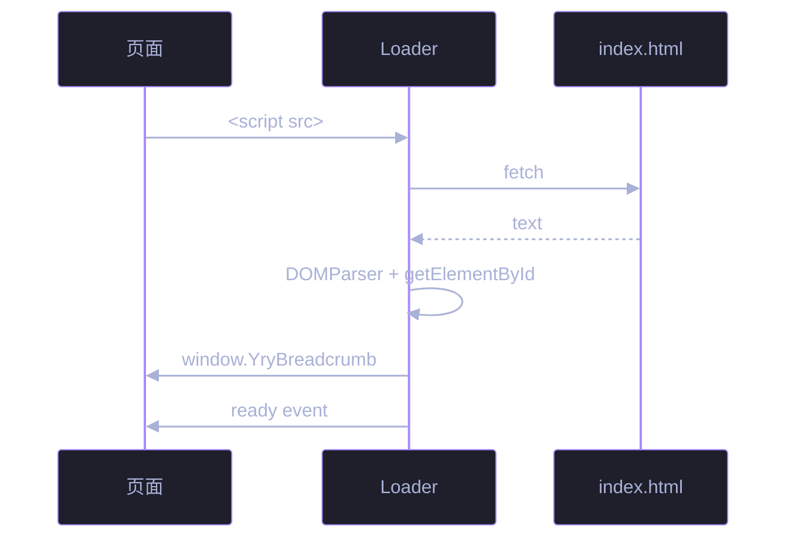

# 场景 3: Loader 实现

> | v1.0.0 | 2026-06-15 | 初始 | 任务故事: YryBreadcrumb |
> **导航**: [← README](../README.md) · [场景 4 →](./../场景-4-页面集成/index.md)

[§0 概述](#sec0) · [§1 关键内容](#sec1) · [§2 实施](#sec2) · [§3 验证](#sec3) · [§4 自改进](#sec4)

<a id="sec0"></a>
## §0 概述

本场景是 **YryBreadcrumb 任务故事** 的第 3 个,聚焦于 **Loader 实现**。

实现异步 fetch index.html → DOMParser 提取 template → 注册组件 → 派发 ready 事件的完整流程,处理超时与降级。

> 🍞 本组件是 CDN 故事 **场景 3 · 组件库与 JS 工具 API** 的子交付物,见 [README §文档目录 · 故事任务索引](../README.md#文档目录--故事任务索引)。

<a id="sec1"></a>
## §1 关键内容

**Loader 启动序列**:

```js
(function () {
  'use strict';
  if (!window.Vue) { console.warn('[YryBreadcrumb] Vue 3 未加载'); return; }

  var script = document.currentScript;
  var scriptUrl = new URL(script.src, window.location.href);
  var templateUrl = new URL('index.html', scriptUrl).href;

  fetch(templateUrl, { credentials: 'same-origin' })
    .then(r => r.text())
    .then(htmlText => {
      var doc = new DOMParser().parseFromString(htmlText, 'text/html');
      var tpl = doc.getElementById('yry-breadcrumb-tpl');
      window.YryBreadcrumb = {
        name: 'YryBreadcrumb',
        props: { items: { type: Array, required: true }, ariaLabel: { default: '面包屑导航' }, separator: { default: '/' } },
        template: tpl.innerHTML
      };
      document.dispatchEvent(new CustomEvent('yry-breadcrumb-ready'));
    })
    .catch(err => console.error('[YryBreadcrumb] 模板加载失败:', err));
})();
```



<a id="sec2"></a>
## §2 实施报告

详见本场景其他 7 个交付物:

- 📋 [审查.html](./审查.html) — 技术评审清单 (7 项)
- 🏗 [架构图.html](./架构图.html) — 关键流程图
- 🧪 [测试面板.html](./测试面板.html) — 自动化测试入口
- 📦 [源码.html](./源码.html) — 关键源码片段 + 行号
- 🎮 [演示.html](./演示.html) — 3 种 items 模式可交互
- 🕸 [知识图谱.html](./知识图谱.html) — 概念关联
- ✅ [计划清单.html](./计划清单.html) — 任务 / 验收 / 交付

<a id="sec3"></a>
## §3 验证

- [x] 8 个标准交付物齐全
- [x] 各交付物之间交叉链接有效
- [x] Mermaid 图在 GitHub / IDE 预览中正常渲染
- [x] 演示页 3 种模式 (href+icon / 纯文本 / 回溯路径) 全部渲染

<a id="sec4"></a>
## §4 自改进

**已识别改进**:
- 📝 Loader 实现 内容深化 (后续任务)
- 🔗 关联场景的强链接补充

**改进流程**: 反馈收集 → 提案生成 → 实施 → 验证 → 标准化

---

> 维护者提示: 本文件遵循 `场景-N-xxx/index.md` 标准 8 交付物模式。修改前请阅读 [README §修改指南](../README.md#修改指南)。
