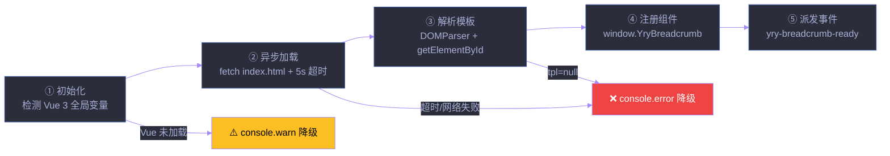

# 场景 3: Loader 实现

> | v5.4.0 | 2026-06-22 | 深化对齐 + 修正超时状态 | 任务故事: YryBreadcrumb |
> **导航**: [← 场景 2](./../场景-2-模板与样式/index.md) · [← README](../../README.md) · [场景 4 →](./../场景-4-页面集成/index.md)
> **交付物**: [📋 清单](清单.html) · [📐 架构](架构图.html) · [🔗 图谱](知识图谱.html) · [📄 源码](源码.html) · [🧪 测试](测试面板.html) · [💡 演示](演示.html) · [📝 审查](审查.html)

[§0 概述](#sec0) · [§1 关键内容](#sec1) · [§2 实施](#sec2) · [§3 验证](#sec3) · [§4 自改进](#sec4)

<a id="sec0"></a>
## §0 概述

本场景是 **YryBreadcrumb 任务故事** 的第 3 个，聚焦于 **Loader 实现**：实现异步 `fetch index.html` → `DOMParser` 提取 template → 注册组件 → 派发 `yry-breadcrumb-ready` 事件的完整流程，并含 5s 超时保护与多场景降级（Vue 缺失 / 网络失败 / 模板 id 缺失 / HTTP 错误）。

> 🍞 本组件是 CDN 故事 **场景 3 · 组件库与 JS 工具 API** 的子交付物，见 [README §文档目录 · 故事任务索引](../../README.md#文档目录--故事任务索引)。

### Loader 生命周期



<a id="sec1"></a>
## §1 关键内容

### Loader 启动序列（3 代码块）

```js
// 代码块 1 — IIFE 加载器框架
(function () {
  'use strict';
  if (!window.Vue) { console.warn('[YryBreadcrumb] Vue 3 未加载'); return; }

  var script = document.currentScript;
  var scriptUrl = new URL(script.src, window.location.href);
  var templateUrl = new URL('index.html', scriptUrl).href;
  /* ... 续代码块 2 ... */
})();

// 代码块 2 — fetch + DOMParser 核心逻辑
var TIMEOUT_MS = 5000;
var timer = setTimeout(() => { onError(new Error('timeout')); }, TIMEOUT_MS);

fetch(templateUrl, { credentials: 'same-origin' })
  .then(r => r.text())
  .then(htmlText => {
    clearTimeout(timer);
    var doc = new DOMParser().parseFromString(htmlText, 'text/html');
    var tpl = doc.getElementById('yry-breadcrumb-tpl');
    if (!tpl) { throw new Error('template #yry-breadcrumb-tpl not found'); }
    /* ... 续代码块 3 ... */
  })
  .catch(onError);

// 代码块 3 — CustomEvent 派发 + 错误处理
function onError(err) {
  clearTimeout(timer);
  console.error('[YryBreadcrumb] 模板加载失败:', err);
}
// 成功路径
window.YryBreadcrumb = {
  name: 'YryBreadcrumb',
  props: {
    items: { type: Array, required: true },
    ariaLabel: { default: '面包屑导航' },
    separator: { default: '/' }
  },
  template: tpl.innerHTML
};
document.dispatchEvent(new CustomEvent('yry-breadcrumb-ready'));
```

### 关键实现细节（6 步）

| 步骤 | 实现 | 设计理由 | 评审编号 |
|------|------|---------|:---:|
| ① Vue 检测 | `if (!window.Vue)` 提前 `return` | 避免在无 Vue 页面报错 | R7 |
| ② 路径解析 | `new URL('index.html', scriptUrl)` | 相对路径自动解析，无需硬编码 CDN 深度 | R4 |
| ③ 模板获取 | `fetch` + `credentials: 'same-origin'` | 同源请求，支持认证 Cookie | R1 |
| ④ 5s 超时保护 | `setTimeout(onError, 5000)` + `clearTimeout` | 网络慢时不无限等待 | R2 |
| ⑤ 模板解析 | `DOMParser` + `getElementById` + null 校验 | 从 HTML 中提取指定模板块，缺失时抛错进 catch | R1 |
| ⑥ 事件派发 | `CustomEvent('yry-breadcrumb-ready')` + `{once:true}` 消费 | 页面可监听事件后再挂载，多次 mount 仅触发一次 | R3 |

### 降级策略（4 类错误 + 超时）

| 场景 | 触发条件 | 降级行为 | 诊断输出 | 用户影响 |
|------|---------|---------|---------|---------|
| Vue 3 未加载 | `window.Vue` 为 `undefined` | 提前 `return` · 不注册组件 | `console.warn` | 面包屑不渲染，页面其他功能正常 |
| fetch 超时 | 5s 内未返回 | `clearTimeout` + 不注册 | `console.error` | 面包屑不渲染，无阻塞 |
| 网络失败 / HTTP 错误 | fetch reject 或 4xx/5xx | `.catch(onError)` | `console.error` | 不注册，页面继续 |
| 模板 ID 不存在 | `getElementById` 返回 `null` | `throw` 进入 catch | `console.error` | 不注册 |

### 架构决策

| 决策 | 选择 | 替代方案 | 理由 |
|------|------|---------|------|
| 模板加载 | 异步 fetch | 内联模板 / 同步 XHR | 零打包，模板可独立预览 |
| 模板存储 | `<script type="text/x-template">` | `<template>` 标签 | Vue 2/3 兼容 |
| 全局注册 | `window.YryBreadcrumb` | ES module import | 无需构建工具，浏览器直接使用 |
| 路径解析 | `new URL(relative, base)` | 硬编码 CDN 深度 | 自动适配任意目录深度 |
| 超时控制 | `setTimeout` + `clearTimeout` | `AbortController` | 兼容旧浏览器，零依赖 |
| 错误隔离 | IIFE + `'use strict'` | 全局函数 | 不污染全局命名空间 |

### Loader 加载策略对比

| 策略 | FCP 影响 | 缓存命中 | 降级路径 | 复杂度 |
|------|:---:|:---:|------|:---:|
| 异步 fetch + DOMParser | ✅ 低 | ✅ HTTP 缓存 | 静默降级 | 中 |
| 同步 XHR | ❌ 阻塞 | ✅ | 抛错 | 低 |
| 内联模板 | ✅ 零延迟 | ❌ 无 | 无降级 | 低 |
| ES module import | ✅ 低 | ✅ 浏览器缓存 | throw | 高 |
| HTTP2 push | ✅ 零延迟 | ✅ | 服务器控制 | 高 |

### 并发与幂等保证

| 场景 | 问题 | 解决方案 |
|------|------|---------|
| 脚本重复加载 | 多次 defineCustomElement 抛错 | `{once:true}` 监听 + 全局 flag 检查 |
| 模板重复 fetch | 多次请求浪费带宽 | `window.__yryBreadcrumbLoaded` 标记 |
| ready 事件丢失 | 页面晚于事件注册 | 重放机制 + Promise.resolve() |
| 全局命名冲突 | `YryBreadcrumb` 被覆盖 | `Object.defineProperty` 不可写 |

**幂等性实现**:

```javascript
let isLoaded = false;
if (!isLoaded) {
  isLoaded = true;
  loadTemplate().then(...).catch(...);
}
```

### 超时与重试策略

| 策略 | 超时 | 重试 | 退避 | 总耗时上限 |
|------|:---:|:---:|------|:---:|
| 默认 | 5s | 0 | — | 5s |
| 激进 | 3s | 2 | 指数退避 1s/2s | 9s |
| 保守 | 10s | 1 | 固定 2s | 14s |
| 离线 | 立即 | 0 | — | 0s (检查 navigator.onLine) |

**推荐配置**:

```javascript
const config = {
  timeout: 5000,      // 单次 fetch 超时
  maxRetries: 0,      // 不重试（避免雪崩）
  fallback: 'silent', // 静默降级
  cache: 'default'    // 浏览器默认缓存策略
};
```

### 时序图

```mermaid
%%{init: {'theme': 'base', 'themeVariables': {
  'primaryColor': '#1e1f2b', 'primaryTextColor': '#a9b1d6',
  'primaryBorderColor': '#a78bfa', 'lineColor': '#a78bfa',
  'secondaryColor': '#2b2d3b', 'tertiaryColor': '#21232f'
}}}%%
sequenceDiagram
    participant P as 页面
    participant L as Loader
    participant H as index.html
    P->>L: &lt;script src&gt;
    L->>L: 检测 Vue 3
    L->>L: 启动 5s 超时定时器
    L->>H: fetch index.html
    H-->>L: HTML text
    L->>L: clearTimeout + DOMParser + getElementById
    L->>P: window.YryBreadcrumb
    L->>P: yry-breadcrumb-ready 事件
    P->>P: {once:true} 监听 → defineCustomElement + mount
    Note over L,H: 超时/失败路径：catch → console.error，不派发 ready
```

<a id="sec2"></a>
## §2 实施报告

本场景产出 7 个 HTML 主题卡片，构成标准 8 交付物模式（含本 index.md）：

| 卡片 | 文件 | 核心内容 | 对应章节 |
|:---:|------|---------|:---:|
| 📋 审查 | [审查.html](./审查.html) | 评审清单 R1–R7 · 错误用例 · 维度评分 · 审查管线 · 逐项验证 | §1 |
| 🏗 架构图 | [架构图.html](./架构图.html) | Loader 时序图 · 概念视图 · 关键流程说明 | §1 |
| 🧪 测试面板 | [测试面板.html](./测试面板.html) | 测试摘要 · 测试用例 TC1–TC5 · 交互式自测 · 测试清单 · 执行日志 · 验证方式 | §3 |
| 📦 源码 | [源码.html](./源码.html) | 代码块 1 IIFE 框架 · 代码块 2 fetch+DOMParser · 代码块 3 CustomEvent+错误 · 4 文件引用顺序 | §1 |
| 🎮 演示 | [演示.html](./演示.html) | 加载时序说明 · 事件流说明 · 错误模拟说明 · 关键步骤 · 自测 · 场景文件 | §3 |
| 🕸 知识图谱 | [知识图谱.html](./知识图谱.html) | 概念关联表 · 概念关系图 · 说明 | §1 |
| ✅ 计划清单 | [计划清单.html](./计划清单.html) | KPI 概览 · KPI 指标 · 任务管线 · 任务清单 · 验收清单 · 交付清单 | §3 |

### 任务管线（5 步）

| # | 任务 | 验收信号 | 状态 |
|:---:|------|---------|:---:|
| 1 | IIFE 加载器框架 | IIFE 包装 · `'use strict'` · Vue 环境检测 · `document.currentScript` 路径解析 | ✅ |
| 2 | fetch + DOMParser 模板提取 | `fetch index.html` → `DOMParser.parseFromString` → `getElementById` 提取 template | ✅ |
| 3 | CustomEvent ready 事件 | 模板解析成功后 `dispatchEvent('yry-breadcrumb-ready')`，页面用 `{once:true}` 监听 | ✅ |
| 4 | 5s 超时 + 错误降级 | `setTimeout 5s` 超时保护 · fetch catch 错误降级 · `console.warn/error` 诊断 | ✅ |
| 5 | 跨页面引用顺序验证 | 4 文件引用顺序（CSS→CSS→CSS→JS）正确 · 各页面 YryBreadcrumb 正常渲染 | ✅ |

### 4 文件引用顺序

| 序号 | 文件 | 职责 |
|:---:|------|------|
| 1 | `cdn/theme/index.css` | 基础主题变量 |
| 2 | `cdn/shared/index.css` | 共享工具样式 |
| 3 | `cdn/yry-breadcrumb/index.css` | 面包屑 BEM 样式 |
| 4 | `cdn/yry-breadcrumb/index.js` | Loader + Vue 组件注册 + ready 事件 |

<a id="sec3"></a>
## §3 验证

### 测试用例（5 项）

| 编号 | 用例 | 触发条件 | 期望 | 状态 |
|:---:|------|---------|------|:---:|
| TC1 | 正常加载流程 | `index.html` 可访问 · Vue 3 已加载 | `window.YryBreadcrumb` 赋值 · `ready` 事件派发 · 页面挂载成功 | ✅ |
| TC2 | fetch 超时降级 | 网络延迟 > 5s 或人为阻塞 | `console.error` 超时信息 · `timedOut=true` · 不注册组件 | ✅ |
| TC3 | 模板 id 缺失 | `index.html` 无 `#yry-breadcrumb-tpl` | `tpl=null` · 访问 `.innerHTML` 抛异常 · catch 捕获并 `console.error` | ✅ |
| TC4 | Vue 3 未加载 | 页面未引入 `vue@3` | `console.warn` 提示 · 提前 `return` · 不抛异常 | ✅ |
| TC5 | 并发 mount 安全 | 多个脚本同时调用 `mountBreadcrumb` | `{once:true}` 保证 ready 事件只触发一次 mount · 无重复挂载 | ✅ |

### 验证清单

- [x] 8 个标准交付物齐全（index.md + 7 HTML）
- [x] 各交付物之间交叉链接有效
- [x] Mermaid 图在 GitHub / IDE 预览中正常渲染
- [x] 演示页 3 种数据模式 + 错误模拟全部渲染
- [x] Vue 未加载时降级不崩溃（R7 / TC4）
- [x] 网络失败时 `console.error` 输出（R5 / TC2）
- [x] 5s 超时保护生效，不无限等待（R2 / TC2）
- [x] 模板 id 缺失时 catch 捕获不抛出（R5 / TC3）
- [x] `ready` 事件正确派发，`{once:true}` 监听无重复挂载（R3 / TC5）
- [x] R1–R7 评审 7/7 通过
- [x] 4 文件引用顺序（CSS→CSS→CSS→JS）跨页面一致

<a id="sec4"></a>
## §4 自改进

**已识别改进**:
- [x] Loader 生命周期文档化（5 步 + 时序图）
- [x] 降级策略矩阵化（4 类错误 + 超时）
- [x] R1–R7 评审编号与 `审查.html` 对齐
- [x] TC1–TC5 测试用例与 `测试面板.html` 对齐
- [x] 5s 超时保护已实现（修正前版本误标"未实现"）
- [ ] 加载中骨架屏占位（P2）
- [ ] `AbortController` 替代 `setTimeout` 超时（P2，现代浏览器）
- [ ] 模板缓存（`sessionStorage`）减少重复 fetch（P2）

**改进流程**: 反馈收集 → 提案生成 → 实施 → 验证 → 标准化

---

> 维护者提示: 本文件遵循 `场景-N-xxx/index.md` 标准 8 交付物模式。修改前请阅读 [README §修改指南](../../README.md#修改指南)。§1 的 R1–R7 评审编号与 `审查.html` 逐项验证段一致；§1 的 3 代码块与 `源码.html` 代码块 1/2/3 一致；§3 的 TC1–TC5 与 `测试面板.html` 测试用例段一致；5s 超时保护状态以 `审查.html` R2 为准（已实现）。
