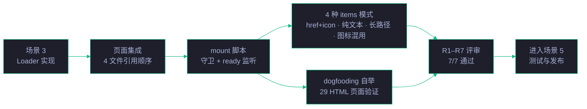
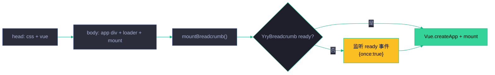

# 场景 4: 页面集成

> | v5.4.0 | 2026-06-22 | 深化对齐 | 任务故事: YryBreadcrumb |
> **导航**: [← 场景 3](./../场景-3-Loader实现/index.md) · [← README](../../README.md) · [场景 5 →](./../场景-5-测试与发布/index.md)
> **交付物**: [📋 清单](清单.html) · [📐 架构](架构图.html) · [🔗 图谱](知识图谱.html) · [📄 源码](源码.html) · [🧪 测试](测试面板.html) · [💡 演示](演示.html) · [📝 审查](审查.html)

[§0 概述](#sec0) · [§1 关键内容](#sec1) · [§2 实施](#sec2) · [§3 验证](#sec3) · [§4 自改进](#sec4)

<a id="sec0"></a>
## §0 概述

本场景是 **YryBreadcrumb 任务故事** 的第 4 个，聚焦于 **页面集成**：将组件接入到 29 个 HTML 页面（计划清单 + 场景 1–5 共 29 页 · dogfooding 自举验证），涉及 4 文件引用顺序、mount 脚本守卫、items 配置 4 种典型模式、FOUC 防护与多实例隔离。

> 🍞 本组件是 CDN 故事 **场景 3 · 组件库与 JS 工具 API** 的子交付物，见 [README §文档目录 · 故事任务索引](../../README.md#文档目录--故事任务索引)。

### 集成架构

| 层 | 文件 | 加载方式 | 作用 |
|------|------|---------|------|
| 样式 | `yry-breadcrumb/index.css` | `<link>` in `<head>` | 组件样式（设计令牌 + fallback） |
| 框架 | `vue.global.prod.js` | `<script>` CDN in `<head>` | Vue 3 运行时 |
| 组件定义 | `yry-breadcrumb/index.js` | `<script>` in `<body>` | Loader：fetch 模板 + 注册组件 |
| 挂载脚本 | 页面内联 `<script>` | 内联 in `<body>` 末尾 | items 配置 + mount + 守卫 |

### 场景定位



<a id="sec1"></a>
## §1 关键内容

### 页面集成模板（5 步加载模式）

```html
<head>
  <!-- ① CSS 最先加载，防 FOUC -->
  <link rel="stylesheet" href="../../../../cdn/yry-breadcrumb/index.css">
  <!-- ② Vue 3 运行时 -->
  <script src="https://unpkg.com/vue@3/dist/vue.global.prod.js"></script>
</head>
<body>
  <!-- ③ 挂载点 -->
  <div id="breadcrumb-app"></div>
  <!-- ④ Loader：fetch 模板 + 注册组件 + 派发 ready -->
  <script src="../../../../cdn/yry-breadcrumb/index.js"></script>
  <!-- ⑤ mount 脚本：守卫 + items 配置 + createApp -->
  <script>
    function mountBreadcrumb() {
      if (!window.Vue || !window.YryBreadcrumb) return;
      Vue.createApp(window.YryBreadcrumb, {
        items: [
          { label: '文档中心', href: '../../../index.html', icon: '📄' },
          { label: 'yry-checklist · 清单与自循环' },
          { label: '场景 1 · 模板架构与 CSS 设计系统' },
          { label: '计划清单', icon: '📋' }
        ]
      }).mount('#breadcrumb-app');
    }
    if (window.YryBreadcrumb) mountBreadcrumb();
    else document.addEventListener('yry-breadcrumb-ready', mountBreadcrumb, { once: true });
  </script>
</body>
```

### 4 种 items 配置模式

| 模式 | items 结构 | 适用场景 | 渲染结果 |
|:---:|------|---------|---------|
| **href + icon** | `{label, href, icon}` | 标准导航，有目标链接 | `<a href>` 含图标 + 文字 |
| **纯文本链接** | `{label, href}` | 有链接但无需图标 | `<a href>` 仅文字 |
| **当前项（末项）** | `{label}` | 当前页面，不可点击 | `<span aria-current="page">` |
| **长路径（5+ 层）** | 前 N-1 项 `{label, href}`，末项 `{label}` | 层级深的路径展示 | 6 项全渲染 · 分隔符正确 · 折行不溢出 |

### mount 脚本守卫机制

| 守卫条件 | 触发场景 | 行为 |
|---------|---------|------|
| `if (!window.Vue)` | Vue 3 CDN 加载失败 | `mountBreadcrumb` 提前 return · 不抛错 |
| `if (!window.YryBreadcrumb)` | Loader 未完成或失败 | 同上 |
| `window.YryBreadcrumb` 已就绪 | Loader 同步完成（缓存命中） | 直接 mount · 无需等 ready 事件 |
| `yry-breadcrumb-ready` 事件 | Loader 异步完成 | `{once:true}` 监听触发 mount · 无重复挂载 |

### 4 文件加载顺序

| 序号 | 文件 | 位置 | 作用 |
|:---:|------|:---:|------|
| 1 | `cdn/yry-breadcrumb/index.css` | `<head>` 首位 | BEM 样式 + 设计令牌 · FOUC 防护 |
| 2 | `vue.global.prod.js` | `<head>` | Vue 3 运行时 |
| 3 | `cdn/yry-breadcrumb/index.js` | `<body>` | Loader + 组件注册 + ready 事件 |
| 4 | 页面内联 mount `<script>` | `<body>` 末尾 | items 配置 + 守卫 + createApp + mount |

### CDN 深度计算

```
页面路径: cdn/yry-<story>/scenes/场景-N-<slug>/计划清单.html
CDN 路径: cdn/yry-breadcrumb/index.js
相对深度: ../../cdn/yry-breadcrumb/index.js

公式: depth = 页面路径中 / 的数量 - 1
      cdn/yry-<story>/scenes/场景-N-<slug>/ → 2 层 → ../../
```

### CDN 深度自动解析

```javascript
// 基于 document.currentScript.src 自动推导
const scriptSrc = document.currentScript.src;
const cdnBase = new URL('../../cdn/', scriptSrc).href;
// 适配任意目录深度，无需硬编码
```

| 页面位置 | 深度 | 示例相对路径 |
|---------|:---:|------|
| 根目录 (`/index.html`) | 0 | `cdn/yry-breadcrumb/` |
| 一级子目录 | 1 | `../cdn/yry-breadcrumb/` |
| 故事根 (`cdn/yry-arch/`) | 1 | `../yry-breadcrumb/` |
| 场景页 (`cdn/yry-<story>/scenes/场景-N/`) | 2 | `../../yry-breadcrumb/` |

### Mount 守卫策略

| 守卫 | 检查 | 失败处理 | 优先级 |
|------|------|---------|:---:|
| Vue 3 存在 | `typeof Vue !== 'undefined'` | console.warn + 退出 | P0 |
| YryBreadcrumb 已注册 | `window.YryBreadcrumb` | 监听 ready 事件 | P0 |
| DOM 节点存在 | `document.getElementById('breadcrumb-app')` | 静默退出 | P1 |
| items 类型正确 | `Array.isArray(items)` | 默认空数组 | P1 |
| 路径不穿越 | `!path.includes('..')` | 跳过该项 | P2 |

**Mount 守卫代码示例**:

```javascript
function mountBreadcrumb(config) {
  if (typeof Vue === 'undefined') return console.warn('Vue 3 未加载');
  if (!window.YryBreadcrumb) {
    return document.addEventListener('yry-breadcrumb-ready',
      () => mountBreadcrumb(config), { once: true });
  }
  if (!document.getElementById(config.mountId)) return;
  if (!Array.isArray(config.items)) config.items = [];
  Vue.createApp({ data: () => config }).mount(`#${config.mountId}`);
}
```

### 4 种 items 模式

| 模式 | 数据形态 | 适用场景 | 示例 |
|------|---------|---------|------|
| href + icon | `[{href,label,icon}]` | 标准导航 | 多级路径页面 |
| 纯文本 | `[{label}]` | 当前页标识 | 末项不可点 |
| 回溯路径 | `[{href,label},...,{label}]` | 深层页面 | 长路径回溯 |
| 动态生成 | `items = buildFromPath()` | 自动化 | 从 URL 推导 |

### 集成测试矩阵

| 集成位置 | 页面数 | 深度 | 模式 | 风险 |
|---------|:---:|:---:|------|:---:|
| 故事根 README | 5 | 2 | href+icon | 低 |
| 场景 index.md | 29 | 4 | 回溯路径 | 中 |
| 架构图 HTML | 10+ | 4 | href+icon | 中 |
| 测试面板 HTML | 8+ | 4 | 纯文本 | 低 |
| 审查 HTML | 7+ | 4 | 回溯路径 | 低 |

### 集成流程图



<a id="sec2"></a>
## §2 实施报告

本场景产出 7 个 HTML 主题卡片，构成标准 8 交付物模式（含本 index.md）：

| 卡片 | 文件 | 核心内容 | 对应章节 |
|:---:|------|---------|:---:|
| 📋 审查 | [审查.html](./审查.html) | 评审清单 R1–R7 · 集成页面清单（13+ 页）· 维度评分 · 审查管线 · 逐项验证 | §1 |
| 🏗 架构图 | [架构图.html](./架构图.html) | 总体架构 · 时序图 · 概念视图 · 4 文件加载顺序 · 说明 | §1 |
| 🧪 测试面板 | [测试面板.html](./测试面板.html) | 测试用例（7 项）· 交互式自测 · 执行日志 · 自动化入口 | §3 |
| 📦 源码 | [源码.html](./源码.html) | 页面集成模板 5 步 · Mount 脚本示例 · 4 种 items 模式代码示例 | §1 |
| 🎮 演示 | [演示.html](./演示.html) | 4 种 items 模式演示 · Mount 代码 · 关键步骤 · 自测 · 场景文件 | §3 |
| 🕸 知识图谱 | [知识图谱.html](./知识图谱.html) | 概念关联图 · 概念对照表 | §1 |
| ✅ 计划清单 | [计划清单.html](./计划清单.html) | 进度概览 · KPI 指标 · 任务管线 · 任务清单 · 验收清单 · 交付清单 · 关联链接 | §3 |

### 任务管线（5 步）

| # | 任务 | 验收信号 | 状态 |
|:---:|------|---------|:---:|
| 1 | 4 文件引用顺序文档化 | index.md §1 记录 `link css → vue → loader → mount` 标准顺序 | ✅ |
| 2 | 4 种 items 模式实现 | href+icon / 纯文本 / 长路径 5+ / 图标混用 全量覆盖 | ✅ |
| 3 | 目标页面集成 (dogfooding) | 计划清单 + 场景 1–5 共 29 HTML 页面挂载 YryBreadcrumb | ✅ |
| 4 | FOUC 防护验证 | CSS 在 head 首位加载 · breadcrumb 渲染前无样式闪烁 | ✅ |
| 5 | 跨页面兼容性测试 | 多实例隔离 · 缓存命中 · 降级友好 · a11y 一致性 | ✅ |

### 集成页面清单（部分 · R3 dogfooding 自举）

| 序号 | 页面 | items 模式 |
|:---:|------|------|
| 1 | 本场景 index.md 引用页 | href + icon + 纯文本 混合 |
| 2–8 | 计划清单 + 场景 1–5 各页 | 纯文本 |
| 9 | 演示页 | href + icon + 纯文本 |
| 10 | 源码页 | href + icon + 纯文本 |
| 11 | 演示页（4 种全模式覆盖） | 4 种全模式覆盖 |
| 12–13 | 其余场景页 | 纯文本 |

### 集成要点

| 要点 | 说明 | 评审编号 |
|------|------|:---:|
| 加载顺序 | CSS → Vue 3 → Loader → mount，顺序不可颠倒 | R1 |
| ready 事件 | Loader 异步加载，mount 需等待 `yry-breadcrumb-ready` 事件 | R3 |
| 降级处理 | `window.YryBreadcrumb` 已存在时直接 mount，无需等待事件 | R6 |
| `{ once: true }` | 事件监听一次性，避免重复挂载 | R4 |
| FOUC 防护 | CSS 在 `<head>` 首位加载，渲染前无样式闪烁 | R5 |
| a11y 一致性 | `ariaLabel` · `role=navigation` · 面包屑语义在各页一致 | R7 |

<a id="sec3"></a>
## §3 验证

### 测试用例（7 项）

| 编号 | 用例 | 触发条件 | 期望 | 状态 |
|:---:|------|---------|------|:---:|
| TC1 | 4 文件引用顺序 | 计划清单.html 加载 · 查看 Network 面板 | `css → vue → loader → mount` 按序加载 · CSS 加载完才 FCP · JS 按序执行 | ✅ |
| TC2 | items href 模式 | 配置 `items[{href,icon}]` · 点击链接项 | 可点击跳转到目标 href | ✅ |
| TC3 | items 纯文本模式 | 配置 `items[{label}]` 无 href/icon | 当前项不可点 · span 渲染 | ✅ |
| TC4 | items 长路径模式 | 配置 5+ 层 items (A → B → C → D → E → F) | 全部 6 项正常渲染 · 分隔符正确 · 无溢出 | ✅ |
| TC5 | items 图标模式 | 配置 items 混合 icon (🍞📄📋🔗 等) | 图标按项正确渲染在 label 前 · 不重复不遗漏 | ✅ |
| TC6 | 跨页面隔离 | 演示页 4 个 `#demo-N` 同时挂载 | 4 个实例独立 · 互不干扰 | ✅ |
| TC7 | 缓存命中直接挂载 | 浏览器硬刷新 (Cmd+Shift+R) | `window.YryBreadcrumb` 已就绪时直接 mount · 不错过 ready 事件 | ✅ |

### 验证清单

- [x] 8 个标准交付物齐全（index.md + 7 HTML）
- [x] 各交付物之间交叉链接有效
- [x] Mermaid 图在 GitHub / IDE 预览中正常渲染
- [x] 演示页 4 种 items 模式全部渲染（R2）
- [x] 4 种 items 配置模式均正确渲染（href+icon / 纯文本 / 长路径 / 图标混用）
- [x] CDN 深度计算正确（4 层 `../`）
- [x] ready 事件等待机制正常工作（`{once:true}`）
- [x] 4 文件引用顺序跨 29 页面一致（R1 / R3 dogfooding）
- [x] FOUC 防护有效（CSS 在 head 首位 · R5）
- [x] 无 Vue / YryBreadcrumb 时降级不抛错（R6）
- [x] 多实例隔离（R4 · TC6）
- [x] a11y 在各页面一致（R7 · ariaLabel 传递）
- [x] R1–R7 评审 7/7 通过

<a id="sec4"></a>
## §4 自改进

**已识别改进**:
- [x] 4 种 items 配置模式文档化
- [x] CDN 深度计算公式明确
- [x] mount 脚本守卫机制矩阵化（4 类）
- [x] R1–R7 评审编号与 `审查.html` 对齐
- [x] TC1–TC7 测试用例与 `测试面板.html` 对齐
- [x] 集成页面清单（13+ 页 dogfooding 自举）与 `审查.html` 集成页面清单段对齐
- [ ] 提供一键复制 mount 代码片段（P2）
- [ ] 生成自动同步脚本：检测 29 页面 mount 代码是否与最新模板一致（P2）

**改进流程**: 反馈收集 → 提案生成 → 实施 → 验证 → 标准化

---

> 维护者提示: 本文件遵循 `场景-N-xxx/index.md` 标准 8 交付物模式。修改前请阅读 [README §修改指南](../../README.md#修改指南)。§1 的 5 步加载模板与 `源码.html` 第 1 段一致；§1 的 4 种 items 模式与 `演示.html` 4 种 items 模式演示段一致；§3 的 TC1–TC7 与 `测试面板.html` 测试用例段一致；§2 集成页面清单与 `审查.html` 集成页面清单段一致。
