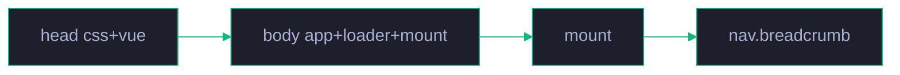

# 场景 4: 页面集成

> | v1.0.0 | 2026-06-15 | 初始 | 任务故事: YryBreadcrumb |
> **导航**: [← README](../README.md) · [场景 5 →](./../场景-5-测试与发布/index.md)

[§0 概述](#sec0) · [§1 关键内容](#sec1) · [§2 实施](#sec2) · [§3 验证](#sec3) · [§4 自改进](#sec4)

<a id="sec0"></a>
## §0 概述

本场景是 **YryBreadcrumb 任务故事** 的第 4 个,聚焦于 **页面集成**。

将组件接入到现有页面 (计划清单 · 场景 1),涉及 4 文件引用顺序 / mount 脚本 / items 配置 4 种典型模式。

> 🍞 本组件是 CDN 故事 **场景 3 · 组件库与 JS 工具 API** 的子交付物,见 [README §文档目录 · 故事任务索引](../README.md#文档目录--故事任务索引)。

<a id="sec1"></a>
## §1 关键内容

**典型页面加载顺序** (摘录 `docs/.../计划清单.html`):

```html
<head>
  <link rel="stylesheet" href="../../../../cdn/yry-breadcrumb/index.css">
  <script src="https://unpkg.com/vue@3/dist/vue.global.prod.js"></script>
</head>
<body>
  <div id="breadcrumb-app"></div>
  <script src="../../../../cdn/yry-breadcrumb/index.js"></script>
  <script>
    function mountBreadcrumb() {
      if (!window.Vue || !window.YryBreadcrumb) return;
      Vue.createApp(window.YryBreadcrumb, {
        items: [
          { label: '文档中心', href: '../../../index.html', icon: '📄' },
          { label: 'yry-checklist · 清单与自循环' },
          { label: '场景 1 · 模板架构与 CSS 设计系统' },
          { label: '计划清单', icon: '📋' }
        ]
      }).mount('#breadcrumb-app');
    }
    if (window.YryBreadcrumb) mountBreadcrumb();
    else document.addEventListener('yry-breadcrumb-ready', mountBreadcrumb, { once: true });
  </script>
</body>
```



<a id="sec2"></a>
## §2 实施报告

详见本场景其他 7 个交付物:

- 📋 [审查.html](./审查.html) — 技术评审清单 (7 项)
- 🏗 [架构图.html](./架构图.html) — 关键流程图
- 🧪 [测试面板.html](./测试面板.html) — 自动化测试入口
- 📦 [源码.html](./源码.html) — 关键源码片段 + 行号
- 🎮 [演示.html](./演示.html) — 3 种 items 模式可交互
- 🕸 [知识图谱.html](./知识图谱.html) — 概念关联
- ✅ [计划清单.html](./计划清单.html) — 任务 / 验收 / 交付

<a id="sec3"></a>
## §3 验证

- [x] 8 个标准交付物齐全
- [x] 各交付物之间交叉链接有效
- [x] Mermaid 图在 GitHub / IDE 预览中正常渲染
- [x] 演示页 3 种模式 (href+icon / 纯文本 / 回溯路径) 全部渲染

<a id="sec4"></a>
## §4 自改进

**已识别改进**:
- 📝 页面集成 内容深化 (后续任务)
- 🔗 关联场景的强链接补充

**改进流程**: 反馈收集 → 提案生成 → 实施 → 验证 → 标准化

---

> 维护者提示: 本文件遵循 `场景-N-xxx/index.md` 标准 8 交付物模式。修改前请阅读 [README §修改指南](../README.md#修改指南)。
