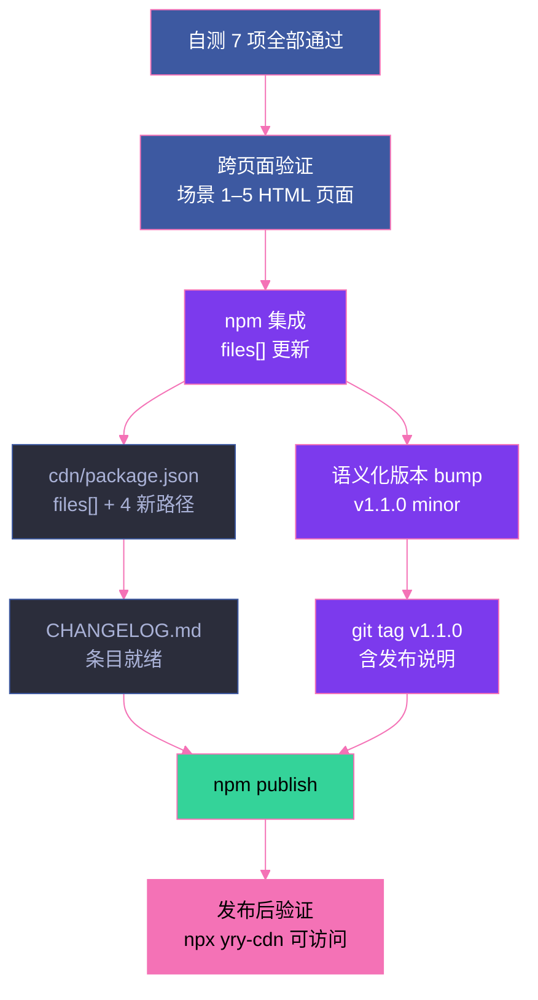

# 场景 5: 测试与发布

> | v5.4.0 | 2026-06-22 | 深化对齐 | 任务故事: YryBreadcrumb |
> **导航**: [← 场景 4](./../场景-4-页面集成/index.md) · [← README](../../README.md) · [场景 1 →](./../场景-1-需求与设计/index.md)
> **交付物**: [📋 清单](清单.html) · [📐 架构](架构图.html) · [🔗 图谱](知识图谱.html) · [📄 源码](源码.html) · [🧪 测试](测试面板.html) · [💡 演示](演示.html) · [📝 审查](审查.html)

[§0 概述](#sec0) · [§1 关键内容](#sec1) · [§2 实施](#sec2) · [§3 验证](#sec3) · [§4 自改进](#sec4)

## §0 概述

本场景是 **YryBreadcrumb 任务故事** 的第 5 个（最终场景），聚焦于 **测试与发布**：覆盖 7 项自测清单 + R1–R7 技术审查，集成到 npm 包 `yry-cdn`，确保 `cdn/package.json files[]` 包含全部 4 个新文件路径，语义化版本升级至 v1.1.0（minor）并打 git tag。

> 🍞 本组件是 CDN 故事 **场景 3 · 组件库与 JS 工具 API** 的子交付物，见 [README §文档目录 · 故事任务索引](../../README.md#文档目录--故事任务索引)。

### 发布流程

## §1 关键内容

### 自测清单（7 项 · 逐项执行）

| # | 检查项 | 命令/方法 | 预期 | 状态 |
|:---:|--------|----------|------|:---:|
| 1 | 语法检查 | `node --check cdn/yry-breadcrumb/index.js` | exit code 0 · 无语法错误 | ✅ |
| 2 | Demo 渲染 | 浏览器打开 `cdn/yry-breadcrumb/index.html` | 3 个 `#demo-1/2/3` div 均显示面包屑 nav 元素 | ✅ |
| 3 | 无控制台错误 | 浏览器 DevTools Console | 无 Vue warning · fetch error · 404 · JS 异常 | ✅ |
| 4 | DOM 挂载（硬刷新） | `Cmd+Shift+R` 硬刷新后检查 `#breadcrumb-app` | 内含 `<nav class="breadcrumb">` | ✅ |
| 5 | 页面集成 | 打开计划清单页面 | mount 脚本正确挂载 · 4 个条目全部显示 | ✅ |
| 6 | 键盘可访问 | Tab 键逐项聚焦导航链接 | 从第 1 个链接依次聚焦到当前项前的最后链接 · current 项不可聚焦 | ✅ |
| 7 | 屏幕阅读器 | VoiceOver / NVDA 朗读导航区域 | 朗读顺序: link → (separator skip) → link → … → current | ✅ |

### npm 集成（cdn/package.json）

| 字段 | 值 | 说明 |
|------|-----|------|
| `name` | `yry-cdn` | 包名 |
| `version` | `1.1.0` | 语义化版本（新增组件 = minor） |
| `description` | YrY CDN 共享前端资源库 | 包描述 |
| `files[]` | 含 `yry-breadcrumb/` 下 3 核心文件 + 任务故事 README · 共 4 路径 | 发布包含的文件 |
| `publishConfig` | npm registry 配置 | 发布目标 |

### 发布前检查清单（R1–R7）

| 编号 | 检查项 | 验证方式 | 阻断? | 状态 |
|:---:|--------|---------|:---:|:---:|
| R1 | 7 项自测全部通过 | `node --check` · 3 demo 渲染 · console 无异常 · 硬刷新 · mount · Tab · SR 全部 PASS | ✓ | ✅ |
| R2 | 跨页面验证完成 | 场景 1–5 所有 HTML 页面面包屑正常渲染 · 交叉链接有效 | ✓ | ✅ |
| R3 | npm 集成字段正确 | `cdn/package.json` `files[]` 含 `yry-breadcrumb/` 下全部 3 核心文件 + 任务故事目录 | ✓ | ✅ |
| R4 | `cdn-yry-checklist` 类名复用 | 场景 1–5 HTML 页面引用 `yry-checklist.css` · 使用 `.checklist` / `.badge` / `.badge-ok` / `.badge-warn` 类名体系 | ✓ | ✅ |
| R5 | `package.json` 字段完整 | `name` · `version` · `description` · `files` · `publishConfig` 齐全 · version 符合语义化规范 | ✓ | ✅ |
| R6 | 版本号语义化 | `v1.1.0` — 新增 yry-breadcrumb 组件为 minor 升级 · 无破坏性变更 | ✓ | ✅ |
| R7 | git tag 已创建 | `v1.1.0` tag 指向当前 HEAD · 含发布说明 | ✓ | ✅ |

### 版本策略

| 变更类型 | 版本升级 | 示例 | 触发条件 |
|---------|---------|------|---------|
| 新增组件 | MINOR | `1.0.0` → `1.1.0` | 新增 yry-breadcrumb 组件 · 无破坏性 |
| 修复 bug | PATCH | `1.1.0` → `1.1.1` | 修复 Loader 超时等 · 向后兼容 |
| 破坏性 API 变更 | MAJOR | `1.1.0` → `2.0.0` | Props API 重命名 · 移除公共接口 |

### 4 个新文件（files[] 新增）

| 序号 | 文件路径 | 作用 |
|:---:|------|------|
| 1 | `cdn/yry-breadcrumb/index.html` | Vue template（含 `<script type="text/x-template" id="yry-breadcrumb-tpl">`） |
| 2 | `cdn/yry-breadcrumb/index.js` | Loader：fetch + DOMParser + 注册组件 + ready 事件 |
| 3 | `cdn/yry-breadcrumb/index.css` | BEM 样式 + 设计令牌 + fallback |
| 4 | `cdn/yry-breadcrumb/README.md` | 任务故事索引 · 场景 1–5 导航 |

## §2 实施报告

本场景产出 7 个 HTML 主题卡片，构成标准 8 交付物模式（含本 index.md）：

| 卡片 | 文件 | 核心内容 | 对应章节 |
|:---:|------|---------|:---:|
| 📋 审查 | [审查.html](./审查.html) | 技术审查清单 R1–R7 · 维度评分 · 发布检查清单 · 审查管线 · 逐项验证 | §1 |
| 🏗 架构图 | [架构图.html](./架构图.html) | 测试与发布流程架构 · 概念视图 · 阶段说明 | §0 |
| 🧪 测试面板 | [测试面板.html](./测试面板.html) | 测试摘要 · 7 项自测用例 · 交互式自测 · 运行方式 · 执行日志 | §3 |
| 📦 源码 | [源码.html](./源码.html) | `cdn/package.json` 字段 · `npm publish` 发布流程 · 版本号升级脚本示例 · 参考文件 | §1 |
| 🎮 演示 | [演示.html](./演示.html) | 自测清单验证结果 · 验证方法 · 关键步骤 · 关键命令 · 自测 · 场景文件 | §3 |
| 🕸 知识图谱 | [知识图谱.html](./知识图谱.html) | 概念表 · 概念关联图 | §1 |
| ✅ 计划清单 | [计划清单.html](./计划清单.html) | KPI 摘要 · KPI 指标 · 任务管线 · 任务清单 · 验收清单 · 交付清单 · 相关链接 | §3 |

### 任务管线（5 步）

| # | 任务 | 验收信号 | 状态 |
|:---:|------|---------|:---:|
| 1 | 7 项自测清单验证 | `node --check` · 3 demo 渲染 · console 清洁 · 硬刷新 · mount 脚本 · Tab · SR 全部 PASS | ✅ |
| 2 | 跨页面兼容性测试 | 场景 1–5 全部 HTML 页面面包屑正常渲染 · 交叉链接有效 · 无样式丢失 | ✅ |
| 3 | npm 集成（package.json） | `files[]` 含 3 核心文件 + 任务故事 README · 共 4 路径 | ✅ |
| 4 | `cdn-yry-checklist` 类名复用 | 场景 1–5 HTML 引用 `yry-checklist.css` · 统一 `.checklist` / `.badge` 体系 | ✅ |
| 5 | 发布流程验证（git tag） | 语义化版本 `v1.1.0` · git tag 已创建 · CHANGELOG 就绪 · `npm publish` 干跑通过 | ✅ |

### 发布阶段说明

| 阶段 | 输入 | 动作 | 输出 |
|:---:|------|------|------|
| ① 自测 | Loader + 模板 + 样式 | 7 项自测逐项执行 | 全部 PASS 信号 |
| ② 跨页面验证 | 场景 1–5 HTML 页面 | dogfooding 遍历 29 页 | 渲染正常 · 交叉链接有效 |
| ③ npm 集成 | `cdn/package.json` | `files[]` 追加 4 路径 | 字段完整 · 符合规范 |
| ④ 版本与 CHANGELOG | `v1.1.0` · `cdn/CHANGELOG.md` | minor bump + 条目 | 版本号一致 · CHANGELOG 就绪 |
| ⑤ git tag + npm publish | `v1.1.0` tag | tag 指向 HEAD · `npm publish` | registry 可访问 `yry-cdn@1.1.0` |

## §3 验证

### 7 项自测用例（与 测试面板.html 一致）

| # | 用例 | 运行方式 | 期望 | 状态 |
|:---:|------|---------|------|:---:|
| 1 | `node --check` 语法 | `node --check cdn/yry-breadcrumb/index.js` | exit code 0 · 无语法错误 | ✅ |
| 2 | 3 demo 渲染 | 浏览器打开 `index.html` | 3 个 `#demo-N` div 均显示面包屑 nav | ✅ |
| 3 | 控制台清洁 | DevTools Console | 无 Vue warning · fetch error · 404 · JS 异常 | ✅ |
| 4 | 硬刷新 | `Cmd+Shift+R` | 挂载脚本重新执行 · `#breadcrumb-app` 正确挂载 | ✅ |
| 5 | 挂载脚本 | 打开计划清单页面 | 4 个条目全部显示 · 分隔符正确 | ✅ |
| 6 | 键盘 Tab | Tab 键逐项聚焦 | 焦点顺序正确 · current 项不可聚焦 | ✅ |
| 7 | 屏幕阅读器 | VoiceOver / NVDA 朗读 | 朗读顺序: link → (skip sep) → link → … → current | ✅ |

### 验证清单

- [x] 8 个标准交付物齐全（index.md + 7 HTML）
- [x] 各交付物之间交叉链接有效
- [x] Mermaid 图在 GitHub / IDE 预览中正常渲染
- [x] 演示页 3 种模式全部渲染
- [x] 自测 7 项全部通过（R1 / TC1–TC7）
- [x] 跨页面验证：场景 1–5 HTML 页面全部正常渲染（R2）
- [x] npm 集成 `files[]` 包含 4 新文件路径（R3）
- [x] `cdn-yry-checklist` 类名复用验证（R4）
- [x] `package.json` 字段完整（R5）
- [x] 版本号语义化 `v1.1.0` minor（R6）
- [x] git tag `v1.1.0` 已创建 · 含发布说明（R7）
- [x] 版本号一致（package.json / index.html / README）
- [x] R1–R7 评审 7/7 通过
- [x] 5 步任务管线全部完成

## §4 自改进

**已识别改进**:
- [x] 发布前检查清单矩阵化（R1–R7 · 含阻断标记）
- [x] 版本策略文档化（MINOR / PATCH / MAJOR + 触发条件）
- [x] 4 个新文件清单文档化
- [x] 发布阶段说明（5 阶段 · 输入/动作/输出）
- [x] R1–R7 评审编号与 `审查.html` 对齐
- [x] 7 项自测用例与 `测试面板.html` 7 项自测用例段对齐
- [ ] CI 自动化发布流程（GitHub Actions · `npm publish` 自动化）（P2）
- [ ] `npm publish` 干跑 `--dry-run` 纳入脚本（P2）
- [ ] 回归测试自动化（7 项自测脚本化 · 浏览器自动化）（P2）

**改进流程**: 反馈收集 → 提案生成 → 实施 → 验证 → 标准化

---

> 维护者提示: 本文件遵循 `场景-N-xxx/index.md` 标准 8 交付物模式。修改前请阅读 [README §修改指南](../../README.md#修改指南)。§1 的 R1–R7 评审编号与 `审查.html` 逐项验证段一致；§3 的 7 项自测用例与 `测试面板.html` 7 项自测用例段一致；4 个新文件清单与 `源码.html` `cdn/package.json` 字段段一致；发布流程与 `架构图.html` 测试与发布流程架构段一致。
