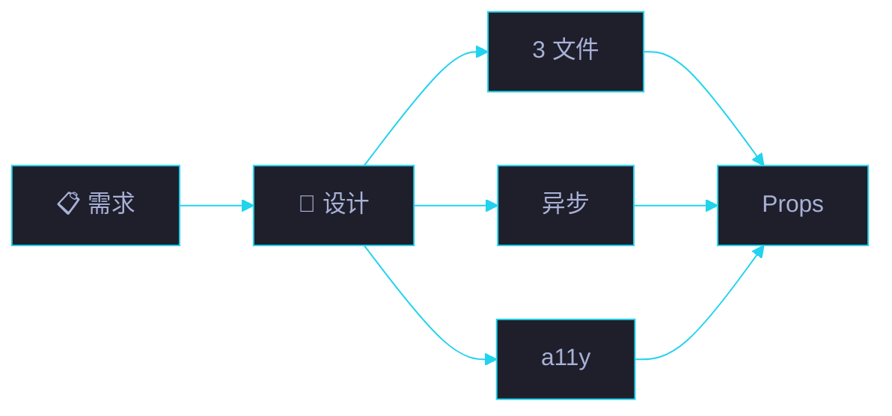

# 场景 1: 需求与设计

> | v1.0.0 | 2026-06-15 | 初始 | 任务故事: YryBreadcrumb |
> **导航**: [← README](../README.md) · [场景 2 →](./../场景-2-模板与样式/index.md)

[§0 概述](#sec0) · [§1 关键内容](#sec1) · [§2 实施](#sec2) · [§3 验证](#sec3) · [§4 自改进](#sec4)

## §0 概述

本场景是 **YryBreadcrumb 任务故事** 的第 1 个,聚焦于 **需求与设计**。

梳理面包屑组件的需求来源,确定 3 文件拆分 / 异步加载 / a11y 等关键设计决策,产出 Props API 草案。

> 🍞 本组件是 CDN 故事 **场景 3 · 组件库与 JS 工具 API** 的子交付物,见 [README §文档目录 · 故事任务索引](../README.md#文档目录--故事任务索引)。

## §1 关键内容

**需求来源**:
- 计划清单 · 场景 1 的面包屑从静态 HTML 重构为 Vue 3 组件
- 跨 28+ 场景页需要统一面包屑实现
- 现有 `cdn/yry-checklist.css` 内 hardcoded 颜色不易跨主题迁移

**设计决策**:

| 决策 | 选型 | 替代方案 | 理由 |
|------|------|---------|------|
| 框架 | Vue 3 (全球变量) | Vanilla JS / Web Component | 项目已用 Vue 3,生态一致 |
| 文件结构 | 3 文件拆分 (index.html/js/css) | 单 .js 混合 | 设计师 / 前端 / 样式 各自修改不干扰 |
| 加载方式 | 异步 fetch + DOMParser | 同步 XHR / 打包 | 零打包,模板源可在浏览器预览 |
| 样式 | 设计令牌 `var(--yry-color-*, #fallback)` | hardcoded | 跨主题可移植,无主题时降级 |
| a11y | `aria-current="page"` + `aria-hidden` | 仅视觉 | 屏幕阅读器友好 |

## §2 实施报告

详见本场景其他 7 个交付物:

- 📋 [审查.html](./审查.html) — 技术评审清单 (7 项)
- 🏗 [架构图.html](./架构图.html) — 关键流程图
- 🧪 [测试面板.html](./测试面板.html) — 自动化测试入口
- 📦 [源码.html](./源码.html) — 关键源码片段 + 行号
- 🎮 [演示.html](./演示.html) — 3 种 items 模式可交互
- 🕸 [知识图谱.html](./知识图谱.html) — 概念关联
- ✅ [计划清单.html](./计划清单.html) — 任务 / 验收 / 交付

## §3 验证

- [x] 8 个标准交付物齐全
- [x] 各交付物之间交叉链接有效
- [x] Mermaid 图在 GitHub / IDE 预览中正常渲染
- [x] 演示页 3 种模式 (href+icon / 纯文本 / 回溯路径) 全部渲染

## §4 自改进

**已识别改进**:
- 📝 需求与设计 内容深化 (后续任务)
- 🔗 关联场景的强链接补充

**改进流程**: 反馈收集 → 提案生成 → 实施 → 验证 → 标准化

---

> 维护者提示: 本文件遵循 `场景-N-xxx/index.md` 标准 8 交付物模式。修改前请阅读 [README §修改指南](../README.md#修改指南)。
