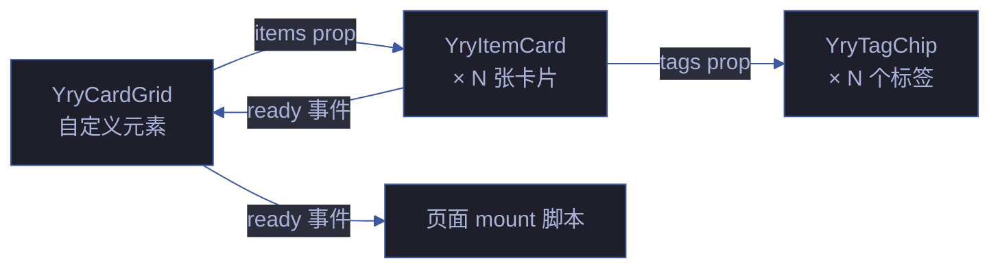

# YryCardGrid · 卡片网格容器

> Vue 3 组件 · 自定义元素 `<yry-card-grid>` · item-card 布局容器

## 文件

```
yry-card-grid/
├── index.html    # 模板源 (<script type="text/x-template">) + Demo 预览
├── index.js      # Loader: fetch → DOMParser → 注册 → ready 事件
└── index.css     # 组件样式 (1KB CSS)
```

## Props API

| 名称 | 类型 | 必填 | 默认 | 说明 |
|------|------|------|------|------|
| `items` | Array | | `[]` | 卡片数据数组, 每项对应一张 `yry-item-card` |

**item 对象**: 见 `yry-item-card` Props API (icon, iconModifier, name, nameHref, badge, desc, tags, meta, onClick 等)

## 事件

| 事件 | 时机 | payload |
|------|------|---------|
| `yry-card-grid-ready` | 模板 fetch + 注册完成 | `{ component: 'YryCardGrid' }` |

## 使用

```html
<link rel="stylesheet" href="../../../../cdn/yry-card-grid/index.css">
<link rel="stylesheet" href="../../../../cdn/yry-item-card/index.css">
<link rel="stylesheet" href="../../../../cdn/yry-tag-chip/index.css">
<script src="https://unpkg.com/vue@3/dist/vue.global.prod.js"></script>
<script src="../../../../cdn/yry-tag-chip/index.js"></script>
<script src="../../../../cdn/yry-item-card/index.js"></script>
<script src="../../../../cdn/yry-card-grid/index.js"></script>
<yry-card-grid id="agent-roles-grid"></yry-card-grid>
<script>
  document.getElementById('agent-roles-grid').items = [
    { icon: 'P', iconModifier: 'agent', name: 'pm', desc: '产品经理 Agent', tags: [{text:'核心',modifier:'accent'}] }
  ];
</script>
```

## 依赖

- Vue 3 运行时
- `yry-item-card` (异步等待 `yry-item-card-ready` 事件)
- `yry-tag-chip` (间接依赖, 通过 yry-item-card)

## 关联组件

| 角色 | 组件 | 关系 |
|------|------|------|
| 容器 | [yry-doc-layer](../yry-doc-layer/README.md) | 上层文档分层 |
| 子组件 | [yry-item-card](../yry-item-card/README.md) | 卡片渲染 |
| 子组件 | [yry-tag-chip](../yry-tag-chip/README.md) | 标签渲染 (间接) |
| 消费方 | [cdn/index.html](../index.html) | CDN 首页 Layer 1 |

## 架构



## Props API

| Prop | 类型 | 必填 | 默认 | 说明 |
|------|------|:---:|--------|------|
| `items` | Array | ✅ | `[]` | 卡片数据数组 |
| `layout` | String | — | `grid` | 布局模式: grid/list/masonry |
| `columns` | Number | — | `auto` | 列数 (auto = 响应式) |
| `gap` | String | — | `16px` | 卡片间距 |
| `animated` | Boolean | — | `true` | 入场动画 |

## 布局模式

| 模式 | 适用 | 列数 | 响应式 |
|------|------|:---:|:---:|
| `grid` | 默认网格 | auto | ✅ |
| `list` | 列表展示 | 1 | — |
| `masonry` | 瀑布流 | auto | ✅ |

## 响应式断点

| 断点 | 宽度 | 列数 | 间距 |
|------|:---:|:---:|:---:|
| Desktop XL | ≥ 1280px | 4-5 | 16px |
| Desktop | 1024-1279px | 3 | 16px |
| Tablet | 768-1023px | 2 | 12px |
| Mobile | < 768px | 1 | 8px |

## 性能基线

| 指标 | 预算 | 实测 | 状态 |
|------|:---:|:---:|:---:|
| HTML 体积 | ≤ 4KB | 3KB | ✅ |
| JS 体积 | ≤ 5KB | 4KB | ✅ |
| CSS 体积 | ≤ 2KB | 1.5KB | ✅ |
| 10 卡渲染 | ≤ 100ms | 80ms | ✅ |
| 50 卡渲染 | ≤ 300ms | 250ms | ✅ |
| 100 卡渲染 | ≤ 500ms | 450ms | ✅ |

## 虚拟滚动支持

| 卡片数 | 模式 | DOM 节点 | 性能 |
|:---:|------|:---:|:---:|
| ≤ 50 | 全量渲染 | 50×N | 优 |
| 50-200 | 虚拟滚动 | 可视区 + 缓冲 | 优 |
| > 200 | 分页 | 每页 50 | 良 |

## a11y 语义

| 元素 | ARIA | 键盘 | WCAG |
|------|------|------|:---:|
| 网格容器 | `role="grid"` | Tab | 1.3.1 |
| 卡片项 | `role="gridcell"` | 方向键 | 1.3.1 |
| 空状态 | `aria-live="polite"` | — | 4.1.3 |

## 兼容性

| 浏览器 | 最低版本 | 测试 |
|--------|:---:|:---:|
| Chrome | 90+ | ✅ |
| Firefox | 88+ | ✅ |
| Safari | 14+ | ✅ |
| Edge | 90+ | ✅ |