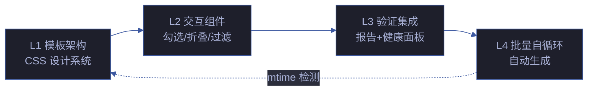

# YryChecklist · 场景文档索引

> 4 个场景 · 每场景 8 标准交付物 · 计划清单自动化生成管线

## 场景导航

| # | 场景 | 主题 | 核心交付 |
|---|------|------|---------|
| 1 | [模板架构与 CSS 设计系统](场景-1-模板架构与CSS设计系统/index.md) | 模板架构 · CSS 分层 · 设计令牌 | 架构图 · 演示 |
| 2 | [清单交互组件实现](场景-2-清单交互组件实现/index.md) | 勾选交互 · 折叠面板 · 风险行 · 批量操作 | 源码 · 演示 |
| 3 | [验证报告与健康面板集成](场景-3-验证报告与健康面板集成/index.md) | 验证报告 · 健康面板 · 数据集成 | 测试面板 |
| 4 | [批量生成与自循环机制](场景-4-批量生成与自循环机制/index.md) | 批量生成 · 自循环 · 定时触发 | 架构图 |

## 故事概述

见 [故事任务.md](故事任务.md) — 四层管线: 模板架构 → 组件交互 → 验证集成 → 批量自循环

## 知识图谱

- [知识图谱.html](知识图谱.html) — 概念节点-边图可视化
- [知识图谱.json](知识图谱.json) — 图谱数据源
- [index.json](index.json) — 场景索引数据

## 通知日志

[通知日志.md](通知日志.md) — 企微通知发送记录

## 标准交付物 (每场景)

📋 计划清单 · 📐 架构图 · 🔗 知识图谱 · 🧪 测试面板 · 📄 源码 · 💡 演示 · 📝 审查 · 📖 index.md

## 四层管线架构

## 场景状态矩阵

| # | 场景 | 文档 | 测试 | 实施 | 用例数 |
|---|------|:---:|:---:|:---:|:---:|
| 1 | 模板架构与 CSS | ✅ | 7 | ✅ | 7 |
| 2 | 清单交互组件 | ✅ | 9 | ✅ | 9 |
| 3 | 验证报告集成 | ✅ | 7 | ✅ | 7 |
| 4 | 批量生成与自循环 | ✅ | 9 | ✅ | 9 |

## 清单生成管线

| 阶段 | 输入 | 输出 | 耗时 | 阻断 |
|------|------|------|:---:|:---:|
| ① 扫描 | 场景目录 | 场景列表 | < 50ms | — |
| ② 提取 | index.md | Context 对象 | < 100ms | ✅ |
| ③ 渲染 | Context + 模板 | HTML | < 50ms | — |
| ④ 写入 | HTML | 7 HTML 文件 | < 100ms | ✅ |
| ⑤ 报告 | 结果 | 摘要 | < 10ms | — |

## 交互组件清单

| 组件 | 触发 | 状态存储 | 动画 | 优先级 |
|------|------|------|------|:---:|
| 勾选进度联动 | click | localStorage | 0.5s ease | P0 |
| 折叠面板 | click | CSS class | 0.3s ease-out | P0 |
| 标签页切换 | click/键盘 1-9 | localStorage | opacity | P0 |
| 风险行展开 | click | CSS class | max-height | P1 |
| 交付物过滤 | click | CSS class | opacity | P1 |
| 复制路径 | click | — | toast 0.15s | P1 |