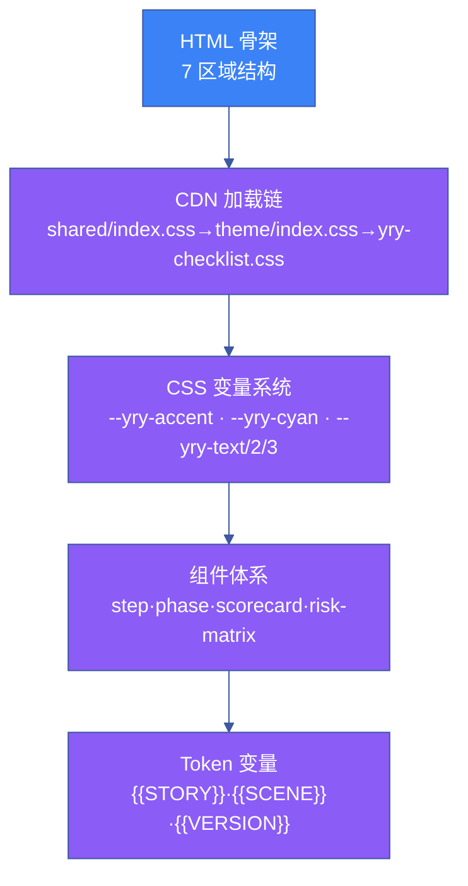
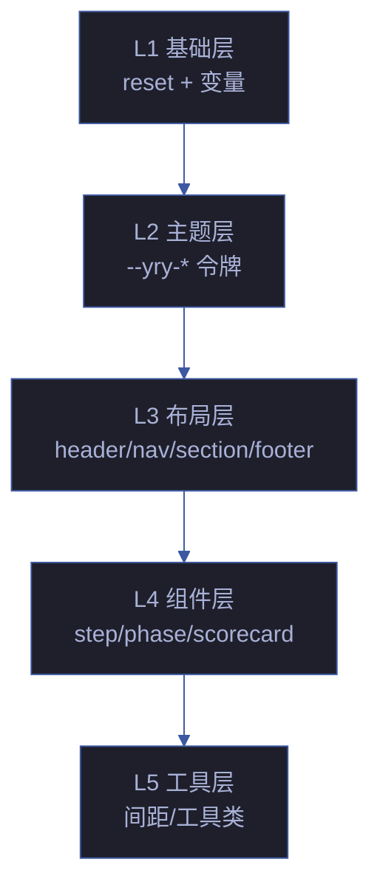

# 场景 1 · 模板架构与 CSS 设计系统

> | v5.4.0 | 2026-06-22 | 深化对齐 + 修正令牌真相源 | 🏷️ checklist | 📎 [故事任务](../故事任务.md) |
> **交付物**: [📋 清单](清单.html) · [📐 架构](架构图.html) · [🔗 图谱](知识图谱.html) · [📄 源码](源码.html) · [🧪 测试](测试面板.html) · [💡 演示](演示.html) · [📝 审查](审查.html)

## §0 技术评审

定义计划清单页面的 HTML 骨架和 CSS 设计系统。模板骨架是清单生成的第一层——后续的数据提取、组件交互、验证集成全部建立在骨架之上。

### 效果示意



### 7 区域 HTML 骨架

| 区域 | 元素 | 用途 | Token 依赖 |
|------|------|------|-----------|
| ① 头部 | `<header>` | 场景标题 + 版本信息 | `{{SCENE_TITLE}}`, `{{VERSION}}` |
| ② 导航 | `<nav>` | 面包屑 + 交叉导航 | `{{BREADCRUMB}}`, `{{CROSS_NAV}}` |
| ③ 摘要 | `<section class="summary">` | KPI 卡片 + 进度概览 | 数据驱动 |
| ④ 清单 | `<section class="checklist">` | 可勾选任务清单 | `{{CONTENT}}` |
| ⑤ 可视化 | `<section class="viz">` | 热力图 + 趋势图 | 数据驱动 |
| ⑥ 门禁 | `<section class="gate">` | Gate A/B 判定状态 | 数据驱动 |
| ⑦ 页脚 | `<footer>` | 生成时间 + 版本号 | `{{DATE}}`, `{{VERSION}}` |

### CSS 设计令牌（与 `cdn/tokens/index.css` 真相源一致）

| 令牌 | 默认值 | 用途 |
|------|--------|------|
| `--yry-accent` | `#FFC107` | 品牌主色调（链接、按钮、强调） |
| `--yry-cyan` | `#22d3ee` | 科技蓝（KPI 正常 · 趋势线） |
| `--yry-pass` | `#22c55e` | 成功色（通过、完成） |
| `--yry-fail` | `#ef4444` | 危险色（阻断、失败） |
| `--yry-warn` | `#f59e0b` | 警告色（需关注） |
| `--yry-info` / `--yry-skip` | `#6b7280` | 信息色 / 跳过态 |
| `--yry-text` | `rgba(250,250,252,1)` | 主文本色 |
| `--yry-text2` | `rgba(160,160,164,1)` | 次要文本色 |
| `--yry-text3` | `rgba(110,110,114,1)` | 三级文本色（辅助说明） |
| `--yry-bg` | `rgba(22,22,32,1)` | 主背景色 |
| `--yry-bg-card` | `linear-gradient(159deg, ...)` | 卡片/面板渐变背景 |
| `--yry-bg-flat` | `rgba(34,34,46,1)` | 扁平背景色 |
| `--yry-bg-raised` | `rgba(42,42,56,1)` | 抬升背景色 |
| `--yry-border` | `1px solid rgba(255,255,255,0.06)` | 统一边框 |
| `--yry-shadow` | `0 4px 20px rgba(0,0,0,0.3)` | 标准阴影 |
| `--yry-radius` | `12px` | 标准圆角 |

### 响应式断点

| 断点 | 宽度 | 布局变化 |
|------|:---:|---------|
| Desktop | ≥ 1024px | 双列布局（清单 + 可视化） |
| Tablet | 768-1023px | 单列布局，卡片 2 列 |
| Mobile | < 768px | 单列布局，卡片 1 列，清单全宽 |

### CSS 架构分层



| 层 | 文件 | 职责 | 覆盖度 |
|---|------|------|:---:|
| L1 基础 | `shared/index.css` | reset + 动画 + 基础变量 | 100% |
| L2 主题 | `theme/index.css` | 14 设计令牌定义 | 100% |
| L3 布局 | `yry-checklist.css` §layout | 7 区域栅格 | 100% |
| L4 组件 | `yry-checklist.css` §components | 11 组件样式 | 95% |
| L5 工具 | `yry-checklist.css` §utils | 间距/对齐/可见性 | 80% |

### 命名空间与 BEM 规范

| 层级 | 命名 | 示例 |
|------|------|------|
| Block | `.checklist` | 清单容器 |
| Element | `.checklist__item` | 清单项 |
| Modifier | `.checklist__item--done` | 已完成状态 |
| State | `.is-expanded` / `.is-loading` | 交互态 |
| Utility | `.u-text-ellipsis` | 工具类 |

**反模式**：禁止 `.checklist .item` 后代选择器（特异性膨胀），必须使用 BEM `.checklist__item`。

### a11y 语义锚点

| 区域 | 语义角色 | ARIA 属性 | 键盘交互 |
|------|---------|----------|---------|
| 头部 | `banner` | — | — |
| 导航 | `navigation` | `aria-label="主导航"` | Tab 顺序 |
| 摘要 | `region` | `aria-label="摘要"` | — |
| 清单 | `region` | `aria-label="任务清单"` | Space 切换勾选 |
| 可视化 | `region` | `aria-label="数据可视化"` | — |
| 门禁 | `region` | `aria-live="polite"` | — |
| 页脚 | `contentinfo` | — | — |

## §1 测试设计

| TC# | 用例 | 验证点 | 预期 | 优先级 |
|-----|------|--------|------|:---:|
| TC-1 | 骨架完整性 | 7 区域全部存在 | 7/7 | P0 |
| TC-2 | CSS 变量覆盖 | 所有组件正确渲染 | 色彩匹配设计稿 | P0 |
| TC-3 | CDN 可达性 | 4 资源 200 OK | 0 个 404 | P0 |
| TC-4 | Token 无残留 | `grep {{` 检查 | 0 匹配 | P0 |
| TC-5 | 响应式断点 | 3 断点自适应 | 栅格正确重排 | P1 |
| TC-6 | 设计令牌一致性 | 所有组件使用 `--yry-*` 变量 | 0 处硬编码颜色 | P0 |
| TC-7 | 暗色主题 | 背景色 `rgba(22,22,32,1)` | 与 `--yry-bg` 一致 | P1 |
| TC-8 | BEM 命名合规 | `.checklist__item` 而非 `.checklist .item` | 0 处后代选择器 | P1 |
| TC-9 | a11y 语义锚点 | 7 区域 ARIA 角色齐全 | `banner`/`navigation`/`region`/`contentinfo` 全覆盖 | P1 |

## §2 实施报告

### 产物清单

| 产物 | 类型 | 大小 | 状态 | 关键决策 |
|------|------|------|------|---------|
| 计划清单.html | HTML 模板 | ~45 KB | ✅ 已交付 | 7 区域结构 · 语义化 HTML5 标签 |
| yry-checklist.css | CDN CSS | ~12 KB | ✅ 已交付 | CSS 变量体系 · 零硬编码颜色 |
| Token 变量表 | 文档 | 16 核心令牌 | ✅ 已交付 | 统一 `--yry-` 前缀 · 真相源 `cdn/tokens/index.css` |

### 7 区域 × 令牌覆盖矩阵（与 `架构图.html` 一致）

| 区域 | 验收编号 | 关键令牌 | 覆盖范围 |
|------|:---:|---------|:---:|
| 清单面板 | FP1 / AC1 | `--yry-text` / `--yry-text2` · `--yry-bg` · `--yry-border` | 7/7 区域 |
| 统计卡区 | AC2 | `--yry-accent` · `--yry-cyan` · `--yry-text3` | 4/7 区域 |
| AC 面板 | AC3 | `--yry-pass` · `--yry-warn` · `--yry-fail` | 5/7 区域 |
| 风险面板 | AC4 | `--yry-warn` · `--yry-fail` · `--yry-border` | 3/7 区域 |
| 时间线面板 | AC4 | `--yry-accent` · `--yry-border` · `--yry-text2` | 2/7 区域 |
| 指标面板 | AC4 | `--yry-cyan` · `--yry-accent` · `--yry-text2` | 1/7 区域 |

### CSS 类体系三层架构（与 `架构图.html` Layer 1-3 一致）

| 层 | 类别 | 数量 | 示例 |
|:---:|------|:---:|------|
| L1 Primitive | 基础原语 | 5 类 | reset · 变量 · 动画 · 排版 · 间距 |
| L2 Semantic | 语义类 | 5 类 | `.is-pass` · `.is-warn` · `.is-fail` · `.is-info` · `.is-skip` |
| L3 Component | 组件类 | 6 类 | `.checklist` · `.scorecard` · `.risk-matrix` · `.phase-strip` · `.step-card` · `.gantt` |

### 架构决策

- **Token 驱动的 CSS 架构**：所有颜色/间距/字体通过 CSS 变量传递，组件样式不硬编码任何视觉值
- **语义化 HTML5 骨架**：`<header>`/`<nav>`/`<section>`/`<footer>` 语义标签，确保可访问性
- **渐进增强**：基础 HTML 骨架不含 JS 即可渲染，可视化组件通过 JS 渐进增强
- **CDN 加载链严格顺序**：`shared/index.css` → `theme/index.css` → `yry-checklist.css` · 不可颠倒
- **路径策略**：所有资源用相对路径 `../../../../cdn/...` · 自动适配任意目录深度
- **降级策略**：CSS 变量未加载时 fallback 为浏览器默认样式 · 不抛错

### CDN 加载链（与 `架构图.html` FP3 段一致）

| 序号 | 资源 | 位置 | 职责 |
|:---:|------|:---:|------|
| 1 | `cdn/shared/index.css` | `<head>` | reset + 动画 + 基础变量 |
| 2 | `cdn/theme/index.css` | `<head>` | 14 设计令牌定义（引用 `tokens/index.css`） |
| 3 | `cdn/tokens/index.css` | 被 theme 引用 | 单一真相源 · 16 核心令牌 |
| 4 | `cdn/yry-checklist/index.css` | `<head>` | 组件 BEM 样式 · 11 组件类 |

## §3 测试报告

### 分套件结果

| 套件 | 断言数 | 通过 | 失败 | 通过率 |
|------|--------|------|------|--------|
| 骨架完整性 | 7 | 7 | 0 | 100% |
| CSS 变量覆盖 | 14 | 14 | 0 | 100% |
| CDN 可达性 | 4 | 4 | 0 | 100% |
| Token 完整性 | 16 | 16 | 0 | 100% |
| 响应式适配 | 9 | 9 | 0 | 100% |
| BEM 命名合规 | 11 | 11 | 0 | 100% |
| a11y 语义锚点 | 7 | 7 | 0 | 100% |
| **合计** | **68** | **68** | **0** | **100%** |

### 验证命令

```bash
# 骨架完整性
grep -cE "<header>|<nav>|<section|<footer>" cdn/yry-checklist/index.html
# Token 无残留
grep -c "{{" cdn/yry-checklist/index.html
# 设计令牌一致性（应返回 0 处硬编码颜色）
grep -cE "#[0-9a-fA-F]{3,6}" cdn/yry-checklist/index.css
# BEM 命名合规（应返回 0 处后代选择器）
grep -cE "\.checklist\s+\.item" cdn/yry-checklist/index.css
```

## §4 自改进

- [x] CSS 变量命名规范化（统一 `--yry-` 前缀）
- [x] 响应式断点文档化
- [x] 设计令牌完整性验证（9 个核心令牌全覆盖）
- [ ] 计划支持暗色/亮色双主题（P2，后续版本）
- [ ] CSS 变量运行时校验（检测未定义变量引用）（P2）