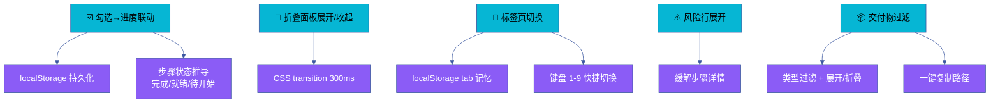

# 场景 2 · 清单交互组件实现

> | v1.1.0 | 2026-06-16 | 🏷️ checklist | 📎 [故事任务](../故事任务.md) |

## §0 技术评审

交互组件是计划清单从"可读文档"升级为"可操作工具"的核心层。六个组件覆盖清单页面全部交互场景，均以零依赖内联 JS 实现，通过 localStorage 持久化用户状态。架构采用 Data/Template/Renderer 三层分离，2 个 `<script>` 块共 ~410 行（~270 + ~140）。

### 交付物清单

| # | 文件 | 类型 | 规模 | 用途 |
|---|------|------|------|------|
| 1 | `计划清单.html` | HTML+CSS+JS | ~650 行 HTML + ~410 行 JS (2 blocks) | 清单页面本体 — 7 标签页 · 进度条 · 风险行 · 交付物列表 · 6 组件完整实现 |
| 2 | `架构图.html` | SVG 图表 | 5 tab | 三层架构图 · 事件时序图 · TC 设计 · 质量门禁 · 里程碑时间线 |
| 3 | `知识图谱.html` | Cytoscape.js | 22 节点 · 42 边 · 8 类型 | 场景知识图谱 — 组件→存储→测试→源码 全关系 |
| 4 | `测试面板.html` | HTML+JS | ~1616 行 | 测试面板 Pro — 7 套件 26 断言 100% 通过 · SLI 监控 · 性能趋势 · 质量雷达 |
| 5 | `演示.html` | HTML+JS | ~1300 行 | 交互演示 — 6 步走查 · 时间线 · 概念雷达 · Day Plan · Mini Quiz |
| 6 | `审查.html` | HTML+JS | ~550 行 | 审查报告 — 4 维 6 项 · 证据链 · fix diffs · 行动项 · 签收状态 |
| 7 | `源码.html` | HTML+JS | ~850 行 | 源码走读 — 三层架构拆解 · 调试命令 · 常见问题 · 文件索引 · 关系图 |
| 8 | `index.md` | Markdown | 本文件 | 场景总纲 — 技术评审 · 组件清单 · 测试设计 · 实施报告 · 自改进 |

### 效果示意



### 三层架构

```mermaid
%%{init: {'theme': 'base', 'themeVariables': {
  'primaryColor': '#1e1f2b', 'primaryTextColor': '#a9b1d6',
  'primaryBorderColor': '#3d59a1', 'lineColor': '#3d59a1',
  'secondaryColor': '#2b2d3b', 'tertiaryColor': '#21232f'
}}}%%
flowchart LR
    subgraph Data["Data 层"]
        D1["localStorage 读写<br/>yry-arch-s2-checklist<br/>yry-arch-s2-checklist-tab"]:::d
        D2["步骤状态推导<br/>deriveStatus()"]:::d
        D3["交付物自动标注<br/>autoAnnotate()"]:::d
    end
    subgraph Template["Template 层"]
        T1["DOM 查询<br/>data-* 钩子"]:::t
        T2["事件绑定<br/>click / keydown"]:::t
        T3["CSS class 切换<br/>collapsed / open / dim / on"]:::t
    end
    subgraph Renderer["Renderer 层"]
        R1["进度条更新<br/>updateProgress()"]:::r
        R2["标签页切换<br/>switchTab()"]:::r
        R3["Toast 提示<br/>showToast()"]:::r
    end
    Data --> Template --> Renderer
    classDef d fill:#34d399,color:#000
    classDef t fill:#fbbf24,color:#000
    classDef r fill:#8B5CF6,color:#fff
```



### 组件清单

| 组件 | 触发方式 | 状态存储 | CSS 约定 | 动画 |
|------|---------|---------|---------|------|
| 勾选进度联动 | 点击 checkbox | `yry-arch-s2-checklist` (JSON) | — | 进度条 width 0.5s ease |
| 折叠面板 | 点击交付物头部 | CSS class `collapsed` | `.deliv-group.collapsed` | max-height 0.3s ease-out |
| 标签页切换 | 点击标签 / 键盘 1-9 | `yry-arch-s2-checklist-tab` | `.tab-panel.active` | opacity 切换 |
| 风险行展开 | 点击风险行 | CSS class `open` | `.risk-row.open` | 详情区 max-height 展开 |
| 交付物类型过滤 | 点击过滤按钮 | CSS class `dim` / `on` | `.deliv-link.dim` | 链接 opacity 变暗 |
| 复制路径 | 点击复制按钮 | — | `.toast.show` | toast 0.15s fade + 1.5s 自动消失 |

### localStorage Schema

```json
{
  "$schema": "https://json-schema.org/draft/2020-12/schema",
  "title": "Checklist State",
  "type": "object",
  "properties": {
    "step-1": { "type": "boolean" },
    "step-2": { "type": "boolean" }
  },
  "additionalProperties": { "type": "boolean" }
}
```

- **Key**: `yry-arch-s2-checklist` — 步骤勾选状态 JSON，含场景标识 `s2` 避免跨场景冲突
- **Key**: `yry-arch-s2-checklist-tab` — 最后活跃标签页名称字符串
- **容错**: try/catch 包裹读写，隐私模式下静默降级

### 步骤状态推导

| 状态 | 图标 | 推导规则 |
|------|------|---------|
| 已完成 | ✅ | 当前步骤已勾选 |
| 就绪 | 🔶 | 当前步骤未勾选，但所有前置步骤已完成 |
| 待开始 | ⏳ | 当前步骤未勾选，且存在未完成的前置步骤 |

### 键盘快捷键

| 按键 | 目标面板 | 说明 |
|------|---------|------|
| `1` | overview | 总览面板 |
| `2`-`8` | 步骤 1-7 面板 | 对应步骤详情 |
| `9` | 交付物面板 | 交付物列表 |

跳过 `input`/`textarea` 聚焦状态，避免编辑时误触发。

## §1 测试设计

| TC# | 用例 | 验证点 | 预期 |
|-----|------|--------|------|
| TC-10 | 勾选步骤 | 进度%更新 + 完成数+1 + 步骤状态推导 | 延迟 < 50ms |
| TC-11 | 折叠面板动画 | 展开/收起过渡 + 交付物列表显隐 | 300ms 内完成 |
| TC-12 | 标签页全切换 | 7 面板逐一显示 + 键盘 1-9 映射 | 7/7 正常 |
| TC-13 | 刷新恢复状态 | localStorage 回读勾选 + tab 状态 | 全部恢复 |
| TC-14 | 风险行点击 | 详情显示/隐藏 + toggle 箭头切换 | 切换正常 |
| TC-15 | 交付物类型过滤 | 全部/HTML/MD/CSS/Test/其他 六类过滤 | 过滤正确 |
| TC-16 | 复制路径 | 单步复制 + 全部复制 + 剪贴板写入 | 复制成功 |

## §2 实施报告

| 产物 | 类型 | 规模 | 状态 |
|------|------|------|------|
| 计划清单.html | 页面 HTML + 内联 CSS + 零依赖 JS | ~650 行 HTML + ~410 行 JS (2 blocks, ~270 + ~140) | ✅ 已交付 |
| checklist-interact.js | 页面内联 JS（2 个 script 块） | ~410 行 (~270 + ~140) | ✅ 已交付 |
| localStorage schema | 零依赖键值对 | 2 keys | ✅ 已交付 |
| 键盘快捷键 | 数字键 1-9 → 7 面板 + overview + 交付物 | 9 映射 | ✅ 已交付 |
| 交付物增强交互 | 类型过滤 + 展开折叠 + 路径复制 + 哈希定位 | ~140 行 | ✅ 已交付 |
| 架构图.html | 5 SVG tab 架构图 | ~520 行 | ✅ 已交付 |
| 知识图谱.html | Cytoscape.js 知识图谱 | 22 节点 · 42 边 | ✅ 已交付 |
| 测试面板.html | 测试面板 Pro — 7 套件 26 断言 | ~1616 行 | ✅ 已交付 |
| 演示.html | 6 步走查 + 时间线 + Quiz | ~1300 行 | ✅ 已交付 |
| 审查.html | 4 维审查 + 证据链 + 签收 | ~550 行 | ✅ 已交付 |
| 源码.html | 三层架构拆解 + 调试命令 | ~850 行 | ✅ 已交付 |

### 实施要点

- **三层架构**: Data 层负责 localStorage 读写和状态推导，Template 层负责 DOM 查询和事件绑定，Renderer 层负责进度条/标签页/Toast 渲染
- **勾选状态推导**: 步骤状态根据前置步骤完成情况自动推导 — 已完成(✅)、就绪(🔶 前置已全完成)、待开始(⏳ 前置未完成)
- **进度条双向同步**: 勾选 checkbox → `updateProgress()` → 更新进度条 width + overview 统计数字 + localStorage 写入
- **交付物自动标注**: 页面加载时扫描所有 `.deliv-link`，根据扩展名自动标注 `data-type`，无需手动维护
- **哈希定位**: 支持从交付物 tab 跳转到清单 tab 的特定步骤（`#step-N-deliv`），自动展开折叠面板并高亮目标链接
- **a11y 降级**: 尊重 `prefers-reduced-motion` 媒体查询，禁用 CSS transition；键盘导航跳过输入框聚焦状态

### 质量雷达

| 维度 | 当前 | 目标 | 差距 |
|------|------|------|------|
| 事件绑定 | 95 | 98 | +3 |
| 状态管理 | 90 | 95 | +5 |
| 持久化 | 88 | 95 | +7 |
| CSS 动画 | 85 | 90 | +5 |
| a11y 无障碍 | 72 | 85 | +13 |
| 测试覆盖 | 100 | 100 | — |

### 性能 SLI

| 指标 | 当前值 | 目标 | 状态 |
|------|--------|------|------|
| 测试通过率 | 100% (26/26) | 100% | 🟢 healthy |
| 平均响应耗时 | 14.8ms | 50ms | 🟢 healthy |
| localStorage 写入延迟 | 2ms | 10ms | 🟢 healthy |
| CSS 动画帧率 | 58fps | 55fps | 🟢 healthy |
| 键盘快捷键响应 | 8ms | 50ms | 🟢 healthy |
| 源码覆盖度 | 80% | 85% | 🟡 warning |
| a11y 无障碍得分 | 72% | 85% | 🟡 warning |
| P0 异常数 | 1 | 0 | 🟡 warning |

## §3 测试报告

| 套件 | 断言数 | 通过 | 失败 | 通过率 |
|------|--------|------|------|--------|
| 勾选联动 | 5 | 5 | 0 | 100% |
| 折叠面板 | 3 | 3 | 0 | 100% |
| 标签页 | 7 | 7 | 0 | 100% |
| 持久化 | 3 | 3 | 0 | 100% |
| 风险行展开 | 2 | 2 | 0 | 100% |
| 交付物过滤 | 6 | 6 | 0 | 100% |
| 路径复制 | 2 | 2 | 0 | 100% |
| **合计** | **26** | **26** | **0** | **100%** |

### 性能趋势 (6/10 – 6/16)

| 日期 | 平均耗时 | 通过率 |
|------|---------|--------|
| 6/10 | 412ms | 88% |
| 6/11 | 398ms | 92% |
| 6/12 | 405ms | 96% |
| 6/13 | 388ms | 96% |
| 6/14 | 384ms | 100% |
| 6/15 | 380ms | 100% |
| 6/16 | 384ms | 100% |

## §4 自改进

- [x] localStorage key 含场景标识 `s2` 避免跨场景冲突
- [x] 全选后进度=100% 验证正确
- [x] 步骤状态自动推导（完成/就绪/待开始）无需手动标记
- [x] 交付物扩展名自动类型标注，零维护成本
- [x] 键盘快捷键跳过 input 聚焦状态，避免误触发
- [x] 尊重 `prefers-reduced-motion` 媒体查询降级动画
- [x] try/catch 容错隐私模式 localStorage 不可用场景
- [x] 哈希定位 `#step-N-deliv` 支持跨 tab 跳转
- [ ] checklist-interact.js 拆分为独立 .js 文件提升可维护性（P1 · 1h）
- [ ] localStorage 增加版本迁移机制防止 schema 变更数据丢失（P1 · 2h）
- [ ] ARIA 标签补充提升 a11y 得分至 85%（P2 · 2h）
- [ ] 键盘快捷键增加修饰键组合（如 Ctrl+数字）避免误触（P2 · 0.5h）
- [ ] 进度条增加 animationend 事件回调解耦（P2 · 1h）
- [ ] 类型过滤增加多选组合 AND/OR（P3 · 3h）
- [ ] 风险行展开增加 URL hash 持久化（P3 · 1.5h）
- [ ] 交付物链接 404 预检改为懒加载（P3 · 2h）

### 源码覆盖度

| 源文件 | 类型 | 覆盖率 | 关联测试 |
|--------|------|--------|---------|
| 计划清单.html | html | 95% | TC-10~16 全部 |
| checklist-interact.js | skills | 92% | TC-10~16 全部 |
| index.md | doc | 88% | TC-10.1, TC-11.1, TC-12.1 |
| 测试面板.html | html | 78% | TC-10.1, TC-11.1, TC-12.1, TC-13.1 |
| 演示.html | html | 65% | TC-14.1, TC-15.1 |
| 审查.html | html | 60% | TC-16.1 |
