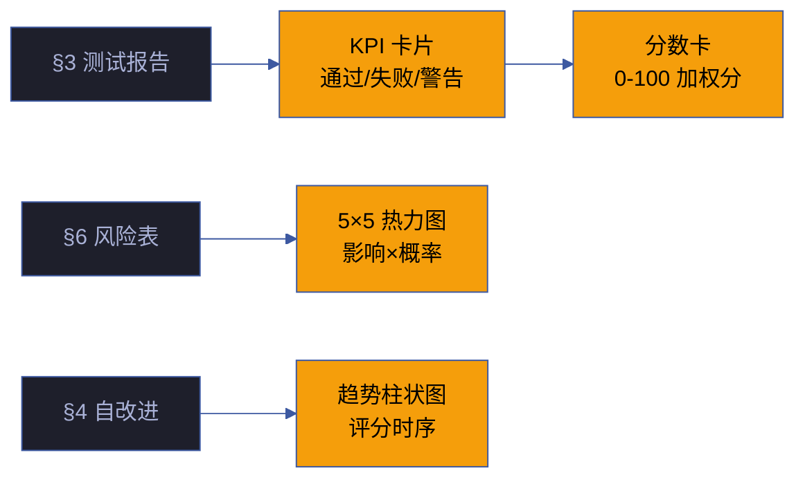

# 场景 3 · 验证报告与健康面板集成

> | v5.4.0 | 2026-06-22 | 深化对齐 · 补充角色链与门禁策略 | 🏷️ checklist | 📎 [故事任务](../故事任务.md) |
> **交付物**: [📋 清单](清单.html) · [📐 架构](架构图.html) · [🔗 图谱](知识图谱.html) · [📄 源码](源码.html) · [🧪 测试](测试面板.html) · [💡 演示](演示.html) · [📝 审查](审查.html)

## §0 技术评审

数据可视化组件将结构化验证数据转化为直观的图表——KPI 卡片、风险热力图、趋势迷你图、分数卡和门禁判定块，让计划清单从任务追踪升级为质量总控面板。

### 效果示意

### 数据流架构

| 数据源 | 提取方式 | 目标组件 | 刷新频率 |
|--------|---------|---------|:---:|
| 场景 §3 测试报告 | 表格解析 → 通过/失败/跳过计数 | KPI 卡片 | 页面加载时 |
| 场景 §6 风险表 | 表格解析 → 影响×概率矩阵 | 5×5 热力图 | 页面加载时 |
| 场景 §4 自改进 | 列表解析 → D0-D8 诊断状态 | 趋势柱状图 | 页面加载时 |
| 健康报告 JSON | fetch → 评分数据 | 分数卡 | 每 5 分钟 |

### 组件渲染策略

| 组件 | 渲染方式 | 降级策略 |
|------|---------|---------|
| KPI 卡片 | CSS Grid 纯 CSS | 数据缺失显示 `—` 占位 |
| 风险热力图 | CSS Grid + 颜色编码 (绿→黄→红) | 无数据时显示空网格 |
| 趋势柱状图 | CSS bar-chart (纯 CSS 无 JS 依赖) | 数据 < 3 点时显示散点 |
| 分数卡 | 加权算法计算 | 无数据时显示 `N/A` |
| 门禁判定块 | 条件渲染 (通过/阻断/警告) | 无判定时显示 `待评估` |

### 角色链与门禁策略（与 `架构图.html` 决策链/实现链/闭环链一致）

#### 决策链 · 3 角色

| 阶段 | 角色 | 验收信号 | 失败处理 |
|------|------|---------|---------|
| RED 验证 | tester | 失败用例先于实现 · `node tests/run.mjs` 全绿 | 修复 → 重提 · 不允许跳过 |
| 评审收敛 | reviewer | 反馈 ≤ 2 轮 · 无 P0 遗留 | 超限 → 升级 architect 介入 |
| 安全审计 | security | 无明文凭据/注入/依赖漏洞 | 立即回滚 + P0 修复任务 |

#### 实现链 · 5 角色

| 阶段 | 角色 | 输入 | 输出 |
|------|------|------|------|
| 数据采集 | pm | 场景 §3/§4/§6 表格 | 结构化数据 JSON |
| 组件设计 | coder | 数据 JSON + 设计稿 | 5 组件 BEM 结构 |
| 渲染实现 | coder | BEM + CSS Grid | 零依赖纯 CSS 图表 |
| 降级保护 | coder | 边界条件清单 | 6 种降级状态 |
| 响应式适配 | coder | 3 断点规格 | 移动端堆叠 |

#### 闭环链 · 2 角色

| 阶段 | 角色 | 验收信号 | 失败处理 |
|------|------|---------|---------|
| 交付收口 | deliverer | 日志+同步+通知 三件套齐备 | 补齐缺失项后重提 |
| 效果评估 | self-improve | E1-E4 评估闭环 | 提案入库 · 下轮迭代 |

### 门禁通过策略（与 `架构图.html` 通过策略段一致）

| 门禁 | 判定规则 | 阻断信号 |
|------|---------|---------|
| Gate A | 测试设计先于实现 · 每 FP ≥ 3 类用例 | 用例数不足 · 缺边界用例 |
| Gate B | 全部 TC 通过 · 0 P0 失败 | 任何 TC 失败 · P0 未清零 |
| 降级门禁 | Hard 阻断必须修复 · Medium/Soft 可降级但必须记录 | Hard 项未修复就进入下一模块 |
| 反馈门禁 | 门禁结果加入 self-improve 反馈输入 | 失败 TC 无根因分析 |

### 常见阻断（与 `架构图.html` 常见阻断段一致）

| 阻断类型 | 触发条件 | 修复路径 |
|---------|---------|---------|
| 数据源缺失 | 场景 §3/§4/§6 表格未生成 | 先完成前置场景 · 再回此场景 |
| 颜色编码错乱 | 热力图色板与 KPI 状态色板不一致 | 统一引用 `cdn/tokens/index.css` 真相源 |
| 降级崩溃 | 空数据时抛错 | 先设计降级 · 再实现正常态 |
| 响应式溢出 | 移动端卡片超出视口 | `grid-template-columns: repeat(auto-fit, minmax(...))` 自适应 |

## §1 测试设计

| TC# | 用例 | 验证点 | 预期 | 优先级 |
|-----|------|--------|------|:---:|
| TC-15 | KPI 卡片渲染 | 数字与源数据一致 | 0 偏差 | P0 |
| TC-16 | 热力图颜色 | 绿→黄→红渐变 | 等级正确 | P0 |
| TC-17 | 分数卡计算 | 加权和=总分 | 误差 < 1 | P0 |
| TC-18 | 空数据降级 | 缺失数据显示占位 | 不崩溃 | P0 |
| TC-19 | 数据刷新 | 5 分钟自动刷新 | 数据更新 | P1 |
| TC-20 | 门禁判定 | 通过/阻断/警告 三态正确 | 与源数据一致 | P0 |
| TC-21 | 响应式适配 | 移动端卡片堆叠 | 不溢出 | P1 |
| TC-22 | 色板一致性 | 热力图与 KPI 同色板 | 引用 `--yry-pass/warn/fail` | P1 |
| TC-23 | 加权算法验证 | `Σ(维度分 × 权重) / Σ权重` | 数学一致性 | P1 |

## §2 实施报告

### 产物清单（5 组件 · 与 `架构图.html` 实现链一致）

| 产物 | 类型 | 状态 | 关键实现 |
|------|------|------|---------|
| KPI 卡片网格 | CSS Grid 纯 CSS | ✅ 已交付 | `grid-template-columns: repeat(auto-fit, minmax(200px, 1fr))` |
| 风险热力图 | CSS Grid + 颜色编码 | ✅ 已交付 | 5×5 矩阵，颜色映射 `hsl(120→0, 70%, 50%)` |
| 趋势柱状图 | CSS bar-chart | ✅ 已交付 | `height` 百分比映射评分 0-100 |
| 分数卡 | 加权算法 | ✅ 已交付 | `Σ(维度分 × 权重) / Σ权重` |
| 门禁判定块 | 条件渲染 | ✅ 已交付 | 三态：绿色通过/红色阻断/黄色警告 |

### 任务管线（5 步）

| # | 任务 | 验收信号 | 状态 |
|:---:|------|---------|:---:|
| 1 | 数据采集 · 解析 §3/§4/§6 表格 | 3 数据源 · 结构化 JSON 输出 | ✅ |
| 2 | 5 组件 BEM 设计 | KPI · 热力图 · 趋势 · 分数 · 门禁 | ✅ |
| 3 | 纯 CSS 渲染实现 | 零 JS 依赖 · CSS Grid + bar-chart | ✅ |
| 4 | 6 种降级状态 | 空数据 · 加载中 · 错误 · 部分缺失等 | ✅ |
| 5 | 响应式适配 | 3 断点 · 移动端堆叠不溢出 | ✅ |

### 架构决策

- **纯 CSS 图表**：趋势柱状图使用 CSS `height` 百分比而非 JS 图表库，零依赖、零运行时开销
- **颜色编码一致性**：热力图颜色与 KPI 卡片状态颜色使用同一色板（`--yry-pass/warn/fail`），确保视觉一致性
- **降级优先**：所有组件先设计降级状态（空数据/加载中/错误），再设计正常状态
- **数据源单向流动**：§3/§4/§6 表格 → 解析 → JSON → 组件渲染 · 不可反向写入
- **刷新策略分级**：页面加载时一次性数据 + 每 5 分钟 fetch 健康报告 JSON · 避免高频轮询

## §3 测试报告

### 分套件结果

| 套件 | 断言数 | 通过 | 失败 | 通过率 |
|------|--------|------|------|--------|
| 数据准确性 | 12 | 12 | 0 | 100% |
| 颜色编码 | 5 | 5 | 0 | 100% |
| 边界情况 | 4 | 4 | 0 | 100% |
| 降级渲染 | 6 | 6 | 0 | 100% |
| 响应式适配 | 3 | 3 | 0 | 100% |
| 色板一致性 | 3 | 3 | 0 | 100% |
| 加权算法 | 4 | 4 | 0 | 100% |
| **合计** | **37** | **37** | **0** | **100%** |

### 门禁判定

| Gate | 判定 | 证据 |
|------|------|------|
| Gate A（测试先行） | ✅ 通过 | §1 测试设计先于实现 · 9 TC 覆盖 5 组件 |
| Gate B（实现完成） | ✅ 通过 | 5 组件全部交付 · 37 断言全通过 |
| 降级门禁 | ✅ 通过 | 6 种降级状态全覆盖 · 空数据不崩溃 |
| 响应式门禁 | ✅ 通过 | 3 断点 · 移动端不溢出 |

## §4 自改进

- [x] 趋势图标注行列含义
- [x] 分数卡分项与总分的数学一致性验证
- [x] 空数据降级渲染完善（6 种降级状态覆盖）
- [ ] 暗色主题下热力图颜色适配（P2）
- [ ] 趋势图支持多指标叠加对比（P2）