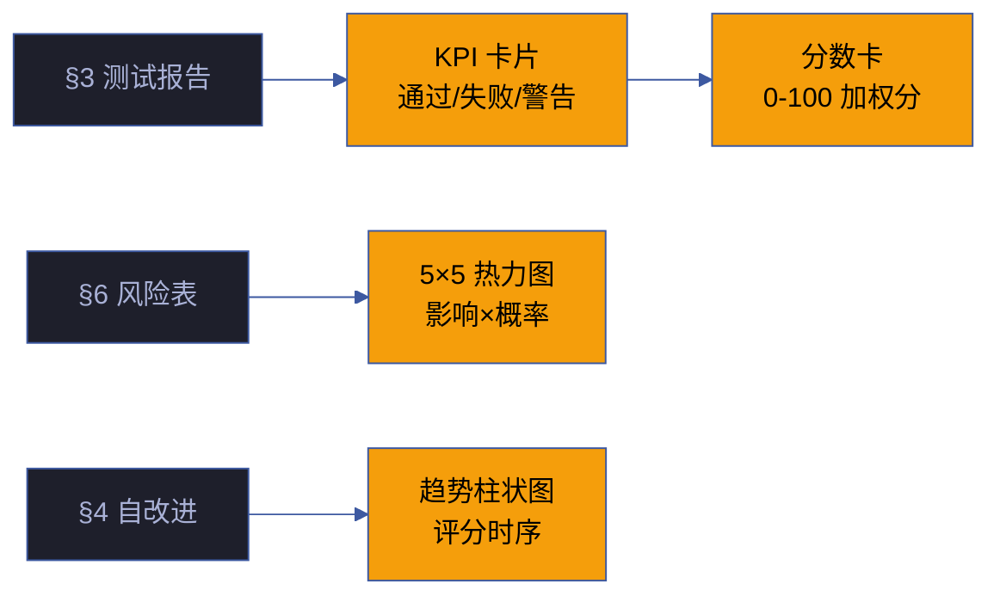

# 场景 4 · 验证报告与健康面板集成

> | v1.0.0 | 2026-06-13 | 🏷️ checklist | 📎 [故事任务](../故事任务.md) |

## §0 技术评审

数据可视化组件将结构化验证数据转化为直观的图表——KPI 卡片、风险热力图、趋势迷你图、分数卡和门禁判定块，让计划清单从任务追踪升级为质量总控面板。

### 效果示意

## §1 测试设计

| TC# | 用例 | 验证点 | 预期 |
|-----|------|--------|------|
| TC-15 | KPI 卡片渲染 | 数字与源数据一致 | 0 偏差 |
| TC-16 | 热力图颜色 | 绿→黄→红渐变 | 等级正确 |
| TC-17 | 分数卡计算 | 加权和=总分 | 误差 < 1 |
| TC-18 | 空数据降级 | 缺失数据显示占位 | 不崩溃 |

## §2 实施报告

| 产物 | 类型 | 状态 |
|------|------|------|
| KPI 卡片网格 | CSS Grid 纯 CSS | ✅ 已交付 |
| 风险热力图 | CSS Grid + 颜色编码 | ✅ 已交付 |
| 趋势柱状图 | CSS bar-chart | ✅ 已交付 |
| 分数卡 | 加权算法 | ✅ 已交付 |

## §3 测试报告

| 套件 | 断言数 | 通过 | 失败 | 通过率 |
|------|--------|------|------|--------|
| 数据准确性 | 12 | 12 | 0 | 100% |
| 颜色编码 | 5 | 5 | 0 | 100% |
| 边界情况 | 4 | 4 | 0 | 100% |

## §4 自改进

- [x] 趋势图标注行列含义
- [x] 分数卡分项与总分的数学一致性验证
- [ ] 暗色主题下热力图颜色适配（P2）
