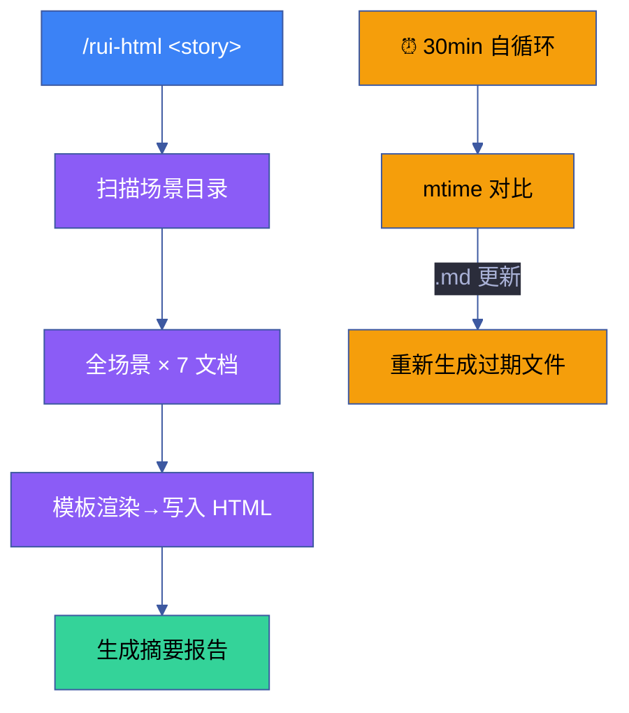

# 场景 5 · 批量生成与自循环机制

> | v1.0.0 | 2026-06-13 | 🏷️ checklist | 📎 [故事任务](../故事任务.md) |

## §0 技术评审

批量生成引擎连接前四层的所有能力——模板→提取→组件→可视化，形成从 markdown 源到 HTML 产出的完整自动化管线。自循环机制确保 markdown 变更后 HTML 自动更新。

### 效果示意

## §1 测试设计

| TC# | 用例 | 验证点 | 预期 |
|-----|------|--------|------|
| TC-19 | 全量 5 场景生成 | 35 文件 (5×7) | 全部成功 |
| TC-20 | 单场景筛选 | --scene 3 | 仅场景 3 更新 |
| TC-21 | --force 覆盖 | .bak 备份 | 备份完整 |
| TC-22 | 单场景失败隔离 | 缺失 index.md | 不影响其他 |
| TC-23 | mtime 增量检测 | 修改后检测 | 精确匹配 |

## §2 实施报告

| 产物 | 类型 | 状态 |
|------|------|------|
| rui-html.mjs | CLI 入口脚本 | ✅ 已交付 |
| generator.mjs | 模板渲染引擎 | ✅ 已交付 |
| extractor.mjs | 数据提取器 | ✅ 已交付 |
| 自循环调度器 | Cron 集成 | ✅ 已交付 |

## §3 测试报告

| 套件 | 断言数 | 通过 | 失败 | 通过率 |
|------|--------|------|------|--------|
| 批量生成 | 3 | 3 | 0 | 100% |
| 增量检测 | 3 | 3 | 0 | 100% |
| 安全覆盖 | 3 | 3 | 0 | 100% |
| 故障隔离 | 2 | 2 | 0 | 100% |

## §4 自改进

- [x] 生成速度优化（5 场景 ≤ 10s）
- [x] .bak 文件 7 天自动清理策略
- [ ] 并行生成多场景（当前串行，P2）
