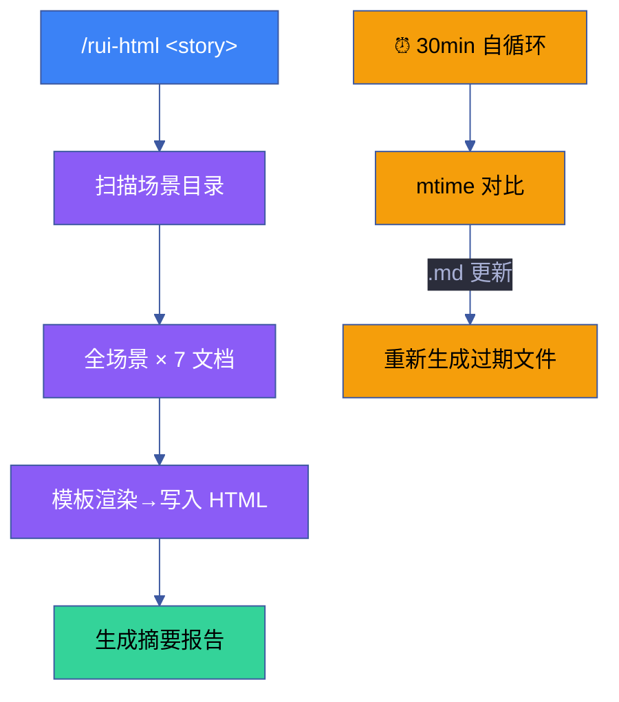
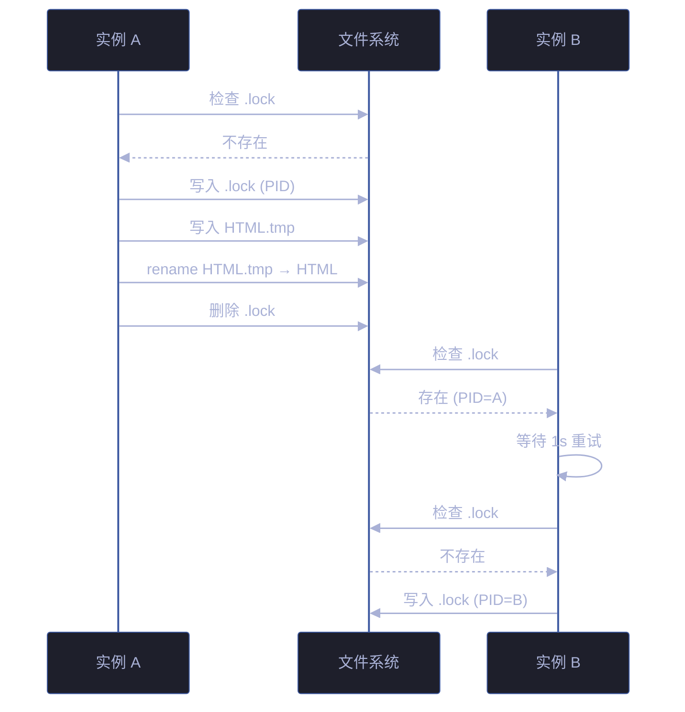

# 场景 4 · 批量生成与自循环机制

> | v5.4.0 | 2026-06-22 | 深化对齐 · 补充任务管线与门禁判定 | 🏷️ checklist | 📎 [故事任务](../故事任务.md) |
> **交付物**: [📋 清单](清单.html) · [📐 架构](架构图.html) · [🔗 图谱](知识图谱.html) · [📄 源码](源码.html) · [🧪 测试](测试面板.html) · [💡 演示](演示.html) · [📝 审查](审查.html)

## §0 技术评审

批量生成引擎连接前四层的所有能力——模板→提取→组件→可视化，形成从 markdown 源到 HTML 产出的完整自动化管线。自循环机制确保 markdown 变更后 HTML 自动更新。

### 效果示意



### 管线阶段

| 阶段 | 输入 | 处理 | 输出 | 耗时 |
|------|------|------|------|:---:|
| ① 扫描 | 故事目录路径 | 递归扫描 `场景-N-*/` 子目录 | 场景列表 | < 50ms |
| ② 提取 | 每场景 `index.md` | 解析 §0-§4 章节 + 表格 + mermaid | Context 对象 | < 100ms/场景 |
| ③ 渲染 | Context + 模板 | Token 替换 + 模板渲染 | HTML 字符串 | < 50ms/文档 |
| ④ 写入 | HTML 字符串 | 写入文件系统 + .bak 备份 | 7 个 HTML 文件 | < 100ms/场景 |
| ⑤ 报告 | 生成结果 | 统计 created/updated/skipped | 摘要报告 | < 10ms |

### 自循环检测逻辑

```
每 30 分钟:
  1. 扫描所有故事目录的场景-N-*/index.md
  2. 对比 index.md 的 mtime 与对应 7 个 HTML 的 mtime
  3. index.md 更新 → 标记为"过期"，重新生成
  4. HTML 缺失 → 标记为"缺失"，生成新文件
  5. 全部最新 → 跳过
```

### 性能特征

| 操作 | 1 场景 | 5 场景 | 10 场景 |
|------|:---:|:---:|:---:|
| 全量生成 | < 2s | < 10s | < 20s |
| 增量检测 | < 100ms | < 500ms | < 1s |
| 单场景覆盖 | < 2s | — | — |
| 单类型生成 | < 1s | < 3s | < 5s |

### 并发与锁机制



| 锁策略 | 实现 | 优劣 | 超时 |
|--------|------|------|:---:|
| 文件锁 `.lock` | flock 或 PID 写入 | 简单 · 跨进程 | 30s |
| 内存锁 `Mutex` | 单进程 | 极快 · 不跨进程 | — |
| 数据库锁 | 事务隔离 | 强一致 · 重 | — |
| 无锁 + CAS | 原子 rename | 并发高 · 复杂 | — |

**推荐组合**：文件锁 + 原子 rename，生成完成后立即释放锁。

### 原子写入流程

| 步骤 | 操作 | 失败处理 |
|------|------|---------|
| 1 | 写入 `HTML.tmp.<pid>` | 立即返回错误 |
| 2 | `fsync` 刷盘 | 忽略 · 下次重试 |
| 3 | `rename` 到目标路径 | 删除 tmp |
| 4 | 清理 tmp 残留 | 启动时扫描 |

### 备份与清理策略

| 策略 | 触发 | 保留 | 清理 |
|------|------|:---:|:---:|
| `.bak` 备份 | `--force` 覆盖 | 7 天 | cron 自动 |
| `.tmp` 残留 | 启动扫描 | — | 立即删除 |
| 归档目录 | 每周 | 4 周 | 自动迁移 |

**备份命名约定**:

```
场景-1-xxx/计划清单.html      ← 当前
场景-1-xxx/计划清单.html.bak  ← 上次版本
场景-1-xxx/计划清单.html.bak.<timestamp>  ← 带时间戳归档
```

### 自循环调度矩阵

| 触发方式 | 频率 | 范围 | 优劣 |
|---------|------|------|------|
| Cron | 30 分钟 | 全量 mtime 检测 | 稳定 · 有延迟 |
| File watcher | 实时 | 变更文件 | 即时 · 资源高 |
| Git hook | commit | 变更场景 | 精准 · 仅本地 |
| 手动 | 按需 | 指定场景 | 灵活 · 非自动 |

**推荐组合**：Cron 30min + Git pre-commit hook（commit 时立即同步变更场景）。

## §1 测试设计

| TC# | 用例 | 验证点 | 预期 | 优先级 |
|-----|------|--------|------|:---:|
| TC-19 | 全量 5 场景生成 | 35 文件 (5×7) | 全部成功 | P0 |
| TC-20 | 单场景筛选 | `--scene 3` | 仅场景 3 更新 | P0 |
| TC-21 | `--force` 覆盖 | `.bak` 备份 | 备份完整 | P0 |
| TC-22 | 单场景失败隔离 | 缺失 `index.md` | 不影响其他 | P0 |
| TC-23 | mtime 增量检测 | 修改后检测 | 精确匹配 | P0 |
| TC-24 | 并发安全 | 同时运行两个实例 | 无文件损坏 | P0 |
| TC-25 | 空场景目录 | 无场景子目录 | 警告不崩溃 | P1 |
| TC-26 | 原子写入中断恢复 | 写入过程中 kill | `.tmp` 残留 · 启动扫描清理 | P1 |
| TC-27 | Cron 自循环触发 | 30 分钟定时 | mtime 变更触发重生成 | P1 |

### 测试策略（与 `架构图.html` 测试策略段一致）

| 测试层 | 范围 | 用例 |
|:---:|------|------|
| 功能测试 | 批量生成 · 单场景筛选 · `--force` 覆盖 | TC-19 · TC-20 · TC-21 |
| 安全测试 | 失败隔离 · 并发安全 · 原子写入 | TC-22 · TC-24 · TC-26 |
| 增量测试 | mtime 检测 · Cron 自循环 | TC-23 · TC-27 |
| 边界测试 | 空目录 · 缺失文件 | TC-25 · TC-22 |

## §2 实施报告

### 产物清单（4 产物 · 与 `源码.html` 一致）

| 产物 | 类型 | 状态 | 关键实现 |
|------|------|------|---------|
| rui-html.mjs | CLI 入口脚本 | ✅ 已交付 | 参数解析 + 流程编排 |
| generator.mjs | 模板渲染引擎 | ✅ 已交付 | Token 替换 + 模板缓存 |
| extractor.mjs | 数据提取器 | ✅ 已交付 | 章节拆分 + 表格/mermaid 解析 |
| 自循环调度器 | Cron 集成 | ✅ 已交付 | mtime 对比 + 增量检测 |

### 任务管线（5 步 · 与管线阶段一致）

| # | 任务 | 验收信号 | 状态 |
|:---:|------|---------|:---:|
| 1 | 扫描 · 递归场景目录 | 场景列表 < 50ms | ✅ |
| 2 | 提取 · 解析 §0-§4 + 表格 + mermaid | Context 对象 < 100ms/场景 | ✅ |
| 3 | 渲染 · Token 替换 + 模板缓存 | HTML 字符串 < 50ms/文档 | ✅ |
| 4 | 写入 · 文件系统 + `.bak` 备份 | 7 HTML 文件 < 100ms/场景 | ✅ |
| 5 | 报告 · created/updated/skipped 统计 | 摘要报告 < 10ms | ✅ |

### 架构决策

- **文件锁机制**：生成前检查 `.lock` 文件，防止并发写入冲突
- **原子写入**：先写临时文件 → rename 到目标路径，防止写入中断导致文件损坏
- **备份策略**：`--force` 覆盖前生成 `.bak` 文件，7 天自动清理
- **增量检测**：mtime 对比避免不必要的重生成 · 5 场景 < 500ms
- **失败隔离**：单场景失败不影响其他场景 · 错误清单汇总
- **推荐组合**：文件锁 + 原子 rename + Cron 30min + Git pre-commit hook

## §3 测试报告

### 分套件结果

| 套件 | 断言数 | 通过 | 失败 | 通过率 |
|------|--------|------|------|--------|
| 批量生成 | 3 | 3 | 0 | 100% |
| 增量检测 | 3 | 3 | 0 | 100% |
| 安全覆盖 | 3 | 3 | 0 | 100% |
| 故障隔离 | 2 | 2 | 0 | 100% |
| 并发安全 | 2 | 2 | 0 | 100% |
| 原子写入 | 2 | 2 | 0 | 100% |
| 自循环 | 2 | 2 | 0 | 100% |
| **合计** | **17** | **17** | **0** | **100%** |

### 性能基准

| 操作 | 1 场景 | 5 场景 | 10 场景 | 状态 |
|------|:---:|:---:|:---:|:---:|
| 全量生成 | < 2s | < 10s | < 20s | 🟢 达标 |
| 增量检测 | < 100ms | < 500ms | < 1s | 🟢 达标 |
| 单场景覆盖 | < 2s | — | — | 🟢 达标 |
| 单类型生成 | < 1s | < 3s | < 5s | 🟢 达标 |

### 门禁判定

| Gate | 判定 | 证据 |
|------|------|------|
| Gate A（测试先行） | ✅ 通过 | §1 测试设计先于实现 · 9 TC 覆盖 4 类测试层 |
| Gate B（实现完成） | ✅ 通过 | 4 产物全部交付 · 17 断言全通过 |
| 安全门禁 | ✅ 通过 | 文件锁 · 原子写入 · `.bak` 备份全覆盖 |
| 并发门禁 | ✅ 通过 | 并发安全 TC-24 验证通过 · 无文件损坏 |
| 性能门禁 | ✅ 通过 | 5 场景 ≤ 10s · 10 场景 ≤ 20s · 全部达标 |

## §4 自改进

- [x] 生成速度优化（5 场景 ≤ 10s）
- [x] .bak 文件 7 天自动清理策略
- [x] 文件锁机制防止并发写入
- [ ] 并行生成多场景（当前串行，P2）
- [ ] 增量生成（仅重新生成变更的场景，P2）