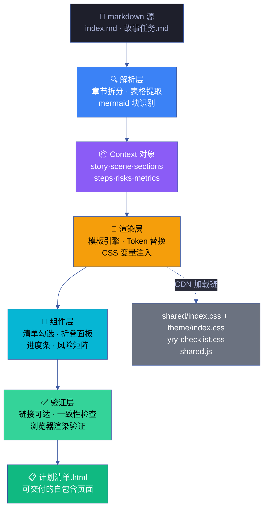
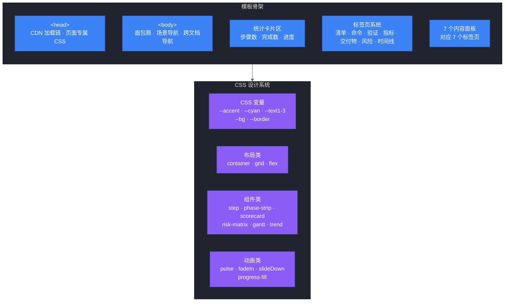
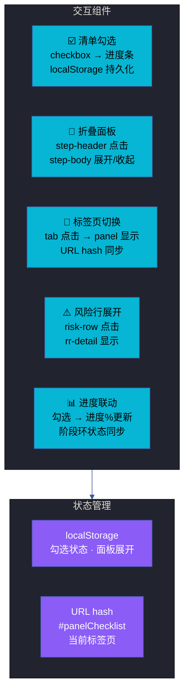
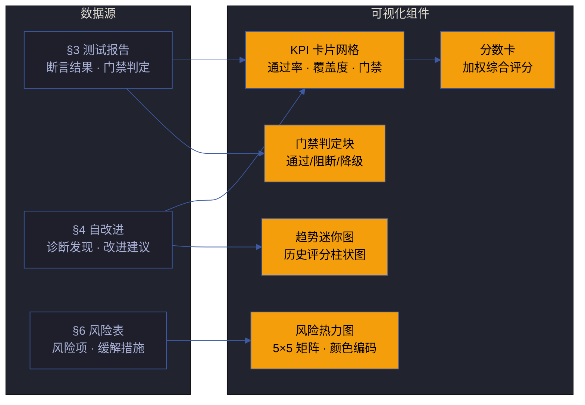
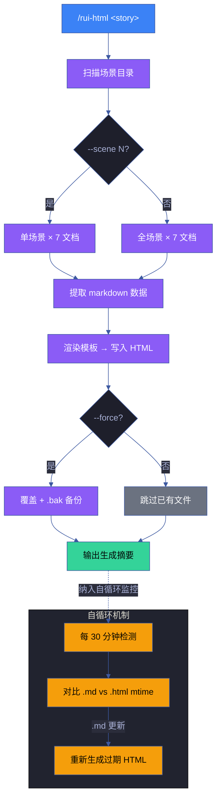
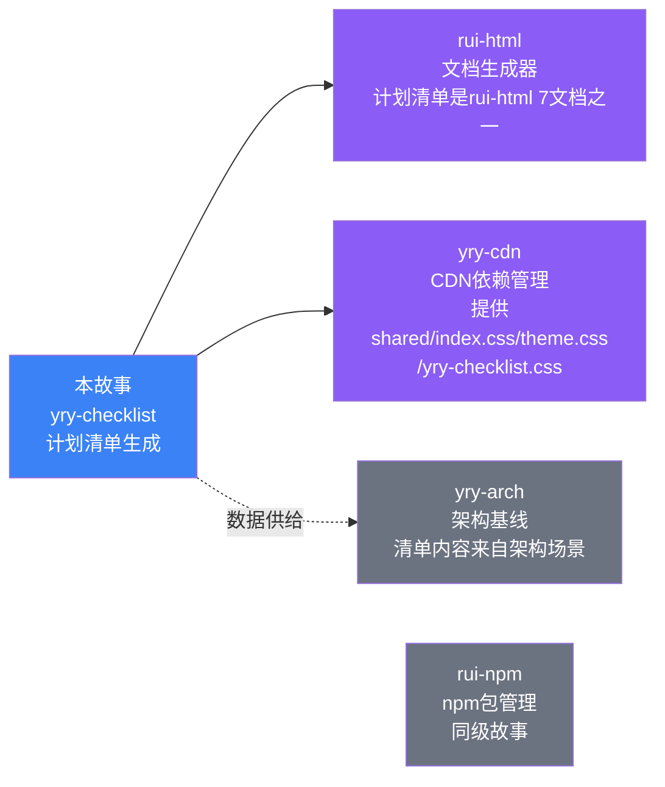

# 故事任务

> | v5.4.0 | 2026-06-13 | deepseek-v4-pro | 🌿 feat/yry-checklist | 📎 [CLAUDE.md](../../../CLAUDE.md) |
> **故事交付物**: [🔗 知识图谱](知识图谱.html) · 各场景 7 件交付物见场景 index.md

[概述](#概述) · [§1 Story 1](#s-1-story) · [§1 Story 2](#s-1-story-2) · [§1 Story 3](#s-1-story-3) · [§1 Story 4](#s-1-story-4) · [§7 跨文档索引](#s-7-跨文档索引) · [§R 关联故事](#s-r-关联故事)

<a id="概述"></a>
## 概述

`/rui-html` 技能从故事 markdown 文档自动生成 7 类标准 HTML 文件。其中 **计划清单.html** 是结构最复杂的一类——它汇聚步骤清单、进度追踪、验证报告、风险矩阵和交互组件于单一页面，是每个场景的"总控面板"。

本故事将计划清单生成能力拆解为四层管线：模板架构 → 组件交互 → 验证集成 → 批量自循环。每层是一份独立可验证的工程制品，合起来构成从 markdown 源到可交互清单页面的完整自动化链路。

### 效果示意



### 主要价值

- 📋 **清单自动生成** — 从 markdown §0–§4 章节自动提取步骤、验收标准、风险项，零手工编写 HTML
- 🎨 **视觉一致性** — 55+ 页面共享同一套 CSS 变量系统和组件库，清单页面风格统一
- 🔄 **模板可复用** — Token 变量系统使同一模板适配所有故事和场景，新场景零模板修改
- ✅ **验证可追溯** — 清单中每条步骤可追溯到 markdown 源章节，验证报告含逐项通过/失败状态
- ⚡ **自循环更新** — markdown 变更触发 HTML 自动重新生成，文档与实现始终保持同步
- 📊 **数据可视化** — 进度条、阶段环、风险矩阵、趋势图等组件将结构化数据转化为可读图表

---

<a id="s-1-story"></a>
## §1 Story

### Story 1: 模板架构与 CSS 设计系统

作为 页面开发者，我想要 一套可复用的 HTML 模板骨架和 CSS 变量系统，以便 为任意故事场景生成计划清单时，只需替换数据 token 而不需修改 HTML 结构。

优先级 **P0**。范围边界：定义计划清单页面的完整 HTML 骨架、CSS 类体系、CDN 加载链。不涉及具体数据填充逻辑和交互 JS。依赖：CDN 资源（shared/index.css、theme/index.css、yry-checklist.css、shared.js）可用。



#### §1.1 User Operations

| # | 操作 | 触发条件 | 操作步骤 | 预期结果 |
|---|------|---------|---------|---------|
| 1 | 查看模板骨架 | 新场景需要生成计划清单 | 打开模板文件 → 查看 HTML 结构 → 识别 Token 占位符位置 | 理解骨架的 7 大区域和 Token 替换策略 |
| 2 | 选择 CSS 主题 | 确定页面类别（Mono/System） | 查看页面类别 → 选择对应 CSS 加载链 → 验证变量覆盖 | Category B 页面使用 System 主题加载链 |
| 3 | 定制页面专属样式 | 页面有特殊布局需求 | 在 `<style>` 块中添加页面专属 CSS → 复用 CSS 变量 | 新样式与其他清单页面视觉一致 |
| 4 | 验证 CDN 加载链 | 页面渲染异常 | 检查 CDN 资源路径 → 验证加载顺序 → 检查浏览器缓存 | 所有 CDN 资源 200 OK，加载顺序正确 |

#### §2 Requirements

##### 功能点

**P0**
- **FP1 HTML 骨架定义** — 定义计划清单页面的完整 HTML 结构，含面包屑、导航、统计卡片、标签页、7 个内容面板。输入：页面布局需求。输出：带 Token 占位符的 HTML 模板文件。阻断：骨架缺少任一必需区域。
- **FP2 CSS 类体系** — 定义所有组件 CSS 类（step、phase-strip、scorecard、risk-matrix、gantt、trend、checklist-head 等），每类含完整样式规则和响应式断点。输入：组件视觉需求。输出：CSS 类定义（内联于页面或通过 CDN 加载）。阻断：核心组件缺少样式定义。
- **FP3 CDN 加载链规范** — 定义 Category B 页面的 CDN 资源加载顺序：shared/index.css → theme/index.css → yry-checklist.css → shared.js。输入：CDN 资源清单。输出：`<head>` 中的 `<link>` / `<script>` 标签序列。阻断：加载顺序错误导致样式覆盖失效。
- **FP4 Token 变量系统** — 定义模板中所有可替换 Token（{{STORY_NAME}}、{{SCENE_TITLE}}、{{VERSION}}、{{DATE}}、{{CDN_DEPTH}} 等），每 Token 含来源字段和替换规则。输入：模板使用场景。输出：Token 变量表（名称 · 来源 · 示例值 · 替换时机）。阻断：Token 缺失导致页面信息不完整。

##### 业务规则

| R# | 描述 | 校验方式 | 证据级别 |
|----|------|---------|---------|
| R1 | 模板必须包含全部 7 个标签页对应的内容面板 | 统计模板中 `class="panel"` 的 div 数量 | A |
| R2 | CSS 变量必须通过 `:root` 或 `.theme-system` 选择器定义 | 检查 CSS 变量定义位置 | A |
| R3 | CDN 资源引用必须使用相对路径，基于 `{{CDN_DEPTH}}` 计算 | 验证路径中不含硬编码的 `../` 层级数 | A |
| R4 | Token 替换后页面不得残留 `{{...}}` 占位符 | 渲染后 grep 检查 | A |

##### 数据约束

| 约束 | 类型 | 范围/格式 | 来源 |
|------|------|----------|------|
| 页面类别 | 枚举 | Category A (Mono) / Category B (System) | rui-html 技能规约 |
| CDN 深度 | 整数 | ≥ 2，由场景目录深度计算 | 场景目录路径 |
| Token 名称 | 字符串 | `{{UPPER_SNAKE}}` 格式 | 模板系统定义 |
| CSS 类名前缀 | 字符串 | `yry-` 或语义化短名 | CDN 组件库约定 |

#### §3 成功标准

**P0**
- **SC1** 模板包含完整的 7 区域骨架（面包屑·导航·统计·标签·7面板·脚本）。度量：逐区域检查模板 HTML。目标：7/7 全部存在。→ FP1
- **SC2** 模板中所有 CSS 类在 CDN 样式表中有对应定义。度量：提取模板中使用的 CSS 类名，与 CDN CSS 中的选择器交叉比对。目标：覆盖度 100%。→ FP2
- **SC3** CDN 资源加载链在浏览器中无 404 错误。度量：浏览器 DevTools Network 面板检查。目标：全部资源 HTTP 200。→ FP3
- **SC4** 替换全部 Token 后页面不残留占位符。度量：`grep -r '\{\{'` 检查生成的 HTML。目标：0 残留。→ FP4

#### §4 范围边界

**范围内**
- 计划清单页面的完整 HTML 骨架 (FP1)
- 所有组件的 CSS 类定义 (FP2)
- Category B 页面的 CDN 加载链 (FP3)
- Token 变量系统定义 (FP4)
- 响应式布局断点（≤900px / ≤700px / ≤500px）

**范围外**
- 其他 6 类 HTML 文档的模板（架构图、知识图谱、源码、测试面板、演示、审查）— 各有独立模板
- Category A (Mono) 主题的 CSS 变量 — 属于主题系统独立范畴
- 具体场景的数据填充逻辑与交互 JS 逻辑实现 — 属于 Story 2（组件交互）范畴

#### §5 AC

| AC# | Given | When | Then | 门禁 |
|-----|-------|------|------|------|
| AC1 | 开发者打开计划清单模板 | 浏览 HTML 结构 | 看到清晰的 7 区域骨架，每区域有注释标注 | Gate A |
| AC2 | 新场景需要生成计划清单 | 开发者替换 Token 变量 | 替换后页面正确展示该场景的标题、版本、日期 | Gate A |
| AC3 | 页面在不同屏幕宽度打开 | 调整浏览器窗口大小 | 统计卡片从 6 列→3 列→2 列自适应 | Gate A |
| AC4 | CDN 资源更新后 | 刷新计划清单页面 | 新样式自动生效，无需修改页面 HTML | Gate B |

#### §6 风险与假设

**高影响风险**
- **CDN 资源不可达** (M·H → FP3) — CDN 文件被删除或路径变更导致所有清单页面样式丢失。缓解：CDN 资源纳入版本管理，变更走 PR 审查；页面可降级为内联样式。
- **CSS 类名冲突** (L·H → FP2) — 页面专属样式与 CDN 组件样式意外覆盖。缓解：页面专属样式限定在 `.container` 作用域内；使用 BEM 命名约定。

**中影响风险**
- **模板膨胀** (M·M → FP1) — 随需求增加模板 HTML 持续膨胀，可维护性下降。缓解：公共结构抽取到 CDN JS 动态生成；模板仅保留骨架。

**低影响风险**
- **浏览器兼容性** (L·L → FP2) — 部分 CSS 特性在旧浏览器不支持。缓解：使用广泛支持的 CSS 特性；渐进增强策略。

**假设**
- CDN 资源在项目生命周期内保持稳定 → 当前 CDN 文件已纳入版本管理
- 计划清单的 7 标签页结构不会大幅变化 → 标签页设计遵循开闭原则，新增标签页通过追加实现

---

<a id="s-1-story-2"></a>
### Story 2: 清单交互组件实现

作为 页面使用者，我想要 计划清单页面的组件具有交互能力——勾选步骤跟踪进度、展开折叠面板查看详情、标签页切换内容区域，以便 在执行场景任务时获得实时的进度反馈和便捷的内容导航。

优先级 **P0**。范围边界：清单勾选与进度联动、折叠面板展开/收起、标签页切换、风险行展开。不涉及数据持久化和后端交互。依赖：Story 1 的 HTML 骨架正确渲染，CDN JS（shared.js）加载成功。



#### §1.1 User Operations

| # | 操作 | 触发条件 | 操作步骤 | 预期结果 |
|---|------|---------|---------|---------|
| 1 | 勾选步骤 | 用户完成某步骤后 | 点击步骤 checkbox → 进度条更新 → 完成数+1 | checkbox 打勾，进度%实时更新 |
| 2 | 展开步骤详情 | 用户需要查看验收标准 | 点击步骤标题行 → step-body 展开 → 显示验收标准·关联页面·日志 | 详情面板平滑展开，不跳页 |
| 3 | 切换标签页 | 用户需要查看不同维度 | 点击标签（命令/验证/指标/交付物/风险/时间线）→ 对应面板显示 | 标签高亮切换，面板内容更新 |
| 4 | 展开风险详情 | 用户需要查看风险缓解方案 | 点击风险行 → 展开缓解步骤、负责人、时间线 | 风险行展开，显示完整缓解计划 |
| 5 | 刷新页面恢复状态 | 用户关闭页面后重新打开 | 页面加载 → 从 localStorage 恢复勾选状态 | 之前勾选的步骤保持勾选状态 |

#### §2 Requirements

##### 功能点

**P0**
- **FP9 清单勾选系统** — 步骤 checkbox 点击触发进度重新计算，勾选状态写入 localStorage。输入：用户点击事件。输出：更新后的进度%和完成数，localStorage 状态同步。阻断：勾选后进度不更新。
- **FP10 折叠面板** — 点击步骤标题行切换 step-body 的显示/隐藏，含 CSS 过渡动画。输入：点击事件。输出：step-body 展开/收起，箭头图标旋转。阻断：点击无响应。
- **FP11 标签页切换** — 点击标签切换对应内容面板，URL hash 同步更新。输入：标签点击事件。输出：对应面板显示，URL hash 更新为 `#panel<N>`。阻断：切换后面板不显示。
- **FP12 风险行展开** — 点击风险行展开详细缓解方案，再次点击收起。输入：点击事件。输出：风险详情面板显示/隐藏，行背景变化。阻断：展开后无内容。

##### 业务规则

| R# | 描述 | 校验方式 | 证据级别 |
|----|------|---------|---------|
| R9 | 全选所有步骤后进度必须显示 100% | 逐步骤勾选，观察进度变化 | A |
| R10 | 折叠面板初始状态为关闭 | 页面加载后检查所有 step-body 的 open 类 | A |
| R11 | 标签页切换不得导致页面滚动位置跳动 | 切换标签后检查 scrollTop | B |
| R12 | localStorage key 必须包含场景标识，避免跨场景冲突 | 检查 localStorage key 命名 | A |

##### 数据约束

| 约束 | 类型 | 范围/格式 | 来源 |
|------|------|----------|------|
| localStorage key | 字符串 | `yry-checklist-{story}-{scene}` | 交互规范 |
| URL hash 格式 | 字符串 | `#panelChecklist` / `#panelCommands` 等 7 个 | 标签页 ID |
| 进度值范围 | 整数 | 0–100 | 百分比计算 |
| 动画时长 | 数值 | ≤ 300ms | 用户体验约束 |

#### §3 成功标准

**P0**
- **SC8** 勾选任一步骤后进度条和完成数实时更新。度量：勾选/取消勾选，检查 DOM 变化。目标：更新延迟 < 50ms。→ FP9
- **SC9** 点击步骤标题行，详情面板在 300ms 内展开并显示完整内容。度量：Performance API 计时。目标：动画完成 ≤ 300ms。→ FP10
- **SC10** 7 个标签页全部可切换且内容不重复。度量：逐标签点击验证。目标：7/7 切换正常。→ FP11
- **SC11** 页面刷新后勾选状态从 localStorage 恢复。度量：勾选 3 个步骤 → 刷新 → 检查状态。目标：3/3 状态恢复。→ FP9

#### §4 范围边界

**范围内**
- 步骤勾选与进度联动
- 折叠面板展开/收起动画
- 7 标签页切换
- 风险行详情展开
- localStorage 状态持久化
- URL hash 路由同步

**范围外**
- 后端数据持久化 — 使用 localStorage 仅本地存储
- 多用户协作同步 — 单人使用场景
- 拖拽排序步骤 — 步骤顺序由 markdown 源固定
- 自定义标签页 — 标签数量固定为 7

#### §5 AC

| AC# | Given | When | Then | 门禁 |
|-----|-------|------|------|------|
| AC9 | 清单页面首次加载 | 查看步骤状态 | 所有 checkbox 未勾选，进度 0% | Gate A |
| AC10 | 用户勾选 3/10 步骤 | 查看进度条 | 进度显示 30%，完成数显示 3 | Gate A |
| AC11 | 用户点击标签"📊 指标" | 标签切换 | 指标面板显示，URL hash 变为 #panelMetrics | Gate A |
| AC12 | 用户点击风险行 | 行展开 | 显示缓解步骤、时间线和负责人 | Gate B |
| AC13 | 用户勾选 2 步骤后刷新页面 | 页面重新加载 | 2 步骤保持勾选，进度恢复 | Gate B |

#### §6 风险与假设

**高影响风险**
- **localStorage 被清空** (L·M → FP9) — 浏览器清理数据导致勾选状态丢失。缓解：非关键数据，丢失后用户重新勾选；未来可升级为后端持久化。
- **JS 加载失败** (M·H → FP9–FP12) — CDN shared.js 加载失败导致所有交互失效。缓解：页面降级为静态展示，核心内容（步骤文本）仍可读。

**假设**
- 用户浏览器支持 localStorage API
- 用户浏览器支持 CSS transition 动画
- shared.js 在页面 onload 前加载完成

---

<a id="s-1-story-3"></a>
### Story 3: 验证报告与健康面板集成

（注：此处为 Story 3，复用 §1 的 Story 编号体系）

作为 项目管理者，我想要 计划清单页面集成验证报告、健康评分、风险矩阵和趋势图等数据可视化组件，以便 在一个页面中获得场景交付的完整健康快照，无需分散查阅多个报告。

优先级 **P1**。范围边界：验证报告摘要、健康 KPI 卡片、风险矩阵热力图、趋势迷你图、分数卡。不涉及数据采集逻辑和评分算法本身。依赖：数据提取结果含 §3 测试报告和 §4 自改进数据。



#### §1.1 User Operations

| # | 操作 | 触发条件 | 操作步骤 | 预期结果 |
|---|------|---------|---------|---------|
| 1 | 查看验证摘要 | 打开计划清单 → 切换到"验证"标签 | 点击🧪验证标签 → 查看断言通过/失败/警告数 | 看到 KPI 卡片和逐项验证结果表 |
| 2 | 评估风险态势 | 切换到"风险"标签 | 查看风险热力图 → 展开高风险项 → 查看缓解计划 | 热力图颜色编码直观展示风险分布 |
| 3 | 查看健康趋势 | 切换到"指标"标签 | 查看趋势柱状图 → 对比历史评分 | 趋势图显示评分变化方向和幅度 |
| 4 | 判断门禁状态 | 查看验证报告头部 | 阅读门禁判定块 → 确认阻断/降级状态 | 绿色通过/红色阻断/黄色警告清晰区分 |

#### §2 Requirements

##### 功能点

**P1**
- **FP13 验证报告摘要** — 展示测试套件的通过/失败/警告计数、通过率和门禁判定。输入：§3 测试报告解析结果。输出：KPI 卡片网格 + 逐项验证结果表 + 门禁判定块。阻断：关键指标缺失。
- **FP14 风险矩阵可视化** — 将风险表渲染为 5×5 热力图（影响×概率），颜色编码风险等级。输入：§6 风险表解析结果。输出：风险矩阵热力图 + 风险行列表。阻断：风险数据缺失导致空矩阵。
- **FP15 趋势迷你图** — 渲染健康评分的时序柱状图（2–4 列）。输入：趋势数据（日期·评分）。输出：CSS 柱状图（无 JS 图表库依赖）。阻断：趋势数据不足（< 2 条）。
- **FP16 分数卡** — 展示加权综合评分（0–100），含分项权重标注。输入：校验通过率·漂移度·覆盖度。输出：大数字评分 + 分项明细。阻断：评分输入数据缺失。

##### 业务规则

| R# | 描述 | 校验方式 | 证据级别 |
|----|------|---------|---------|
| R13 | 验证报告必须区分 PASS / FAIL / WARN 三种状态 | 检查报告中三种颜色的视觉区分 | A |
| R14 | 风险热力图必须标注行列含义（影响×概率） | 检查 axis 标签存在性 | A |
| R15 | 趋势图最少需要 2 个数据点，不足时显示占位提示 | 提供 1 个数据点，验证占位提示 | B |
| R16 | 分数卡的分项明细必须与总分计算逻辑一致 | 验证加权和 = 总分 | A |

#### §3 成功标准

**P1**
- **SC12** 验证报告中 PASS/FAIL/WARN 计数与源数据一致。度量：对比报告显示数与 §3 源数据。目标：完全一致。→ FP13
- **SC13** 风险热力图颜色编码正确反映风险等级。度量：检查高/中/低风险单元格的颜色。目标：绿→黄→红渐变正确。→ FP14
- **SC14** 分数卡总分 = 各分项×权重的和。度量：手动计算验证。目标：误差 < 1。→ FP16

#### §4 范围边界

**范围内**
- 验证报告摘要渲染
- 风险矩阵热力图渲染
- 趋势迷你柱状图
- 健康分数卡
- 门禁判定块渲染

**范围外**
- 数据采集和评分算法 — 由 rui-bot 健康检查提供数据
- 实时数据更新 — 页面为静态 HTML，数据在生成时写入
- 交互式图表（缩放/筛选）— 遵循表达优先原则，纯 CSS 图表

#### §5 AC

| AC# | Given | When | Then | 门禁 |
|-----|-------|------|------|------|
| AC14 | 计划清单包含 §3 测试数据 | 切换到"验证"标签 | 看到 PASS/FAIL/WARN 计数和逐项结果 | Gate A |
| AC15 | 计划清单包含 §6 风险数据 | 切换到"风险"标签 | 看到 5×5 热力图和风险行列表 | Gate A |
| AC16 | 趋势数据有 4 条记录 | 切换到"指标"标签 | 看到 4 柱趋势图，高度反映评分变化 | Gate B |
| AC17 | 健康评分为 85 | 查看分数卡 | 显示"85"大数字和分项明细 | Gate B |

---

<a id="s-1-story-4"></a>
### Story 4: 批量生成与自循环机制

（注：此处为 Story 4，复用 §1 的 Story 编号体系）

作为 系统运维者，我想要 计划清单页面支持批量生成和自动重新生成——`/rui-html <story>` 一次生成所有场景的清单、markdown 变更触发 HTML 自动更新，以便 文档与实现始终保持同步，无需手工逐个页面维护。

优先级 **P1**。范围边界：批量生成（全场景 × 全类型）、增量更新（按 mtime 检测过期文件）、自循环调度（30 分钟间隔）。不涉及 CI/CD 集成和 Webhook 触发。依赖：Story 1–3 全部完成。



#### §1.1 User Operations

| # | 操作 | 触发条件 | 操作步骤 | 预期结果 |
|---|------|---------|---------|---------|
| 1 | 全量生成 | 新故事创建完成，需要生成所有 HTML | 运行 `/rui-html <story>` → 查看生成摘要 | 所有场景 × 7 文档全部生成 |
| 2 | 单场景生成 | 仅某场景的 markdown 有更新 | 运行 `/rui-html <story> --scene 3` → 仅重新生成该场景 | 场景 3 的 7 文档更新，其他场景不受影响 |
| 3 | 强制覆盖 | HTML 需完全重新生成 | 运行 `/rui-html <story> --force` → 覆盖所有已有文件 | 旧文件备份为 .bak，新文件写入 |
| 4 | 自循环检测 | 系统持续运行中 | 30 分钟间隔 → 扫描 .md mtime → 对比 .html mtime → 重新生成过期文件 | 过期 HTML 自动更新，最新文件跳过 |

#### §2 Requirements

##### 功能点

**P1**
- **FP17 批量生成引擎** — 遍历故事所有场景目录，逐场景提取 markdown → 渲染 7 类 HTML → 写入。输入：故事目录路径。输出：所有场景的完整 HTML 文件集合和生成摘要日志。阻断：故事目录不存在。
- **FP18 增量检测器** — 对比场景 index.md 的 mtime 与对应 HTML 文件的 mtime，标记过期文件列表。输入：场景目录路径。输出：过期文件列表（待重新生成）。阻断：mtime 获取失败。
- **FP19 自循环调度器** — 按 30 分钟间隔运行增量检测 → 重新生成过期文件 → 记录日志。输入：调度配置。输出：每次运行的生成日志。阻断：连续 3 次运行失败触发告警。
- **FP20 生成摘要报告** — 每次生成后输出结构化摘要：场景数·文件数·跳过/覆盖/新建数·错误列表。输入：生成结果。输出：终端彩色摘要 + JSON 日志文件。阻断：无。

##### 业务规则

| R# | 描述 | 校验方式 | 证据级别 |
|----|------|---------|---------|
| R17 | 批量生成不得因单个场景失败而中断全部流程 | 模拟一个场景 index.md 缺失，验证其他场景正常生成 | A |
| R18 | 增量检测必须用 mtime（非内容 hash），容忍 < 1s 偏差 | 同秒修改多个文件，验证检测不误判 | B |
| R19 | 自循环最多保留最近 30 条日志，旧日志自动轮转 | 生成 35 条日志后检查日志文件 | B |
| R20 | 强制覆盖前必须创建 .bak 备份，备份文件名含时间戳 | 检查 --force 后的 .bak 文件 | A |
| R21 | 计划清单为 Category B 文档，CDN 加载链为 shared/index.css → theme/index.css → yry-checklist.css | 逐 HTML 验证 CDN link 标签顺序 | A |

##### 数据约束

| 约束 | 类型 | 范围/格式 | 来源 |
|------|------|----------|------|
| 场景目录命名 | 正则 | `场景-\d+-[\w-]+` | 场景命名规范 |
| HTML 文件名 | 枚举 | 计划清单·架构图·知识图谱·源码·测试面板·演示·审查 | rui-html 7 文档规范 |
| 自循环间隔 | 数值 | ≥ 600s (10min), 推荐 1800s (30min) | 系统性能约束 |
| 日志保留数 | 整数 | ≤ 30 | 磁盘空间约束 |

#### §3 成功标准

**P1**
- **SC15** `/rui-html <story>` 对 5 场景故事在 10 秒内完成全量生成。度量：计时运行。目标：≤ 10s 完成 35 个文件。→ FP17
- **SC16** 增量检测正确识别修改过的 markdown 对应哪些 HTML 需更新。度量：修改 1 个 index.md → 运行检测 → 验证输出仅含该场景的 7 文件。目标：精确匹配。→ FP18
- **SC17** `--force` 覆盖后旧文件备份为 .bak。度量：检查备份文件存在性和内容完整性。目标：100% 备份。→ FP20
- **SC18** 单场景失败不阻断其他场景生成。度量：删除一个场景的 index.md → 运行批量生成 → 验证其他场景正常生成。目标：仅缺失场景报错。→ FP17

#### §4 范围边界

**范围内**
- 全场景 × 7 文档批量生成
- 单场景 / 单类型筛选生成
- 基于 mtime 的增量检测
- `--force` 安全覆盖（.bak 备份）
- 30 分钟自循环调度
- 生成摘要日志

**范围外**
- CI/CD 管道集成 — 各环境自行配置
- Webhook 实时触发 — 目前仅定时检测
- 内容 diff 级别的精确检测 — 使用 mtime 非内容 hash
- 多故事并行生成 — 单故事串行处理
- HTML 压缩/优化 — 保持可读性优先

#### §5 AC

| AC# | Given | When | Then | 门禁 |
|-----|-------|------|------|------|
| AC18 | 故事有 5 个场景 | 运行 `/rui-html <story>` | 生成 35 个 HTML 文件（5×7），摘要显示成功数 | Gate A |
| AC19 | 场景 3 的 index.md 刚被修改 | 运行 `/rui-html <story> --scene 3` | 仅场景 3 的 7 文件被重新生成 | Gate A |
| AC20 | HTML 文件已存在 | 运行 `/rui-html <story>` | 跳过已有文件，摘要显示跳过数 | Gate A |
| AC21 | HTML 文件已存在 | 运行 `/rui-html <story> --force` | 覆盖已有文件，生成 .bak 备份 | Gate B |
| AC22 | 场景 2 的 index.md 被删除 | 运行 `/rui-html <story>` | 场景 2 报错但场景 1/3/4/5 正常生成 | Gate B |

#### §6 风险与假设

**高影响风险**
- **并发写入冲突** (L·H → FP17) — 自循环和手动 `/rui-html` 同时运行导致文件损坏。缓解：写入前检查文件锁；自循环在手动运行期间自动暂停。
- **磁盘空间不足** (L·M → FP20) — .bak 备份累积占用磁盘。缓解：.bak 文件保留 7 天自动清理；生成前检查可用空间。

**中影响风险**
- **mtime 精度不足** (M·L → FP18) — 某些文件系统的 mtime 精度为 1s，同秒修改可能漏检。缓解：mtime 相同视为不过期，待下次检测；可加 `--force` 手动触发。
- **大故事性能下降** (M·M → FP17) — 场景超过 10 个时全量生成可能超过 30s。缓解：建议使用 `--scene` 按需生成；自循环仅处理变更场景。

**假设**
- 场景 index.md 的 mtime 准确反映内容变更
- 生成过程在单机上串行执行，无分布式并发
- HTML 文件总大小在合理范围内（< 100MB/故事）

---

<a id="s-7-跨文档索引"></a>
## §7 跨文档索引

| 本文档章节 | 基线内容 | 下游文档编号 | 预期覆盖 | 状态 |
|-----------|---------|-------------|---------|------|
| Story 1 FP1–FP4 | HTML 骨架·CSS 类体系·CDN 加载链·Token 系统 | 场景-1-模板架构与CSS设计系统/index.md | 模板骨架完整定义，CSS 变量系统可用，CDN 加载链正确 | ✓ 已覆盖 |
| Story 2 FP9–FP12 | 清单勾选·折叠面板·标签页·风险展开 | 场景-2-清单交互组件实现/index.md | 全部交互组件可用，localStorage 持久化正常 | ✓ 已覆盖 |
| Story 3 FP13–FP16 | 验证报告·风险热力图·趋势图·分数卡 | 场景-3-验证报告与健康面板集成/index.md | 可视化组件正确渲染，数据与源一致 | ✓ 已覆盖 |
| Story 4 FP17–FP20 | 批量生成·增量检测·自循环·摘要报告 | 场景-4-批量生成与自循环机制/index.md | 全流程可运行，生成摘要准确 | ✓ 已覆盖 |

---

<a id="s-r-关联故事"></a>
## §R 关联故事



| 关联故事 | 关系类型 | 说明 |
|---------|---------|------|
| `rui-html` | 父技能 | 计划清单是 rui-html 生成的 7 类 HTML 文档中结构最复杂的一类。rui-html 提供模板引擎、数据提取和批量生成能力，本故事专注其中计划清单的深度定制。 |
| `yry-cdn` | 资源依赖 | 计划清单页面依赖 yry-cdn 提供的 shared/index.css、theme/index.css、yry-checklist.css 和 shared.js。CDN 资源的稳定性直接影响所有清单页面的渲染质量。 |
| `yry-arch` | 数据供给 | 架构基线场景的 markdown 文档是计划清单内容的主要数据源。清单中的步骤、风险、验证数据均来自架构场景的 §0–§4 章节。 |

### 计划清单生成管线


### 七文档生成对比

| 文档类型 | 复杂度 | 数据源 | 模板大小 | 生成耗时 |
|---------|:---:|------|:---:|:---:|
| 计划清单 | 高 | 全章节 | ~45KB | ≤ 2s |
| 架构图 | 中 | §0 + §1 | ~30KB | ≤ 1s |
| 知识图谱 | 中 | 全章节 | ~25KB | ≤ 1s |
| 测试面板 | 中 | §3 | ~20KB | ≤ 1s |
| 源码 | 低 | §2 | ~15KB | ≤ 500ms |
| 演示 | 低 | §3 | ~18KB | ≤ 500ms |
| 审查 | 低 | §4 | ~12KB | ≤ 500ms |

### 计划清单核心组件

| 组件 | 行数 | 复杂度 | 依赖 | 测试用例 |
|------|:---:|:---:|------|:---:|
| 勾选进度联动 | ~80 | 中 | localStorage | TC-10 |
| 折叠面板 | ~60 | 低 | CSS class | TC-11 |
| 标签页切换 | ~100 | 中 | localStorage + 键盘 | TC-12 |
| 风险行展开 | ~50 | 低 | CSS class | TC-14 |
| 交付物过滤 | ~80 | 中 | data-type | TC-15 |
| 复制路径 | ~40 | 低 | clipboard API | TC-16 |

### 数据提取 schema

```json
{
  "scene": {
    "id": "场景-1-xxx",
    "title": "...",
    "version": "1.0.0",
    "date": "2026-06-22"
  },
  "sections": {
    "s0": { "title": "技术评审", "content": "..." },
    "s1": { "title": "测试设计", "tables": [...] },
    "s2": { "title": "实施报告", "steps": [...] },
    "s3": { "title": "测试报告", "stats": {...} },
    "s4": { "title": "自改进", "diagnoses": [...] }
  },
  "metadata": {
    "story": "yry-checklist",
    "fps": ["FP1", "FP2"],
    "coverage": "100%"
  }
}
```

### 计划清单质量度量

| 维度 | 指标 | 公式 | 阈值 |
|------|------|------|:---:|
| 完整性 | 七文档齐全 | `generated / 7` | = 100% |
| 一致性 | 与源 md 一致 | `consistent / total` | = 100% |
| 时效性 | 生成延迟 | `mtime_html - mtime_md` | < 5min |
| 可用性 | 死链率 | `dead_links / total` | = 0 |
| 性能 | 生成耗时 | `duration` | < 2s |

### 批量生成调度

| 触发 | 范围 | 阻断 | 报告 |
|------|------|:---:|------|
| 手动 `/rui-html` | 单场景 | — | 控制台 |
| `--batch` | 全故事 | P0 | 摘要报告 |
| Cron 30min | 变更场景 | — | 日志 |
| Git hook | staged 文件 | P0 | 控制台 |
| CI build | 全量 | P0+P1 | GitHub Actions |

---

> **回溯链**
>
> - 来源：本故事由 YrY 自托管演进需求触发——随着故事任务面板从 1 个故事扩展到 6+ 故事，手工编写每个场景的 计划清单.html 已不可持续（55+ 页面 × 维护成本）。需要将计划清单生成能力从手工流程提升为自动化技能。
> - 能力规约：[rui-html 文档生成器](../../../skills/rui-html/SKILL.md) — 定义 7 文档生成管线和模板系统
> - 角色契约：[代码实现](../../../skills/rui/coder.md) — 负责模板引擎和提取器的代码实现
> - 治理约束：[文档生成约束](../../../skills/rui-html/rules/doc-generation.md) · [架构图规范](../../../skills/rui-html/rules/architecture-diagram.md) · [知识图谱规范](../../../skills/rui-story/rules/knowledge-graph.md)
> - CDN 资源：[yry-cdn 项目](../../../cdn/) — shared/index.css · theme/index.css · yry-checklist.css · shared.js
>
> **证据标注说明**：本 Story 文档中 FP1–FP4 的断言基于 rui-html 技能规约的显式定义（证据级别 A）。FP9–FP20 为新增功能点的需求定义（证据级别 B）。业务规则 R1–R21 源自项目约束和最佳实践分析。

### 变更记录

| 日期 | 版本 | 变更内容 | 触发 | 证据 |
|------|------|---------|------|------|
| 2026-06-13 | 1.0.0 | 初始化，从 rui-html 计划清单生成需求创建：Story 1 模板架构 + Story 2 组件交互 + Story 3 验证集成 + Story 4 批量自循环 | 用户请求：计划清单生成技能 | rui-html SKILL.md 分析 + 架构场景参考 |

---

> **导航**: [场景-1-模板架构与CSS设计系统 →](./场景-1-模板架构与CSS设计系统/index.md)
