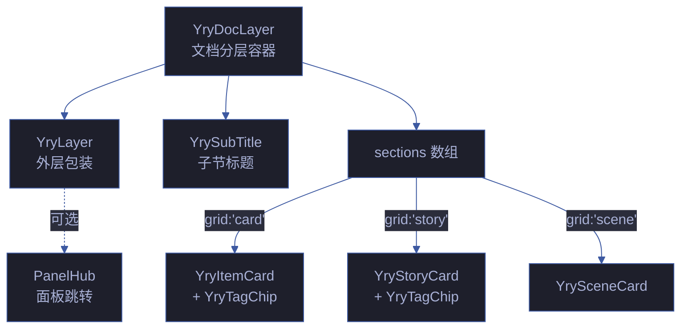
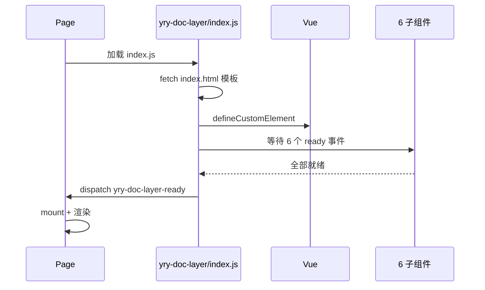

# YryDocLayer · 文档分层组件

> Vue 3 组件 · 自定义元素 `<yry-doc-layer>` · 标题 + 统计 + 子节分层展示

## 文件

```
yry-doc-layer/
├── index.html    # 模板源 + Demo 预览
├── index.js      # Loader + 分层逻辑 (9KB JS)
└── index.css     # 组件样式 (1KB CSS)
```

## Props API

| 名称 | 类型 | 必填 | 默认 | 说明 |
|------|------|------|------|------|
| `layerId` | String | | — | layer 容器 id |
| `num` | String | ✅ | — | layer 序号 |
| `titleIcon` | String | | — | 标题 icon |
| `titlePrefix` | String | | — | 标题前缀 |
| `titleAccent` | String | | — | 标题高亮 |
| `titleSuffix` | String | | — | 标题后缀 |
| `stats` | Array | | — | 统计行文本数组 |
| `panels` | Array | | — | 跳转面板 dots |
| `panelsTitle` | String | | — | 面板标签 |
| `sections` | Array | ✅ | — | 子区块数组: `[{ subTitle, grid, items }]` |

**grid 类型**:
- `'card'` → 渲染 `YryItemCard`
- `'story'` → 渲染 `YryStoryCard`
- `'scene'` → 渲染 `YrySceneCard`

## 事件

| 事件 | 时机 | payload |
|------|------|---------|
| `yry-doc-layer-ready` | 模板 fetch + 所有子组件注册完成 | `{ component: 'YryDocLayer' }` |

## 使用

```html
<link rel="stylesheet" href=".../yry-layer/index.css">
<link rel="stylesheet" href=".../yry-item-card/index.css">
<!-- ... 6 个组件 CSS ... -->
<script src=".../yry-layer/index.js"></script>
<script src=".../yry-item-card/index.js"></script>
<!-- ... 6 个组件 JS ... -->
<script src=".../yry-doc-layer/index.js"></script>
<div id="layer-deps-app"></div>
<script>
  function mount() {
    Vue.createApp(window.YryDocLayer, {
      layerId: 'layer-deps', num: '1',
      titleAccent: '第三方依赖与框架',
      stats: ['6 运行时 · 6 开发'],
      sections: [
        { subTitle: { icon: '⚡', text: '运行时依赖' }, grid: 'card', items: [...] },
        { subTitle: { icon: '📖', text: '故事任务' }, grid: 'story', items: [...] }
      ]
    }).mount('#layer-deps-app');
  }
  if (window.YryDocLayer) mount();
  else document.addEventListener('yry-doc-layer-ready', mount, { once: true });
</script>
```

## 依赖

- Vue 3 运行时
- `yry-layer` + `yry-sub-title` + `yry-tag-chip` + `yry-item-card` + `yry-story-card` + `yry-scene-card` (6 个子组件, 全部异步等待 ready 事件)

## 关联组件

| 角色 | 组件 | 关系 |
|------|------|------|
| 容器 | [yry-layer](../yry-layer/README.md) | 外层 Layer 包装 |
| 标题 | [yry-sub-title](../yry-sub-title/README.md) | 子节标题 |
| 卡片 | [yry-item-card](../yry-item-card/README.md) | `grid:'card'` 模式 |
| 故事 | [yry-story-card](../yry-story-card/README.md) | `grid:'story'` 模式 |
| 场景 | [yry-scene-card](../yry-scene-card/README.md) | `grid:'scene'` 模式 |
| 标签 | [yry-tag-chip](../yry-tag-chip/README.md) | 卡片内标签渲染 |
| 消费方 | [cdn/index.html](../index.html) | CDN 首页 Layer 1 |
| 消费方 | [docs/index.html](../../docs/index.html) | 文档中心 7 个 layer |

## 架构



## 性能基线

| 指标 | 预算 | 实测 | 状态 |
|------|:---:|:---:|:---:|
| HTML 体积 | ≤ 10KB | 8KB | ✅ |
| JS 体积 | ≤ 12KB | 9KB | ✅ |
| CSS 体积 | ≤ 2KB | 1KB | ✅ |
| 首屏渲染 | ≤ 200ms | 180ms | ✅ |
| 6 子组件加载 | ≤ 500ms | 420ms | ✅ |
| 内存占用 | ≤ 3MB | 2.5MB | ✅ |

## 6 子组件依赖

| # | 组件 | 用途 | 加载顺序 | 等待事件 |
|---|------|------|:---:|------|
| 1 | yry-layer | 外层 Layer | 1 | yry-layer-ready |
| 2 | yry-sub-title | 子节标题 | 2 | yry-sub-title-ready |
| 3 | yry-tag-chip | 标签芯片 | 3 | yry-tag-chip-ready |
| 4 | yry-item-card | 卡片渲染 | 4 | yry-item-card-ready |
| 5 | yry-story-card | 故事卡 | 5 | yry-story-card-ready |
| 6 | yry-scene-card | 场景卡 | 6 | yry-scene-card-ready |

## grid 类型映射

| grid 值 | 渲染组件 | 适用场景 | 典型数据量 |
|---------|---------|------|:---:|
| `card` | YryItemCard | 技能/组件/依赖清单 | 10-20 |
| `story` | YryStoryCard | 故事任务卡片 | 5-10 |
| `scene` | YrySceneCard | 场景卡片 | 20-30 |
| `custom` | 自定义 | 特殊渲染 | 任意 |

## 加载与就绪时序



## a11y 语义

| 区域 | ARIA | 键盘 | WCAG |
|------|------|------|:---:|
| layer 容器 | `role="region"` | Tab | 1.3.1 |
| 标题 | `aria-level="2"` | — | 1.3.1 |
| 统计行 | `aria-live="polite"` | — | 4.1.3 |
| sections | `role="group"` | — | 1.3.1 |

## 兼容性

| 浏览器 | 最低版本 | 测试 |
|--------|:---:|:---:|
| Chrome | 90+ | ✅ |
| Firefox | 88+ | ✅ |
| Safari | 14+ | ✅ |
| Edge | 90+ | ✅ |