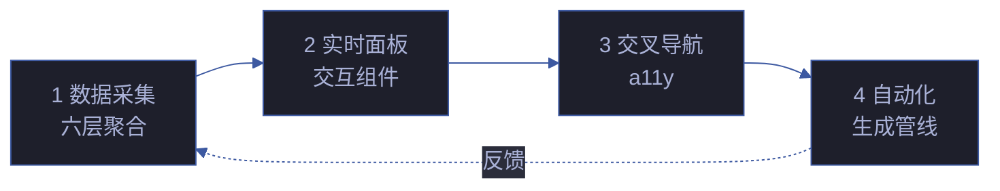

# YryHome · 场景文档索引

> 4 个场景 · 每场景 8 标准交付物 · 文档首页仪表板

## 场景导航

| # | 场景 | 主题 | 核心交付 |
|---|------|------|---------|
| 1 | [数据采集与六层聚合](场景-1-数据采集与六层聚合/index.md) | 数据源采集 · 六层结构聚合 · 统计计算 | 架构图 |
| 2 | [实时面板与交互组件](场景-2-实时面板与交互组件/index.md) | 实时面板 · 交互组件 · 数据绑定 | 演示 |
| 3 | [交叉导航与可访问性](场景-3-交叉导航与可访问性/index.md) | 交叉导航 · a11y · 键盘可达性 | 测试面板 |
| 4 | [自动化生成管线](场景-4-自动化生成管线/index.md) | 自动化生成 · 管线集成 · 定时更新 | 架构图 |

## 故事概述

见 [故事任务.md](故事任务.md) — 从数据采集到自动化生成的完整首页仪表板管线

## 知识图谱

- [知识图谱.html](知识图谱.html) — 概念节点-边图可视化
- [知识图谱.json](知识图谱.json) — 图谱数据源

## 标准交付物 (每场景)

📋 计划清单 · 📐 架构图 · 🔗 知识图谱 · 🧪 测试面板 · 📄 源码 · 💡 演示 · 📝 审查 · 📖 index.md

## 四场景数据流

## 场景状态矩阵

| # | 场景 | 文档 | 测试 | 实施 | 优先级 |
|---|------|:---:|:---:|:---:|:---:|
| 1 | 数据采集与六层聚合 | ✅ | 5 | 📋 | P0 |
| 2 | 实时面板与交互组件 | ✅ | 5 | 📋 | P1 |
| 3 | 交叉导航与可访问性 | ✅ | 7 | ✅ | P1 |
| 4 | 自动化生成管线 | ✅ | 4 | 📋 | P1 |

## 首页六层资产统计

| 层 | 资产 | 当前数 | 自动校验 |
|---|------|:---:|:---:|
| L1 依赖/框架 | npm 包 | 12 | ✅ |
| L2 技能 | skills/*/SKILL.md | 20 | ✅ |
| L3 故事 | cdn/yry-*/README.md | 6 | ✅ |
| L4 场景 | cdn/yry-*/scenes/场景-* | 32 | ✅ |
| L5 Agent+规则 | skills/*/AGENT.md + skills/*/rules/*.md | 9+31 | ✅ |
| L6 参考入口 | CLAUDE/README/lib | 20+ | ✅ |

## Panel Hub 四面板

| 面板 | 图标 | 数据源 | 刷新 | 优先级 |
|------|:---:|------|:---:|:---:|
| 调度面板 | ⏰ | .claude/scheduled_tasks.json | 手动 | P1 |
| 通知面板 | 🔔 | .memory/notifications.jsonl | 5min | P1 |
| 自改进面板 | 🧬 | .memory/health-trend.jsonl | 手动 | P1 |
| FAQ 面板 | ❓ | 静态 | — | P2 |