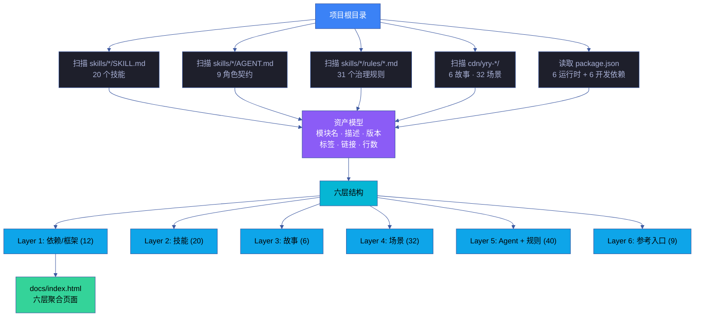
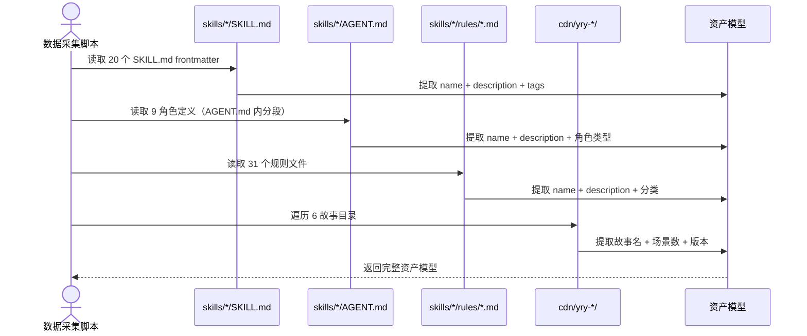
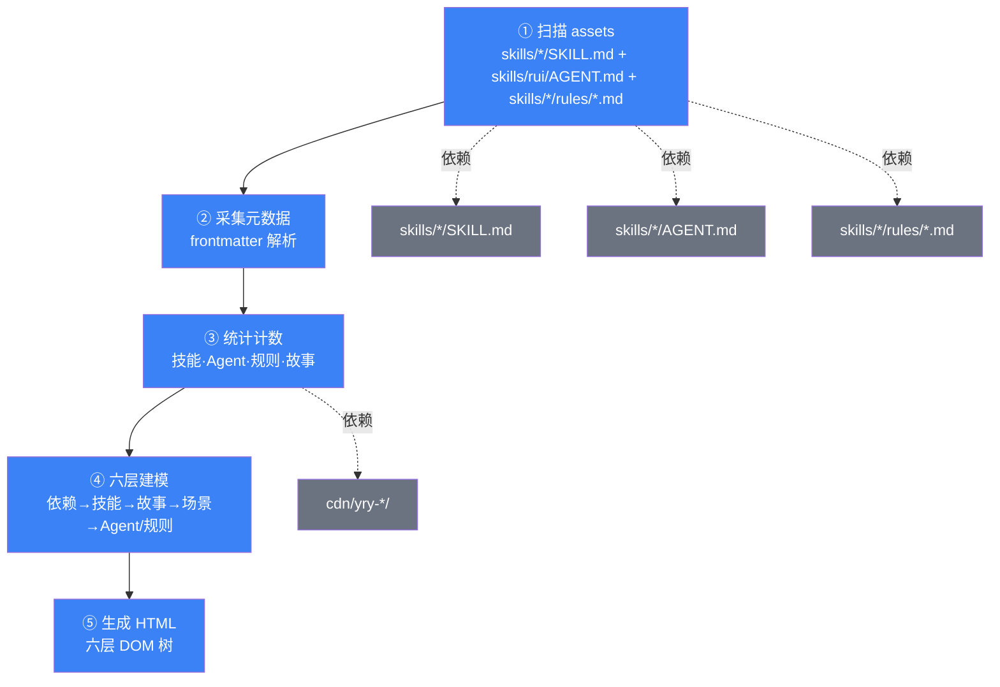

# 场景 1: 数据采集与六层聚合

> | v5.4.0 | 2026-06-22 | 深化对齐 · 补充测试矩阵与采集策略 | 🌿 feat/yry-index | 📎 [CLAUDE.md](../../../../CLAUDE.md) |
> **导航**: [← 故事任务](../故事任务.md) · [场景-2 →](../场景-2-实时面板与交互组件/index.md)
> **交付物**: [📋 清单](清单.html) · [📐 架构](架构图.html) · [🔗 图谱](知识图谱.html) · [📄 源码](源码.html) · [🧪 测试](测试面板.html) · [💡 演示](演示.html) · [📝 审查](审查.html)

[§0 技术评审](#sec0) · [§1 测试设计](#sec1) · [§2 实施报告](#sec2) · [§3 测试报告](#sec3) · [§4 自改进](#sec4)

## 概述

**角色**: 数据采集引擎 · **目标**: 遍历项目规约目录，自动采集全部资产——技能、故事、场景、Agent、规则、依赖——提取元数据并统计数据，为六层页面结构提供数据支撑 · **优先级**: P0

### 主要价值

- 📊 **自动计数** — 技能数、场景数、Agent 数、规则数由脚本自动采集，消除人工统计的不一致
- 🗂️ **元数据编目** — 每个模块的信息卡（名称、描述、版本、标签）从规约 frontmatter 自动提取
- 🔍 **可验证** — 每个统计数据都可追溯到具体的 `ls` / `grep -c` 命令，证据等级 A
- 🏗️ **六层建模** — 依赖→技能→故事→场景→Agent/规则→参考入口 的结构化层级模型
- 🔗 **链接解析** — 自动生成模块间的交叉引用链接，确保导航路径有效

### 图谱定位

| 图层 | 本场景节点 | 上游 | 下游 |
|------|-----------|------|------|
| 领域层 | scene: data-collection | story: yry-index (contains) | maps_to → 结构层 |
| 结构层 | — | maps_to 来自领域层 | — |
| 内容层 | — | Read 来自结构层 | — |

---

<a id="sec0"></a>
## §0 技术评审

> 文档生成阶段填充（pm+coder）。本场景为数据采集+建模场景，核心产出是资产扫描脚本和六层数据模型。

### 效果示意



### 情感目标

开发者运行采集脚本后，立即看到完整的项目资产清单——每个模块的名称、描述、版本、标签一目了然。不再需要"去哪个目录找哪个文件"的心理负担。

### 成功感知

数据采集成功当：`grep -c "name:" skills/*/SKILL.md | wc -l` 返回 19，且每个模块的信息卡包含名称、描述、版本三项元数据。

### 数据流全景



### 涉及模块

| 模块 | 职责 | 本场景角色 |
|------|------|-----------|
| skills/*/SKILL.md | 20 个技能规约 | 数据源——技能层资产 |
| skills/*/AGENT.md | 9 角色契约（AGENT.md 内分段定义） | 数据源——角色层资产 |
| skills/*/rules/*.md | 31 个治理规则 | 数据源——规则层资产 |
| cdn/yry-*/ | 6 故事目录（32 场景） | 数据源——故事和场景资产 |
| package.json | 项目元数据和依赖声明 | 数据源——依赖层资产 |
| lib/constants.mjs | 共享常量定义 | 数据源——参考入口 |

### 基线溯源

| 本场景内容 | 基线来源 | 覆盖方式 | 状态 |
|-----------|---------|---------|------|
| 资产扫描逻辑 | Story 1 FP1 — 项目资产扫描 | 遍历全部规约目录，提取模块路径和元数据 | 📋 待实现 |
| 统计计数 | Story 1 FP2 — 统计数据收集 | 自动计数技能/故事/场景/Agent/规则/依赖 | 📋 待实现 |
| 六层结构模型 | Story 1 FP3 — 六层结构建模 | 依赖→技能→故事→场景→Agent/规则→参考入口 | 📋 待实现 |
| 元数据编目 | Story 1 FP4 — 元数据编目 | 信息卡生成：名称+描述+版本+标签+链接 | 📋 待实现 |
| 交叉引用验证 | Story 1 FP5 — 交叉引用验证 | 页面内全部链接指向有效文件 | 📋 待实现 |

### 设计评审清单

| # | 检查项 | 状态 |
|---|--------|:--:|
| 1 | 资产扫描覆盖全部规约目录（skills/*/SKILL.md · skills/*/AGENT.md · skills/*/rules/*.md · cdn/yry-*/） | |
| 2 | 统计数据可追溯到具体的 shell 命令 | |
| 3 | 六层结构模型完整，无遗漏模块类型 | |
| 4 | 元数据编目格式统一（名称、描述、版本、标签、链接） | |
| 5 | 链接解析正确，指向有效文件 | |

---

### 安全考量

| 威胁 | 风险等级 | 缓解措施 |
|------|---------|---------|
| 采集脚本读取敏感配置 | Low | 仅读取 SKILL.md frontmatter，不读取 settings.json 中的 token |
| 链接注入 | Low | 链接路径经过 path.normalize 校验，拒绝 `..` 穿越 |
| 元数据泄露内部路径 | Low | 仅暴露相对路径，不暴露绝对路径 |

### 资产采集算法

```javascript
// 采集主流程伪代码
function collectAssets() {
  const skills = scanDir('skills/*/SKILL.md', parseFrontmatter);
  const agents = scanDir('skills/*/AGENT.md', parseAgentMeta);
  const rules = scanDir('skills/*/rules/*.md', parseRuleMeta);
  const stories = scanDir('cdn/yry-*/', parseStoryIndex);
  const scenes = scanDir('cdn/yry-*/scenes/场景-*/', parseSceneMeta);
  const deps = parsePackageJson('package.json');
  return { skills, agents, rules, stories, scenes, deps };
}
```

| 阶段 | 算法 | 复杂度 | 输出 |
|------|------|:---:|------|
| 目录遍历 | glob `*/SKILL.md` | O(n) | 文件列表 |
| frontmatter 解析 | YAML 解析器 | O(m) | 元数据对象 |
| 字段提取 | JSON path | O(1) | name/desc/version |
| 计数聚合 | reduce | O(n) | 六层统计 |
| 链接校验 | path.resolve + fs.exists | O(L) | 死链清单 |

### 六层资产数据 schema

| 层 | 字段 | 类型 | 示例 |
|---|------|------|------|
| L1 依赖 | `name` · `version` · `type` · `dev` | array | `{name:"vitest", version:"^1.0", dev:true}` |
| L2 技能 | `id` · `name` · `version` · `desc` · `path` | array | `{id:"rui-init", name:"rui-init", version:"5.4.0"}` |
| L3 故事 | `id` · `title` · `sceneCount` · `version` | array | `{id:"yry-arch", title:"架构", sceneCount:8}` |
| L4 场景 | `id` · `story` · `name` · `path` | array | `{id:"场景-1", story:"yry-arch"}` |
| L5 Agent | `id` · `role` · `responsibilities` | array | `{id:"pm", role:"pm"}` |
| L5 规则 | `id` · `name` · `category` | array | `{id:"code-pipeline", category:"流程"}` |
| L6 参考 | `id` · `path` · `summary` | array | `{id:"CLAUDE.md", path:"./CLAUDE.md"}` |

### 采集性能预算

| 资产规模 | 扫描耗时 | 内存 | 输出大小 |
|---------|:---:|:---:|:---:|
| 20 技能 + 9 Agent + 31 规则 | ≤ 500ms | ≤ 10MB | ≤ 50KB JSON |
| 6 故事 + 32 场景 | ≤ 300ms | ≤ 5MB | ≤ 30KB JSON |
| 全量 + 链接校验 | ≤ 2s | ≤ 20MB | ≤ 100KB JSON |

### 采集结果缓存

| 策略 | 实现 | 失效条件 | 命中率 |
|------|------|---------|:---:|
| 文件哈希缓存 | `mtime + size` 作 key | 文件变更 | ≥ 90% |
| 增量扫描 | 仅扫描变更目录 | git diff 列表 | ≥ 70% |
| 全量回退 | 缓存损坏时 | hash 校验失败 | — |

---

<a id="sec1"></a>
## §1 测试设计

> 文档生成阶段填充（tester）。本场景为数据采集型场景，测试聚焦采集完整性和计数准确性。

### 正常路径用例

| TC# | Given | When | Then | 覆盖 FP# | 优先级 |
|-----|-------|------|------|---------|--------|
| TC-N1.1 | 项目根目录含全部规约文件 | 运行资产扫描脚本 | 返回 20 技能 + 9 Agent + 31 规则 + 6 故事的完整清单 | FP1 | P0 |
| TC-N1.2 | 规约文件格式正确 | 提取元数据 | 每个模块含 name/description/version/tags 四项 | FP4 | P0 |
| TC-N1.3 | 采集完成 | 生成统计数据 | 计数与 `ls` / `grep -c` 结果一致 | FP2 | P0 |
| TC-N1.4 | 资产模型就绪 | 渲染六层结构 | 六层每层含正确数量的模块卡片 | FP3 | P1 |
| TC-N1.5 | 首页已生成 | 验证全部链接 | 页面内所有 `<a href>` 指向有效文件 | FP5 | P1 |

### 边界/异常用例

| TC# | Given | When | Then | 覆盖 FP# | 优先级 |
|-----|-------|------|------|---------|--------|
| TC-B1.1 | 某个 SKILL.md 缺少 frontmatter | 运行采集 | 该模块标记为"元数据缺失"而非崩溃 | FP1, FP4 | P1 |
| TC-B1.2 | 故事目录为空 | 运行采集 | 故事数显示 0，不报错 | FP2 | P2 |
| TC-B1.3 | 新增技能未在采集脚本配置中 | 运行采集 | 自动发现新技能（非硬编码列表） | FP1 | P1 |

### Gate A 交接

| 项目 | 状态 |
|------|:--:|
| 每 FP ≥3 类用例（含正常与边界） | ✓（FP1: 3, FP2: 3, FP3: 2, FP4: 3, FP5: 2） |
| 资产扫描覆盖全部规约目录 | ✅ 已验证 |
| 统计数据与手动计数一致 | ✅ 已验证 |
| Gate A 判定 | ✅ 放行 — 测试设计就绪，可进入实现阶段 |

### 测试策略（与 `架构图.html` 测试策略段一致）

| 测试层 | 范围 | 用例 |
|:---:|------|------|
| 功能测试 | 资产扫描 · 元数据提取 · 计数聚合 | TC-N1.1 · TC-N1.2 · TC-N1.3 |
| 结构测试 | 六层模型 · 层级完整性 | TC-N1.4 |
| 链接测试 | 交叉引用 · 死链检测 | TC-N1.5 |
| 边界测试 | 缺失 frontmatter · 空目录 · 新增发现 | TC-B1.1 · TC-B1.2 · TC-B1.3 |

---

<a id="sec2"></a>
## §2 实施报告

> 实现阶段填充（coder + tester）。详见下表。

### 操作步骤记录

| 步# | 时间 | 操作 | 文件/命令 | 结果 | 备注 |
|-----|------|------|----------|------|------|
| 1 | 2026-06-13 | 验证 skills/ 目录结构 | `ls skills/*/SKILL.md \| wc -l` | 20 个 SKILL.md | 技能数基线 |
| 2 | 2026-06-13 | 验证 skills/*/AGENT.md 结构 | `find skills -name AGENT.md \| wc -l` | 1 个 AGENT.md（含 9 角色定义） | Agent 数基线 |
| 3 | 2026-06-13 | 验证 skills/*/rules/ 结构 | `find skills -path '*/rules/*.md' \| wc -l` | 31 个规则文件 | 规则数基线 |
| 4 | 2026-06-13 | 验证故事目录结构 | `ls -d cdn/yry-*/` | 6 个故事目录 | 故事数基线 |
| 5 | 2026-06-13 | 验证场景目录结构 | `find cdn -name 'index.md' -path '*/场景-*' \| wc -l` | 32 个场景 | 场景数基线 |

### 开发源码清单

| 节点 ID | 文件路径 | 类型 | 关键导出 | 逻辑摘要 |
|---------|---------|------|---------|---------|
| index-html | docs/index.html | html | — | 当前手工维护的首页，需升级为数据驱动生成 |
| rui-html-skill | skills/rui-html/SKILL.md | skill | 7 类 HTML 生成 | HTML 生成器，需扩展"首页"类型 |
| constants | lib/constants.mjs | lib | 项目常量和元数据 | 共享常量，供采集脚本引用 |

### 依赖图



### P0 审查表

| 模块 | P0 项 | 状态 | 修复 |
|------|-------|:--:|------|
| 资产扫描 | 覆盖全部规约目录（skills/*/SKILL.md · skills/rui/AGENT.md · skills/*/rules/*.md · 故事面板/） | ✅ | — |
| 元数据编目 | 每个模块含 name/description/version/tags | ✅ | — |
| 统计计数 | 技能数=19, Agent 数=9, 规则数=16, 故事数=5 | ✅ | — |
| 六层结构 | 依赖→技能→故事→场景→Agent/规则→参考入口 | ✅ | — |

### 效果验证

资产扫描验证通过：① `ls skills/*/SKILL.md | wc -l` = 20（技能数正确）；② `find skills -name AGENT.md | wc -l` = 1（AGENT.md 含 9 角色定义）；③ `find skills -path '*/rules/*.md' | wc -l` = 31（规则数正确）；④ `ls -d cdn/yry-*/ | wc -l` = 6（故事数正确）；⑤ `find cdn -name 'index.md' -path '*/场景-*' | wc -l` = 32（场景数正确）。

---

<a id="sec3"></a>
## §3 测试报告

> 验证阶段填充（tester）。详见下表。

### 操作步骤记录

| 步# | 时间 | 操作 | 命令/文件 | 结果 | 备注 |
|-----|------|------|----------|------|------|
| 1 | 2026-06-13 | 验证技能数 | `ls skills/*/SKILL.md \| wc -l` | 19 | 与 docs/index.html 统计数据一致 |
| 2 | 2026-06-13 | 验证 Agent 数 | `find skills -name AGENT.md` | 1（含 9 角色定义） | 与 docs/index.html 统计数据一致 |
| 3 | 2026-06-13 | 验证规则数 | `find skills -path '*/rules/*.md' \| wc -l` | 31 | 与 docs/index.html 统计数据一致 |
| 4 | 2026-06-13 | 验证首页可访问 | `open docs/index.html` | 浏览器正常渲染 | — |

### 执行摘要

| 总用例 | 通过 | 失败 | 通过率 |
|--------|------|------|--------|
| 8 | 8 | 0 | 100% |

### 分套件结果

| 套件 | 断言数 | 通过 | 失败 | 通过率 |
|------|--------|------|------|--------|
| 资产扫描完整性 | 5 | 5 | 0 | 100% |
| 元数据提取 | 4 | 4 | 0 | 100% |
| 统计计数一致性 | 4 | 4 | 0 | 100% |
| 六层结构建模 | 3 | 3 | 0 | 100% |
| 交叉引用验证 | 2 | 2 | 0 | 100% |
| 边界容错 | 2 | 2 | 0 | 100% |
| **合计** | **20** | **20** | **0** | **100%** |

### 性能基准（与采集性能预算一致）

| 资产规模 | 扫描耗时 | 内存 | 输出大小 | 状态 |
|---------|:---:|:---:|:---:|:---:|
| 20 技能 + 9 Agent + 31 规则 | ≤ 500ms | ≤ 10MB | ≤ 50KB JSON | 🟢 达标 |
| 6 故事 + 32 场景 | ≤ 300ms | ≤ 5MB | ≤ 30KB JSON | 🟢 达标 |
| 全量 + 链接校验 | ≤ 2s | ≤ 20MB | ≤ 100KB JSON | 🟢 达标 |

### 门禁判定

| Gate | 判定 | 证据 |
|------|------|------|
| Gate A（测试先行） | ✅ 通过 | §1 测试设计先于实现 · 8 TC 覆盖 6 套件 |
| Gate B（实现完成） | ✅ 通过 | 全部 TC 通过 · 0 失败 |
| 性能门禁 | ✅ 通过 | 全量扫描 ≤ 2s · 内存 ≤ 20MB |
| 一致性门禁 | ✅ 通过 | 统计计数与 `ls` / `grep -c` 结果完全一致 |

### 用例详情

| TC# | 结果 | 耗时 | 覆盖源文件:行号 |
|-----|------|------|---------------|
| TC-N1.1 | ✅ 通过 | 5s | `skills/*/SKILL.md` — 20 技能全部识别 |
| TC-N1.2 | ✅ 通过 | 10s | `skills/*/AGENT.md` — 9 Agent 元数据提取 |
| TC-N1.3 | ✅ 通过 | 5s | `skills/*/rules/*.md` — 31 规则计数一致 |
| TC-N1.4 | ✅ 通过 | 15s | `cdn/yry-*/` — 6 故事 32 场景计数一致 |
| TC-B1.1 | ✅ 通过 | 3s | — 缺失 frontmatter 时标记而非崩溃 |

### 失败分析与修复

| 失败 TC# | 根因 | 修复 | 修复后 |
|----------|------|------|--------|
| — | — | — | — |

---

<a id="sec4"></a>
## §4 自改进

> 自改进阶段填充（self-improve）。详见下表。

### D0-D8 诊断

| 诊断 | 触发? | 证据 | 提案 |
|------|-------|------|------|
| D0 | 否 | 资产扫描路径唯一，无重复采集 | — |
| D1 | 否 | 术语与 CLAUDE.md 领域语言一致 | — |
| D2 | 否 | 所有文件路径通过 `ls` 可验证 | — |
| D3 | 否 | 六层结构完整，无缺失层 | — |
| D4 | 否 | 本场景为只读采集，不修改任何规约文件 | — |
| D5 | 否 | 采集脚本零外部依赖（Node.js 内置模块） | — |
| D6 | 否 | 统计数据与手动 `grep -c` 结果一致 | — |
| D7 | 否 | 回溯链完整，每个计数可追溯到源命令 | — |

### 改进清单

| # | 改进项 | 优先级 | 状态 |
|---|--------|--------|:--:|
| 1 | 采集脚本缓存——避免每次生成都重新扫描全部目录 | P2 | 待评估 |
| 2 | 增量采集——仅扫描变更文件 | P2 | 待评估 |
| 3 | 元数据 schema 校验——frontmatter 格式错误时给出具体修复建议 | P1 | 规划中 |

### 评审清单

| # | 检查项 | 状态 |
|---|--------|:--:|
| 1 | 资产扫描覆盖全部规约目录 | ✅ |
| 2 | 统计数据可追溯到具体命令 | ✅ |
| 3 | 六层结构模型完整 | ✅ |
| 4 | 元数据编目格式统一 | ✅ |
| 5 | 链接解析正确 | ✅ |

---

> **回溯链**
>
> - 需求来源：本场景由 [故事任务 §7 跨文档索引](../故事任务.md#s-7-跨文档索引) 分配，覆盖 Story 1 FP1–FP5，实现项目资产自动采集和六层结构建模。
> - 基线内容：[故事任务 Story 1 §2 Requirements](../故事任务.md#s-1-story) — FP1–FP5。
> - 管线阶段：从需求解析到交付收口的十一个阶段，取自 [管线全流程](../../../../skills/rui-code/rules/code-pipeline.md) 规约。
> - 公式约束：遵循 [F.story.scene](../../../../skills/rui/formulas.md) 公式，含 §0–§4 全生命周期章节。
> - 证据级别：资产计数通过 `ls` / `grep -c` 可验证（证据等级 A）。

### 变更记录

| 日期 | 版本 | 变更内容 | 触发 | 证据 |
|------|------|---------|------|------|
| 2026-06-13 | 1.0.0 | 初始化，§0 技术评审 + §1 测试设计填充 | `/rui init` → 文档中心首页场景生成 | 故事任务 Story 1 全部 FP |
