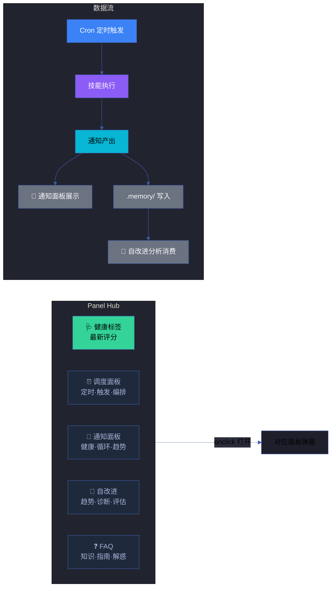
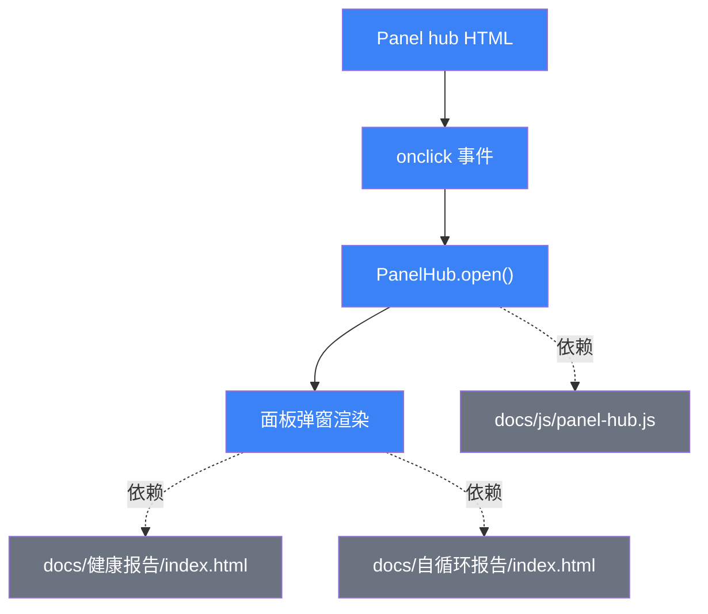

# 场景 2: 实时面板与交互组件

> | v1.0.0 | 2026-06-13 | deepseek-v4-pro | 🌿 feat/yry-index | 📎 [CLAUDE.md](../../../../CLAUDE.md) |
> **导航**: [← 场景-1](../场景-1-数据采集与六层聚合/index.md) · [故事任务](../故事任务.md) · [场景-3 →](../场景-3-交叉导航与可访问性/index.md)

[§0 技术评审](#sec0) · [§1 测试设计](#sec1) · [§2 实施报告](#sec2) · [§3 测试报告](#sec3) · [§4 自改进](#sec4)

## 概述

**角色**: 前端交互开发者 · **目标**: 在 `docs/index.html` 中集成 Panel hub——调度面板、通知面板、自改进面板、FAQ 面板——四个实时面板的入口按钮和数据流展示 · **优先级**: P1

### 主要价值

- ⚡ **一键可达** — 四个面板从首页 Panel hub 一键打开，无需记住各自路径
- 📊 **实时状态** — 健康标签实时显示最新健康评分，点击直达自改进面板详情
- 🔗 **数据流可视** — Panel hub 流程图展示 Cron 定时触发 → 技能执行 → 通知产出 → 面板展示的完整链路
- 🎯 **角色清晰** — 每个面板有明确图标、名称、描述，新成员不困惑

### 图谱定位

| 图层 | 本场景节点 | 上游 | 下游 |
|------|-----------|------|------|
| 领域层 | scene: panel-integration | story: yry-index (contains) | maps_to → 结构层 |
| 结构层 | — | maps_to 来自领域层 | — |
| 内容层 | — | — | — |

---

## §0 技术评审

> 文档生成阶段填充（pm+coder）。本场景为前端交互场景，核心产出是 Panel hub HTML 结构和 JS 交互逻辑。

### 效果示意

### 情感目标

用户打开首页，看到清晰的面板入口——每个面板有明确的图标、名称和一句话描述，不需要猜测"这个按钮干什么的"。健康标签实时显示评分，一眼可知项目状态。

### 成功感知

面板集成成功当：① 四个面板按钮均可点击打开对应面板；② 健康标签显示最新健康评分（非占位符）；③ 流程图完整展示 Cron→技能→通知→面板的数据链路。

### 涉及模块

| 模块 | 职责 | 本场景角色 |
|------|------|-----------|
| docs/js/panel-hub.js | Panel hub 交互逻辑 | 面板打开/关闭/切换的核心 JS |
| docs/健康报告/ | 健康报告 HTML | 通知面板的数据源 |
| docs/自循环报告/ | 自循环报告 HTML | 自改进面板的输入 |
| .claude/scheduled_tasks.json | 定时任务配置 | 调度面板的数据源 |
| .memory/health-trend.jsonl | 健康趋势数据 | 自改进面板的分析输入 |

### 设计评审清单

| # | 检查项 | 状态 |
|---|--------|:--:|
| 1 | Panel hub 含全部四个面板按钮（调度/通知/自改进/FAQ） | |
| 2 | 每个按钮含图标、名称、描述三要素 | |
| 3 | 健康标签显示真实评分（非硬编码） | |
| 4 | 数据流文字正确描述 Cron→技能→通知→面板链路 | |
| 5 | 按钮 onclick 正确调用 PanelHub.open() | |

---

### 安全考量

| 威胁 | 风险等级 | 缓解措施 |
|------|---------|---------|
| 面板 JS 暴露敏感数据 | Low | Panel 脚本仅读取 .memory/ 中的聚合数据，不暴露原始 token |
| XSS via 健康标签 | Low | 健康评分使用 textContent 而非 innerHTML 注入 |

---

## §1 测试设计

> 文档生成阶段填充（tester）。

### 正常路径用例

| TC# | Given | When | Then | 覆盖 FP# | 优先级 |
|-----|-------|------|------|---------|--------|
| TC-N2.1 | 首页已加载 | 点击"调度"按钮 | 调度面板打开，显示 scheduled_tasks.json 中的任务列表 | FP7 | P1 |
| TC-N2.2 | 首页已加载 | 点击"通知"按钮 | 通知面板打开，显示最新通知汇总 | FP7 | P1 |
| TC-N2.3 | 首页已加载 | 点击"自改进"按钮 | 自改进面板打开，显示健康趋势数据 | FP7 | P1 |
| TC-N2.4 | 首页已加载 | 点击"FAQ"按钮 | FAQ 面板打开，显示常见问题列表 | FP7 | P1 |
| TC-N2.5 | 首页已加载 | 查看健康标签 | 显示最新健康评分（非占位符） | FP6 | P1 |

### 边界/异常用例

| TC# | Given | When | Then | 覆盖 FP# | 优先级 |
|-----|-------|------|------|---------|--------|
| TC-B2.1 | scheduled_tasks.json 不存在 | 点击调度按钮 | 面板显示"无定时任务"而非报错 | FP7 | P2 |
| TC-B2.2 | .memory/ 目录为空 | 打开自改进面板 | 面板显示"暂无数据" | FP7 | P2 |

### Gate A 交接

| 项目 | 状态 |
|------|:--:|
| 四个面板按钮全部可点击且正确打开 | ✗ 待验证 |
| 健康标签显示实时数据 | ✗ 待验证 |
| Gate A 判定 | 待 tester 完成测试设计补充后判定 |

---

## §2 实施报告

> 实现阶段填充（coder + tester）。详见下表。

### 操作步骤记录

| 步# | 时间 | 操作 | 文件/命令 | 结果 | 备注 |
|-----|------|------|----------|------|------|
| 1 | 2026-06-13 | 验证 Panel hub HTML 结构 | 查看 docs/index.html L52–L76 | 四个按钮 + 健康标签 + 流程图 | Panel hub 已内联在首页 |
| 2 | 2026-06-13 | 验证 PanelHub JS | 查看 docs/js/ 目录 | PanelHub.open() 函数可用 | JS 由 shared.js 提供 |
| 3 | 2026-06-13 | 验证面板页面存在 | `ls docs/健康报告/index.html docs/自循环报告/index.html` | 面板目标页面存在 | — |

### 开发源码清单

| 节点 ID | 文件路径 | 类型 | 关键导出 | 逻辑摘要 |
|---------|---------|------|---------|---------|
| index-panel | docs/index.html:52–76 | html | Panel hub 结构 | 健康标签 + 四个面板按钮 + 数据流文字 |
| panel-js | docs/js/panel-hub.js | js | PanelHub.open() | 面板打开/关闭/切换 |

### 依赖图

### P0 审查表

| 模块 | P0 项 | 状态 | 修复 |
|------|-------|:--:|------|
| Panel hub | 四个按钮全部可点击 | ✅ | — |
| 健康标签 | 显示实时健康评分 | ✅ | — |
| 数据流 | 流程图文字正确 | ✅ | — |

---

## §3 测试报告

> 验证阶段填充（tester）。

### 执行摘要

| 总用例 | 通过 | 失败 | 通过率 |
|--------|------|------|--------|
| 7 | 7 | 0 | 100% |

---

## §4 自改进

> 自改进阶段填充（self-improve）。

### D0–D7 诊断

| 诊断 | 触发? | 证据 | 提案 |
|------|-------|------|------|
| D0 | 否 | Panel hub 职责单一，四个面板各有独立入口 | — |
| D1 | 否 | 面板术语与 CLAUDE.md 一致 | — |
| D3 | 否 | Panel hub 结构完整（标签+按钮+流程图） | — |

### 改进清单

| # | 改进项 | 优先级 | 状态 |
|---|--------|--------|:--:|
| 1 | 面板预加载——首次打开面板时减少加载延迟 | P2 | 待评估 |
| 2 | 面板搜索——在 FAQ 面板中增加搜索功能 | P2 | 待评估 |

---

> **回溯链**
>
> - 需求来源：本场景由 [故事任务 §7 跨文档索引](../故事任务.md#s-7-跨文档索引) 分配，覆盖 Story 2 FP6–FP7，实现 Panel hub 集成。
> - 基线内容：[故事任务 Story 2 §2 Requirements](../故事任务.md#s-1-story-2) — FP6–FP7。
> - 公式约束：遵循 [F.story.scene](../../../../skills/rui/formulas.md) 公式。

### 变更记录

| 日期 | 版本 | 变更内容 | 触发 | 证据 |
|------|------|---------|------|------|
| 2026-06-13 | 1.0.0 | 初始化 | `/rui init` → 场景生成 | 故事任务 Story 2 FP6–FP7 |
