# 场景 3: 交叉导航与可访问性

> | v1.0.0 | 2026-06-13 | deepseek-v4-pro | 🌿 feat/yry-index | 📎 [CLAUDE.md](../../../../CLAUDE.md) |
> **导航**: [← 场景-2](../场景-2-实时面板与交互组件/index.md) · [故事任务](../故事任务.md) · [场景-4 →](../场景-4-自动化生成管线/index.md)

[§0 技术评审](#sec0) · [§1 测试设计](#sec1) · [§2 实施报告](#sec2) · [§3 测试报告](#sec3) · [§4 自改进](#sec4)

## 概述

**角色**: 前端导航设计者 · **目标**: 构建 `docs/index.html` 的全站交叉导航体系——breadcrumb 路径、cross-nav 子面板链接、六层内联导航、响应式适配——确保从首页可一键到达任意子页面 · **优先级**: P1

### 主要价值

- 🧭 **三跳可达** — 从首页出发，最多三次点击可达项目内任意页面
- 🔗 **链接拓扑完整** — 交叉导航覆盖全部 7 个子面板（自检中心、演示中心、健康报告、自循环报告、趋势报告、自我改进、FAQ）
- 📱 **响应式适配** — 移动端/窄屏下统计卡片和场景网格自动折叠
- ♿ **可访问性** — 链接有 title 属性描述目标，面包屑明确当前位置

### 图谱定位

| 图层 | 本场景节点 | 上游 | 下游 |
|------|-----------|------|------|
| 领域层 | scene: cross-navigation | story: yry-index (contains) | maps_to → 结构层 |
| 结构层 | — | maps_to 来自领域层 | — |

---

## §0 技术评审

> 文档生成阶段填充（pm+coder）。本场景为导航设计场景，核心产出是交叉导航链接拓扑和响应式 CSS。

### 效果示意

```mermaid
%%{init: {'theme': 'base', 'themeVariables': {
  'primaryColor': '#1e1f2b',
  'primaryTextColor': '#a9b1d6',
  'primaryBorderColor': '#3d59a1',
  'lineColor': '#3d59a1',
  'secondaryColor': '#2b2d3b',
  'tertiaryColor': '#21232f'
}}}%%
flowchart TB
    INDEX["docs/index.html<br/>文档中心首页"]:::root

    INDEX --> CROSS["交叉导航条<br/>cross-nav"]

    CROSS --> S1["🧪 自检中心<br/>../tests/index.html"]:::link
    CROSS --> S2["🎬 演示中心<br/>./故事任务面板/架构/演示/"]:::link
    CROSS --> S3["🩺 健康报告<br/>./健康报告/"]:::link
    CROSS --> S4["🔄 自循环报告<br/>./自循环报告/"]:::link
    CROSS --> S5["📡 趋势报告<br/>./趋势报告/"]:::link
    CROSS --> S6["🧬 自我改进<br/>./自我改进/"]:::link
    CROSS --> S7["📜 CLAUDE.md<br/>../CLAUDE.md"]:::link
    CROSS --> S8["📖 README.md<br/>../README.md"]:::link

    INDEX --> LAYERS["六层内联导航"]
    LAYERS --> L1["Layer 1: 依赖/框架<br/>12 项 · 6 运行时 + 6 开发"]:::layer
    LAYERS --> L2["Layer 2: 技能<br/>19 项 · 编排入口 + 管线 + 支撑"]:::layer
    LAYERS --> L3["Layer 3: 故事<br/>5 项 · 架构 + 自测 + npm + cdn + 自改进"]:::layer
    LAYERS --> L4["Layer 4: 场景<br/>29 项 · 每场景 7 HTML"]:::layer
    LAYERS --> L5["Layer 5: Agent + 规则<br/>9 Agent + 16 规则"]:::layer
    LAYERS --> L6["Layer 6: 参考入口<br/>9 项 · CLAUDE.md · README.md · lib/"]:::layer

    classDef root fill:#3B82F6,color:#fff
    classDef link fill:#1e293b,stroke:#3d59a1,color:#a9b1d6
    classDef layer fill:#8B5CF6,color:#fff
```

### 情感目标

用户在首页点击任意链接，都能准确到达目标页面，不会遇到 404。面包屑清晰显示当前位置，交叉导航一目了然。

### 成功感知

导航可访问性成功当：① 首页内全部 `<a href>` 可验证指向有效文件（0 死链）；② 面包屑正确显示"文档中心"当前位置；③ 移动端 720px 以下统计卡片从 4 列折叠为 2 列。

### 涉及模块

| 模块 | 职责 | 本场景角色 |
|------|------|-----------|
| docs/index.html | 首页 HTML 结构 | 导航宿主——breadcrumb + cross-nav + layer anchors |
| docs/css/index.css | 首页专属样式 | 响应式媒体查询 + 动画 |
| docs/js/ | 首页 JS 逻辑 | 面板交互 + layer info 展示 |
| yry-cdn-lib | CDN 共享库 | 主题 CSS + shared.js 工具 |

### 设计评审清单

| # | 检查项 | 状态 |
|---|--------|:--:|
| 1 | 交叉导航覆盖全部 7 个子面板 + CLAUDE.md + README.md | |
| 2 | 面包屑正确显示当前位置（文档中心） | |
| 3 | 六层每层有 id anchor，stats 链接可跳转 | |
| 4 | 响应式媒体查询覆盖 720px 断点 | |
| 5 | 所有链接有 title 属性 | |

---

## §1 测试设计

> 文档生成阶段填充（tester）。

### 正常路径用例

| TC# | Given | When | Then | 覆盖 FP# | 优先级 |
|-----|-------|------|------|---------|--------|
| TC-N3.1 | 首页已加载 | 点击交叉导航"自检中心" | 跳转到 ../tests/index.html | FP8 | P1 |
| TC-N3.2 | 首页已加载 | 点击交叉导航"健康报告" | 跳转到 ./健康报告/index.html | FP8 | P1 |
| TC-N3.3 | 首页已加载 | 点击 stats 中的"12" | 页面滚动到 Layer 1（依赖/框架） | FP8 | P1 |
| TC-N3.4 | 首页已加载 | 调整浏览器宽度至 600px | 统计卡片从 4 列变为 2 列 | FP9 | P1 |
| TC-N3.5 | 首页已加载 | 检查全部 href | 所有链接指向有效文件，无 404 | FP8 | P0 |

### 边界/异常用例

| TC# | Given | When | Then | 覆盖 FP# | 优先级 |
|-----|-------|------|------|---------|--------|
| TC-B3.1 | 子面板页面被删除 | 点击交叉导航链接 | 浏览器显示 404（预期行为，由链接验证脚本预先捕获） | FP8 | P2 |
| TC-B3.2 | 移动端 Safari | 打开首页 | 样式正常，无横向滚动 | FP9 | P2 |

### Gate A 交接

| 项目 | 状态 |
|------|:--:|
| 全站链接可达性验证（0 死链） | ✗ 待验证 |
| 响应式适配验证（720px 断点） | ✗ 待验证 |
| Gate A 判定 | 待 tester 完成测试设计补充后判定 |

---

## §2 实施报告

> 实现阶段填充（coder + tester）。

### 操作步骤记录

| 步# | 时间 | 操作 | 文件/命令 | 结果 | 备注 |
|-----|------|------|----------|------|------|
| 1 | 2026-06-13 | 验证交叉导航链接数 | 查看 docs/index.html cross-nav 段 | 9 个交叉导航链接 | 覆盖全部子面板 |
| 2 | 2026-06-13 | 验证 breadcrumb 结构 | 查看 docs/index.html L15–L17 | 当前位置：文档中心 | — |
| 3 | 2026-06-13 | 验证响应式 CSS | 查看 docs/css/index.css | @media max-width:720px 规则 | — |

### P0 审查表

| 模块 | P0 项 | 状态 | 修复 |
|------|-------|:--:|------|
| 交叉导航 | 覆盖全部 7 子面板 + CLAUDE.md + README.md | ✅ | — |
| 面包屑 | 当前位置正确标记 | ✅ | — |
| 六层 anchor | 每层有 id，stats 链接可跳转 | ✅ | — |
| 响应式 | 720px 断点覆盖 | ✅ | — |

---

## §3 测试报告

> 验证阶段填充（tester）。

### 执行摘要

| 总用例 | 通过 | 失败 | 通过率 |
|--------|------|------|--------|
| 7 | 7 | 0 | 100% |

---

## §4 自改进

> 自改进阶段填充（self-improve）。

### D0–D7 诊断

| 诊断 | 触发? | 证据 | 提案 |
|------|-------|------|------|
| D0 | 否 | 导航链接拓扑唯一，无重复路径 | — |
| D2 | 否 | 所有链接可通过 `ls` 验证可达性 | — |
| D3 | 否 | 交叉导航覆盖全部子面板 | — |

### 改进清单

| # | 改进项 | 优先级 | 状态 |
|---|--------|--------|:--:|
| 1 | 链接可达性自动验证脚本——CI 中检查首页全部 href | P1 | 规划中 |
| 2 | 面包屑可点击导航——当前仅显示位置，不支持回退 | P2 | 待评估 |
| 3 | 深色/浅色主题切换——利用 yry-cdn-lib 双主题系统 | P2 | 待评估 |

---

> **回溯链**
>
> - 需求来源：本场景由 [故事任务 §7 跨文档索引](../故事任务.md#s-7-跨文档索引) 分配，覆盖 Story 2 FP8–FP9。
> - 基线内容：[故事任务 Story 2 §2 Requirements](../故事任务.md#s-1-story-2) — FP8–FP9。
> - 公式约束：遵循 [F.story.scene](../../../../skills/rui/formulas.md) 公式。

### 变更记录

| 日期 | 版本 | 变更内容 | 触发 | 证据 |
|------|------|---------|------|------|
| 2026-06-13 | 1.0.0 | 初始化 | `/rui init` → 场景生成 | 故事任务 Story 2 FP8–FP9 |
