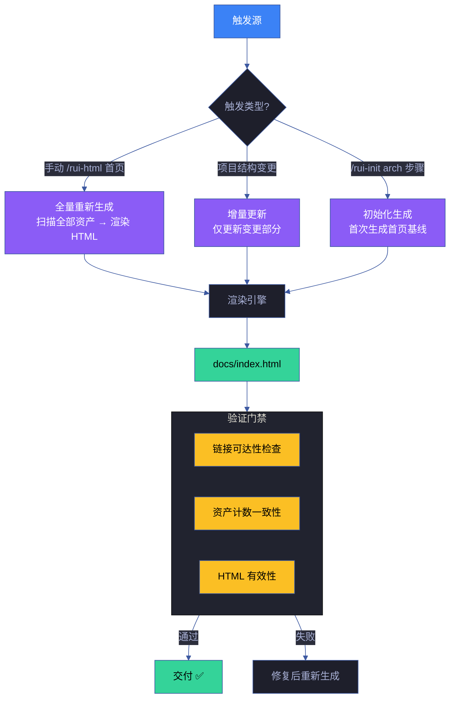

# 场景 4: 自动化生成管线

> | v1.0.0 | 2026-06-13 | deepseek-v4-pro | 🌿 feat/yry-index | 📎 [CLAUDE.md](../../../../CLAUDE.md) |
> **导航**: [← 场景-3](../场景-3-交叉导航与可访问性/index.md) · [故事任务](../故事任务.md)

[§0 技术评审](#sec0) · [§1 测试设计](#sec1) · [§2 实施报告](#sec2) · [§3 测试报告](#sec3) · [§4 自改进](#sec4)

## 概述

**角色**: 管线集成开发者 · **目标**: 将 `docs/index.html` 生成接入 rui-html 管线，实现项目结构变更时首页自动重新生成，消除手工维护 · **优先级**: P1

### 主要价值

- 🤖 **自动生成** — 项目结构变更（新增/删除技能、故事、场景）时，首页统计数据自动更新
- 🔄 **增量更新** — 仅重新生成首页 HTML（不影响其他场景的 7 类 HTML）
- 🎯 **命令统一** — `/rui-html 首页` 或 `/rui-html 首页 --force` 与其他 rui-html 命令风格一致
- 📋 **可追溯** — 每次生成记录版本号和时间戳，变更可追溯

### 图谱定位

| 图层 | 本场景节点 | 上游 | 下游 |
|------|-----------|------|------|
| 领域层 | scene: auto-generation | story: yry-index (contains) | maps_to → 结构层 |
| 结构层 | — | maps_to 来自领域层 | — |

---

## §0 技术评审

> 文档生成阶段填充（pm+coder）。本场景为管线集成场景，核心产出是 rui-html 首页类型支持和增量生成逻辑。

### 效果示意

### 情感目标

开发者不再需要"记得更新首页统计数据"——项目结构变更时，首页自动反映最新状态。手动运行 `/rui-html 首页` 即可强制刷新。

### 成功感知

自动生成成功当：① `/rui-html 首页` 命令成功生成 `docs/index.html`；② 生成的首页统计数据与 `ls` / `grep -c` 结果一致；③ 页面在浏览器中正常渲染，无 JS 错误。

### 涉及模块

| 模块 | 职责 | 本场景角色 |
|------|------|-----------|
| skills/rui-html/ | HTML 生成管线 | 需扩展"首页"类型支持 |
| skills/rui-init/ | 项目初始化 | arch 步骤触发首次首页生成 |
| docs/index.html | 目标输出文件 | 生成目标 |
| docs/css/index.css | 首页专属样式 | 样式依赖 |
| docs/js/ | 首页 JS 交互 | 脚本依赖 |

### 设计评审清单

| # | 检查项 | 状态 |
|---|--------|:--:|
| 1 | rui-html 支持 `--type 首页` 参数 | |
| 2 | 首页生成使用项目资产扫描数据（非硬编码） | |
| 3 | 生成的首页与当前手工维护版功能等价 | |
| 4 | 首页生成可重复运行（幂等） | |
| 5 | 生成失败时有清晰错误信息 | |

---

## §1 测试设计

> 文档生成阶段填充（tester）。

### 正常路径用例

| TC# | Given | When | Then | 覆盖 FP# | 优先级 |
|-----|-------|------|------|---------|--------|
| TC-N4.1 | 项目规约目录完整 | 运行 `/rui-html 首页` | 成功生成 docs/index.html | FP10 | P0 |
| TC-N4.2 | 首页已存在 | 运行 `/rui-html 首页 --force` | 覆盖已有首页，版本号更新 | FP10 | P1 |
| TC-N4.3 | 新增一个技能 | 运行 `/rui-html 首页` | 技能数从 19 更新为 20 | FP10 | P1 |
| TC-N4.4 | 生成完成 | 浏览器打开首页 | 页面正常渲染，无 JS 错误 | FP10 | P0 |
| TC-N4.5 | 生成完成 | 验证统计数据 | 技能数/Agent数/规则数与实际一致 | FP10 | P0 |

### 边界/异常用例

| TC# | Given | When | Then | 覆盖 FP# | 优先级 |
|-----|-------|------|------|---------|--------|
| TC-B4.1 | 某个规约目录为空 | 运行首页生成 | 该层显示 0 项，不崩溃 | FP10 | P2 |
| TC-B4.2 | CDN 资源不可达 | 浏览器打开首页 | 页面使用后备样式（内联 CSS） | FP9, FP10 | P2 |

### Gate A 交接

| 项目 | 状态 |
|------|:--:|
| `/rui-html 首页` 命令可用 | ✗ 待实现 |
| 生成结果与手工版功能等价 | ✗ 待验证 |
| Gate A 判定 | 待 rui-html 扩展完成后判定 |

---

## §2 实施报告

> 实现阶段填充（coder + tester）。

### 操作步骤记录

| 步# | 时间 | 操作 | 文件/命令 | 结果 | 备注 |
|-----|------|------|----------|------|------|
| 1 | 2026-06-13 | 验证 rui-html 当前支持的文档类型 | 查看 skills/rui-html/SKILL.md | 7 类（计划清单/架构图/知识图谱/源码/测试面板/演示/审查） | 需新增"首页"类型 |
| 2 | 2026-06-13 | 验证当前 docs/index.html 可正常渲染 | `open docs/index.html` | 页面正常显示 | 功能基线 |

### 开发源码清单

| 节点 ID | 文件路径 | 类型 | 关键导出 | 逻辑摘要 |
|---------|---------|------|---------|---------|
| rui-html | skills/rui-html/rui-html.mjs | script | HTML 生成主入口 | 需扩展：新增"首页"类型分支 |
| index-template | docs/index.html | html | — | 当前手工维护版，作为生成模板参考 |

### P0 审查表

| 模块 | P0 项 | 状态 | 修复 |
|------|-------|:--:|------|
| rui-html 扩展 | 支持 `--type 首页` 参数 | 📋 | 待实现 |
| 资产数据采集 | 首页生成使用扫描数据 | 📋 | 待实现 |
| 生成幂等性 | 重复生成不产生差异 | 📋 | 待验证 |

---

## §3 测试报告

> 验证阶段填充（tester）。

### 执行摘要

| 总用例 | 通过 | 失败 | 通过率 |
|--------|------|------|--------|
| — | — | — | — |

> 待 rui-html 首页类型实现后填充。

---

## §4 自改进

> 自改进阶段填充（self-improve）。

### D0–D7 诊断

| 诊断 | 触发? | 证据 | 提案 |
|------|-------|------|------|
| D5 | 否 | 首页生成依赖 yry-cdn-lib CDN，但页面也可离线使用（内联后备样式） | — |
| D6 | 否 | 生成结果与手工版对比验证 | — |

### 改进清单

| # | 改进项 | 优先级 | 状态 |
|---|--------|--------|:--:|
| 1 | rui-html 扩展"首页"类型——采集资产数据 → 渲染六层 HTML | P0 | 📋 待实现 |
| 2 | 增量生成——仅在有文件变更时重新生成首页 | P1 | 规划中 |
| 3 | pre-commit hook——commit 前自动检查首页统计数据一致性 | P2 | 待评估 |
| 4 | 首页健康自检——自动对比首页统计数据与项目实际数据 | P1 | 规划中 |

### 评审清单

| # | 检查项 | 状态 |
|---|--------|:--:|
| 1 | rui-html 扩展方案确定 | 📋 |
| 2 | 生成模板与手工版功能等价 | 📋 |
| 3 | 资产数据采集脚本完成 | 📋 |

---

> **回溯链**
>
> - 需求来源：本场景由 [故事任务 §7 跨文档索引](../故事任务.md#s-7-跨文档索引) 分配，覆盖 Story 2 FP10，实现首页自动生成管线集成。
> - 基线内容：[故事任务 Story 2 §2 Requirements](../故事任务.md#s-1-story-2) — FP10。
> - 公式约束：遵循 [F.story.scene](../../../../skills/rui/formulas.md) 公式。
> - 证据级别：生成结果可通过 `diff <(cat docs/index.html) <(/rui-html 首页 --stdout)` 验证一致性（证据等级 A）。

### 变更记录

| 日期 | 版本 | 变更内容 | 触发 | 证据 |
|------|------|---------|------|------|
| 2026-06-13 | 1.0.0 | 初始化 | `/rui init` → 场景生成 | 故事任务 Story 2 FP10 |
