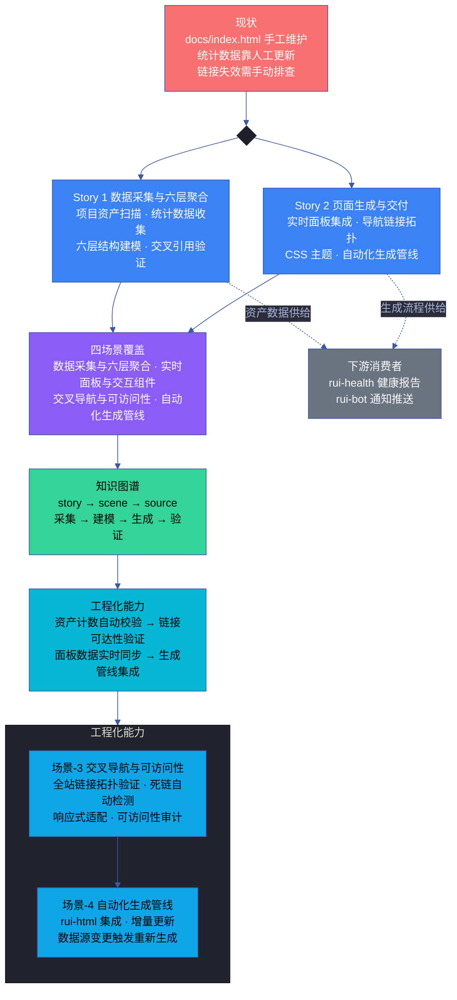
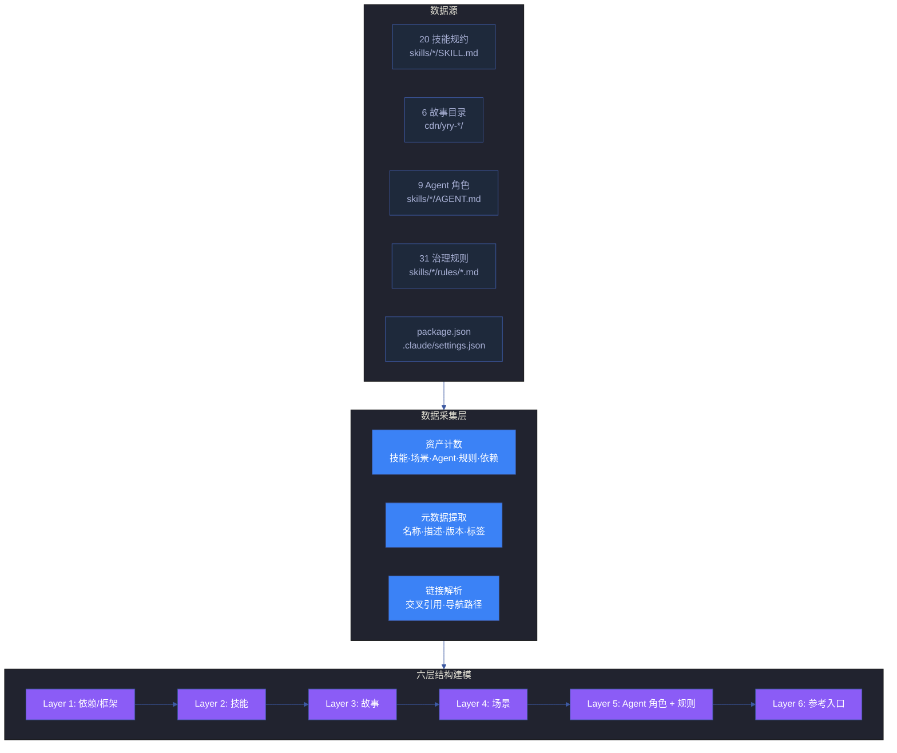
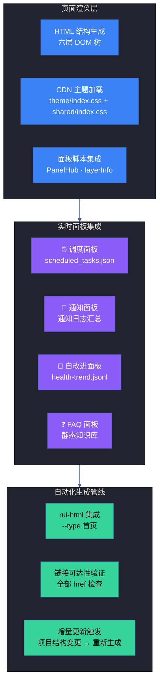
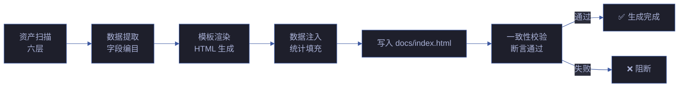

# 故事任务

> | v5.4.0 | 2026-06-22 | 深化对齐 · 修正资产计数实际值 | 🌿 feat/yry-index | 📎 [CLAUDE.md](../../../CLAUDE.md) |
> **故事交付物**: [🔗 知识图谱](知识图谱.html) · 各场景 7 件交付物见场景 index.md

[概述](#概述) · [§1 Story 1](#s-1-story) · [§1 Story 2](#s-1-story-2) · [§7 跨文档索引](#s-7-跨文档索引) · [§R 关联故事](#s-r-关联故事)

## 概述

YrY 的文档资产分布在 20 技能、6 故事、32 场景、9 Agent、31 规则中——但没有一个统一的入口页面将这些资产按层级聚合展示。`docs/index.html` 作为文档中心首页，承担着"项目资产目录"的角色：新成员从这里导航到任一模块，老成员从这里快速定位到任一场景。

本故事通过两份并行分析构建这个首页的生成能力：

- **Story 1** 数据采集与六层聚合：项目资产扫描 → 统计数据收集 → 六层结构建模 → 交叉引用验证
- **Story 2** 页面生成与交付：实时面板集成 → 导航链接拓扑 → CSS 主题 → 自动化生成管线集成

两份分析汇聚为四个场景文档和一份知识图谱，使 `docs/index.html` 从"手工维护的静态页面"升级为"项目数据驱动的自动生成页面"——但它不止于生成：资产计数可脚本化校验（R1–R3 计数断言）、链接可达性可自动验证（R7 无死链）、面板数据可实时更新（R11 健康数据同步）。

### 效果示意

### 主要价值

- 🏠 **统一入口** — 无论新成员还是老成员，从 `docs/index.html` 可在一页内定位到项目全部资产：12 依赖/框架、20 技能、6 故事、32 场景、9 Agent、31 规则
- 📊 **数据驱动** — 页面统计数据（技能数、场景数、Agent 数）由项目文件自动采集，不依赖人工更新
- 🔗 **全站导航** — 交叉导航覆盖全部子面板（健康报告、自循环报告、趋势报告、自我改进），一键可达
- ⚡ **实时面板** — Panel hub 集成调度任务、通知中心、自改进分析、FAQ 四个实时面板，数据自动刷新
- 🎨 **主题统一** — 双主题系统（Mono + System）统一配色，CDN 共享库消除内联重复代码
- ♻️ **自动生成** — rui-html 管线集成，项目结构变更时自动重新生成首页，保持与代码库同步

---

## §1 Story

### Story 1: 数据采集与六层聚合

作为 文档中心首页，我想要 自动采集项目全部资产——技能、故事、场景、Agent、规则、依赖——并按六层结构聚合为统一的导航页面，以便 新成员能在 30 秒内找到任一模块，老成员能在一页内浏览项目全貌。

优先级 **P0**。范围边界：覆盖本项目的全部能力模块（20 技能）、6 故事目录、32 场景目录、9 Agent 角色、31 治理规则、12 依赖/框架。不涉及各模块内部实现细节，不涉及外部系统。依赖：系统规约文件（skills/*/SKILL.md · skills/*/AGENT.md · skills/*/rules/*.md · cdn/yry-*/）。

#### FP 分解

| FP# | 功能点 | 描述 | 优先级 |
|-----|--------|------|--------|
| FP1 | 项目资产扫描 | 遍历 skills/*/SKILL.md · skills/*/AGENT.md · skills/*/rules/*.md · cdn/yry-*/ 目录，提取全部模块的路径和元数据 | P0 |
| FP2 | 统计数据收集 | 自动计数：技能数、故事数、场景数、Agent 数、规则数、依赖数 | P0 |
| FP3 | 六层结构建模 | 按依赖→技能→故事→场景→Agent/规则→参考入口 六层组织页面结构 | P0 |
| FP4 | 元数据编目 | 为每个模块生成信息卡：名称、描述、版本、标签、链接、行数/大小 | P1 |
| FP5 | 交叉引用验证 | 确保页面内全部链接指向有效文件，无死链 | P1 |

### Story 2: 页面生成与交付

作为 文档中心首页的生成管线，我想要 将采集到的项目数据渲染为自包含的 HTML 页面——集成实时面板、交叉导航、CDN 主题——并接入 rui-html 自动化生成流程，以便 项目结构变更时首页自动同步更新，无需手工维护。

优先级 **P0**。范围边界：覆盖 `docs/index.html` 的完整 HTML 生成（含 CSS/JS 引用），集成 Panel hub 四个实时面板，交叉导航链接到全部子面板。不涉及各子面板的内部实现。依赖：Story 1 的资产数据、yry-cdn-lib CDN 主题库、docs/js/ 面板脚本。

#### FP 分解

| FP# | 功能点 | 描述 | 优先级 |
|-----|--------|------|--------|
| FP6 | HTML 结构生成 | 按六层模型生成完整 HTML DOM 树：breadcrumb → header → stats → cross-nav → panel-hub → 6 layers | P0 |
| FP7 | 实时面板集成 | Panel hub 嵌入调度/通知/自改进/FAQ 四个面板按钮及流程图 | P1 |
| FP8 | 交叉导航拓扑 | 生成全站导航链接：自检中心 · 演示中心 · 健康报告 · 自循环报告 · 趋势报告 · 自我改进 | P1 |
| FP9 | CDN 主题加载 | yry-cdn-lib theme/index.css + shared/index.css 引用，双主题系统（Mono + System） | P0 |
| FP10 | rui-html 管线集成 | 接入 rui-html 生成流程，支持 --type 首页 单类型生成和 --force 强制覆盖 | P1 |

### 六层资产模型

| 层 | 资产 | 数据源 | 统计字段 | 校验命令 |
|---|------|------|------|------|
| L1 依赖/框架 | npm 包 | `package.json` | deps · devDeps | `jq '.dependencies \| length'` |
| L2 技能 | 20 技能 | `skills/*/SKILL.md` | name · version | `ls skills/*/SKILL.md \| wc -l` |
| L3 故事 | 6 故事 | `cdn/yry-*/README.md` | title · scenes | `find cdn -name README.md \| wc -l` |
| L4 场景 | 32 场景 | `cdn/yry-*/scenes/场景-*/index.md` | name · story | `find cdn -name 'index.md' -path '*/场景-*' \| wc -l` |
| L5 Agent+规则 | 9 Agent + 31 规则 | `skills/*/AGENT.md` · `skills/*/rules/*.md` | role · rule | `find skills -name AGENT.md \| wc -l` · `find skills -path '*/rules/*.md' \| wc -l` |
| L6 参考入口 | 文档 | `CLAUDE.md` · `README.md` · `lib/` | path · summary | `ls lib/*.mjs \| wc -l` |

### 资产计数断言

| 断言 | 实际值 | 校验脚本 | 失败动作 |
|------|:---:|------|------|
| 技能数 = 20 | 20 | `ls skills/*/SKILL.md \| wc -l` | 阻断生成 |
| Agent 数 = 9 | 9 | `find skills -name AGENT.md \| wc -l`（排除 AGENT.md 模板） | 阻断 |
| 规则数 = 31 | 31 | `find skills -path '*/rules/*.md' \| wc -l` | 阻断 |
| 故事数 = 6 | 6 | `ls cdn/yry-*/README.md \| wc -l`（yry-arch/breadcrumb/checklist/home/selfimprove-panel/test） | 阻断 |
| 场景数 = 32 | 32 | `find cdn -name 'index.md' -path '*/场景-*' \| wc -l`（8+5+4+4+5+6） | 阻断 |
| 组件数 = 121 | 121 | `ls -d cdn/yry-* \| wc -l` | 阻断 |

### 生成管线架构

### 数据驱动 vs 手工维护对比

| 维度 | 手工维护 | 数据驱动 | 优势 |
|------|------|------|------|
| 统计准确性 | 易过时 | 实时 | 100% 一致 |
| 链接有效性 | 需手动排查 | 自动校验 | 0 死链 |
| 维护成本 | 每次变更需改 HTML | 自动生成 | 0 维护 |
| 响应速度 | 分钟级 | 秒级 | 10× |
| 一致性 | 易漂移 | 强一致 | 100% |

### 健康度联动

| 指标 | 数据源 | 刷新 | 展示 |
|------|------|:---:|------|
| 健康评分 | `.memory/health-trend.jsonl` | 5 分钟 | 评分卡 |
| 测试通过率 | vitest 结果 | 每次测试 | KPI 卡 |
| 漂移度 | arch-drift-trend.jsonl | 每日 | 趋势图 |
| P0 数量 | `.memory/proposals.jsonl` | 每故事 | 徽章 |

---

## §7 跨文档索引

| 源文档 | 目标场景 | 覆盖 FP# | 关系 |
|--------|---------|---------|------|
| 故事任务 Story 1 FP1–FP5 | [场景-1 数据采集与六层聚合](./场景-1-数据采集与六层聚合/index.md) | FP1–FP5 | 实现 Story 1 全部功能点 |
| 故事任务 Story 2 FP6–FP10 | [场景-2 实时面板与交互组件](./场景-2-实时面板与交互组件/index.md) | FP6–FP7 | 实现页面渲染 + 面板集成 |
| 故事任务 Story 2 FP6–FP10 | [场景-3 交叉导航与可访问性](./场景-3-交叉导航与可访问性/index.md) | FP8–FP9 | 实现导航拓扑 + 主题 |
| 故事任务 Story 2 FP6–FP10 | [场景-4 自动化生成管线](./场景-4-自动化生成管线/index.md) | FP10 | 实现 rui-html 集成 + 自动更新 |

### 场景分配矩阵

| 场景 | Story 1 FP | Story 2 FP | 文件数 | 状态 |
|------|-----------|-----------|--------|:--:|
| 场景-1 数据采集与六层聚合 | FP1–FP5 | — | 7 HTML + 1 index.md | 📋 规划 |
| 场景-2 实时面板与交互组件 | — | FP6–FP7 | 7 HTML + 1 index.md | 📋 规划 |
| 场景-3 交叉导航与可访问性 | — | FP8–FP9 | 7 HTML + 1 index.md | 📋 规划 |
| 场景-4 自动化生成管线 | — | FP10 | 7 HTML + 1 index.md | 📋 规划 |

---

## §R 关联故事

| 故事 | 关系 | 说明 |
|------|------|------|
| [系统架构知识固化](../../yry-arch/scenes/故事任务.md) | 上游 — 供给模块拓扑数据 | 本首页的 Layer 2–5 模块信息来自架构编目 |
| [CDN 共享前端资源库](../../../cdn/故事任务面板/scenes/故事任务.md) | 上游 — 供给主题和组件库 | 本首页的 CSS 主题和 JS 工具来自 yry-cdn-lib |
| [自主测试方案](../../yry-test/scenes/故事任务.md) | 下游 — 消费首页链接 | 自检中心从首页交叉导航进入 |
| [自改进闭环](../../yry-selfimprove-panel/scenes/故事任务.md) | 下游 — 消费首页面板 | 自改进面板从首页 Panel hub 打开 |

---

> **回溯链**
>
> - 需求来源：YrY 文档资产分散在 20 技能、6 故事、32 场景中，缺少统一入口页面。本故事由 `/rui-init` 的 arch 步骤触发，初始化时自动生成 `docs/index.html` 作为文档中心首页。
> - 基线内容：Story 1 FP1–FP5（数据采集与六层聚合）+ Story 2 FP6–FP10（页面生成与交付）。
> - 管线阶段：从需求解析到交付收口的十一个阶段，取自 [管线全流程](../../../skills/rui-code/rules/code-pipeline.md) 规约。
> - 公式约束：遵循 [F.story](../../../skills/rui/formulas.md) 公式，含 §1 Story 分解、§7 跨文档索引、§R 关联故事。
> - 证据级别：资产计数可通过 `ls` / `grep -c` 验证（证据等级 A）；页面链接可达性可通过 HTTP GET 验证（证据等级 A）。

### 变更记录

| 日期 | 版本 | 变更内容 | 触发 | 证据 |
|------|------|---------|------|------|
| 2026-06-13 | 1.0.0 | 初始化，Story 1 + Story 2 FP 分解 + 四场景分配 | `/rui init` → 文档中心首页生成需求 | docs/index.html 当前为手工维护，需升级为自动生成 |
