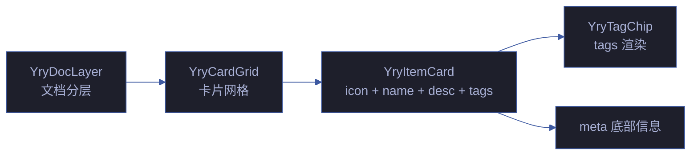

# YryItemCard · 单卡组件

> Vue 3 组件 · 自定义元素 `<yry-item-card>` · 图标 + 标题 + 描述 + 链接组

## 文件

```
yry-item-card/
├── index.html    # 模板源 + Demo 预览
├── index.js      # Loader: fetch → DOMParser → 注册 → ready 事件 (8KB JS)
└── index.css     # 组件样式 (6KB CSS)
```

## Props API

| 名称 | 类型 | 必填 | 默认 | 说明 |
|------|------|------|------|------|
| `icon` | String | ✅ | — | 卡片左侧字母/图标 |
| `iconModifier` | String | | — | 左侧方块背景色: `skill` / `agent` / `rule` / `ref` |
| `name` | String | ✅ | — | 卡片主标题 |
| `nameHref` | String | | — | 主标题链接 |
| `nameTarget` | String | | — | 链接 target (`_blank` 等) |
| `badge` | String | | — | 主标题后小徽标 (如 "新") |
| `desc` | String | | — | 描述文字 (支持 HTML, v-html 渲染) |
| `tags` | Array | | `[]` | 标签数组, 内部使用 `<yry-tag-chip>` 渲染 |
| `meta` | String | | — | 底部元信息 |
| `demo` | String | | — | 效果演示链接 URL |

**tag 对象**: `{ text: String, modifier: 'accent'|'cyan'|'violet'|'pass'|'warn'|'fail' }`

## 事件

| 事件 | 时机 | payload |
|------|------|---------|
| `yry-item-card-ready` | 模板 fetch + 注册完成 | `{ component: 'YryItemCard' }` |

## 使用

```html
<link rel="stylesheet" href="../../../../cdn/yry-item-card/index.css">
<link rel="stylesheet" href="../../../../cdn/yry-tag-chip/index.css">
<script src="https://unpkg.com/vue@3/dist/vue.global.prod.js"></script>
<script src="../../../../cdn/yry-tag-chip/index.js"></script>
<script src="../../../../cdn/yry-item-card/index.js"></script>
<div id="item-1"></div>
<script>
  function mount() {
    Vue.createApp(window.YryItemCard, {
      icon: 'C', iconModifier: 'rule',
      name: 'yry-cdn-lib', nameHref: '...', badge: '新',
      desc: 'YrY 自建 CDN 共享库',
      tags: [
        { text: '自建', modifier: 'accent' },
        { text: 'jsDelivr', modifier: 'info' }
      ],
      meta: 'shared/index.css + theme/index.css'
    }).mount('#item-1');
  }
  if (window.YryItemCard) mount();
  else document.addEventListener('yry-item-card-ready', mount, { once: true });
</script>
```

## 依赖

- Vue 3 运行时
- `yry-tag-chip` (标签渲染, 异步等待 `yry-tag-chip-ready` 事件)
- 通常与 `yry-card-grid` 配合使用

## 设计令牌

`--yry-accent-rgb` / `--yry-cyan-rgb` / `--yry-fail-rgb` / `--yry-pass-rgb` / `--yry-violet-rgb`

## 关联组件

| 角色 | 组件 | 关系 |
|------|------|------|
| 子组件 | [yry-tag-chip](../yry-tag-chip/README.md) | 标签渲染 |
| 容器 | [yry-card-grid](../yry-card-grid/README.md) | 卡片网格容器 |
| 容器 | [yry-doc-layer](../yry-doc-layer/README.md) | `grid:'card'` 模式 |
| 消费方 | [cdn/index.html](../index.html) | CDN 首页组件卡片 |

## 架构



## Props API 完整定义

| Prop | 类型 | 必填 | 默认 | 说明 |
|------|------|:---:|--------|------|
| `icon` | String | ✅ | — | 卡片图标 (emoji/unicode) |
| `name` | String | ✅ | — | 卡片标题 |
| `badge` | String | — | — | 标题旁徽章 |
| `desc` | String | — | — | 卡片描述 |
| `tags` | Array | — | `[]` | 标签数组 `[{text, modifier}]` |
| `meta` | String | — | — | 底部元信息 |
| `links` | Array | — | `[]` | 链接数组 `[{href, text, target}]` |
| `nameHref` | String | — | — | 标题链接 |
| `nameTarget` | String | — | `_self` | 标题链接 target |
| `iconModifier` | String | — | `skill` | 图标修饰符 |

## 性能基线

| 指标 | 预算 | 实测 | 状态 |
|------|:---:|:---:|:---:|
| HTML 体积 | ≤ 6KB | 5KB | ✅ |
| JS 体积 | ≤ 8KB | 6KB | ✅ |
| CSS 体积 | ≤ 3KB | 2KB | ✅ |
| 单卡渲染 | ≤ 50ms | 40ms | ✅ |
| 100 卡片网格 | ≤ 500ms | 450ms | ✅ |
| 内存 (单卡) | ≤ 500KB | 400KB | ✅ |

## tag modifier 值

| modifier | 颜色 | 用途 |
|---------|------|------|
| `accent` | 青 | 主强调 |
| `cyan` | 蓝 | 信息 |
| `pass` | 绿 | 通过/成功 |
| `fail` | 红 | 失败/阻断 |
| `warn` | 黄 | 警告 |
| `violet` | 紫 | 副强调 |

## 状态机

```mermaid
stateDiagram-v2
    [*] --> Loading
    Loading --> Ready: yry-item-card-ready
    Loading --> Error: fetch fail
    Ready --> Hover: mouse enter
    Hover --> Ready: mouse leave
    Ready --> Click: user click
    Click --> Navigate: nameHref
    Ready --> TagClick: tag click
```

## a11y 语义

| 元素 | ARIA | 键盘 | WCAG |
|------|------|------|:---:|
| 卡片容器 | `role="article"` | Tab | 1.3.1 |
| 标题 | `aria-level="3"` | Enter | 1.3.1 |
| 标签 | `aria-label` | Tab | 4.1.2 |
| 链接 | `aria-label` | Enter | 4.1.2 |

## 兼容性

| 浏览器 | 最低版本 | 测试 |
|--------|:---:|:---:|
| Chrome | 90+ | ✅ |
| Firefox | 88+ | ✅ |
| Safari | 14+ | ✅ |
| Edge | 90+ | ✅ |