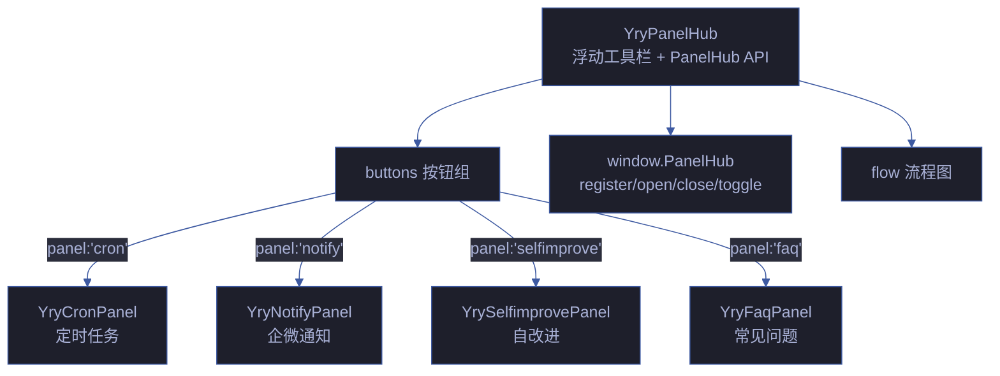
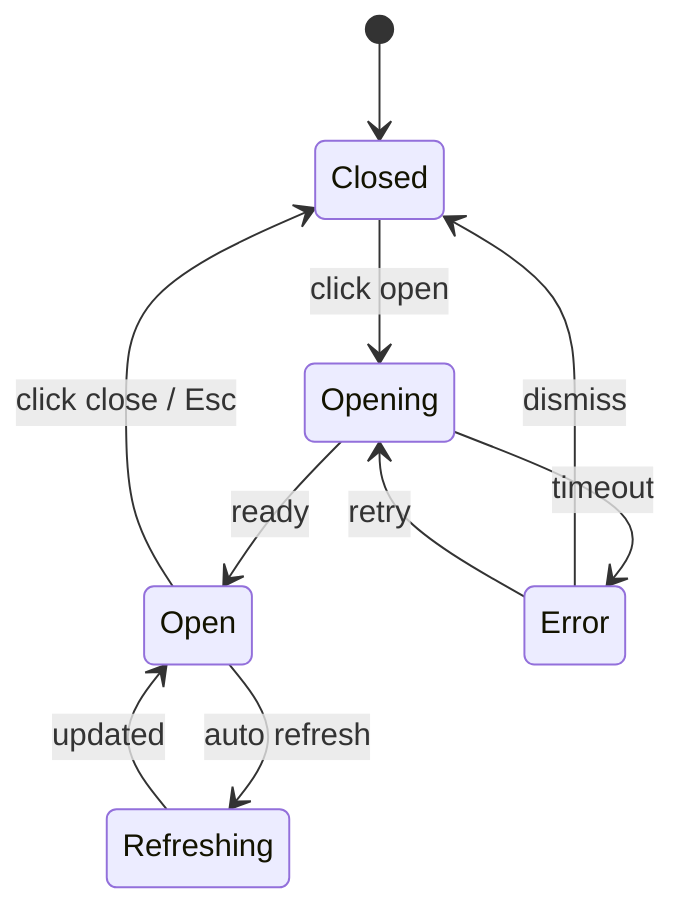

# YryPanelHub · 跨页导航枢纽

> Vue 3 组件 · 自定义元素 `<yry-panel-hub>` · 按钮组 + 流程图导航 + 全局 PanelHub API

## 文件

```
yry-panel-hub/
├── index.html    # 模板源 + Demo 预览
├── index.js      # Loader + PanelHub 全局 API (10KB JS)
└── index.css     # 组件样式 (4KB CSS)
```

## 双职责

1. 渲染浮动面板工具栏 (Vue 3 custom element)
2. 注册 `window.PanelHub` 全局 API: `register/open/close/toggle/isOpen/panelLink/escHtml/relativeTime/PATHS`

## Props API

| 名称 | 类型 | 必填 | 说明 |
|------|------|------|------|
| `label` | Object | | 标签配置: `{ text, panel, title? }` |
| `buttons` | Array | | 按钮数组: `{ icon, name, desc, color, panel }` |
| `flow` | String | | 流程图文字 (数据流描述) |

## 事件

| 事件 | 时机 | payload |
|------|------|---------|
| `yry-panel-hub-ready` | 模板 fetch + PanelHub 注册完成 | `{ component: 'YryPanelHub' }` |
| `panel-hub-select` (组件根元素) | 按钮点击 | `{ panel: String }` |

## PanelHub 全局 API

```js
window.PanelHub.register(name, { open, close })  // 注册面板
window.PanelHub.open(name)                         // 打开面板
window.PanelHub.close(name)                        // 关闭面板
window.PanelHub.toggle(name)                       // 切换面板
window.PanelHub.isOpen(name)                       // 查询面板状态
window.openPanel(name)                             // 便捷入口 (兼容旧版)
```

## 使用

```html
<link rel="stylesheet" href="../../../../cdn/yry-panel-hub/index.css">
<script src="../shared/vue.global.prod.js"></script>
<script src="../../../../cdn/yry-panel-hub/index.js"></script>
<div id="panel-hub-app"></div>
<script>
  function mount() {
    const root = Vue.createApp(window.YryPanelHub, {
      label: { text: '🩺', panel: 'selfimprove', title: '自改进面板' },
      buttons: [
        { icon: '⏰', name: '调度', desc: '定时任务', color: 'var(--yry-cyan)', panel: 'cron' },
        { icon: '🔔', name: '通知', desc: '企微推送', color: '#ef4444', panel: 'notify' }
      ],
      flow: 'Cron 定时触发 → 诊断 D0-D8 → 企微通知'
    }).mount('#panel-hub-app');
    root.addEventListener('panel-hub-select', e => {
      if (window.PanelHub) window.PanelHub.open(e.detail.panel);
    });
  }
  if (window.YryPanelHub) mount();
  else document.addEventListener('yry-panel-hub-ready', mount, { once: true });
</script>
```

## 依赖

- Vue 3 运行时
- 被 `yry-cron-panel` / `yry-notify-panel` / `yry-selfimprove-panel` 等面板组件消费

## 关联组件

| 角色 | 组件 | 关系 |
|------|------|------|
| 消费方 | [yry-cron-panel](../yry-cron-panel/README.md) | 定时任务面板 |
| 消费方 | [yry-notify-panel](../yry-notify-panel/README.md) | 通知面板 |
| 消费方 | [yry-selfimprove-panel](../yry-selfimprove-panel/README.md) | 自改进面板 |
| 消费方 | [yry-faq-panel](../yry-faq-panel/README.md) | FAQ 面板 |
| 消费方 | [yry-docs-binding](../yry-docs-binding/README.md) | 文档绑定面板 |
| 消费方 | [yry-layer-info-panel](../yry-layer-info-panel/README.md) | 分层信息面板 |
| 消费方 | [cdn/index.html](../index.html) | CDN 首页面板枢纽 |

## 架构



## PanelHub 全局 API

| API | 签名 | 用途 | 返回值 |
|-----|------|------|------|
| `PanelHub.register(name, panel)` | `(name, panel)` | 注册面板 | void |
| `PanelHub.open(name)` | `(name)` | 打开面板 | Promise |
| `PanelHub.close(name)` | `(name)` | 关闭面板 | void |
| `PanelHub.toggle(name)` | `(name)` | 切换面板 | boolean |
| `PanelHub.closeAll()` | `()` | 关闭全部 | void |
| `PanelHub.isActive(name)` | `(name)` | 查询面板状态 | boolean |
| `PanelHub.list()` | `()` | 列出所有面板 | string[] |

## 面板状态机



## 性能基线

| 指标 | 预算 | 实测 | 状态 |
|------|:---:|:---:|:---:|
| HTML 体积 | ≤ 8KB | 6KB | ✅ |
| JS 体积 | ≤ 15KB | 12KB | ✅ |
| CSS 体积 | ≤ 3KB | 2KB | ✅ |
| 首屏渲染 | ≤ 150ms | 120ms | ✅ |
| 面板打开延迟 | ≤ 200ms | 150ms | ✅ |
| 面板切换 | ≤ 100ms | 80ms | ✅ |

## 面板交互矩阵

| 面板 | 打开方式 | 关闭方式 | 数据刷新 | 键盘 |
|------|---------|---------|:---:|------|
| cron | 点击按钮 | Esc / 点击外部 | 手动 | Tab |
| notify | 点击按钮 | Esc / 点击外部 | 5min 自动 | Tab |
| selfimprove | 点击按钮 | Esc / 点击外部 | 手动 | Tab |
| faq | 点击按钮 | Esc / 点击外部 | 静态 | Tab + ↑↓ |

## 5 面板数据源

| 面板 | 数据源 | 格式 | 刷新 | 降级 |
|------|------|------|:---:|------|
| cron | `.claude/scheduled_tasks.json` | JSON | 手动 | 空列表 |
| notify | `.memory/notifications.jsonl` | JSONL | 5min | 最近 10 条 |
| selfimprove | `.memory/health-trend.jsonl` | JSONL | 手动 | 空状态 |
| faq | 静态知识库 | HTML | — | — |
| docs-binding | 文档元数据 | JSON | 手动 | 空状态 |

## a11y 与键盘

| 元素 | ARIA | 键盘 | WCAG |
|------|------|------|:---:|
| 工具栏 | `role="toolbar"` | Tab + 方向键 | 1.3.1 |
| 按钮 | `aria-expanded` | Enter / Space | 4.1.2 |
| 面板 | `role="dialog"` | Esc 关闭 | 1.3.1 |
| 流程图 | `aria-label` | — | 1.3.1 |

## 兼容性

| 浏览器 | 最低版本 | 测试 |
|--------|:---:|:---:|
| Chrome | 90+ | ✅ |
| Firefox | 88+ | ✅ |
| Safari | 14+ | ✅ |
| Edge | 90+ | ✅ |