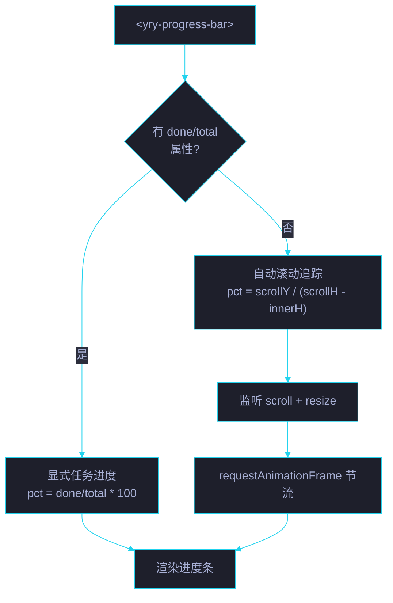

# 场景 1: 需求与设计

> | v5.4.0 | 2026-06-27 | 初始 | 组件: YryProgressBar |
> **导航**: [← README](../../README.md) · [场景 2 →](../场景-2-模板与样式/index.md)
> **交付物**: [📋 清单](清单.html) · [📐 架构](架构图.html) · [🔗 图谱](知识图谱.html) · [📄 源码](源码.html) · [🧪 测试](测试面板.html) · [💡 演示](演示.html) · [📝 审查](审查.html)

[§0 概述](#sec0) · [§1 关键内容](#sec1) · [§2 实施](#sec2) · [§3 验证](#sec3) · [§4 自改进](#sec4)

<a id="sec0"></a>
## §0 概述

本场景是 **YryProgressBar** 的第 1 个场景，聚焦于 **需求与设计**：定义进度条组件的功能边界、Props API 契约、双模式设计思路以及视觉规格。

### 需求背景

| 需求 | 优先级 | 来源 |
|------|:---:|------|
| 页面级进度指示 (吸顶 sticky) | P0 | 健康报告仪表板 |
| 显式任务进度 (done/total) | P0 | 任务面板 |
| 自动滚动追踪 (无属性时) | P0 | 长文档阅读进度 |
| 玻璃质感 + 扫光动画 | P1 | 视觉设计系统 |
| CSS 自定义属性暴露高度 | P1 | 下游 sticky 组件偏移 |
| a11y ARIA 语义 | P1 | WCAG 合规 |

### 双模式设计



<a id="sec1"></a>
## §1 关键内容

### Props API 契约

| Prop | 类型 | 必填 | 默认 | 说明 |
|------|------|:---:|------|------|
| `done` | Number | — | `0` | 已完成数量。不设则启用自动滚动追踪 |
| `total` | Number | — | `0` | 总数量。`> 0` 时进度 = `done / total * 100%` |
| `label` | String | — | `"进度"` | aria-label 标签文字 |

### 模式选择逻辑

```
if (el.hasAttribute('done') || el.hasAttribute('total'))
  → 显式任务进度模式 (监听 prop 变化)
else
  → 自动滚动追踪模式 (监听 scroll + resize)
```

### 视觉规格

| 特性 | 规格 |
|------|------|
| 定位 | `position: sticky; top: 0; z-index: 100` |
| 背景 | 半透明深色渐变 `rgba(22,22,32,.96)` → `rgba(22,22,32,.78)` |
| 磨砂 | `backdrop-filter: blur(14px) saturate(160%)` |
| 轨高 | 6px · `border-radius: 999px` |
| 填充渐变 | 青 `--yry-cyan` → 紫 `--yry-violet` |
| 扫光动画 | `pb-shine` 2.6s ease-in-out infinite |
| 完成态 | 绿 `--yry-pass` → 青渐变 + 暖光晕 |
| 空态 | 无发光 (box-shadow: none) |
| 动效偏好 | `prefers-reduced-motion: reduce` → 关闭过渡与发光 |

### CSS 自定义属性暴露

| 属性 | 值 | 用途 |
|------|-----|------|
| `--yry-progress-bar-height` | `21px` | 主机总高度，供下游 sticky 组件 (如 yry-dashboard-quicknav) 计算 `top` 偏移 |

计算: `padding-top(6) + track(6) + padding-bottom(8) + border-bottom(1) = 21px`

### a11y 语义映射

| 元素 | ARIA 属性 | WCAG 标准 |
|------|------|:---:|
| 进度条容器 | `role="progressbar"` | 1.3.1 |
| 当前值 | `:aria-valuenow="pct"` | 1.3.1 |
| 最小值 | `aria-valuemin="0"` | 1.3.1 |
| 最大值 | `aria-valuemax="100"` | 1.3.1 |
| 标签 | `:aria-label="label \|\| '进度'"` | 1.3.1 |
| 动效 | `prefers-reduced-motion` 适配 | 2.3.3 |

### 架构决策

| 决策 | 选择 | 替代方案 | 理由 |
|------|------|---------|------|
| 模板加载 | vue-ce-loader 共享加载器 | 组件内 fetch | 统一错误处理 · 减少重复代码 |
| 进度计算 | computed pct | method 手动计算 | Vue 响应式自动追踪依赖 |
| 滚动节流 | requestAnimationFrame + flag | throttle(fn, 16ms) | 与浏览器帧同步 · 零依赖 |
| 双模式判定 | mounted 中检查 attribute | prop default 语义 | 显式明确 · 避免歧义 |
| 样式注入 | 独立 index.css (link 引入) | JS 内联注入 | 利用浏览器缓存 · CSS 可独立预览 |
| 高度暴露 | CSS 自定义属性 `:root` | JS 计算 + data-attr | 声明式 · 下游纯 CSS 引用 |

<a id="sec2"></a>
## §2 实施

### 任务管线

| # | 任务 | 验收信号 | 状态 |
|:---:|------|---------|:---:|
| 1 | Props API 定义 | `done`/`total`/`label` 三 prop 完整 · 类型正确 | ✅ |
| 2 | 双模式判定逻辑 | `hasAttribute` 检查生效 · 两种模式互斥 | ✅ |
| 3 | 视觉规格落地 | sticky + 玻璃 + 扫光 + 渐变全部实现 | ✅ |
| 4 | CSS 自定义属性暴露 | `--yry-progress-bar-height: 21px` 在 `:root` 定义 | ✅ |
| 5 | a11y ARIA 完整 | 4 个 ARIA 属性 + prefers-reduced-motion | ✅ |

<a id="sec3"></a>
## §3 验证

| 验证项 | 方法 | 阈值 |
|--------|------|:---:|
| Props 类型校验 | Vue devtools 检查 | 0 类型告警 |
| 双模式切换 | 手动添加/移除 done 属性 | 模式正确切换 |
| 进度计算精度 | done=3, total=8 → pct=38% | Math.round 取整 |
| 边界: done > total | done=12, total=10 → pct=120% | 样式处理 (width > 100%) |
| 边界: total=0 | done=5, total=0 → pct=0 | 不除零 |
| a11y 审计 | axe-core 扫描 | 0 violations |

<a id="sec4"></a>
## §4 自改进

| 维度 | 当前 | 目标 | 行动 |
|------|:---:|:---:|------|
| 颜色主题 | 固定青紫渐变 | 支持 color prop | 新增 prop + CSS 类切换 |
| 高度定制 | 固定 6px 轨高 | 支持 height prop | 通过 CSS 自定义属性覆盖 |
| 标签显示 | 无可见标签 | 可选文字标签 | 模板新增 label span |
| 缓冲进度 | 无 | 支持 buffer prop | 新增第二轨 (类似 video buffer) |

---

> 维护者提示: 本文件遵循 `场景-N-xxx/index.md` 标准模式。§1 的架构决策与 `审查.html` 评审清单对齐。
