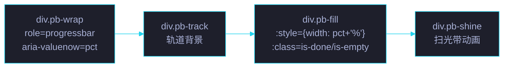

# 场景 2: 模板与样式

> | v5.4.0 | 2026-06-27 | 初始 | 组件: YryProgressBar |
> **导航**: [← 场景 1](../场景-1-需求与设计/index.md) · [场景 3 →](../场景-3-组件注册与加载/index.md)
> **交付物**: [📋 清单](清单.html) · [📐 架构](架构图.html) · [🔗 图谱](知识图谱.html) · [📄 源码](源码.html) · [🧪 测试](测试面板.html) · [💡 演示](演示.html) · [📝 审查](审查.html)

[§0 概述](#sec0) · [§1 关键内容](#sec1) · [§2 实施](#sec2) · [§3 验证](#sec3) · [§4 自改进](#sec4)

<a id="sec0"></a>
## §0 概述

本场景是 **YryProgressBar** 的第 2 个场景，聚焦于 **模板与样式**：Vue 3 `<script type="text/x-template">` 模板结构、sticky 吸顶 + 玻璃磨砂 + 扫光动画的 CSS 实现、CSS 自定义属性集成。

### 模板结构



<a id="sec1"></a>
## §1 关键内容

### 模板源码

```html
<script type="text/x-template" id="yry-progress-bar-tpl">
  <div class="pb-wrap"
       role="progressbar"
       :aria-label="label || '进度'"
       :aria-valuenow="pct" aria-valuemin="0" aria-valuemax="100">
    <div class="pb-track">
      <div class="pb-fill"
           :class="{ 'is-done': pct >= 100, 'is-empty': pct <= 0 }"
           :style="{ width: pct + '%' }">
        <div class="pb-shine"></div>
      </div>
    </div>
  </div>
</script>
```

### CSS 架构

```
index.css
├── :root { --yry-progress-bar-height: 21px }   ← 下游组件引用
├── yry-progress-bar { ... }                      ← 主机: sticky 吸顶 + 玻璃背景
├── .pb-track { ... }                             ← 轨道: 6px 高 · 圆角 · 暗底
├── .pb-fill { ... }                              ← 填充: 渐变 · 发光 · 过渡
├── .pb-fill.is-done { ... }                      ← 完成态: 绿青渐变
├── .pb-fill.is-empty { ... }                     ← 空态: 无发光
├── .pb-shine { ... }                             ← 扫光带: 伪元素动画
├── @keyframes pb-shine { ... }                   ← 扫光关键帧
└── @media (prefers-reduced-motion) { ... }       ← a11y 动效降级
```

### 样式关键值

| 元素 | 属性 | 值 | 理由 |
|------|------|-----|------|
| 主机 | `position` | `sticky; top: 0` | 吸顶不随滚动消失 |
| 主机 | `z-index` | `100` | 高于普通内容 (低于面板 200+) |
| 主机 | `background` | `linear-gradient(rgba(22,22,32,.96) → rgba(22,22,32,.78))` | 深色半透明保留背景氛围 |
| 主机 | `backdrop-filter` | `blur(14px) saturate(160%)` | 强磨砂玻璃 |
| 主机 | `padding` | `6px 0 8px` | 上下呼吸空间 |
| 主机 | `border-bottom` | `1px solid rgba(255,255,255,.08)` | 微弱分隔线 |
| 轨道 | `height` | `6px` | 可见但不厚重 |
| 轨道 | `background` | `rgba(255,255,255,.06)` | 暗底衬亮填充 |
| 填充 | `background` | `linear-gradient(90deg, cyan → violet)` | 品牌渐变 |
| 填充 | `box-shadow` | `0 0 8px cyan, 0 0 18px violet` | 内外发光层次 |
| 填充 | `transition` | `width 0.5s cubic-bezier(.22,.61,.36,1)` | 弹性缓出 |
| 扫光 | `width` | `45%` | 光带宽幅 |
| 扫光 | `animation` | `2.6s ease-in-out infinite` | 持续扫光 |

### 扫光动画关键帧

```
@keyframes pb-shine
  0%   → translateX(-100%)   ← 从左侧外开始
  55%  → translateX(220%)    ← 扫到右侧外
  100% → translateX(220%)    ← 停留 (占总周期 45%)
```

55% 后停留 45% 周期 → 每 2.6s 扫一次，停顿约 1.17s。

### CSS 自定义属性集成

| 变量 | 定义位置 | 用途 |
|------|---------|------|
| `--yry-cyan` / `--yry-cyan-bright` | `theme/index.css` | 填充渐变起点 (fallback: `#22d3ee`) |
| `--yry-violet` | `theme/index.css` | 填充渐变终点 (fallback: `#a78bfa`) |
| `--yry-pass` | `theme/index.css` | 完成态绿色 (fallback: `#22c55e`) |
| `--yry-font-sans` | `theme/index.css` | 字体栈 |
| `--yry-text` / `--yry-gray-pale` | `theme/index.css` | 文字颜色 |
| `--yry-progress-bar-height` | `index.css :root` | **本组件定义**，供下游使用 |

### 响应式行为

组件无独立响应式断点 — 始终 `width: 100%`，高度固定 6px。通过 CSS 自定义属性暴露高度，下游组件自行适配。

<a id="sec2"></a>
## §2 实施

### 任务管线

| # | 任务 | 验收信号 | 状态 |
|:---:|------|---------|:---:|
| 1 | 模板结构定义 | `#yry-progress-bar-tpl` 含 wrap/track/fill/shine 四层 | ✅ |
| 2 | sticky 吸顶样式 | 滚动时进度条吸附视口顶部 | ✅ |
| 3 | 玻璃磨砂背景 | `backdrop-filter` 生效 · 不遮挡正文 | ✅ |
| 4 | 渐变填充 + 发光 | 青紫渐变可见 · box-shadow 内外发光 | ✅ |
| 5 | 扫光动画 | `pb-shine` 动画持续运行 · 2.6s 周期 | ✅ |
| 6 | 完成态 / 空态 | `is-done` 绿色 · `is-empty` 无发光 | ✅ |
| 7 | prefers-reduced-motion | 系统动效偏好开启时动画停止 | ✅ |
| 8 | CSS 自定义属性暴露 | `--yry-progress-bar-height: 21px` 在 `:root` | ✅ |

<a id="sec3"></a>
## §3 验证

| 验证项 | 方法 | 阈值 |
|--------|------|:---:|
| 模板元素完整 | DevTools 检查 DOM 结构 | wrap > track > fill > shine |
| sticky 生效 | 滚动页面观察 | 进度条始终在视口顶部 |
| backdrop-filter 生效 | 进度条后方内容模糊 | 可见磨砂效果 |
| 动画帧率 | Performance 面板 | ≥ 60fps |
| 完成态颜色切换 | pct=100 → 绿色渐变 | 视觉确认 |
| prefers-reduced-motion | 系统设置开启 | 动画停止 · 发光消失 |
| CSS 变量可读 | `getComputedStyle` 读取 | `--yry-progress-bar-height` = `21px` |

<a id="sec4"></a>
## §4 自改进

| 维度 | 当前 | 目标 | 行动 |
|------|:---:|:---:|------|
| 标签显示 | 无可见文案 | 可选 label span | 模板新增 `<span class="pb-label">` |
| 颜色主题 | 仅青紫渐变 | 多色方案 | 新增 color prop → CSS class 映射 |
| 条纹动画 | 仅扫光 | 不确定进度动画 | 新增 indeterminate 模式 |
| 暗色模式 | 固定深色 | 自动跟随系统 | `prefers-color-scheme` 媒体查询 |

---

> 维护者提示: 本文件遵循 `场景-N-xxx/index.md` 标准模式。模板 id `yry-progress-bar-tpl` 必须与 `index.js` 中 `templateId` 一致。
