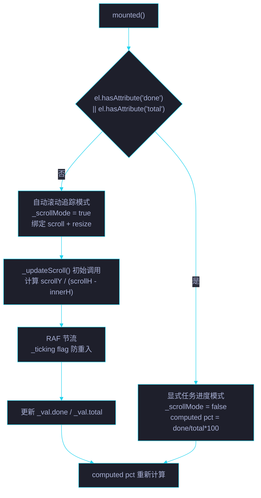

# 场景 4: 双模式进度追踪

> | v5.4.0 | 2026-06-27 | 初始 | 组件: YryProgressBar |
> **导航**: [← 场景 3](../场景-3-组件注册与加载/index.md) · [场景 5 →](../场景-5-页面集成与发布/index.md)
> **交付物**: [📋 清单](清单.html) · [📐 架构](架构图.html) · [🔗 图谱](知识图谱.html) · [📄 源码](源码.html) · [🧪 测试](测试面板.html) · [💡 演示](演示.html) · [📝 审查](审查.html)

[§0 概述](#sec0) · [§1 关键内容](#sec1) · [§2 实施](#sec2) · [§3 验证](#sec3) · [§4 自改进](#sec4)

<a id="sec0"></a>
## §0 概述

本场景是 **YryProgressBar** 的第 4 个场景，聚焦于 **双模式进度追踪**：显式任务进度模式 (done/total 属性) 和自动滚动追踪模式 (scroll + resize 监听)，以及两者的判定逻辑和实现细节。

### 双模式判定流程



<a id="sec1"></a>
## §1 关键内容

### 模式 1: 显式任务进度

**触发条件**: `<yry-progress-bar>` 元素上存在 `done` 或 `total` attribute。

```html
<yry-progress-bar done="5" total="10" label="构建进度"></yry-progress-bar>
```

**进度计算**:
```javascript
computed: {
  pct: function () {
    var d = this._scrollMode ? this._val.done : this.done;
    var t = this._scrollMode ? this._val.total : this.total;
    return t > 0 ? Math.round((d / t) * 100) : 0;
  }
}
```

### 模式 2: 自动滚动追踪

**触发条件**: 元素上不含 `done` 且不含 `total` attribute。

```html
<yry-progress-bar></yry-progress-bar>
<!-- 自动追踪页面滚动进度 -->
```

**核心实现**:
```javascript
mounted: function () {
  var el = this.$el;
  if (el.hasAttribute('done') || el.hasAttribute('total')) return;
  this._scrollMode = true;
  var self = this;
  this._onScroll = function () {
    if (!self._ticking) {
      self._ticking = true;
      requestAnimationFrame(function () { self._updateScroll(); });
    }
  };
  window.addEventListener('scroll', this._onScroll, { passive: true });
  window.addEventListener('resize', this._onScroll, { passive: true });
  this.$nextTick(function () { self._updateScroll(); });
}

_updateScroll: function () {
  var docH = document.documentElement.scrollHeight - window.innerHeight;
  this._val = {
    done: Math.round(window.scrollY),
    total: Math.max(1, Math.round(docH))
  };
  this._ticking = false;
}
```

### 节流策略

| 策略 | 实现 | 效果 |
|------|------|------|
| RAF 同步 | `requestAnimationFrame` 回调 | 与浏览器帧同步 (60fps) |
| flag 防重入 | `_ticking` boolean 标记 | 同一帧内多次 scroll 事件合并为一次更新 |
| passive 监听 | `{ passive: true }` | 不阻塞滚动 · 提升性能 |

### 边界处理

| 边界 | 处理 |
|------|------|
| `total = 0` (显式) | `pct = 0` — 不除零 |
| `total = 0` (滚动) | `Math.max(1, Math.round(docH))` — 保证分母 ≥ 1 |
| `scrollHeight = innerHeight` | `docH = 0` → `total = 1` → 进度始终 0 |
| `done > total` (显式) | `pct > 100` → `width > 100%` 溢出轨道 (CSS 自动裁剪) |
| 快速滚动 | `_ticking` 合并 → 每帧最多 1 次计算 |
| 窗口 resize | 重新计算 total → 进度自动修正 |

### 清理机制

```javascript
beforeUnmount: function () {
  if (this._onScroll) {
    window.removeEventListener('scroll', this._onScroll);
    window.removeEventListener('resize', this._onScroll);
    this._onScroll = null;
  }
}
```

| 清理项 | 时机 | 防漏 |
|--------|------|------|
| scroll listener | `beforeUnmount` | `removeEventListener` |
| resize listener | `beforeUnmount` | `removeEventListener` |
| `_onScroll` 引用 | `beforeUnmount` | 置 `null` 释放闭包 |

### 模式对比

| 维度 | 显式任务进度 | 自动滚动追踪 |
|------|------|------|
| 触发 | done/total attribute 存在 | 无 done 且无 total |
| 进度来源 | prop 绑定 (外部更新) | scrollY / (scrollH - innerH) |
| 响应性 | Vue props 响应式 | RAF + _val 内部状态 |
| listener | 无 | scroll + resize (passive) |
| 清理 | 无 | beforeUnmount 移除 |
| 使用场景 | 任务面板 · 构建进度 | 长文档阅读进度 · 健康报告 |

<a id="sec2"></a>
## §2 实施

### 任务管线

| # | 任务 | 验收信号 | 状态 |
|:---:|------|---------|:---:|
| 1 | 显式模式 computed pct | done=5, total=10 → pct=50 | ✅ |
| 2 | 自动模式判定 | 无属性 → _scrollMode=true → 绑定 listener | ✅ |
| 3 | RAF 节流 | 同一帧多次 scroll → 仅 1 次 _updateScroll | ✅ |
| 4 | passive listener | `{ passive: true }` 参数 | ✅ |
| 5 | _updateScroll 计算 | scrollY 映射到 0-100 | ✅ |
| 6 | beforeUnmount 清理 | scroll/resize listener 移除 | ✅ |
| 7 | 边界: total=0 | 不除零 · Math.max(1, ...) | ✅ |

<a id="sec3"></a>
## §3 验证

| 验证项 | 方法 | 阈值 |
|--------|------|:---:|
| 显式模式进度正确 | done=3, total=8 | pct = 38 |
| 自动模式激活 | 空 `<yry-progress-bar>` 插入页面 | 滚动时进度变化 |
| 模式互斥 | 加 done 属性 → scroll listener 不绑定 | _scrollMode = false |
| RAF 节流生效 | Performance 面板记录调用次数 | scroll 事件数 >> _updateScroll 调用数 |
| 清理无泄漏 | Chrome Memory 面板 | detached DOM = 0 |
| 边界 total=0 | done=5, total=0 | pct = 0 · 无 NaN |
| 边界页面无滚动 | scrollHeight = innerHeight | total = 1 · pct = 0 |

<a id="sec4"></a>
## §4 自改进

| 维度 | 当前 | 目标 | 行动 |
|------|:---:|:---:|------|
| 水平滚动 | 仅垂直 | 支持水平滚动追踪 | `_updateScroll` 检测 overflow-x |
| 指定容器 | 仅 document | 支持 `scroll-target` prop | IntersectionObserver 绑定指定元素 |
| 滚动方向 | 不区分 | 上滚/下滚指示 | 记录上次 scrollY 比较方向 |
| 阅读估算 | 无 | 剩余阅读时间 | 根据滚动速度估算 |

---

> 维护者提示: `_scrollMode` 在 `mounted()` 中仅判定一次，运行时不会动态切换。如需动态切换模式，使用两个独立的 `<yry-progress-bar>` 实例并通过 `v-if` 切换。
