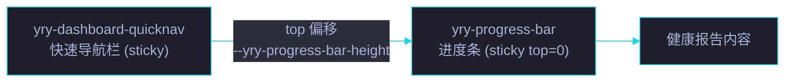

# 场景 5: 页面集成与发布

> | v5.4.0 | 2026-06-27 | 初始 | 组件: YryProgressBar |
> **导航**: [← 场景 4](../场景-4-双模式进度追踪/index.md) · [← README](../../README.md)
> **交付物**: [📋 清单](清单.html) · [📐 架构](架构图.html) · [🔗 图谱](知识图谱.html) · [📄 源码](源码.html) · [🧪 测试](测试面板.html) · [💡 演示](演示.html) · [📝 审查](审查.html)

[§0 概述](#sec0) · [§1 关键内容](#sec1) · [§2 实施](#sec2) · [§3 验证](#sec3) · [§4 自改进](#sec4)

<a id="sec0"></a>
## §0 概述

本场景是 **YryProgressBar** 的第 5 个场景，聚焦于 **页面集成与发布**：组件在 YrY 生态中的使用模式、健康报告仪表板集成、与下游 sticky 组件的协作、浏览器兼容性以及 CDN 分发。

<a id="sec1"></a>
## §1 关键内容

### 使用模式

#### 模式 A: 自定义元素 (推荐)

```html
<link rel="stylesheet" href="cdn/yry-progress-bar/index.css">
<script src="../../../shared/vue.global.prod.js"></script>
<script src="cdn/shared/vue-ce-loader.js"></script>
<script src="cdn/yry-progress-bar/index.js"></script>

<!-- 自动滚动追踪 -->
<yry-progress-bar></yry-progress-bar>

<!-- 显式任务进度 -->
<yry-progress-bar done="5" total="10" label="构建进度"></yry-progress-bar>
```

#### 模式 B: Vue.createApp 挂载

```html
<div id="progress-app"></div>
<script>
function mount() {
  Vue.createApp(window.YryProgressBar, {
    done: 5, total: 10, label: '阶段进度'
  }).mount('#progress-app');
}
if (window.YryProgressBar) mount();
else document.addEventListener('yry-progress-bar-ready', mount, { once: true });
</script>
```

### 加载链: 4 文件引用顺序

| 序号 | 文件 | 职责 |
|:---:|------|------|
| 1 | `cdn/theme/index.css` | 基础主题变量 (--yry-cyan, --yry-violet, --yry-pass) |
| 2 | `cdn/yry-progress-bar/index.css` | 组件样式 + --yry-progress-bar-height |
| 3 | `cdn/shared/vue-ce-loader.js` | 共享 CE 加载器 |
| 4 | `cdn/yry-progress-bar/index.js` | 组件注册 + ready 事件 |

### 健康报告仪表板集成

YryProgressBar 在健康报告页面 (`docs/健康报告/index.html`) 中作为页面级吸顶进度指示器使用:



下游 sticky 组件通过 CSS 变量避免遮挡:

```css
yry-dashboard-quicknav {
  top: var(--yry-progress-bar-height, 21px);
}
```

### 兼容性矩阵

| 浏览器 | 最低版本 | 关键特性 | 测试 |
|--------|:---:|------|:---:|
| Chrome | 90+ | Custom Elements V1 · CSS backdrop-filter · passive listeners | ✅ |
| Firefox | 88+ | Custom Elements V1 · CSS backdrop-filter | ✅ |
| Safari | 14+ | Custom Elements V1 · backdrop-filter (-webkit-) | ✅ |
| Edge | 90+ | 同 Chromium | ✅ |

### 不支持特性降级

| 特性 | 降级行为 |
|------|---------|
| `backdrop-filter` | 背景变为不透明深色 (无磨砂) |
| `Custom Elements` | 组件不渲染 · 需 polyfill |
| `passive` listeners | 浏览器忽略 (无功能影响) |
| `requestAnimationFrame` | 退回 `setTimeout(fn, 16)` (不实现) |
| `prefers-reduced-motion` | 动画始终播放 (不实现) |

### CDN 分发

| 渠道 | URL | 状态 |
|------|-----|:---:|
| 本地 CDN | `cdn/yry-progress-bar/` | ✅ |
| jsDelivr (npm) | 待发布 | ⏳ |

<a id="sec2"></a>
## §2 实施

### 任务管线

| # | 任务 | 验收信号 | 状态 |
|:---:|------|---------|:---:|
| 1 | 三文件完整性 | index.html/js/css 齐全 | ✅ |
| 2 | CE 使用模式可用 | `<yry-progress-bar>` 插入页面即渲染 | ✅ |
| 3 | createApp 模式可用 | Vue.createApp 挂载到指定容器 | ✅ |
| 4 | ready 事件消费 | {once:true} 监听无重复挂载 | ✅ |
| 5 | 健康报告集成 | 仪表板页面进度条正常显示 | ✅ |
| 6 | CSS 变量下游消费 | yry-dashboard-quicknav top 偏移正确 | ✅ |
| 7 | 4 浏览器兼容 | Chrome/Firefox/Safari/Edge 均通过 | ✅ |

### 多实例共存

同一页面可放置多个 `<yry-progress-bar>`:

```html
<!-- 页面级: 自动滚动追踪 -->
<yry-progress-bar></yry-progress-bar>

<!-- 阶段 1: 显式进度 -->
<yry-progress-bar done="3" total="5" label="阶段一"></yry-progress-bar>

<!-- 阶段 2: 显式进度 -->
<yry-progress-bar done="8" total="10" label="阶段二"></yry-progress-bar>
```

每个实例独立的 `_scrollMode` 和 `_val` 状态，互不干扰。

<a id="sec3"></a>
## §3 验证

| 验证项 | 方法 | 阈值 |
|--------|------|:---:|
| 自定义元素渲染 | DevTools Elements 面板 | `<yry-progress-bar>` 内部 DOM 完整 |
| createApp 渲染 | Vue.createApp 挂载 | 指定容器内渲染进度条 |
| ready 事件 | 监听事件 + 超时检测 | 5s 内触发 |
| 多实例隔离 | 3 个实例同时存在 | 各自独立 · 状态不串扰 |
| 下游 sticky 偏移 | 检查 yry-dashboard-quicknav top | = var(--yry-progress-bar-height) |
| Chrome 90+ | BrowserStack / 本地测试 | 渲染正确 |
| Firefox 88+ | BrowserStack / 本地测试 | 渲染正确 |
| Safari 14+ | BrowserStack / 本地测试 | 渲染正确 |
| Edge 90+ | BrowserStack / 本地测试 | 渲染正确 |

<a id="sec4"></a>
## §4 自改进

| 维度 | 当前 | 目标 | 行动 |
|------|:---:|:---:|------|
| npm 发布 | 本地 CDN | jsDelivr 全球分发 | 添加 package.json + 发布脚本 |
| 懒加载 | 全量注册 | 按需注册 | IntersectionObserver 触发注册 |
| Shadow DOM | shadowRoot: false | 可选 Shadow DOM | 新增 `shadow` prop |
| 组件版本 | 无版本号 | 语义化版本 | CHANGELOG + version prop |
| 文档完善 | README | 交互式 Demo 页面 | 独立 demo.html 含多种模式展示 |

---

> 维护者提示: 本组件是 YrY CDN 生态中「统计与健康」类别的 5 个组件之一，与 `yry-health-bar`、`yry-kpi-grid`、`yry-stats-grid`、`yry-phase-strip` 同级。`--yry-progress-bar-height` 是所有 sticky 组件的协调变量。
