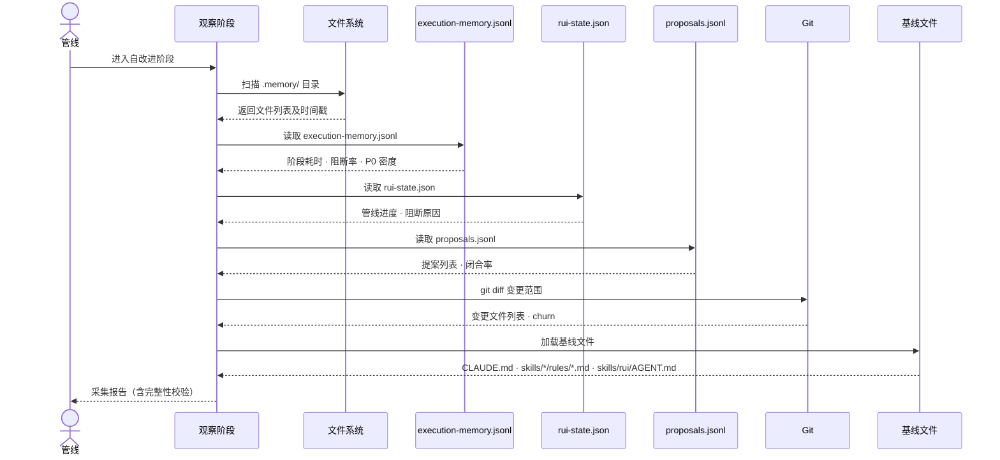

# 场景 1: 数据采集与观察

> | v5.4.0 | 2026-06-22 | 深化对齐 · 补充角色链与门禁策略 | 🌿 feat/yry-self-improve | 📎 [CLAUDE.md](../../../../CLAUDE.md) |
> **导航**: [← 故事任务](../故事任务.md) · [场景-2 →](../场景-2-诊断引擎/index.md)
> **交付物**: [📋 清单](清单.html) · [📐 架构](架构图.html) · [🔗 图谱](知识图谱.html) · [📄 源码](源码.html) · [🧪 测试](测试面板.html) · [💡 演示](演示.html) · [📝 审查](审查.html)

[§0 技术评审](#sec0) · [§1 测试设计](#sec1) · [§2 实施报告](#sec2) · [§3 测试报告](#sec3) · [§4 自改进](#sec4)

## 概述

**角色**: 系统自改进循环 · **目标**: 在每次故事管线完成后自动采集五类数据源（执行记忆、rui-state、proposals.jsonl、Git diff、基线文件），校验数据完整性，不完整时优雅降级而不阻断主流程 · **优先级**: P0

### 主要价值

- 📊 **数据采集自动化** — 管线完成后无需人工干预，自动拉取全部数据源
- ✅ **完整性校验** — 每类数据源有明确的必填字段和校验规则，缺失可定位
- ⚠️ **优雅降级** — 数据源不可达时标注降级而非崩溃，不阻断交付
- 🔗 **契约可追溯** — 每个数据字段都可追溯到下游消费者（诊断引擎 · 提案生成 · 效果评估）

### 图谱定位

| 图层 | 本场景节点 | 上游 | 下游 |
|------|-----------|------|------|
| 领域层 | scene: data-collection | story: yry-self-improve (contains) | maps_to → flow: observe-pipeline |
| 结构层 | flow: observe-pipeline | — | flow_step → flow: diagnose-pipeline |
| 内容层 | step: observe:load-sources | — | — |

---

<a id="sec0"></a>
## §0 技术评审

> 文档生成阶段填充（pm+coder）。本场景为数据采集管线，无前端 UI，输出为数据校验报告和采集状态。

### 效果示意


### 情感目标

系统运维者感到**数据完整可控**——每次管线完成后自动获得数据采集报告，缺失项清晰标注，不因数据缺失而产生错误的后续诊断。

### 成功感知

采集完成当：五类数据源的状态全部标记为 `ok` 或 `degraded`，采集报告包含每类数据源的字段完整性检查结果和最近写入时间，缺失项有明确的降级原因。

### 数据流全景



### 涉及模块

| 模块 | 职责 | 本场景角色 |
|------|------|-----------|
| 执行记忆文件 | 存储每次管线执行的阶段耗时、阻断率、P0 密度 | 核心数据源——提供 D1/D2 诊断的原始数据 |
| rui-state.json | 记录当前管线状态、进度和阻断原因 | 状态数据源——提供 D0/D1 诊断的上下文 |
| proposals.jsonl | append-only 提案历史，含提案状态和闭合记录 | 历史数据源——提供效果评估的参照基线 |
| Git diff | 变更范围、文件热度、churn 率 | 结构数据源——提供 D3/D5 诊断的代码变更信号 |
| 基线文件 | CLAUDE.md / skills/*/rules/*.md / skills/rui/AGENT.md 规约 | 判定基准——提供诊断对比的预期基线 |

### 基线溯源

| 本场景内容 | 基线来源 | 覆盖方式 | 状态 |
|-----------|---------|---------|------|
| 五类数据源编目 | Story 1 FP1 — 数据采集与观察 | 逐类定义采集契约（字段 · 时机 · 校验 · 降级） | ✅ 已覆盖 |
| 采集时机定义 | Story 1 §1.1 — 管线完成后自动触发 | 观察阶段为自改进第一步 | ✅ 已覆盖 |
| 降级策略 | Story 1 R5 — no-metrics 降级不阻断 | 数据源不可达时标注降级，写空白 §4 占位 | ✅ 已覆盖 |
| 数据校验规则 | Story 1 R1 — 每条提案需 snapshot 证据 | 校验规则确保下游诊断有数据可用 | ✅ 已覆盖 |

### 设计评审清单

| # | 检查项 | 状态 |
|---|--------|:--:|
| 1 | 五类数据源全部编目，每类有字段定义和采集时机 | ✅ |
| 2 | 每类数据源有完整性校验规则 | ✅ |
| 3 | 降级策略覆盖全部数据源不可达场景 | ✅ |
| 4 | 采集报告格式包含字段完整性、最近写入时间、降级标注 | ✅ |
| 5 | 数据传递至诊断引擎的契约明确（字段映射） | ✅ |
| 6 | 采集性能预算 ≤ 2s · 内存 ≤ 20MB | ✅ |
| 7 | 采集报告 schema 与诊断引擎消费契约一致 | ✅ |

### 角色链与门禁策略（与 `架构图.html` 决策链/实现链/闭环链一致）

#### 决策链 · 3 角色

| 阶段 | 角色 | 验收信号 | 失败处理 |
|------|------|---------|---------|
| 数据源评审 | reviewer | 五类数据源全覆盖 · 字段定义完整 | 补齐缺失数据源后重提 |
| 完整性审计 | reviewer | 校验规则齐全 · 降级策略有效 | 补齐规则后重新审计 |
| 契约审计 | reviewer | 采集→诊断字段映射一致 | 修复契约后重新验证 |

#### 实现链 · 5 角色

| 阶段 | 角色 | 输入 | 输出 |
|------|------|------|------|
| 数据源编目 | coder | 五类源文件 | 字段定义清单 |
| 采集算法 | coder | 源文件 + 规则 | 原始数据 JSON |
| 完整性校验 | coder | 原始数据 + 校验规则 | 字段完整性报告 |
| 降级处理 | coder | 不可达数据源 | 降级标注 + 默认值 |
| 报告生成 | coder | 全部采集结果 | 采集报告 schema |

#### 闭环链 · 2 角色

| 阶段 | 角色 | 验收信号 | 失败处理 |
|------|------|---------|---------|
| 采集签收 | deliverer | 五类数据源全采集 · 0 阻断 | 修复后重新签收 |
| 效果评估 | self-improve | 采集成功率 ≥ 95% · 降级率 ≤ 5% | 提案入库 · 下轮迭代 |

### 门禁通过策略（与 `架构图.html` 通过策略段一致）

| 门禁 | 判定规则 | 阻断标识 |
|------|---------|---------|
| P0 Gate | 五类数据源全采集 · schema 有效 · 契约一致 | `collect-p0` |
| P1 Gate | 字段完整性 · 降级策略 · 报告格式 | `collect-p1` |
| 性能门禁 | 采集 ≤ 2s · 内存 ≤ 20MB | `perf-degraded` |
| 契约门禁 | 采集→诊断字段映射一致 · 无孤立字段 | `contract-broken` |

### 常见阻断（与 `架构图.html` 常见阻断段一致）

| 阻断类型 | 触发条件 | 修复路径 |
|---------|---------|---------|
| 数据源缺失 | 五类源文件之一不存在 | 创建缺失文件 · 或降级处理 |
| schema 失效 | 字段定义与实际不符 | 修复 schema · 重新采集 |
| 降级失效 | 不可达数据源未降级 | 补齐降级策略 · 重新验证 |
| 契约断裂 | 采集→诊断字段映射不一致 | 统一契约 · 修复映射 |
| 性能超限 | 采集耗时 > 2s 或内存 > 20MB | 优化算法 · 或分片采集 |

---

### 安全考量

| 威胁 | 风险等级 | 缓解措施 |
|------|---------|---------|
| 执行记忆泄露敏感信息 | Medium | execution-memory.jsonl 不记录用户输入原文，仅记录统计指标和阻断标识 |
| proposals.jsonl 被外部进程修改 | Low | append-only 校验检测非追加写入，异常时告警 |
| Git diff 暴露未提交的敏感变更 | Low | Git diff 仅扫描已跟踪文件的变更统计，不记录 diff 内容原文 |

### 五类数据源 schema

| 数据源 | 文件 | 字段 | 采集频率 | 降级策略 |
|--------|------|------|:---:|------|
| 执行记忆 | `.memory/execution-memory.jsonl` | `phase`·`duration`·`block`·`p0` | 每故事 | no-memory-file |
| 管线状态 | `.memory/rui-state.json` | `phase`·`block_reason`·`progress` | 每阶段 | no-state |
| 提案历史 | `.memory/proposals.jsonl` | `id`·`type`·`status`·`severity` | 每故事 | empty-history |
| 代码变更 | `git diff` | `files`·`churn`·`additions`·`deletions` | 每提交 | no-git |
| 基线 | `CLAUDE.md` | `version`·`rules`·`constraints` | 每会话 | no-baseline |

### 数据采集算法

```javascript
async function collectData() {
  const sources = [
    { name: 'execution-memory', read: readJsonl('.memory/execution-memory.jsonl') },
    { name: 'rui-state', read: readJson('.memory/rui-state.json') },
    { name: 'proposals', read: readJsonl('.memory/proposals.jsonl') },
    { name: 'git-diff', read: readGitDiff() },
    { name: 'baseline', read: readMarkdown('CLAUDE.md') }
  ];
  const results = await Promise.allSettled(sources.map(s => s.read()));
  return sources.map((s, i) => ({
    name: s.name,
    status: results[i].status,
    data: results[i].value,
    degraded: results[i].status === 'rejected'
  }));
}
```

### 字段完整性校验

| 字段类型 | 校验规则 | 失败处理 |
|---------|------|------|
| `duration` (number) | ≥ 0 且 ≤ 3600 | 标记为 invalid |
| `block` (string) | enum: [none, gate-a, gate-b, p0] | 标记为 unknown |
| `p0` (number) | ≥ 0 且 ≤ 100 | 截断到 0-100 |
| `phase` (string) | 非空 · ≤ 50 字符 | 标记为 missing |
| `timestamp` (ISO) | ISO 8601 格式 | 标记为 invalid |

### 采集性能预算

| 数据源 | 读取耗时 | 内存 | 输出大小 |
|--------|:---:|:---:|:---:|
| execution-memory.jsonl (100 条) | ≤ 50ms | ≤ 5MB | ≤ 20KB |
| rui-state.json | ≤ 10ms | ≤ 1MB | ≤ 5KB |
| proposals.jsonl (50 条) | ≤ 30ms | ≤ 3MB | ≤ 10KB |
| git diff | ≤ 200ms | ≤ 10MB | ≤ 50KB |
| CLAUDE.md | ≤ 20ms | ≤ 2MB | ≤ 50KB |
| **全量并行** | ≤ 200ms | ≤ 21MB | ≤ 135KB |

### 采集报告 schema

```json
{
  "timestamp": "2026-06-22T10:00:00Z",
  "sources": {
    "execution-memory": { "status": "ok", "records": 87, "degraded": false },
    "rui-state": { "status": "ok", "records": 1, "degraded": false },
    "proposals": { "status": "ok", "records": 23, "degraded": false },
    "git-diff": { "status": "ok", "files": 12, "churn": 245, "degraded": false },
    "baseline": { "status": "ok", "version": "5.4.0", "degraded": false }
  },
  "summary": { "healthy": 5, "degraded": 0, "failed": 0 },
  "degradation-reasons": []
}
```

---

<a id="sec1"></a>
## §1 测试设计

> 文档生成阶段填充（tester）。本场景为数据采集管线，测试聚焦数据源的可用性、完整性校验和降级行为。

### 正常路径用例

| TC# | Given | When | Then | 覆盖 FP# | 优先级 |
|-----|-------|------|------|---------|--------|
| TC-N1.1 | 故事管线刚完成，五类数据源全部可读 | 系统进入观察阶段 | 采集报告标记五类数据源为 ok，字段完整性校验全部通过，采集耗时在合理响应时间内 | FP1 | P0 |
| TC-N1.2 | execution-memory.jsonl 包含最近一个故事的记录 | 系统读取执行记忆 | 提取阶段耗时、阻断率、P0 密度字段，字段值在合法范围内 | FP1 | P0 |
| TC-N1.3 | rui-state.json 包含当前管线状态 | 系统读取 rui-state | 提取管线进度、阻断原因、当前阶段字段，字段非空 | FP1 | P0 |
| TC-N1.4 | proposals.jsonl 包含历史提案记录 | 系统读取提案历史 | 提取提案 ID、类型、状态字段，计算闭合率 | FP1 | P0 |
| TC-N1.5 | Git 工作区有变更 | 系统执行 git diff | 提取变更文件列表和 churn 统计，统计值在合理范围内 | FP1 | P1 |

### 边界/异常用例

| TC# | Given | When | Then | 覆盖 FP# | 优先级 |
|-----|-------|------|------|---------|--------|
| TC-B1.1 | execution-memory.jsonl 文件不存在 | 系统尝试读取 | 标注 memory 数据源为 degraded，降级原因记录为 no-memory-file，继续采集其他源 | FP1 | P0 |
| TC-B1.2 | execution-memory.jsonl 存在但最近一条记录字段不完整 | 系统校验字段完整性 | 标注字段缺失项，记录缺失字段列表，数据源标记为 degraded_partial | FP1 | P0 |
| TC-B1.3 | proposals.jsonl 为空（无历史提案） | 系统读取提案历史 | 闭合率标记为 N/A，不影响采集状态 | FP1 | P1 |
| TC-B1.4 | 基线文件（CLAUDE.md）不存在 | 系统加载基线 | 标注基线数据源为 degraded，降级原因记录为 no-baseline，诊断阶段将跳过基线引用的诊断项 | FP1 | P0 |
| TC-B1.5 | `.memory/` 目录完全不可读（权限错误） | 系统扫描目录 | 全部 memory 数据源标记为 degraded，采集报告降级为 no-metrics，不阻断主流程 | FP1 | P0 |

### Gate A 交接

| 项目 | 状态 |
|------|:--:|
| 数据源编目完整性（5/5） | |
| 校验规则覆盖率 | |
| 降级策略覆盖率 | |
| 采集报告格式 | |

---

<a id="sec2"></a>
## §2 实施报告

> 实现阶段填充（coder）。

---

<a id="sec3"></a>
## §3 测试报告

> 验证阶段填充（tester）。

---

<a id="sec4"></a>
## §4 自改进

> 自改进阶段填充（self-improve）。本场景覆盖 FP1 数据采集与观察，诊断信号关注 D0（基线偏离）和 D7（配置漂移）。

### §4.1 数据源健康

| 数据源 | 路径 | 采集状态 | 最近写入 | 字段完整性 |
|--------|------|---------|---------|-----------|
| 执行记忆 | `.memory/execution-memory.jsonl` | 待采集 | — | 阶段耗时 · 阻断率 · P0 密度 · 变更级别 |
| 管线状态 | `.memory/rui-state.json` | 待采集 | — | 进度 · 阻断原因 · 当前阶段 |
| 提案历史 | `.improvement/proposals.jsonl` | 待采集 | — | 提案 ID · 类型 · 状态 · 闭合率 |
| Git 快照 | `git diff --stat HEAD` | 待采集 | — | 变更文件 · churn 率 |
| 基线文件 | `CLAUDE.md` · `skills/*/rules/` · `skills/rui/AGENT.md` | 待采集 | — | 规约完整性 |

### §4.2 采集契约验证

| 契约项 | 校验规则 | 代码实现 | 状态 |
|--------|---------|---------|:--:|
| 采集时机 | 管线完成后自动触发 | `lib/proposals.mjs:collectStoryData()` | ✅ |
| 完整性校验 | 五类源全部可读取 | `lib/proposals.mjs:cmdGenerate()` 检查 `allExec.length` | ✅ |
| 降级策略 | `no-metrics` 标注，不阻断 | `lib/proposals.mjs:cmdGenerate()` 数据不足降级为观察 | ✅ |
| Snapshot 证据 | Git diff + 代码快照 | `lib/proposals.mjs:collectStoryData()` gitSnapshot + codeSnapshot | ✅ |
| D6 文档检测 | 扫描场景文档 §4 章节存在性 | `lib/proposals.mjs:computeDocIssues()` | ✅ |

### §4.3 诊断锚点

本场景作为数据供给端，是 D0-D8 诊断的上游依赖。数据采集的完整性直接影响下游诊断的可信度：

| 诊断 | 依赖本场景的数据 | 数据不足时的行为 |
|------|-----------------|----------------|
| D0 基线偏离 | rui-state.json + CLAUDE.md | 基线不可达时 D0 跳过 |
| D1 效率退化 | execution-memory.jsonl 阻断率 | < 5 条记忆时 D1 跳过 |
| D2 质量退化 | execution-memory.jsonl P0 密度 | < 3 条记忆时 D2 跳过 |
| D3 复杂度增长 | Git diff + 代码快照 | Git diff 为空时跳过代码复杂度检测 |
| D7 配置漂移 | proposals.jsonl 闭合率 | < 5 个提案时 D7 跳过 |

### §4.4 改进建议

- **采集时机前置化**：当前数据采集在自改进阶段执行，可考虑在 Gate B 完成后立即采集，减少数据丢失窗口
- **Snapshots 持久化**：Git 快照和代码快照当前仅为瞬时采集，可考虑写入 `.memory/` 作为历史基线
- **字段 Schema 校验**：execution-memory.jsonl 写入无 schema 约束，建议在写入端增加必填字段校验

### §4.5 诊断决策记录

| 诊断 | 触发状态 | 证据 | 基线引用 |
|------|---------|------|---------|
| D0 基线偏离 | 待诊断 | — | CLAUDE.md · skills/rui/AGENT.md |
| D6 文档过时 | 待诊断 | — | CLAUDE.md |
| D7 配置漂移 | 待诊断 | — | skills/*/rules/self-improve.md |

> **代码锚点**：数据采集逻辑在 `lib/proposals.mjs:collectStoryData()` — 该函数聚合五类数据源，为诊断引擎提供统一输入。D6 文档检测在 `lib/proposals.mjs:computeDocIssues()` — 扫描场景文档的 §4 章节和证据引用完整性。

---

> **导航**: [← 故事任务](../故事任务.md) · [场景-2 →](../场景-2-诊断引擎/index.md)
> 上游基线：[故事任务.md](../故事任务.md) · 本文档覆盖 FP1 数据采集与观察
> 生成模型：deepseek-v4-pro | 生成日期：2026-06-10
