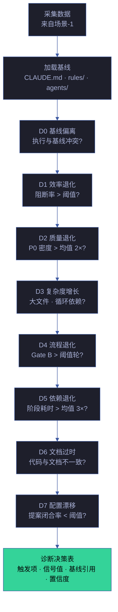
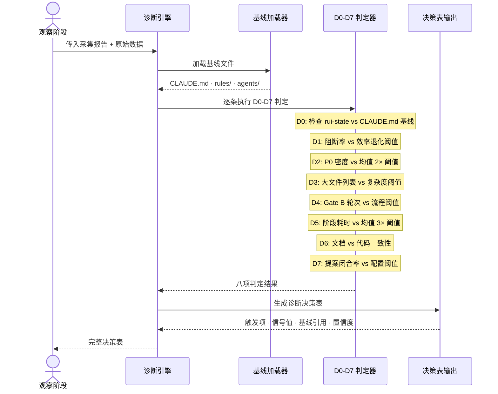

# 场景 2: 诊断引擎

> | v5.1.0 | 2026-06-10 | deepseek-v4-pro | 🌿 feat/yry-self-improve | 📎 [CLAUDE.md](../../../../CLAUDE.md) |
> **导航**: [← 场景-1](../场景-1-数据采集与观察/index.md) · [场景-3 →](../场景-3-提案生成与路由/index.md)

[§0 技术评审](#sec0) · [§1 测试设计](#sec1) · [§2 实施报告](#sec2) · [§3 测试报告](#sec3) · [§4 自改进](#sec4)

## 概述

**角色**: 系统自改进循环 · **目标**: 基于采集数据与基线规约的对比，按 D0–D7 八级诊断规则逐条判定是否触发改进信号，每条判定必须有基线依据和信号阈值，无依据不判定 · **优先级**: P0

### 主要价值

- 🔍 **八维诊断覆盖** — D0–D7 覆盖基线偏离、效率退化、质量退化、复杂度增长、流程退化、依赖退化、文档过时、配置漂移
- ⚓ **基线锚定** — 每条诊断必须引用具体基线文件作为判定依据，不可凭经验主观判断
- 📈 **信号量化** — 诊断信号有明确的阈值定义，信号强度可对比和追踪
- 🚦 **误报控制** — 低置信度诊断仅生成观察记录不生成提案，避免噪声

### 图谱定位

| 图层 | 本场景节点 | 上游 | 下游 |
|------|-----------|------|------|
| 领域层 | scene: diagnose-engine | story: yry-self-improve (contains) | maps_to → flow: diagnose-pipeline |
| 结构层 | flow: diagnose-pipeline | flows_from → flow: observe-pipeline | flow_step → flow: proposal-pipeline |
| 内容层 | step: diagnose:load-baseline · step: diagnose:run-d0-d7 | — | — |

---

## §0 技术评审

> 文档生成阶段填充（pm+coder）。本场景为诊断逻辑，无前端 UI。

### 效果示意

### 情感目标

系统演进者感到**判断有据而非靠猜测**——每个诊断结论都可追溯到具体基线段落和量化信号，避免了"我觉得应该优化"的主观判断。

### 成功感知

诊断完成当：D0–D7 八级诊断全部完成判定（触发/未触发 + 信号值 + 阈值 + 基线引用 + 置信度），无诊断项缺失基线引用，低置信度项已标注观察而非提案。

### 数据流全景

### 诊断项详细定义

| # | 信号 | 假设 | 数据源 | 阈值 | 置信度条件 | 基线依据 |
|---|------|------|--------|------|-----------|---------|
| D0 | 执行与基线冲突 | 哲学偏离 | rui-state.json + CLAUDE.md | 当前阶段不在预期管线序列中 | ≥ 1 条执行记忆 | CLAUDE.md · agents/ |
| D1 | 阻断率超过效率阈值 | 预处理不充分 | execution-memory.jsonl | 阻断率 > BLOCK_RATE_THRESHOLD | ≥ 3 条执行记忆 | rules/code-pipeline.md |
| D2 | P0 密度超过质量阈值 | 设计遗漏 | execution-memory.jsonl | P0 密度 > 滚动均值 × 2 | ≥ 3 条执行记忆 | rules/doc-generation.md |
| D3 | 文件行数超过复杂度阈值或存在循环依赖 | 需求边界模糊 | Git diff + 代码快照 | 文件 > MAX_FILE_LINES 行或循环依赖 > 0 | ≥ 3 条执行记忆 | agents/pm.md |
| D4 | Gate B 轮次超过流程阈值 | 测试先行不足 | execution-memory.jsonl | Gate B > MAX_GATE_B_ROUNDS 轮 | Gate B 计数 ≥ 1 | rules/code-pipeline.md |
| D5 | 某阶段耗时超过均值 3 倍 | Agent 协作瓶颈 | execution-memory.jsonl | 阶段耗时 > 均值 × STAGE_TIMING_MULTIPLIER | ≥ 3 条执行记忆 | agents/ |
| D6 | 连续检测到退化窗口 | 系统性恶化 | retro 分析 | 连续退化窗口 ≥ 2 | retro 分析完成 | CLAUDE.md |
| D7 | 提案闭合率低于闭合阈值 | 改进项不可执行 | proposals.jsonl | 闭合率 < CLOSURE_RATE_THRESHOLD | ≥ 5 个提案 | rules/self-improve.md |

> 阈值作为语义常量定义在 `lib/constants.mjs`，文档中引用常量名而非裸数字。

### 涉及模块

| 模块 | 职责 | 本场景角色 |
|------|------|-----------|
| D0-D7 判定器 | 逐条执行诊断规则的信号判定逻辑 | 核心判定引擎——接收采集数据输出触发/未触发 |
| 基线加载器 | 读取并解析 CLAUDE.md / rules/ / agents/ 规约 | 依据层——为诊断提供判定基准 |
| 决策表生成器 | 将八项判定结果汇总为结构化决策表 | 输出层——生成下游提案路由的输入 |
| lib/proposals.mjs | D0-D7 诊断引擎 + 提案生成 + E1-E4 评估的可执行工具 | 工具层——诊断规则的可执行实现 |

### 基线溯源

| 本场景内容 | 基线来源 | 覆盖方式 | 状态 |
|-----------|---------|---------|------|
| D0-D7 诊断规则定义 | Story 1 FP2 — 诊断引擎 | 逐条定义信号 · 阈值 · 基线引用 · 置信度 | ✅ 已覆盖 |
| 诊断以基线为判定基准 | Story 1 R3 — 每条诊断必须引用基线文件 | 每条诊断标注 baseline_ref 字段 | ✅ 已覆盖 |
| 诊断→提案路由映射 | Story 1 R6 — 诊断组→提案类型路由 | D0/D6/D7→process · D1/D5→refactor · D2/D4→quality · D3→security | ✅ 已覆盖 |
| 诊断基准方法论 | rules/self-improve.md §诊断基准 | 以基线文件为判定依据，假设无依据不成立 | ✅ 已覆盖 |

### 设计评审清单

| # | 检查项 | 状态 |
|---|--------|:--:|
| 1 | D0-D7 八项诊断全部定义，无遗漏 | |
| 2 | 每条诊断有明确的信号来源和阈值 | |
| 3 | 每条诊断引用至少一份基线文件 | |
| 4 | 置信度条件明确（记忆条数/计数要求） | |
| 5 | 低置信度诊断仅生成观察不生成提案 | |

---

### 安全考量

| 威胁 | 风险等级 | 缓解措施 |
|------|---------|---------|
| 诊断规则被篡改导致误判 | Medium | 诊断规则以基线规约为准，工具实现与规约交叉验证 |
| 基线文件引用失效导致诊断无依据 | Low | 基线加载器验证引用文件路径有效性，失效时标注降级 |

---

## §1 测试设计

> 文档生成阶段填充（tester）。测试聚焦诊断规则的判定准确性、基线引用完整性和降级行为。

### 正常路径用例

| TC# | Given | When | Then | 覆盖 FP# | 优先级 |
|-----|-------|------|------|---------|--------|
| TC-N2.1 | 采集报告就绪，基线文件可读 | 系统执行 D0-D7 诊断 | 输出诊断决策表，八项诊断全部完成判定，每项含信号值、阈值、基线引用、置信度 | FP2 | P0 |
| TC-N2.2 | 阻断率低于效率阈值 | 系统执行 D1 诊断 | D1 判定为未触发，信号值为当前阻断率，阈值为 BLOCK_RATE_THRESHOLD | FP2 | P0 |
| TC-N2.3 | P0 密度超过质量阈值（滚动均值 2 倍） | 系统执行 D2 诊断 | D2 判定为触发，置信度标注记忆条数，基线引用指向 doc-generation.md | FP2 | P0 |
| TC-N2.4 | proposals.jsonl 包含超过 MIN_PROPOSALS_FOR_CLOSURE_CHECK 个提案 | 系统执行 D7 诊断 | D7 计算闭合率，与 CLOSURE_RATE_THRESHOLD 对比，输出触发/未触发 | FP2 | P0 |
| TC-N2.5 | 执行记忆条数不足 D1/D2/D3 的置信度最低要求 | 系统执行对应诊断 | 诊断项标注低置信度，判定结果标注为观察而非触发 | FP2 | P1 |

### 边界/异常用例

| TC# | Given | When | Then | 覆盖 FP# | 优先级 |
|-----|-------|------|------|---------|--------|
| TC-B2.1 | 基线文件（rules/code-pipeline.md）不存在 | 系统尝试加载 D1/D4 基线 | D1/D4 诊断标注基线不可达，判定结果为 skipped，降级原因记录为 no-baseline-ref | FP2 | P0 |
| TC-B2.2 | 执行记忆为空（无历史数据） | 系统执行全部诊断 | 所有需要执行记忆的诊断项标注 insufficient-data，不产出误判 | FP2 | P0 |
| TC-B2.3 | 某诊断项在两个基线文件中存在矛盾定义 | 系统加载基线并比对 | 标注基线冲突，记录冲突文件和段落，判定结果标记为 conflict 等待人工裁决 | FP2 | P1 |
| TC-B2.4 | 连续两个窗口均退化（D6 触发） | 系统执行 D6 诊断 | D6 判定为触发，列出两个退化窗口的具体退化指标 | FP2 | P0 |
| TC-B2.5 | Git diff 返回空（无代码变更） | 系统执行 D3 诊断 | D3 跳过代码复杂度检测，仅基于执行记忆中的历史文件大小数据判定 | FP2 | P1 |

### Gate A 交接

| 项目 | 状态 |
|------|:--:|
| D0-D7 八项诊断覆盖率 | |
| 基线引用完整性 | |
| 置信度判定完整性 | |
| 降级覆盖（基线不可达 / 数据不足 / 基线冲突） | |

---

## §2 实施报告

> 实现阶段填充（coder）。

---

## §3 测试报告

> 验证阶段填充（tester）。

---

## §4 自改进

> 自改进阶段填充（self-improve）。本场景覆盖 FP2 诊断引擎，核心是 D0–D7 八级诊断规则的信号判定与基线锚定。

### §4.1 D0–D7 诊断决策表

| # | 标签 | 信号源 | 阈值 | 当前值 | 触发 | 置信度 | 基线依据 |
|---|------|--------|------|--------|:--:|--------|---------|
| **D0** | 基线偏离 | rui-state.json vs CLAUDE.md | 当前阶段不在管线序列中 | — | — | ≥1 条记忆 | CLAUDE.md · agents/ |
| **D1** | 效率退化 | execution-memory.jsonl 阻断率 | `BLOCK_RATE_THRESHOLD` (20%) | — | — | ≥5 条记忆 | rules/code-pipeline.md |
| **D2** | 质量退化 | execution-memory.jsonl P0 密度 | P0 密度 > 50% | — | — | ≥3 条记忆 | rules/doc-generation.md |
| **D3** | 复杂度增长 | Git diff + 代码快照 | T3 占比 > `T3_PROPORTION_THRESHOLD` (30%) | — | — | ≥3 条记忆 | agents/pm.md |
| **D4** | 流程退化 | execution-memory.jsonl Gate B 轮次 | Gate B > `GATE_B_MAX_ROUNDS` (2) | — | — | Gate B 计数 ≥2 | rules/code-pipeline.md |
| **D5** | 依赖退化 | tool-audit.jsonl 工具调用 | 失败率 > `TOOL_ERROR_RATE_THRESHOLD` (30%) | — | — | ≥3 条记忆 | agents/ |
| **D6** | 文档过时 | 场景文档 §4 章节 + 复盘文件 | 连续 2 窗口退化 | — | — | ≥2 条记忆 | CLAUDE.md |
| **D7** | 配置漂移 | proposals.jsonl 闭合率 | 闭合率 < `PROPOSAL_CLOSURE_MIN_RATE` (50%) | — | — | ≥5 个提案 | rules/self-improve.md |

> 阈值常量定义在 `lib/constants.mjs`，诊断逻辑实现在 `lib/engine/diagnostics.mjs`。文档中引用常量名而非裸数字（铁律：禁止魔法数字）。

### §4.2 诊断路由映射

| 诊断组 | 触发信号 | 路由提案类型 | 路由依据 |
|--------|---------|------------|---------|
| D0 / D6 / D7 | 基线偏离 / 文档过时 / 配置漂移 | `process` | `lib/constants.mjs:DIAGNOSTIC_PROPOSAL_TYPE` |
| D1 / D5 | 阻断率上升 / 工具失败率上升 | `refactor` | 同上 |
| D2 / D4 | P0 密度上升 / Gate B 多轮 | `quality` | 同上 |
| D3 | T3 占比偏高 / 复杂度增长 | `security` | 同上 |

### §4.3 代码实现对照

| 诊断 | 实现函数 | 关键逻辑 | 降级行为 |
|------|---------|---------|---------|
| D0 | `runDiagnostics()` | 扫描 `was_blocked` 无原因 + `stage === "unknown"` | `conflicts > 0` 才触发 |
| D1 | `runDiagnostics()` | `blockedCount / execCount > BLOCK_RATE_THRESHOLD` | `execCount < 5` 跳过 |
| D2 | `runDiagnostics()` | `totalP0 / totalIssues > 0.5` | `execCount < 3` 跳过 |
| D3 | `runDiagnostics()` | `t3Count / execCount > T3_PROPORTION_THRESHOLD` | `execCount < 3` 跳过 |
| D4 | `runD4Diagnostic()` | 双路径：statusHistory 回溯 / deliveryTrack 失败计数 | 无状态历史时用 deliveryTrack 代理 |
| D5 | `runD5Diagnostic()` | `toolErrors / toolAudit.length > TOOL_ERROR_RATE_THRESHOLD` | `toolAudit.length < 3` 跳过 |
| D6 | `runD6Diagnostic()` | `computeDocIssues()` 预计算 docIssues | `execCount < 2` 跳过 |
| D7 | `runD7Diagnostic()` | `closed / proposals.length < PROPOSAL_CLOSURE_MIN_RATE` | `proposals.length < 5` 跳过 |

### §4.4 诊断覆盖率自检

| 检查项 | 状态 | 说明 |
|--------|:--:|------|
| D0–D7 全部实现为纯函数可独立测试 | ✅ | `lib/engine/diagnostics.mjs` — 无 FS/I/O |
| 每条诊断有明确信号阈值 | ✅ | 阈值全部从 `lib/constants.mjs` 导入 |
| 每条诊断有基线文件引用 | ✅ | `DIAGNOSTIC_BASELINES` 映射到规约文件 |
| 低置信度诊断仅生成观察不生成提案 | ✅ | `DIAGNOSTIC_MIN_CONFIDENCE` 控制最低记忆条数 |
| 诊断结果可被下游提案路由消费 | ✅ | 返回结构化 `diagnostics[]` 数组 |
| D6 文档检测覆盖场景文档 + 复盘文件 + 提案记录 | ✅ | `computeDocIssues()` 三重检测 |

### §4.5 改进空间

- **D4 双路径统一**：当前 D4 有 statusHistory 和 deliveryTrack 两条路径，数据不完整时自动降级到 deliveryTrack 代理。建议在 rui-state 写入端统一记录，减少双路径复杂度
- **D6 检测粒度**：当前 D6 检测 §4 章节存在性和 §2 证据引用，但未检测 §4 内容质量（如诊断决策表是否完整、E1-E4 是否已填写）。可增加内容完整性评分
- **D5 依赖退化扩展**：当前 D5 仅统计工具调用失败率，`agents/self-improve.md` 还定义了趋势查询（rui-trends 外部参考新鲜度），建议在 D5 诊断中增加外部依赖版本过期检测

> **代码锚点**：诊断引擎 `lib/engine/diagnostics.mjs:runDiagnostics()` — 纯函数式八级诊断，数据入结果出。常量映射 `lib/constants.mjs:DIAGNOSTIC_PROPOSAL_TYPE` — 诊断 ID → 提案类型的路由表。

---

> **导航**: [← 场景-1](../场景-1-数据采集与观察/index.md) · [场景-3 →](../场景-3-提案生成与路由/index.md)
> 上游基线：[故事任务.md](../故事任务.md) · 本文档覆盖 FP2 诊断引擎
> 生成模型：deepseek-v4-pro | 生成日期：2026-06-10
