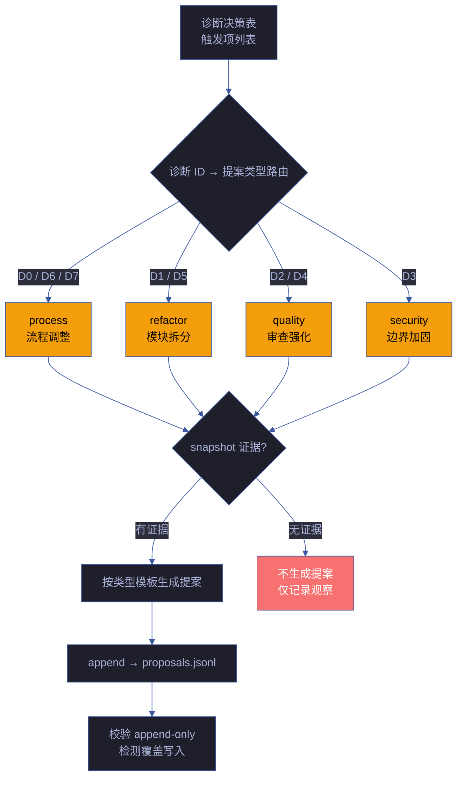
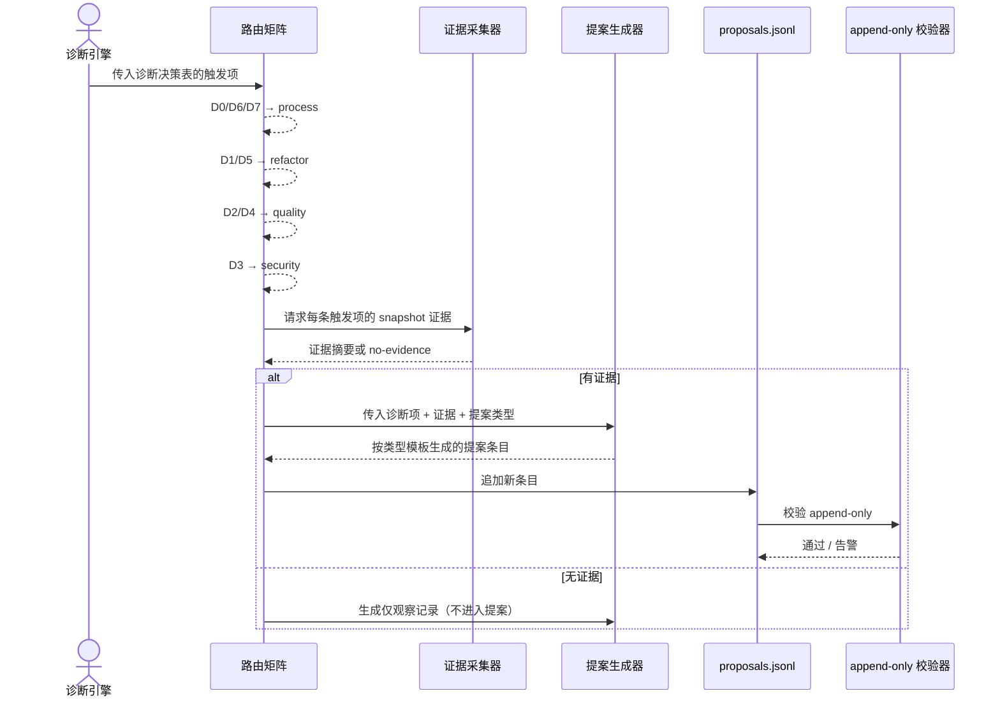

# 场景 3: 提案生成与路由

> | v5.1.0 | 2026-06-10 | deepseek-v4-pro | 🌿 feat/yry-self-improve | 📎 [CLAUDE.md](../../../../CLAUDE.md) |
> **导航**: [← 场景-2](../场景-2-诊断引擎/index.md) · [场景-4 →](../场景-4-效果评估与闭环/index.md)

[§0 技术评审](#sec0) · [§1 测试设计](#sec1) · [§2 实施报告](#sec2) · [§3 测试报告](#sec3) · [§4 自改进](#sec4)

## 概述

**角色**: 系统自改进循环 · **目标**: 将诊断决策表中的触发项按路由矩阵映射到五种提案类型，每条提案必须有 snapshot 证据支撑，追加到 proposals.jsonl 且遵循 append-only 约束，状态变更通过新增条目而非覆盖 · **优先级**: P0

### 主要价值

- 🗺️ **路由自动映射** — 诊断信号自动路由到对应提案类型，无需人工判断
- 📎 **证据强制** — 每条提案必须附 snapshot 证据，无证据不生成，防止空洞建议
- 📝 **追加式记录** — proposals.jsonl append-only，状态变更可完整追溯
- 🏷️ **类型化模板** — 五种提案类型各有固定要素模板，结构一致便于分析

### 图谱定位

| 图层 | 本场景节点 | 上游 | 下游 |
|------|-----------|------|------|
| 领域层 | scene: proposal-generation | story: yry-self-improve (contains) | maps_to → flow: proposal-pipeline |
| 结构层 | flow: proposal-pipeline | flows_from → flow: diagnose-pipeline | flow_step → flow: evaluate-pipeline |
| 内容层 | step: proposal:route · step: proposal:generate · step: proposal:append | — | — |

---

<a id="sec0"></a>
## §0 技术评审

> 文档生成阶段填充（pm+coder）。本场景为提案生成逻辑，无前端 UI。

### 效果示意



### 情感目标

系统演进者感到**改进可执行且可信赖**——每条提案有数据支撑和来源追溯，不是泛泛的"建议优化"，而是有具体模块、具体信号、具体改进方向的 actionable item。

### 成功感知

提案生成完成当：每条触发的诊断都路由到了正确的提案类型，每条提案包含证据摘要、基线引用和建议方向，proposals.jsonl 新增条目且历史条目未被修改。

### 数据流全景



### 提案类型模板

#### process — 流程调整

| 要素 | 说明 |
|------|------|
| 触发诊断 | D0（基线偏离）/ D6（文档过时）/ D7（配置漂移） |
| 核心问题 | 当前流程中导致偏离/过时/漂移的具体环节 |
| 证据摘要 | 偏离值与基线的对比数据 |
| 建议方向 | 调整哪个阶段的哪个流程步骤 |
| 示例 | "Gate A 阶段耗时 3 倍于基线均值，建议增加预检脚本在进入 Gate A 前校验依赖完整性" |

#### refactor — 模块拆分

| 要素 | 说明 |
|------|------|
| 触发诊断 | D1（效率退化）/ D5（依赖退化） |
| 核心问题 | 导致效率或依赖退化的模块结构问题 |
| 证据摘要 | 耗时对比 / 依赖版本数据 |
| 建议方向 | 拆分哪个模块，拆成几个子模块 |
| 示例 | "某规约文件行数超过模块行数上限，建议拆为 detect/generate/verify 三段独立小节" |

#### quality — 审查强化

| 要素 | 说明 |
|------|------|
| 触发诊断 | D2（质量退化）/ D4（流程退化） |
| 核心问题 | 导致 P0 密度上升或 Gate B 多轮的审查盲点 |
| 证据摘要 | P0 密度趋势 / Gate B 轮次统计 |
| 建议方向 | 强化哪个角色的哪项审查检查项 |
| 示例 | "P0 密度连续多个故事上升，建议 coder 自审查清单增加 SQL 注入检查项" |

#### security — 边界加固

| 要素 | 说明 |
|------|------|
| 触发诊断 | D3（复杂度增长） |
| 核心问题 | 复杂度增长暴露的安全或边界模糊问题 |
| 证据摘要 | 大文件列表 / 循环依赖路径 |
| 建议方向 | 加固哪个边界，添加何种校验 |
| 示例 | "第三方脚本无 SRI 校验，建议添加 integrity 属性" |

### 涉及模块

| 模块 | 职责 | 本场景角色 |
|------|------|-----------|
| 路由矩阵 | 诊断 ID → 提案类型的映射表 | 路由层——确保每个诊断信号到达正确的提案模板 |
| 证据采集器 | 从数据源重新拉取 snapshot 证据 | 证据层——确保每条提案有数据支撑 |
| 提案生成器 | 按类型模板生成结构化提案条目 | 生成层——产出 proposals.jsonl 新条目 |
| append-only 校验器 | 检测 proposals.jsonl 的非追加写入 | 安全层——确保历史记录不可覆盖 |
| lib/proposals.mjs | 可执行工具——诊断 + 提案 + 评估一体化 | 工具层——提案生成的代码实现 |

### 基线溯源

| 本场景内容 | 基线来源 | 覆盖方式 | 状态 |
|-----------|---------|---------|------|
| 五种提案类型定义 | Story 1 FP3 — 提案生成与路由 | process · quality · refactor · security · skill 全部覆盖 | ✅ 已覆盖 |
| 诊断→提案路由映射 | Story 1 R6 — 诊断组→提案类型路由 | D0/D6/D7→process · D1/D5→refactor · D2/D4→quality · D3→security | ✅ 已覆盖 |
| 提案必须有 snapshot 证据 | Story 1 R1 — 无证据不出提案 | 证据采集器校验 evidence 字段非空 | ✅ 已覆盖 |
| proposals.jsonl append-only | Story 1 R2 — 状态变更通过新增条目 | append-only 校验器检测覆盖写入 | ✅ 已覆盖 |

### 设计评审清单

| # | 检查项 | 状态 |
|---|--------|:--:|
| 1 | 五种提案类型全部定义，每类有固定要素模板 | |
| 2 | 诊断→提案路由映射完整覆盖 D0-D7 | |
| 3 | 无证据时仅生成观察记录，不生成提案 | |
| 4 | proposals.jsonl append-only 约束有校验机制 | |
| 5 | 提案条目包含证据摘要、基线引用、建议方向 | |

---

### 安全考量

| 威胁 | 风险等级 | 缓解措施 |
|------|---------|---------|
| proposals.jsonl 被意外覆盖 | Medium | append-only 校验器检测非追加写入并告警 |
| 提案生成器被恶意输入注入 | Low | 提案内容来自诊断引擎的结构化输出，非用户直接输入 |

---

<a id="sec1"></a>
## §1 测试设计

> 文档生成阶段填充（tester）。测试聚焦提案路由正确性、证据强制约束和 append-only 校验。

### 正常路径用例

| TC# | Given | When | Then | 覆盖 FP# | 优先级 |
|-----|-------|------|------|---------|--------|
| TC-N3.1 | 诊断决策表包含 D1 触发项，执行记忆足够 | 系统生成提案 | 提案类型为 refactor，提案包含信号值、基线引用、建议方向和证据摘要 | FP3 | P0 |
| TC-N3.2 | 诊断决策表包含 D3 触发项，代码快照有证据 | 系统生成提案 | 提案类型为 security，提案包含大文件列表或循环依赖路径作为证据 | FP3 | P0 |
| TC-N3.3 | 诊断决策表包含 D0 + D6 两个触发项 | 系统分别路由 | D0→process 提案，D6→process 提案，两条提案各自独立追加 | FP3 | P0 |
| TC-N3.4 | proposals.jsonl 已有历史提案 | 系统追加新提案 | 新提案追加到文件末尾，历史提案未被修改，append-only 校验通过 | FP3 | P0 |
| TC-N3.5 | 诊断决策表包含低置信度触发项 | 系统生成输出 | 生成观察记录但不出提案，观察记录标注置信度不足原因 | FP3 | P1 |

### 边界/异常用例

| TC# | Given | When | Then | 覆盖 FP# | 优先级 |
|-----|-------|------|------|---------|--------|
| TC-B3.1 | 诊断触发项但 snapshot 证据采集失败 | 系统尝试生成提案 | 提案不生成，输出无证据观察记录，标注 evidence-unavailable | FP3 | P0 |
| TC-B3.2 | proposals.jsonl 被外部进程修改（非追加） | 系统校验 append-only | 检测到非追加写入，告警并记录异常，当前提案仍正常追加但标注 integrity-warning | FP3 | P0 |
| TC-B3.3 | 诊断决策表为空（无触发项） | 系统执行提案生成 | 提案生成步骤跳过，记录 no-proposals-this-cycle 状态 | FP3 | P1 |
| TC-B3.4 | 同一故事多次运行诊断（重复触发同一诊断） | 系统生成提案 | 检测到与最近提案相似度超过去重阈值的条目，标注 potential-duplicate 并链接到前次提案 ID | FP3 | P1 |
| TC-B3.5 | proposals.jsonl 文件不存在 | 系统首次生成提案 | 创建新文件，写入首条提案，append-only 校验跳过（首次写入不校验） | FP3 | P1 |

### Gate A 交接

| 项目 | 状态 |
|------|:--:|
| 五种提案类型模板覆盖率 | |
| 诊断→提案路由映射完整性 | |
| evidence 强制约束验证 | |
| append-only 校验覆盖 | |

---

<a id="sec2"></a>
## §2 实施报告

> 实现阶段填充（coder）。

---

<a id="sec3"></a>
## §3 测试报告

> 验证阶段填充（tester）。

---

<a id="sec4"></a>
## §4 自改进

> 自改进阶段填充（self-improve）。本场景覆盖 FP3 提案生成与路由，核心是诊断→提案类型映射、snapshot 证据强制和 append-only 约束。

### §4.1 提案路由矩阵

| 诊断 ID | 提案类型 | 触发条件 | 优先级判定 | 去重策略 |
|---------|---------|---------|-----------|---------|
| D0 | `process` | 基线偏离触发 | `confidence ≥ 5 → P0, ≥ 3 → P1, else P2` | 已有 open 提案则跳过 |
| D1 | `refactor` | 阻断率超阈值 | 同上 | 同上 |
| D2 | `quality` | P0 密度超阈值 | 同上 | 同上 |
| D3 | `security` | T3 占比超阈值 | 同上 | 同上 |
| D4 | `quality` | Gate B 超轮次 | 同上 | 同上 |
| D5 | `refactor` | 工具失败率超阈值 | 同上 | 同上 |
| D6 | `process` | 文档过时 | 同上 | 同上 |
| D7 | `process` | 闭合率低于阈值 | 同上 | 同上 |

> 路由表定义在 `lib/constants.mjs:DIAGNOSTIC_PROPOSAL_TYPE`，优先级判定在 `lib/proposals.mjs:generateProposals()`。

### §4.2 提案要素模板

| 提案类型 | 核心问题域 | 证据要求 | 建议方向模板 | 示例 |
|---------|-----------|---------|-------------|------|
| `process` | 流程环节偏离/过时/漂移 | 偏离值与基线对比数据 | 调整 {阶段} 的 {步骤} | "Gate A 阶段耗时 3 倍基线，建议增加预检脚本" |
| `refactor` | 模块结构导致效率/依赖退化 | 耗时对比 / 依赖版本数据 | 拆分 {模块} 为 {N} 个子模块 | "规约文件行数超限，建议拆为 detect/generate/verify" |
| `quality` | 审查盲点导致质量退化 | P0 密度趋势 / Gate B 轮次 | 强化 {角色} 的 {检查项} | "P0 密度上升，建议 coder 自审查增加 SQL 注入项" |
| `security` | 复杂度增长暴露边界模糊 | 大文件列表 / 循环依赖路径 | 加固 {边界} 的 {校验} | "第三方脚本无 SRI，建议添加 integrity 校验" |
| `skill` | Agent 反复犯同类错误 | 重复模式 + 发生频率 | 创建 {skill/rule} 专项检查 | "Agent 反复犯错 → 创建专项 Red Flag" |

### §4.3 证据门禁验证

| 门禁 | 规则来源 | 代码实现 | 校验方式 |
|------|---------|---------|---------|
| Snapshot 证据 | `rules/self-improve.md` R1 | `generateProposals()` 检查 `hasGitSnapshot \|\| hasCodeSnapshot` | 无 snapshot 则跳过全部提案生成 |
| 去重检测 | — | `generateProposals()` 收集 `openDiags` Set | 同诊断已有 open 提案则跳过 |
| Append-only | `rules/self-improve.md` R2 | `appendFileSync()` 追加写入 | 使用 `appendFileSync` 而非 `writeFileSync` |
| 提案 ID 唯一性 | — | `${storyName}-${diagId}-${timestamp}` | 故事名 + 诊断 ID + 时间戳组合 |
| 低置信度过滤 | `rules/self-improve.md` §诊断规则 | `DIAGNOSTIC_MIN_CONFIDENCE` 控制诊断触发 | 置信度不足的诊断不生成，不进入提案阶段 |

### §4.4 提案状态机

```
open → in_progress → done       (闭合 — E4 改善 > 退化)
  ↓        ↓
  └──→ rolled_back              (退化 — E4 退化 > 改善)
  └──→ superseded               (被后续提案替代)
```

| 状态 | 含义 | 变更方式 |
|------|------|---------|
| `open` | 待执行 | 诊断触发时创建 |
| `in_progress` | 执行中 | 实例化 (materialize) 后 |
| `done` | 已闭合 | E4 综合判定改善后 |
| `rolled_back` | 已回退 | E4 综合判定退化后 |
| `superseded` | 已被替代 | 新提案覆盖同一问题时 |

### §4.5 代码实现对照

| 功能 | 文件:函数 | 关键逻辑 |
|------|---------|---------|
| 提案生成 | `lib/proposals.mjs:generateProposals()` | 诊断去重 → 快照证据校验 → 类型路由 → 优先级判定 → append |
| 提案序列化 | `lib/proposals.mjs:generateProposals()` → `appendFileSync()` | 每条提案一行 JSON，追加到 proposals.jsonl |
| 提案列表 | `lib/proposals.mjs:cmdList()` | 按状态过滤，统计状态分布 |
| 实例化 | `lib/engine/materialize.mjs:materializeProposal()` | open 提案 → 故事任务目录 + rui-state.json + 基线文档 |
| 升级检测 | `lib/engine/upgrade.mjs:cmdUpgradeCandidates()` | 统计同类型提案跨故事触发次数 vs 升级阈值 |

### §4.6 提案同步状态

| 检查项 | 状态 | 说明 |
|--------|:--:|------|
| 五种提案类型模板完整 | ✅ | process · quality · refactor · security · skill |
| 诊断→提案路由完整覆盖 D0-D7 | ✅ | `DIAGNOSTIC_PROPOSAL_TYPE` 8/8 映射 |
| 无证据阻止提案生成 | ✅ | `generateProposals()` 前置快照检查 |
| Append-only 写入 | ✅ | 使用 `appendFileSync` |
| 同诊断去重 | ✅ | 检查已有 open 提案的 `openDiags` Set |

### §4.7 改进空间

- **提案相似度去重**：当前仅按诊断 ID 去重，未按提案内容相似度检测。同一诊断的两次触发可能建议不同方向，应增加语义相似度判断
- **提案优先级动态调整**：当前优先级根据 confidence 一次性判定，未根据提案滞留时间或重复触发次数动态升级
- **提案效果预估**：当前提案生成时无效果预估，建议在提案模板中增加预期改善幅度字段，便于后续 E1-E4 评估时对比预期 vs 实际

> **代码锚点**：`lib/proposals.mjs:generateProposals()` — 提案生成入口，包含快照校验、去重、路由、优先级判定全流程。`lib/constants.mjs:DIAGNOSTIC_PROPOSAL_TYPE` — 诊断→提案类型路由表。

---

> **导航**: [← 场景-2](../场景-2-诊断引擎/index.md) · [场景-4 →](../场景-4-效果评估与闭环/index.md)
> 上游基线：[故事任务.md](../故事任务.md) · 本文档覆盖 FP3 提案生成与路由
> 生成模型：deepseek-v4-pro | 生成日期：2026-06-10
