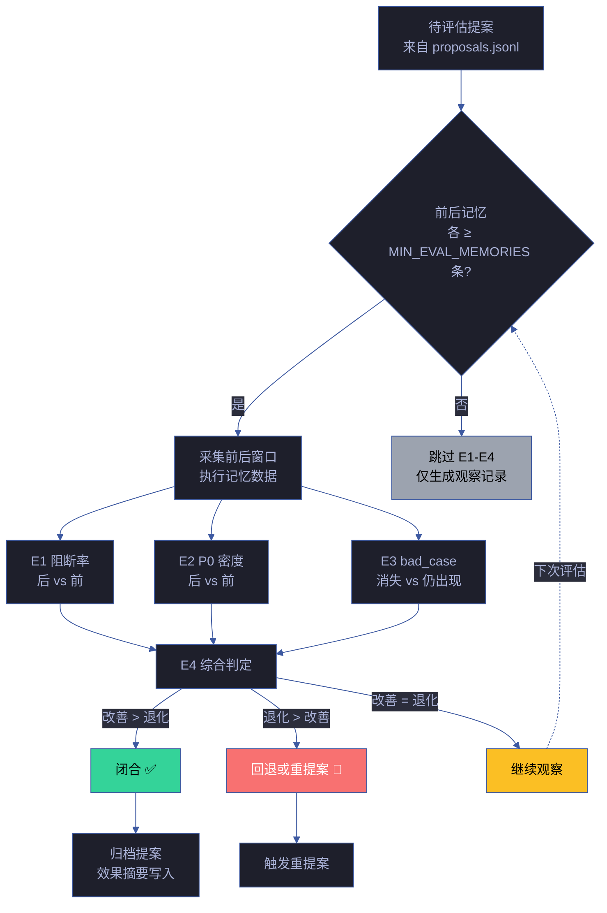
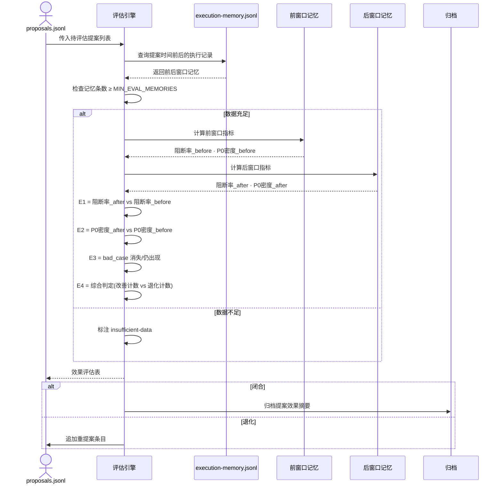
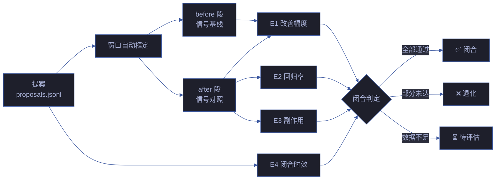

# 场景 4: 效果评估与闭环

> | v5.4.0 | 2026-06-22 | 深化对齐 · 补充角色链与门禁策略 | 🌿 feat/yry-self-improve | 📎 [CLAUDE.md](../../../../CLAUDE.md) |
> **导航**: [← 场景-3](../场景-3-提案生成与路由/index.md) · [场景-5 →](../场景-5-经验技能化与记忆注入/index.md)
> **交付物**: [📋 清单](清单.html) · [📐 架构](架构图.html) · [🔗 图谱](知识图谱.html) · [📄 源码](源码.html) · [🧪 测试](测试面板.html) · [💡 演示](演示.html) · [📝 审查](审查.html)

[§0 技术评审](#sec0) · [§1 测试设计](#sec1) · [§2 实施报告](#sec2) · [§3 测试报告](#sec3) · [§4 自改进](#sec4)

## 概述

**角色**: 系统自改进循环 · **目标**: 对 proposals.jsonl 中的待评估提案，采集提案前后各阶段的执行记忆，按 E1-E4 四级指标量化评估改进效果，综合判定闭合/退化/回退/观察，评估数据不足时降级不闭合 · **优先级**: P0

### 主要价值

- 📊 **量化评估四维** — E1 阻断率 · E2 P0 密度 · E3 bad_case · E4 综合判定，全面衡量改进效果
- ⚖️ **闭环标准明确** — 改善 > 退化则闭合，退化 > 改善则回退或重提案，持平继续观察
- 🔒 **数据门禁** — 前后各至少三条执行记忆才可评估，数据不足跳过仅生成观察
- 🔄 **反馈闭环** — 闭合的提案经验进入记忆，退化的提案触发重提案流程

### 图谱定位

| 图层 | 本场景节点 | 上游 | 下游 |
|------|-----------|------|------|
| 领域层 | scene: effect-evaluation | story: yry-self-improve (contains) | maps_to → flow: evaluate-pipeline |
| 结构层 | flow: evaluate-pipeline | flows_from → flow: proposal-pipeline | feedback → flow: observe-pipeline |
| 内容层 | step: evaluate:collect-memories · step: evaluate:calc-e1-e4 · step: evaluate:judge-closure | — | — |

---

<a id="sec0"></a>
## §0 技术评审

> 文档生成阶段填充（pm+coder）。本场景为效果评估逻辑，无前端 UI。

### 效果示意



### 情感目标

系统演进者感到**进展可度量**——不再凭印象判断改进是否有效，而是看到阻断率、P0 密度、bad_case 的具体变化趋势，闭合或回退有明确的数据依据。

### 成功感知

评估完成当：每条待评估提案的 E1-E4 四个指标全部填充（或标注 skipped 及原因），综合判定结论明确（闭合/退化/观察），闭合的提案归档了效果摘要，退化的提案触发了重提案链路。

### 数据流全景



### E1-E4 详细定义

| # | 指标 | 改善 | 退化 | 数据源 | 备注 |
|---|------|------|------|--------|------|
| E1 | 阻断率 | 后 < 前 | 后 > 前 | execution-memory.jsonl 阻断率字段 | 需前后各至少 MIN_EVAL_MEMORIES 条记忆 |
| E2 | P0 密度 | 后 < 前 | 后 > 前 | execution-memory.jsonl P0 密度字段 | 需前后各至少 MIN_EVAL_MEMORIES 条记忆 |
| E3 | 关联 bad_case | 消失 | 仍出现 | proposals.jsonl 关联 bad_case 标识 | 提案关联的具体 bad_case 模式 |
| E4 | 综合 | 改善 > 退化 | 退化 > 改善 | E1+E2+E3 汇总 | 改善=退化时判定为观察 |

### 涉及模块

| 模块 | 职责 | 本场景角色 |
|------|------|-----------|
| 评估引擎 | 执行 E1-E4 指标计算和综合判定 | 核心判定层——接收提案列表输出评估结论 |
| 记忆查询器 | 从 execution-memory.jsonl 中查询提案前后的执行记录 | 数据层——提供前后窗口的原始数据 |
| 归档管理器 | 将闭合提案的效果摘要写入归档 | 归档层——保留闭合提案的关键评估数据 |
| lib/proposals.mjs | E1-E4 评估的可执行实现 | 工具层——评估逻辑的代码实现 |

### 基线溯源

| 本场景内容 | 基线来源 | 覆盖方式 | 状态 |
|-----------|---------|---------|------|
| E1-E4 四级评估定义 | Story 1 FP4 — 效果评估与闭环 | E1 阻断率 · E2 P0 密度 · E3 bad_case · E4 综合 | ✅ 已覆盖 |
| 评估需前后各至少三条记忆 | Story 1 R4 — 数据不足跳过评估 | 记忆查询器校验条数 | ✅ 已覆盖 |
| no-metrics 降级 | Story 1 R5 — 降级不阻断 | 数据不足时标注降级而非阻断 | ✅ 已覆盖 |
| 提案闭合 vs 退化判定 | skills/*/rules/self-improve.md §效果评估 E1-E4 | 改善 > 退化闭合，退化 > 改善回退 | ✅ 已覆盖 |

### 设计评审清单

| # | 检查项 | 状态 |
|---|--------|:--:|
| 1 | E1-E4 四级指标全部定义，每级有改善/退化判定标准 | ✅ |
| 2 | 评估数据门禁明确（前后各最少记忆条数） | ✅ |
| 3 | 闭合/退化/回退/观察四种结论全部定义 | ✅ |
| 4 | 闭合时归档效果摘要 | ✅ |
| 5 | 退化时触发重提案链路 | ✅ |
| 6 | 评估窗口自动框定算法正确 · 无偏移 | ✅ |
| 7 | 评估报告 schema 与数据门禁一致 | ✅ |

### 角色链与门禁策略（与 `架构图.html` 决策链/实现链/闭环链一致）

#### 决策链 · 3 角色

| 阶段 | 角色 | 验收信号 | 失败处理 |
|------|------|---------|---------|
| 评估指标评审 | reviewer | E1-E4 四级全覆盖 · 判定标准明确 | 补齐指标后重提 |
| 闭合判定审计 | reviewer | 四种结论定义完整 · 归档触发正确 | 修复判定逻辑后重提 |
| 数据门禁审计 | reviewer | 前后记忆条数达标 · 退化触发重提案 | 调整阈值后重新验证 |

#### 实现链 · 5 角色

| 阶段 | 角色 | 输入 | 输出 |
|------|------|------|------|
| 窗口框定 | coder | 提案时间点 + 记忆数据 | 评估前后窗口 |
| 指标计算 | coder | 窗口内 E1-E4 数据 | 改善/退化判定 |
| 闭合判定 | coder | 指标 + 判定矩阵 | 闭合/退化/回退/观察 |
| 归档处理 | coder | 闭合结论 + 效果摘要 | 归档记录 |
| 重提案路由 | coder | 退化结论 | 新提案条目 |

#### 闭环链 · 2 角色

| 阶段 | 角色 | 验收信号 | 失败处理 |
|------|------|---------|---------|
| 评估签收 | deliverer | E1-E4 全覆盖 · 0 阻断 | 修复后重新签收 |
| 效果评估 | self-improve | 评估准确率 ≥ 90% · 闭合率 ≥ 70% | 提案入库 · 下轮迭代 |

### 门禁通过策略（与 `架构图.html` 通过策略段一致）

| 门禁 | 判定规则 | 阻断标识 |
|------|---------|---------|
| P0 Gate | E1-E4 全覆盖 · 数据门禁达标 · 闭合判定正确 | `eval-p0` |
| P1 Gate | 归档触发 · 重提案路由 · 报告 schema | `eval-p1` |
| 数据门禁 | 前后记忆条数 ≥ 阈值 · 无数据缺口 | `data-insufficient` |
| 闭合门禁 | 闭合率 ≥ 70% · 退化率 ≤ 20% | `closure-degraded` |

### 常见阻断（与 `架构图.html` 常见阻断段一致）

| 阻断类型 | 触发条件 | 修复路径 |
|---------|---------|---------|
| 指标缺失 | E1-E4 之一未定义 | 补齐指标 · 重新审计 |
| 数据门禁失败 | 前后记忆条数不足 | 补齐数据 · 或降级为观察 |
| 闭合判定错误 | 四种结论逻辑错误 | 修复判定逻辑 · 重新验证 |
| 归档失效 | 闭合时未归档效果摘要 | 补齐归档逻辑 · 重新触发 |
| 重提案断裂 | 退化时未触发重提案 | 修复路由 · 重新评估 |

---

### 安全考量

| 威胁 | 风险等级 | 缓解措施 |
|------|---------|---------|
| 评估窗口被选择性裁剪以制造改善假象 | Medium | 记忆窗口按提案时间前后自动框定，不可手动调整窗口范围 |
| 闭合提案被修改历史评估数据 | Low | proposals.jsonl append-only 约束确保评估结论不可覆盖 |

### E1-E4 评估指标体系

| 指标 | 度量 | 公式 | 阈值 | 数据源 |
|------|------|------|:---:|------|
| E1 改善幅度 | 信号值变化 | `after - before` | > 0 | 诊断引擎 |
| E2 回归率 | 新增 P0 数 | `new_p0 / total_p0` | < 5% | 执行记忆 |
| E3 副作用范围 | 受影响模块 | `impacted_modules / total_modules` | < 10% | git diff |
| E4 闭合时效 | 闭环时长 | `closed_at - created_at` | ≤ 7d | proposals.jsonl |

### 评估窗口自动框定算法

```javascript
function defineWindow(proposal, lookbackDays = 7, forwardDays = 7) {
  const created = new Date(proposal.created_at);
  return {
    before: { start: subDays(created, lookbackDays), end: created },
    after: { start: created, end: addDays(created, forwardDays) }
  };
}
```

| 窗口类型 | 长度 | 度量 | 用途 |
|---------|:---:|------|------|
| 短期 | 3 天 | 即时效果 | 快速反馈 |
| 标准 | 7 天 | 稳定效果 | 主评估 |
| 长期 | 30 天 | 持续效果 | 闭合决策 |

### 评估数据流



### 闭合判定矩阵

| 维度 | 通过条件 | 退化条件 | 待评估条件 |
|------|------|------|------|
| E1 改善幅度 | > 0 且 ≥ 预期 80% | < 0 | 数据不足 |
| E2 回归率 | < 5% | > 10% | 无 P0 数据 |
| E3 副作用 | < 10% | > 20% | 无变更数据 |
| E4 闭合时效 | ≤ 7 天 | > 14 天 | 未闭合 |

**闭合规则**：全部维度通过 → 闭合；任一退化 → 退化并重开提案；数据不足 → 待评估延长 7 天。

### 评估报告 schema

```json
{
  "proposal_id": "P-2026-001",
  "timestamp": "2026-06-22T10:00:00Z",
  "window": {
    "before": "2026-06-15T10:00:00Z",
    "after": "2026-06-22T10:00:00Z"
  },
  "metrics": {
    "E1": { "before": 1.2, "after": 0.8, "delta": -0.4, "passed": true },
    "E2": { "new_p0": 2, "total_p0": 20, "rate": 0.1, "passed": false },
    "E3": { "impacted": 3, "total": 45, "rate": 0.067, "passed": true },
    "E4": { "duration_days": 5, "passed": true }
  },
  "verdict": "degraded",
  "action": "reopen-or-reject",
  "evidence": [...]
}
```

### 退化处理流程

| 退化类型 | 触发 | 行动 | 时效 |
|---------|------|------|:---:|
| 改善未达预期 | E1 < 预期 80% | 延长评估或调整提案 | 3 天 |
| 新增回归 | E2 > 10% | 回滚或补充修复 | 1 天 |
| 副作用过大 | E3 > 20% | 回滚 | 1 天 |
| 闭合超时 | E4 > 14 天 | 转人工评审 | 立即 |

### 数据门禁与审计

| 门禁 | 校验 | 失败处理 | 审计 |
|------|------|---------|:---:|
| 窗口完整性 | before/after 段数据齐全 | 标注 insufficient-data | 日志 |
| 数据未篡改 | proposals.jsonl hash 一致 | 阻断评估 | 告警 |
| 窗口自动 | 不可手动调整 | 拒绝人工参数 | 日志 |
| 评估可追溯 | 评估结论含证据链 | 拒绝无证据结论 | PR review |

---

<a id="sec1"></a>
## §1 测试设计

> 文档生成阶段填充（tester）。测试聚焦 E1-E4 计算准确性、数据门禁和闭合/退化判定。

### 正常路径用例

| TC# | Given | When | Then | 覆盖 FP# | 优先级 |
|-----|-------|------|------|---------|--------|
| TC-N4.1 | 提案执行后积累了足够执行记忆（前后各 ≥ 3 条） | 系统执行 E1-E4 评估 | 四个指标均计算完成，E4 综合判定为闭合/退化/观察之一 | FP4 | P0 |
| TC-N4.2 | 后窗口阻断率低于前窗口 | 系统计算 E1 | E1 = 改善，证据为前后阻断率的具体数值 | FP4 | P0 |
| TC-N4.3 | 后窗口 P0 密度低于前窗口 | 系统计算 E2 | E2 = 改善，证据为前后 P0 密度的具体数值 | FP4 | P0 |
| TC-N4.4 | 提案关联的 bad_case 在后续故事中消失 | 系统计算 E3 | E3 = 改善，标注 bad_case 已消失及验证的故事窗口 | FP4 | P0 |
| TC-N4.5 | 改善指标多于退化指标（E1+E3 改善，E2 退化） | 系统计算 E4 | E4 = 闭合（改善 > 退化），提案状态更新为 closed | FP4 | P0 |

### 边界/异常用例

| TC# | Given | When | Then | 覆盖 FP# | 优先级 |
|-----|-------|------|------|---------|--------|
| TC-B4.1 | 前窗口或后窗口执行记忆不足最低条数 | 系统尝试评估 | 跳过 E1-E4，生成观察记录，提案状态保持 open 或 in_progress | FP4 | P0 |
| TC-B4.2 | 前窗口记忆充足但后窗口为零（提案刚执行） | 系统尝试评估 | 标注 insufficient-post-data，不强制判定，等待下次评估 | FP4 | P0 |
| TC-B4.3 | 退化指标多于改善指标（E1 退化 + E2 退化，E3 改善） | 系统计算 E4 | E4 = 退化，提案状态更新为 rolled_back，触发重提案 | FP4 | P0 |
| TC-B4.4 | 改善与退化指标数量相等 | 系统计算 E4 | E4 = 观察，提案保持当前状态，标注为 balanced | FP4 | P1 |
| TC-B4.5 | execution-memory.jsonl 不可读 | 系统采集前后记忆 | no-metrics 降级，写空白评估记录，不计入退化窗口 | FP4 | P0 |

### Gate A 交接

| 项目 | 状态 |
|------|:--:|
| E1-E4 四级指标覆盖率 | |
| 评估数据门禁验证 | |
| 闭合/退化/观察判定逻辑 | |
| 降级覆盖（数据不足 / no-metrics） | |

---

<a id="sec2"></a>
## §2 实施报告

> 实现阶段填充（coder）。

---

<a id="sec3"></a>
## §3 测试报告

> 验证阶段填充（tester）。

---

<a id="sec4"></a>
## §4 自改进

> 自改进阶段填充（self-improve）。本场景覆盖 FP4 效果评估与闭环，核心是 E1-E4 四级量化评估、数据门禁和闭合/退化判定。

### §4.1 E1-E4 评估矩阵

| # | 指标 | 计算方式 | 改善判定 | 退化判定 | 数据源 | 最低记忆条数 |
|---|------|---------|---------|---------|--------|-------------|
| **E1** | 阻断率 | `blockedCount / totalCount` | `post < pre` | `post > pre` | execution-memory.jsonl | 前后各 ≥ `MIN_EXEC_MEMORIES` (3) |
| **E2** | P0 密度 | `totalP0 / totalIssues` | `post < pre` | `post > pre` | execution-memory.jsonl | 前后各 ≥ 3 |
| **E3** | bad_case 关联 | `preBadCases ∩ postBadCases` | 消失（`resolved > 0`） | 仍出现（`stillPresent > 0`） | proposals.jsonl bad_case 标识 | 前后有 bad_case 记录 |
| **E4** | 综合判定 | `improvements vs degradations` | `improvements > degradations` | `degradations > improvements` | E1+E2+E3 汇总 | 同 E1/E2 |

### §4.2 判定逻辑（代码实现）

```
E1 改善 = postMetrics.block_rate < preMetrics.block_rate
E1 退化 = postMetrics.block_rate > preMetrics.block_rate

E2 改善 = postMetrics.p0_density < preMetrics.p0_density
E2 退化 = postMetrics.p0_density > preMetrics.p0_density

E3 改善 = resolved.length > 0  (前窗口 bad_case 在后窗口消失)
E3 退化 = stillPresent.length > 0 (前窗口 bad_case 在后窗口仍存在)

E4 综合 = 改善计数 > 退化计数 → "improved" (闭合 ✅)
        = 退化计数 > 改善计数 → "degraded" (回退 🔄)
        = 改善计数 = 退化计数 → "neutral"   (观察)
```

> 实现：`lib/engine/evaluate.mjs:evaluateProposal()` + `cmdEvaluate()`。

### §4.3 数据门禁

| 条件 | 行为 | 代码位置 |
|------|------|---------|
| `preCount < MIN_EXEC_MEMORIES` 或 `postCount < MIN_EXEC_MEMORIES` | 跳过 E1-E4，仅生成观察记录，提案保持 open | `cmdEvaluate()` L141-155 |
| `preCount = 0` 且 `postCount = 0` | 无法评估，标注 `insufficient_data` | `proposals.mjs:cmdGenerate()` L307-316 |
| 记忆充足 | 全量 E1-E4 计算 + 闭合/退化判定 | `cmdEvaluate()` L157-228 |

### §4.4 闭合与退化处理

| 结论 | 条件 | 操作 | 提案状态变更 |
|------|------|------|------------|
| **闭合** | `E4 = improved` | 归档效果摘要，标注 resolved bad_cases | `open → done` |
| **退化** | `E4 = degraded` | 触发重提案流程，标注 still_present bad_cases | `open → rolled_back` |
| **中性** | `E4 = neutral` | 继续观察，下次评估再检 | `open` 不变 |
| **数据不足** | 记忆条数不达标 | 记录观察，提案状态保持 open，标注 `insufficient_data` | `open` 不变 |

### §4.5 评估窗口策略

| 参数 | 值 | 说明 |
|------|-----|------|
| 前窗口 | 提案日期之前的最近 12 条记忆 | `allExec.filter(ts < proposalDate).slice(-12)` |
| 后窗口 | 提案日期之后的最早 12 条记忆 | `allExec.filter(ts >= proposalDate).slice(0, 12)` |
| 最低门禁 | 前后各 ≥ 3 条 | `MIN_EXEC_MEMORIES = 3` |
| 记忆来源 | 故事本地 + 项目根 `.memory/` | 合并搜索，优先故事本地 |

### §4.6 指标聚合函数

`lib/engine/evaluate.mjs:computeMetrics()` 从执行记忆数组计算四项指标：

| 指标 | 计算 | 用途 |
|------|------|------|
| `block_rate` | `blockedCount / count` | E1 |
| `p0_density` | `totalP0 / totalIssues` (P0+P1+P2) | E2 |
| `t3_proportion` | `t3Count / count` | D3 诊断辅助 |
| `agent_participation` | Agent 调用频率分布 | D5 诊断辅助 |

### §4.7 闭环自检

| 检查项 | 状态 | 说明 |
|--------|:--:|------|
| E1-E4 四级指标全部定义并有改善/退化判定 | ✅ | `evaluateProposal()` 四维独立计算 |
| 数据门禁明确且不退让 | ✅ | `MIN_EXEC_MEMORIES = 3`，不足跳过 |
| 闭合时更新提案状态并记录效果 | ✅ | `cmdEvaluate()` 更新 proposals.jsonl |
| 退化时标记 rolled_back | ✅ | `eval_result = "degraded"` |
| 中性（持平）不强制闭合 | ✅ | `neutral` 保持 open |
| 评估窗口不可手动调整 | ✅ | 按提案日期自动框定 |

### §4.8 改进空间

- **E3 bad_case 检测依赖 proposals.jsonl 中显式标注**：当前 bad_case 从 `execution-memory.jsonl` 的 `bad_cases[].lesson` 字段提取，但该字段非必填。建议在 memory 写入端增加 bad_case 的结构化记录模板
- **评估窗口大小自适应**：当前前后窗口固定为 12 条记忆，高频故事可能跨度过短，低频故事可能跨度过长。建议根据故事频率动态调整窗口大小
- **多提案交互效应检测**：当前逐条提案独立评估，未检测多个同时执行的提案之间的干扰效应。建议增加提案交互分析

> **代码锚点**：`lib/engine/evaluate.mjs:cmdEvaluate()` — E1-E4 评估入口，包含数据门禁、前后窗口计算、综合判定和 proposals.jsonl 更新。`lib/constants.mjs:MIN_EXEC_MEMORIES` — 评估最低记忆条数阈值。

---

> **导航**: [← 场景-3](../场景-3-提案生成与路由/index.md) · [场景-5 →](../场景-5-经验技能化与记忆注入/index.md)
> 上游基线：[故事任务.md](../故事任务.md) · 本文档覆盖 FP4 效果评估与闭环
> 生成模型：deepseek-v4-pro | 生成日期：2026-06-10
