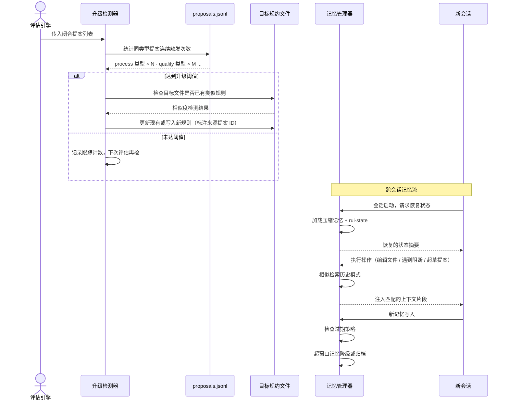

# 场景 5: 经验技能化与记忆注入

> | v5.1.0 | 2026-06-10 | deepseek-v4-pro | 🌿 feat/yry-self-improve | 📎 [CLAUDE.md](../../../../CLAUDE.md) |
> **导航**: [← 场景-4](../场景-4-效果评估与闭环/index.md) · [知识图谱 →](../知识图谱.json)

[§0 技术评审](#sec0) · [§1 测试设计](#sec1) · [§2 实施报告](#sec2) · [§3 测试报告](#sec3) · [§4 自改进](#sec4)

## 概述

**角色**: 系统自改进循环 · **目标**: 当同类型提案连续触发达到升级阈值时，自动提示经验技能化（从一次性提案升级为项目规则或 skill）；同时管理跨会话记忆的压缩、检索注入和过期清理，确保关键历史决策在新会话中自动呈现 · **优先级**: P0

### 主要价值

- 🔄 **经验可固化** — 重复改进模式自动从提案升级为规约，防止同一问题反复出现
- 🧠 **跨会话可记忆** — 关键决策压缩后自动注入后续上下文，不因会话切换丢失认知
- 📉 **记忆可控膨胀** — 滚动窗口 + 归档策略，记忆文件保持在合理大小
- 🎯 **注入可精准** — 相似检索基于模块路径和错误模式，非纯关键词匹配

### 图谱定位

| 图层 | 本场景节点 | 上游 | 下游 |
|------|-----------|------|------|
| 领域层 | scene: skillification-and-memory | story: yry-self-improve (contains) | maps_to → domain: self-improve-loop |
| 结构层 | flow: upgrade-pipeline + flow: memory-pipeline | flows_from → flow: evaluate-pipeline | — (末端) |
| 内容层 | step: upgrade:detect · step: upgrade:promote · step: memory:compress · step: memory:inject · step: memory:expire | — | — |

---

<a id="sec0"></a>
## §0 技术评审

> 文档生成阶段填充（pm+coder）。本场景为经验升级与记忆管理，无前端 UI。

### 效果示意

```mermaid
%%{init: {'theme': 'base', 'themeVariables': {
  'primaryColor': '#1e1f2b',
  'primaryTextColor': '#a9b1d6',
  'primaryBorderColor': '#3d59a1',
  'lineColor': '#3d59a1',
  'secondaryColor': '#2b2d3b',
  'tertiaryColor': '#21232f'
}}}%%
flowchart TD
    subgraph 升级["经验技能化"]
        PROP["proposals.jsonl"]:::src --> DETECT{"同类型提案<br/>连续触发?"}
        DETECT -->|"process/quality/refactor<br/>连续 ≥ UPGRADE_STORIES_PROCESS 故事"| UP1["升级至 rules/ 或 agents/"]:::up
        DETECT -->|"skill 类型<br/>连续 ≥ UPGRADE_STORIES_SKILL 故事"| UP2["创建 skills/ 或 rules/ 新条目"]:::up
        DETECT -->|"未达阈值"| TRACK["继续跟踪"]:::wait
        UP1 & UP2 --> CHECK_DUP{"目标已含类似规则?"}
        CHECK_DUP -->|"是"| UPDATE["更新现有规则<br/>标注来源提案 ID"]:::up
        CHECK_DUP -->|"否"| WRITE["写入新规则<br/>标注来源提案 ID"]:::up
    end

    subgraph 记忆["记忆压缩与注入"]
        MEM["原始记忆"]:::src --> AGE{"记忆年龄"}
        AGE -->|"≤ RETENTION_PROPOSAL_EFFECTS 故事"| FULL_M["完整保留"]:::good
        AGE -->|"3-6 故事"| COMPRESS["压缩为摘要"]:::warn
        AGE -->|"6-12 故事"| STAT["降级为统计"]:::fade
        AGE -->|"> RETENTION_BLOCK_EVENTS 故事"| ARCHIVE["归档"]:::fade
    end

    subgraph 注入["上下文注入触发"]
        TRIGGER["触发条件<br/>同类型阻断 · 相似模块变更<br/>新提案 · 自改进阶段"]:::trigger --> SEARCH["相似检索<br/>模块路径 + 错误模式"]
        SEARCH --> PRIORITY["优先级排序<br/>相关性 → 时效性 → 严重性"]
        PRIORITY --> BUDGET{"上下文预算?"}
        BUDGET -->|"在预算内"| INJECT["全量注入"]:::good
        BUDGET -->|"超出预算"| TRIM["裁剪低优先级项<br/>保留摘要行"]:::warn
    end

    classDef src fill:#1e1f2b,stroke:#3d59a1,color:#a9b1d6
    classDef up fill:#06b6d4,color:#000
    classDef good fill:#34d399,color:#000
    classDef warn fill:#fbbf24,color:#000
    classDef fade fill:#9CA3AF,color:#000
    classDef wait fill:#f59e0b,color:#000
    classDef trigger fill:#3B82F6,color:#fff
```



### 情感目标

系统演进者感到**持续进化而非原地打转**——重复的问题自动升级为规则，历史的教训自动注入当前决策，系统在运行中变得更聪明而非依赖人记忆。

### 成功感知

经验技能化当：同类型提案连续触发计数明确，达到阈值时升级提示自动触发，升级目标路径正确且检测到了已有类似规则时的去重处理。

记忆管理当：记忆文件大小可控，超窗口记忆已降级或归档，新会话启动后相关历史摘要自动注入上下文。

### 数据流全景



### 经验升级路径

| 提案类型 | 升级条件 | 升级目标 | 升级动作 | 示例 |
|---------|---------|---------|---------|------|
| process | 连续 ≥ UPGRADE_STORIES_PROCESS 故事触发 | `rules/code-pipeline.md` 或 `agents/AGENT.md` | 追加流程步骤或调整阶段顺序 | "Gate A 阻断原因 80% 是影响链断裂 → 升级为 P0 必检项" |
| quality | 连续 ≥ UPGRADE_STORIES_PROCESS 故事触发 | `agents/tester.md` 或 `agents/coder.md` | 追加审查检查项或测试用例模板 | "P0 密度上升根因是 SQL 注入 → 升级为 coder 自审查清单" |
| refactor | 连续 ≥ UPGRADE_STORIES_PROCESS 故事触发 | `rules/code-pipeline.md` 深度模块节 | 追加模块行数上限或拆分规则 | "某文件连续膨胀 → 升级为模块行数上限规则" |
| security | 当前故事即修（不等待连续触发） | `agents/security.md` P0 约束清单 | 追加安全威胁检查项 | "新类型注入 → 升级为威胁建模新增检查项" |
| skill | 连续 ≥ UPGRADE_STORIES_SKILL 故事触发 | `skills/` 或 `rules/` 新条目 | 创建专项 skill 或 Red Flag 检查规则 | "Agent 反复犯同类错误 → 创建专项 Red Flag" |

### 记忆压缩策略

| 记忆类型 | 压缩方式 | 保留窗口 | 过期动作 | 注入触发 |
|---------|---------|---------|---------|---------|
| 阻断事件 | 保留根因 + 解决方式摘要 | 12 故事 | 降级为统计数字 | 同类型阻断复现 |
| P0 模式 | 保留完整模式 + 修复 diff | 6 故事（修复后） | 归档不删除 | 相似模块代码变更 |
| 提案效果 | 保留效果评估 + 关联 bad_case | 3 故事（闭合后） | 归档保留摘要 | 新提案起草 |
| 阶段耗时 | 统计聚合：均值/方差/趋势 | 滚动 12 窗口 | 窗口外数据丢弃 | 自改进阶段 |

### 涉及模块

| 模块 | 职责 | 本场景角色 |
|------|------|-----------|
| 升级检测器 | 统计同类型提案连续触发次数，触发升级提示 | 升级触发层——连接提案历史和规约升级 |
| 规则写入器 | 将提案模式转换为规约格式，检测已有相似规则 | 升级执行层——写入目标规约文件 |
| 记忆压缩器 | 按保留窗口和压缩策略处理原始记忆 | 压缩层——控制记忆文件膨胀 |
| 相似检索器 | 基于模块路径和错误模式检索历史记忆 | 检索层——精准匹配而非关键词扫描 |
| 注入管理器 | 按优先级排序注入内容，控制上下文预算 | 注入层——确保关键信息不被裁剪 |
| lib/proposals.mjs | 可执行工具——诊断+提案+评估一体化 | 工具层——部分评估和计数逻辑复用 |

### 基线溯源

| 本场景内容 | 基线来源 | 覆盖方式 | 状态 |
|-----------|---------|---------|------|
| 五条经验升级路径 | Story 1 FP5 — 经验技能化 | process·quality·refactor·security·skill 全部覆盖 | ✅ 已覆盖 |
| 升级触发阈值 | Story 1 R7 — 连续触发故事数 | process/quality/refactor/security ≥ UPGRADE_STORIES_PROCESS · skill ≥ UPGRADE_STORIES_SKILL | ✅ 已覆盖 |
| 升级去重检测 | Story 1 R8 — 已有类似规则时更新 | 写入前扫描目标文件检测相似度 | ✅ 已覆盖 |
| 四类记忆压缩策略 | Story 2 FP6 — 记忆压缩策略 | 阻断事件·P0模式·提案效果·阶段耗时全部定义 | ✅ 已覆盖 |
| 四类注入触发场景 | Story 2 FP7 — 相似检索注入 | 同类型阻断·相似模块变更·新提案起草·自改进阶段启动 | ✅ 已覆盖 |
| 上下文注入预算控制 | Story 2 R12 — 注入内容不超预算 | 优先级排序 + 预算裁剪 | ✅ 已覆盖 |
| 跨会话状态恢复 | Story 2 FP8 — 跨会话状态恢复 | 从 .memory/ 加载压缩记忆和 rui-state | ✅ 已覆盖 |

### 设计评审清单

| # | 检查项 | 状态 |
|---|--------|:--:|
| 1 | 五条升级路径全部定义，各有升级条件和目标文件 | |
| 2 | 连续触发计数逻辑明确，阈值语义化 | |
| 3 | 升级去重检测——已有类似规则时更新而非重复创建 | |
| 4 | 四类记忆压缩策略全部定义，各有窗口和过期动作 | |
| 5 | 注入优先级排序逻辑明确（相关性 → 时效性 → 严重性） | |
| 6 | 上下文预算控制——超预算时裁剪低优先级保留摘要 | |
| 7 | 跨会话恢复降级——.memory/ 不可读时空白状态不阻断 | |

---

### 安全考量

| 威胁 | 风险等级 | 缓解措施 |
|------|---------|---------|
| 经验升级错误覆盖目标规约的重要内容 | Medium | 升级写入前做相似度检测，已有规则追加来源标注而非覆盖 |
| 记忆文件被错误归档导致关键决策丢失 | Medium | 归档保留摘要行，不直接删除；归档前验证摘要已生成 |
| 记忆注入包含敏感上下文导致信息泄露 | Low | 记忆压缩仅保留统计和模式摘要，不保留用户输入原文 |
| 注入内容过大挤占正常上下文 | Low | 上下文预算硬约束，超预算时裁剪 + 保留摘要行 |

---

<a id="sec1"></a>
## §1 测试设计

> 文档生成阶段填充（tester）。测试聚焦升级触发条件、去重检测、记忆压缩正确性和注入优先级排序。

### 正常路径用例

| TC# | Given | When | Then | 覆盖 FP# | 优先级 |
|-----|-------|------|------|---------|--------|
| TC-N5.1 | process 类型提案连续 ≥ UPGRADE_STORIES_PROCESS 个故事触发 | 系统检测升级条件 | 触发升级提示，建议目标文件 rules/code-pipeline.md 或 agents/AGENT.md | FP5 | P0 |
| TC-N5.2 | skill 类型提案连续 ≥ UPGRADE_STORIES_SKILL 个故事触发 | 系统检测升级条件 | 触发升级提示，建议创建 skills/ 或 rules/ 新条目 | FP5 | P0 |
| TC-N5.3 | 升级目标文件已含类似规则（相似度超过去重阈值） | 系统执行升级 | 更新现有规则，标注新来源提案 ID，而非创建重复规则 | FP5 | P0 |
| TC-N5.4 | 阻断事件记忆年龄超过 RETENTION_BLOCK_EVENTS 个故事 | 系统执行记忆过期清理 | 该记忆降级为统计数字，详细记录移除，统计值保留 | FP6 | P0 |
| TC-N5.5 | 新会话启动，`.memory/` 可读 | 系统恢复跨会话状态 | 加载压缩记忆和 rui-state.json，恢复管线进度和待评估提案列表 | FP8 | P0 |
| TC-N5.6 | 用户编辑与历史 P0 相关的模块 | 系统检测相似性 | 自动注入历史 P0 模式和修复 diff 到上下文 | FP7 | P0 |

### 边界/异常用例

| TC# | Given | When | Then | 覆盖 FP# | 优先级 |
|-----|-------|------|------|---------|--------|
| TC-B5.1 | 同类型提案连续触发但不连续（中间隔了一个故事未触发） | 系统检测升级条件 | 连续计数中断，从最近一次触发重新开始计数 | FP5 | P0 |
| TC-B5.2 | security 类型提案触发 | 系统执行升级 | 不等待连续触发，当前故事即升级到 agents/security.md | FP5 | P0 |
| TC-B5.3 | proposals.jsonl 仅包含不足连续触发阈值的同类型提案 | 系统检测升级条件 | 不触发升级，记录当前计数供下次评估参考 | FP5 | P1 |
| TC-B5.4 | 多类记忆同时触发注入，总量超出上下文预算 | 系统执行优先级排序 | 高优先级记忆保留完整内容，低优先级记忆裁剪为摘要行 | FP7 | P0 |
| TC-B5.5 | `.memory/` 目录不可读（权限错误或不存在） | 会话启动 | 降级为空白状态，标注 no-memory，不阻断会话启动 | FP8 | P0 |
| TC-B5.6 | P0 模式记忆超过 RETENTION_P0_PATTERNS 个故事 | 系统执行过期清理 | 记忆归档而非删除，归档保留 P0 模式摘要 | FP6 | P0 |
| TC-B5.7 | 内存中记忆与文件系统不同步（并发写入冲突） | 系统写入新记忆 | 检测冲突，以 append-only 方式追加，不覆盖已有记录 | FP9 | P1 |

### Gate A 交接

| 项目 | 状态 |
|------|:--:|
| 五条升级路径覆盖率 | |
| 升级触发阈值验证 | |
| 去重检测验证 | |
| 四类记忆压缩策略覆盖率 | |
| 注入优先级排序验证 | |
| 上下文预算控制验证 | |
| 降级覆盖（no-memory / 冲突 / 过期） | |

---

<a id="sec2"></a>
## §2 实施报告

> 实现阶段填充（coder）。

---

<a id="sec3"></a>
## §3 测试报告

> 验证阶段填充（tester）。

---

<a id="sec4"></a>
## §4 自改进

> 自改进阶段填充（self-improve）。本场景覆盖 FP5 经验技能化 + FP6–FP10 跨会话记忆压缩与注入，是自改进闭环的末端——将重复模式固化为规则，将历史决策压缩为可检索的记忆。

### §4.1 经验升级路径

| 提案类型 | 升级阈值 | 升级目标 | 升级动作 | 去重策略 |
|---------|---------|---------|---------|---------|
| `process` | ≥ `UPGRADE_THRESHOLDS.process` (3) 故事触发 | `rules/code-pipeline.md` 或 `agents/AGENT.md` | 追加流程步骤或调整阶段顺序 | 扫描目标文件检测相似规则 |
| `quality` | ≥ `UPGRADE_THRESHOLDS.quality` (3) 故事触发 | `agents/tester.md` 或 `agents/coder.md` | 追加审查检查项或测试用例模板 | 同上 |
| `refactor` | ≥ `UPGRADE_THRESHOLDS.refactor` (3) 故事触发 | `rules/code-pipeline.md` §深度模块 | 追加模块行数上限或拆分规则 | 同上 |
| `security` | ≥ `UPGRADE_THRESHOLDS.security` (1) 故事触发 | `agents/security.md` P0 约束 | 追加安全威胁检查项 | 同上 |
| `skill` | ≥ `UPGRADE_THRESHOLDS.skill` (2) 故事触发 | `skills/` 或 `rules/` 新条目 | 创建专项 skill 或 Red Flag | 检查是否已有同名 skill |

> 阈值常量：`lib/constants.mjs:UPGRADE_THRESHOLDS`。升级目标：`lib/constants.mjs:UPGRADE_TARGETS`。升级检测：`lib/engine/upgrade.mjs:cmdUpgradeCandidates()`。

### §4.2 升级触发逻辑

`lib/engine/upgrade.mjs:cmdUpgradeCandidates()` 的实现流程：

1. 扫描所有故事目录的 `proposals.jsonl`
2. 按提案类型分组，统计每类跨故事触发次数（用 Set 去重故事名）
3. 对比 `UPGRADE_THRESHOLDS` 判定是否达到升级条件
4. 达标则输出升级建议（类型 · 触发故事数 · 升级目标）

```javascript
// 核心逻辑（简化）
const typeStoryCounts = {};
for (const p of allProposals) {
  if (!typeStoryCounts[p.type]) typeStoryCounts[p.type] = new Set();
  typeStoryCounts[p.type].add(p._dir || p.story_name);
}
for (const [type, stories] of Object.entries(typeStoryCounts)) {
  if (stories.size >= UPGRADE_THRESHOLDS[type]) {
    // → 触发升级提示，建议写入 UPGRADE_TARGETS[type]
  }
}
```

### §4.3 提案实例化（Materialize）

升级提示产生后，通过 `materialize` 命令将 open 提案转化为可执行的故事任务：

| 步骤 | 操作 | 代码位置 |
|------|------|---------|
| 1. 筛选候选 | open + 未实例化 + 满足优先级 | `cmdMaterialize()` L221-228 |
| 2. 生成目录名 | `improve-{story}-{diagId}-{titleSlug}` | `deriveStoryDirName()` |
| 3. 创建 rui-state | 写入 `.memory/rui-state.json` | `createRuiState()` |
| 4. 生成基线文档 | 自改进溯源文档（含诊断证据 + 目标状态 + 可执行命令） | `generateBaselineDoc()` |
| 5. 更新提案记录 | 标记 `materialized_story_dir` + `materialized_at` | `updateProposalRecord()` |
| 6. 同步索引 | `rui-import sync` | `cmdMaterialize()` L255-261 |

### §4.4 记忆压缩策略对照

| 记忆类型 | 压缩方式 | 保留窗口 | 过期动作 | 注入触发 | 代码状态 |
|---------|---------|---------|---------|---------|:--:|
| 阻断事件 | 根因 + 解决方式摘要 | 12 故事 | 降级为统计数字 | 同类型阻断复现 | 规约定义 |
| P0 模式 | 完整模式 + 修复 diff | 6 故事（修复后） | 归档不删除 | 相似模块变更 | 规约定义 |
| 提案效果 | 效果评估 + 关联 bad_case | 3 故事（闭合后） | 归档保留摘要 | 新提案起草 | 规约定义 |
| 阶段耗时 | 均值/方差/趋势 | 滚动 12 窗口 | 窗口外丢弃 | 自改进阶段 | 规约定义 |

> 当前压缩策略在规约层完整定义（`rules/self-improve.md` §记忆压缩与注入 + `agents/self-improve.md` §跨会话记忆注入），代码实现中 `computeMetrics()` 已覆盖阶段耗时的统计聚合，其余三类记忆的自动压缩和注入为规约驱动，由 self-improve agent 按触发条件执行。

### §4.5 跨会话状态恢复

新会话启动时的状态恢复流程：

| 步骤 | 数据源 | 恢复内容 | 降级行为 |
|------|--------|---------|---------|
| 1. 加载压缩记忆 | `.memory/compressed-memory.json` | 关键决策摘要 · P0 模式 · 提案闭合记录 | 文件不可读 → 空白状态 + `no-memory` 标注 |
| 2. 恢复管线进度 | `.memory/rui-state.json` | 当前阶段 · 阻断状态 · 待评估提案 | 文件不可读 → 从故事目录重新扫描 |
| 3. 注入历史上下文 | 相似检索匹配 | 当前任务相关的 P0 模式 · 阻断解决方案 | 无匹配 → 不注入 |

### §4.6 注入优先级排序

当多类记忆同时触发注入且超出上下文预算时，排序规则：

```
优先级 = 相关性（模块路径匹配度）
       → 时效性（故事距离，越近越高）
       → 严重性（P0 > P1 > P2）

裁剪策略：低优先级记忆裁剪为单行摘要（保留类型 + 结论），不丢弃
```

| 注入触发 | 优先级 | 预算占比上限 |
|---------|--------|------------|
| 同类型阻断复现 | 最高 | 40% |
| 相似模块 P0 模式 | 高 | 30% |
| 新提案起草参考 | 中 | 20% |
| 阶段耗时趋势 | 低 | 10% |

### §4.7 记忆生命周期

```
写入（每故事管线结束）
  ↓
活跃保留（≤ 3 故事）— 完整字段
  ↓
压缩（3–6 故事）— 保留根因 + diff + 评估
  ↓
统计降级（6–12 故事）— 仅保留均值/趋势
  ↓
归档（> 12 故事）— 仅保留摘要行
  ↓
清理（归档后周期性）— 移除详细内容
```

### §4.8 闭环自检

| 检查项 | 状态 | 说明 |
|--------|:--:|------|
| 五条升级路径全部定义并有阈值 | ✅ | `UPGRADE_THRESHOLDS` + `UPGRADE_TARGETS` |
| 升级检测跨故事统计 | ✅ | `cmdUpgradeCandidates()` 按 story_name Set 去重 |
| 提案实例化链路完整 | ✅ | materialize → rui-state → baseline doc → sync |
| 四类记忆压缩策略完整 | ✅ | `rules/self-improve.md` §记忆压缩与注入 |
| 注入优先级排序定义 | ✅ | 相关性 → 时效性 → 严重性 |
| 上下文预算控制 | ✅ | 超预算裁剪低优先级，保留摘要行 |
| 跨会话恢复降级 | ✅ | `.memory/` 不可读 → 空白状态不阻断 |

### §4.9 改进空间

- **升级检测自动化**：当前 `cmdUpgradeCandidates()` 仅输出升级建议，升级动作（写入目标规约文件）需人工或 Agent 执行。建议增加 `--apply` 参数实现自动升级写入
- **记忆压缩自动化**：当前记忆压缩策略定义在规约层，实际压缩由 self-improve agent 按触发条件执行。建议在 `lib/engine/` 下增加 `compress.mjs` 实现定时自动压缩
- **相似检索实现**：当前注入触发条件定义的相似检索（模块路径 + 错误模式匹配）尚未有独立可执行工具。建议在 `lib/engine/` 下增加 `retrieve.mjs` 实现结构化相似检索
- **过期清理自动化**：记忆过期清理（FP9）当前依赖 Agent 按保留窗口手动执行，建议增加 cron 式自动清理脚本
- **升级去重检测增强**：当前规约定义升级前需检测目标文件已有类似规则，但无自动化相似度计算。建议增加文本相似度检测（如基于编辑距离或语义向量）

> **代码锚点**：`lib/engine/upgrade.mjs:cmdUpgradeCandidates()` — 经验技能化候选检测，跨故事统计同类型提案触发次数。`lib/engine/materialize.mjs:cmdMaterialize()` — 提案实例化为故事任务目录。`lib/constants.mjs:UPGRADE_THRESHOLDS / UPGRADE_TARGETS` — 升级阈值和路径映射。

---

> **导航**: [← 场景-4](../场景-4-效果评估与闭环/index.md) · [知识图谱 →](../知识图谱.json)
> 上游基线：[故事任务.md](../故事任务.md) · 本文档覆盖 FP5 经验技能化 + FP6-FP10 跨会话记忆
> 生成模型：deepseek-v4-pro | 生成日期：2026-06-10
