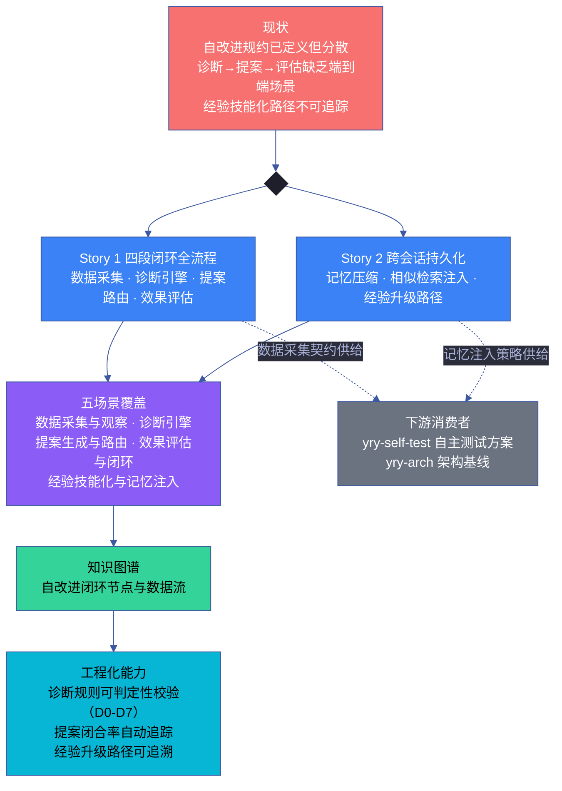
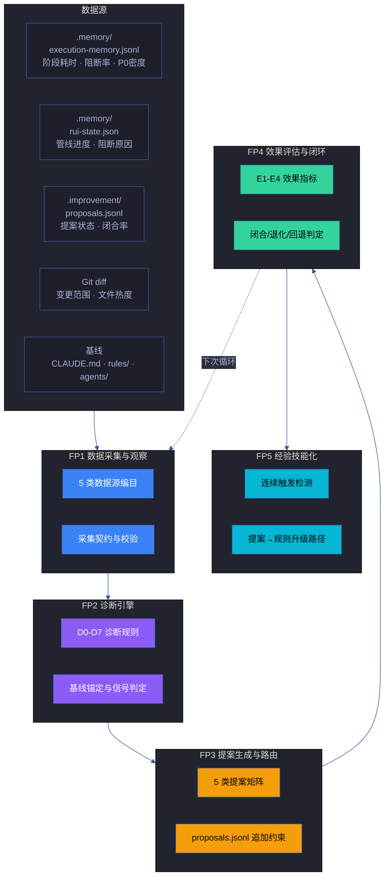
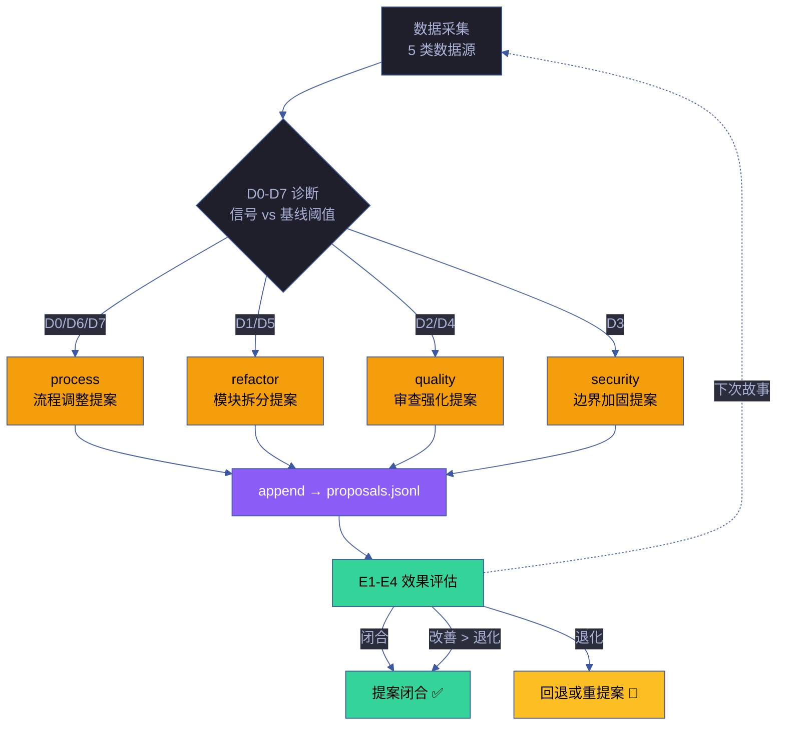
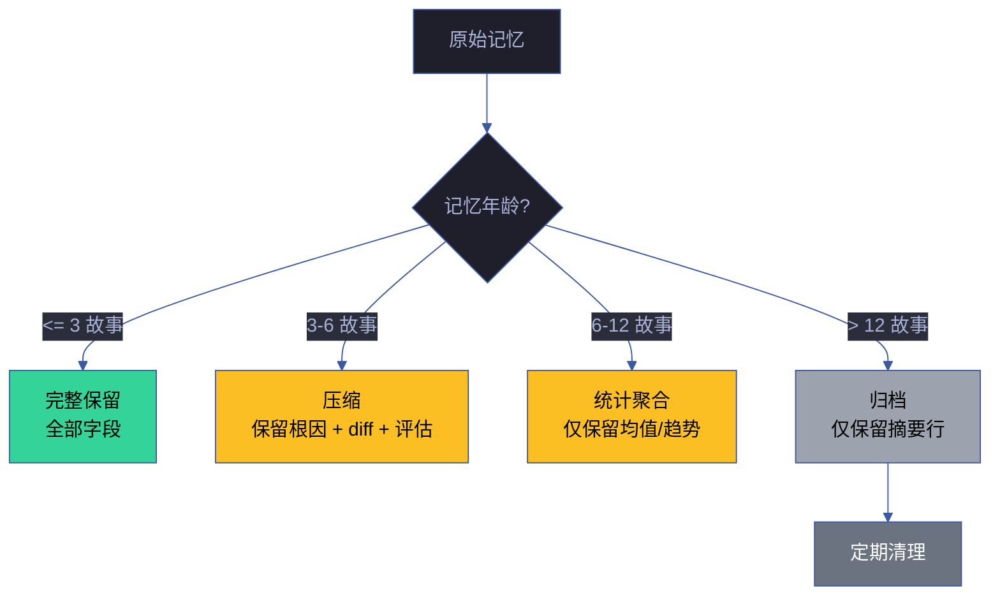
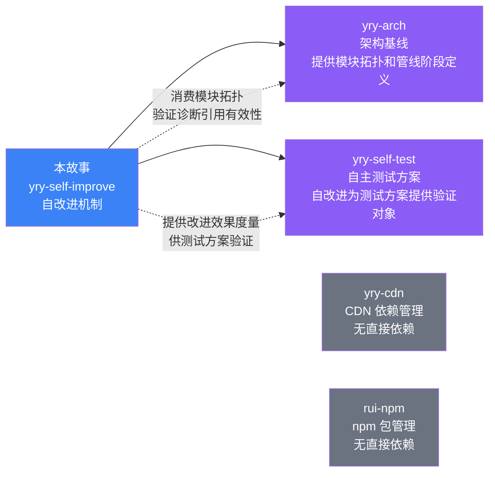

# 故事任务

> | v5.1.0 | 2026-06-10 | deepseek-v4-pro | 🌿 feat/yry-self-improve | 📎 [CLAUDE.md](../../../CLAUDE.md) |

[概述](#概述) · [§1 Story](#s-1-story) · [§7 跨文档索引](#s-7-跨文档索引) · [§R 关联故事](#s-r-关联故事)

## 概述

YrY 的自改进机制已经沉淀为两份规约（`rules/self-improve.md` + `agents/self-improve.md`），定义了四段闭环（观察→诊断→改进→评估）、八级诊断规则（D0–D7）、四级效果评估（E1–E4）、五种提案类型和两条经验升级路径。但这份机制目前散落在规约文本中——诊断规则与数据采集的契约关系未成形、提案路由的触发条件缺少端到端场景覆盖、效果评估的参照基准尚未从历史数据中抽取、经验技能化的升级路径缺少逐阶段可追踪的决策记录。

本故事将自改进机制拆解为两份并行 Story 和五个场景文档，把规约中的规则转化为可操作的执行场景：

- **Story 1** 覆盖四段闭环全流程：数据采集的契约与源端 → 诊断规则的可判定条件 → 提案的类型路由与生成约束 → 效果评估的基准参照与闭合标准
- **Story 2** 覆盖跨会话持久化：记忆压缩策略 → 相似检索注入 → 经验技能化的逐阶段升级路径

两份 Story 汇聚为五个场景文档和一份知识图谱，使自改进机制从"规约定义"升级为"可执行、可追踪、可验证"的工程制品。

### 效果示意

### 主要价值

- 🔄 **自改进可追踪** — 每次诊断→提案→评估的全链路决策记录可回溯，不再依赖记忆
- 📊 **数据驱动而非印象** — 每条提案必须有 snapshot 证据支撑，无数据不产出
- 🎯 **诊断可判定** — D0–D7 每条规则都有明确的信号阈值和基线依据，可脚本化校验
- 🔗 **经验可固化** — 同一模式连续触发后自动升级为项目规则或 skill，避免重复犯错
- 🧠 **跨会话可记忆** — 关键决策压缩注入后续上下文，不因会话切换丢失认知
- ⚖️ **闭环可度量** — E1–E4 量化评估改进效果，改善/退化皆有据可依

---

## §1 Story

### Story 1: 自改进闭环 — 数据驱动的诊断、提案、评估与经验固化

作为 系统演进者，我想要 一条完整的自改进闭环——从执行记忆中自动采集数据、按 D0–D7 规则诊断偏差、为每条诊断生成可追踪的提案、用量化的 E1–E4 指标评估效果，以便 每个故事走完管线后自动产出改进建议，同一模式反复出现时自动升级为项目规则或 skill，使系统在运行中自我纠偏而非依赖人工复盘。

优先级 **P0**。范围边界：覆盖自改进管线的全部四个阶段（数据采集→诊断→提案→评估），含诊断决策表、提案类型路由、效果评估矩阵和经验技能化升级路径。不涉及各诊断规则的具体算法实现细节，不涉及外部监控系统。依赖：执行记忆数据源（`execution-memory.jsonl` · `rui-state.json` · `proposals.jsonl` · Git diff）、基线规约（`CLAUDE.md` · `rules/` · `agents/`）。

#### §1.1 User Operations

| # | 操作 | 触发条件 | 操作步骤 | 预期结果 |
|---|------|---------|---------|---------|
| 1 | 查看自改进数据采集状态 | 用户需要了解当前有哪些数据源可用、数据是否充分 | 查阅数据采集编目 → 定位目标数据源 → 查看采集契约和校验规则 | 获得各数据源的可用性状态和最近采集时间 |
| 2 | 触发诊断分析 | 故事管线完成后，用户需要了解是否有改进信号 | 查阅 D0–D7 诊断决策表 → 对照当前数据与基线阈值 → 识别触发的诊断项 | 获得完整的诊断判定结果和触发的改进信号列表 |
| 3 | 生成改进提案 | 诊断发现偏差信号后，用户需要将诊断转化为可执行的提案 | 根据诊断类型路由到对应提案类型 → 收集 snapshot 证据 → 生成提案追加到 proposals.jsonl | 提案生成并持久化，每条提案有证据支撑 |
| 4 | 评估改进效果 | 提案执行一段时间后，用户需要判断改进是否有效 | 采集提案前后各阶段的执行记忆 → 对照 E1–E4 指标 → 判定闭合/退化/继续观察 | 获得量化的效果评估结论 |
| 5 | 经验升级为规则 | 同一类型提案连续多次触发，用户需要将其固化 | 查阅 proposals.jsonl 同类型提案触发次数 → 判断是否达到升级阈值 → 将提案模式写入对应规约文件 | 重复模式升级为项目规则，标注来源提案 ID |
| 6 | 跨会话记忆检索 | 新会话启动后，用户需要快速恢复对历史改进决策的认知 | 自动加载压缩后的执行记忆 → 相似检索当前任务与历史模式 → 注入相关上下文 | 关键历史决策在需要时自动呈现，不占用上下文窗口 |

#### §2 Requirements

##### 功能点

**P0**
- **FP1 数据采集与观察** — 编目全部五类数据源（执行记忆、rui-state、proposals、Git diff、基线文件），定义每类的采集契约（字段 · 采集时机 · 校验规则）和异常降级策略。输入：数据源文件路径集合。输出：数据源编目表（源名 · 字段 · 采集时机 · 校验规则 · 降级策略）。阻断：任一数据源无采集契约或校验规则缺失。
- **FP2 诊断引擎** — 实现 D0–D7 八级诊断规则的信号判定。每条规则标注信号阈值、基线依据（引用具体规约文件）、置信度条件和误报风险。输入：采集数据 + 基线规约。输出：诊断决策表（诊断项 · 信号 · 阈值 · 基线引用 · 判定结果 · 置信度）。阻断：任一诊断项无基线引用或阈值定义。
- **FP3 提案生成与路由** — 将诊断结论映射到五种提案类型（process · quality · refactor · security · skill），每类提案有固定要素模板。proposals.jsonl 支持 append-only 写入约束和状态变更检测。输入：诊断决策表。输出：proposals.jsonl 新条目。阻断：提案无 snapshot 证据或类型路由未定义。
- **FP4 效果评估与闭环** — 实现 E1–E4 四级效果评估：阻断率变化（E1）、P0 密度变化（E2）、关联 bad_case 消失/仍出现（E3）、综合改善/退化判定（E4）。提案闭合需前后各至少三条执行记忆。输入：proposals.jsonl + 执行记忆前后窗口。输出：效果评估表（提案ID · E1 · E2 · E3 · E4 综合 · 闭合/退化/观察）。阻断：评估数据不足时闭合操作被阻止。
- **FP5 经验技能化** — 检测同类型提案连续触发次数，达到阈值后触发升级流程。定义从提案到规则/skill 的五条升级路径（process → rules/code-pipeline.md · quality → agents/tester.md 或 coder.md · refactor → rules/code-pipeline.md · security → agents/security.md · skill → skills/ 或 rules/ 新条目）。输入：proposals.jsonl 历史。输出：目标规约文件增量更新 + 来源提案 ID 标注。阻断：目标文件已含类似规则时更新现有规则而非重复创建。

##### 业务规则

| R# | 描述 | 校验方式 | 证据级别 |
|----|------|---------|---------|
| R1 | 每条提案必须有 snapshot 证据支撑（数据快照 · Git diff · 执行记录），无证据不出提案 | 逐条提案检查 evidence 字段非空且引用具体数据 | A |
| R2 | proposals.jsonl append-only — 状态变更通过新增条目而非覆盖现有条目 | 逐行比对历史 proposals.jsonl，检查无条目被修改 | A |
| R3 | 每条诊断必须引用基线文件作为判定依据（CLAUDE.md / rules/ / agents/） | 逐条诊断检查 baseline_ref 字段引用有效文件路径 | A |
| R4 | 效果评估需前后各至少三条执行记忆，数据不足跳过 E1–E4 仅生成观察记录 | 统计执行记忆条目数，不足阈值时检查评估是否降级 | B |
| R5 | no-metrics 降级不阻断交付 — 数据采集失败时写空白场景文档 §4 占位，不计入退化窗口 | 检查降级场景的 §4 占位存在且标注降级原因 | B |
| R6 | 诊断→提案路由必须按诊断组映射到对应提案类型（D0/D6/D7→process · D1/D5→refactor · D2/D4→quality · D3→security） | 逐条诊断检查路由结果与映射表一致 | B |
| R7 | 经验技能化升级条件：process/quality/refactor/security 类型连续三个故事触发；skill 类型连续两个故事触发 | 统计同类型提案连续触发故事数，比对阈值 | B |
| R8 | 经验升级目标已含类似规则时，更新现有规则（标注来源提案 ID）而非重复创建 | 升级前 grep 目标文件检查规则相似度 | B |

##### 数据约束

| 约束 | 类型 | 范围/格式 | 来源 |
|------|------|----------|------|
| 诊断级别 | 枚举 | D0 · D1 · D2 · D3 · D4 · D5 · D6 · D7 | 自改进流程规约 |
| 提案类型 | 枚举 | process · quality · refactor · security · skill | 自改进流程规约 |
| 提案状态 | 枚举 | open · in_progress · closed · rolled_back · superseded | proposals.jsonl 约束 |
| 效果评估级别 | 枚举 | E1（阻断率）· E2（P0 密度）· E3（bad_case）· E4（综合） | 自改进流程规约 |
| 证据等级 | 枚举 | A（已验证附路径）· B（可推导附规则）· C（待补充）· D（禁止出现） | Agent 共用基线 |
| 数据阈值 | 语义常量 | 评估最少记忆条数（前后各 MIN_EVAL_MEMORIES 条）· 升级触发故事数（UPGRADE_STORIES_PROCESS / UPGRADE_STORIES_SKILL）· 记忆保留窗口（RETENTION_WINDOW_STORIES） | lib/constants.mjs |
| 闭合判定 | 枚举 | 闭合（改善 > 退化）· 退化（退化 > 改善）· 回退（需人工介入）· 观察（数据不足或持平） | 自改进流程规约 |

#### §3 成功标准

**P0**
- **SC1** 每次故事管线完成后自动触发数据采集和诊断分析。度量：检查最近完成的故事是否有对应的诊断决策表输出。目标：全部故事覆盖。→ FP1,FP2
- **SC2** 每条提案可追溯到对应的 snapshot 证据和基线引用。度量：逐条提案检查 evidence 和 baseline_ref 字段完整性。目标：全部提案证据链闭合。→ FP3
- **SC3** 效果评估 E1–E4 四维指标全部可量化，不可凭感觉判定。度量：逐条评估记录检查四个指标均有数值或状态标记。目标：全部评估记录完整。→ FP4
- **SC4** 同类型提案连续触发达到阈值后自动提示经验升级。度量：统计 proposals.jsonl 中连续触发次数，验证升级提示触发时机。目标：阈值到达后下次管线中提示升级。→ FP5

**P1**
- **SC5** 用户可在一次检索内了解自改进闭环的完整运行状态。度量：从打开自改进状态面板到了解最近诊断结论和待评估提案。目标：三十秒内获得完整状态。→ FP1–FP4
- **SC6** 数据采集失败时系统优雅降级，不阻断主流程但明确标注降级原因。度量：模拟数据源不可达，验证系统行为和降级标注。目标：降级记录完整，主流程未中断。→ FP1

#### §4 范围边界

**范围内**
- 五类数据源的完整编目和采集契约 (FP1) — 含字段定义、采集时机、校验规则、降级策略
- D0–D7 八级诊断规则的信号判定与基线锚定 (FP2) — 含阈值定义、基线引用、置信度评估
- 五种提案类型的路由矩阵与生成模板 (FP3) — 含要素模板、append-only 约束、状态机
- E1–E4 四级效果评估的量化基准与闭合标准 (FP4) — 含记忆窗口要求、综合判定逻辑
- 五条经验技能化升级路径的触发检测与执行流程 (FP5) — 含升级条件、目标映射、相似检测

**范围外**
- 诊断规则的具体算法实现 — 属于 `lib/proposals.mjs` 的范畴，通过入口索引链接
- 通知推送和文档同步 — 属于 rui-bot 和 rui-import 的范畴
- 外部监控系统和告警 — 自改进聚焦项目内部闭环，外部集成另立故事
- 健康检查维度和趋势分析 — 属于 rui-trends 和 health 检查的范畴，自改进消费其数据但不定义其规则

#### §5 AC

| AC# | Given | When | Then | 门禁 |
|-----|-------|------|------|------|
| AC1 | 故事管线完成，执行记忆已写入 | 系统进入自改进阶段 | 自动采集五类数据源，校验数据完整性，不完整时标注降级 | Gate A |
| AC2 | 采集数据就绪，基线文件可读取 | 系统执行 D0–D7 诊断 | 输出诊断决策表，每条判定有信号值、阈值、基线引用和判定结果 | Gate A |
| AC3 | 诊断决策表产生，存在触发项 | 系统生成改进提案 | 每条触发的诊断路由到对应提案类型，提案含证据和基线引用 | Gate A |
| AC4 | proposals.jsonl 包含待评估提案 | 系统采集提案前后执行记忆 | 逐条计算 E1–E4 指标，输出闭合/退化/观察判定 | Gate A |
| AC5 | 同类型提案连续触发次数达到升级阈值 | 系统检测升级条件 | 生成升级提示，标注来源提案 ID 和目标规约文件 | Gate B |
| AC6 | 数据采集失败（no-metrics） | 系统进入自改进阶段 | 写降级版场景文档 §4 占位，标注降级原因，不计入退化窗口 | Gate B |
| AC7 | 用户查看自改进状态面板 | 打开故事面板或诊断摘要 | 看到最近诊断结论、待评估提案列表、经验升级提示（如有） | Gate B |

#### §6 风险与假设

**高影响风险**

- **诊断误报导致无效提案** (M·H → FP2,FP3) — 信号阈值设置过敏感可能导致大量低质量提案，消耗上下文和注意力。缓解：每条诊断标注置信度，低置信度（< 3 条记忆）的 D1/D2/D3 仅生成观察记录不生成提案。
- **评估窗口不足导致错误闭合** (M·H → FP4) — 提案执行后评估窗口太窄可能过早判定改善或退化。缓解：评估要求前后各至少三条执行记忆；不足时标注为观察而非闭合。

**中影响风险**

- **append-only 约束被意外绕过** (L·M → FP3) — proposals.jsonl 直接编辑而非追加可能破坏历史记录。缓解：工具层实现 append-only 校验，检测非追加写入时告警。
- **升级目标文件已变化** (M·M → FP5) — 经验升级时目标规约文件可能已被重构或重组。缓解：升级前重新扫描目标文件结构，检测相似规则而非精确匹配。

**低影响风险**

- **记忆膨胀导致上下文超载** (L·M → FP1,FP5) — 长期运行后执行记忆累积可能超出上下文窗口。缓解：滚动窗口保留策略，超窗口记忆降级为统计摘要。

**假设**

- 执行记忆在每次故事管线完成后正常写入 → 检查 execution-memory.jsonl 最近写入时间验证 (FP1)
- 基线文件（CLAUDE.md / rules/ / agents/）保持更新 → 诊断前重新加载基线文件验证引用有效性 (FP2)
- proposals.jsonl 不会被外部工具直接修改 → append-only 校验检测异常写入 (FP3)

---

### Story 2: 跨会话记忆注入 — 压缩、检索与上下文增强

作为 系统演进者，我想要 一套跨会话的记忆压缩与注入机制——执行记忆自动压缩为模式摘要、历史 P0 模式按相似代码变更自动检索注入、提案闭合效果在新提案起草时自动参考，以便 每个新会话启动后无需重述历史背景，关键决策自动呈现，减少上下文浪费和重复错误。

优先级 **P0**。范围边界：覆盖记忆压缩策略（四类记忆类型 × 压缩方式 × 保留窗口）、相似检索注入（触发条件 × 注入内容 × 过期策略）、跨会话状态恢复。不涉及 AI 模型本身的压缩算法实现，不涉及外部分布式记忆存储。依赖：执行记忆数据（`execution-memory.jsonl` · `rui-state.json` · `proposals.jsonl`）、`.memory/` 目录下的持久化文件。

#### §1.1 User Operations

| # | 操作 | 触发条件 | 操作步骤 | 预期结果 |
|---|------|---------|---------|---------|
| 1 | 新会话自动恢复关键历史 | 新 Claude Code 会话启动，处理同项目任务 | 系统自动加载压缩后的执行记忆 → 检测当前任务与历史模式的相似性 → 注入匹配的上下文 | 关键历史决策自动呈现在上下文中，无需手动回顾 |
| 2 | 相似代码变更时获取历史 P0 提醒 | 编辑与历史 P0 相关的文件或模块 | 系统检测变更模块与历史 P0 的相似性 → 注入相关 P0 模式和修复 diff → 在代码审查阶段主动提醒 | 避免重复犯同类错误 |
| 3 | 起草新提案时参考历史效果 | 自改进阶段生成新提案 | 系统检索同类型历史提案的效果评估 → 注入闭合率、回退案例和改进效果数据 | 新提案基于历史数据起草，避免重复无效提案 |
| 4 | 查看记忆压缩摘要 | 用户想了解最近几个故事的改进趋势 | 查阅滚动窗口内的统计聚合（阻断率趋势 · P0 密度变化 · 提案闭合率） | 获得量化的改进趋势概览 |

#### §2 Requirements

##### 功能点

**P0**
- **FP6 记忆压缩策略** — 定义四类记忆的压缩方式、保留窗口和过期策略。阻断事件保留根因和解决方式摘要（十二故事后降级为统计）；P0 模式保留完整模式加修复 diff（六故事后过期）；提案效果保留评估加关联 bad_case（闭合后三故事归档）；阶段耗时统计聚合为均值、方差、趋势（滚动十二窗口）。输入：原始执行记忆。输出：压缩摘要文件。阻断：任一记忆类型的压缩策略缺失。
- **FP7 相似检索注入** — 根据当前任务特征（变更模块、故事类型、诊断信号）检索历史记忆中的相似模式，注入相关摘要到当前上下文。触发条件：同类型阻断复现 · 相似模块代码变更 · 新提案起草 · 自改进阶段启动。输入：当前任务上下文 + 压缩记忆。输出：注入上下文片段（经过优先级排序，总长度不超过上下文预算）。阻断：注入触发条件缺失或注入内容超出上下文预算。
- **FP8 跨会话状态恢复** — 新会话启动时，从 `.memory/` 加载压缩记忆和 rui-state.json，恢复管线进度、待评估提案列表和最近诊断结论。输入：`.memory/` 目录下的持久化文件。输出：恢复的状态摘要（注入系统提示或 CLAUDE.md 上下文段）。阻断：持久化文件不可读时降级为空白状态而非阻断启动。

**P1**
- **FP9 记忆过期自动清理** — 按保留窗口自动清理过期记忆。超窗口的详细记忆降级为统计摘要（保留统计值，丢弃原始记录）。输入：记忆文件时间戳。输出：清理后的记忆文件 + 降级统计。阻断：清理逻辑错误导致有效记忆丢失。
- **FP10 注入优先级排序** — 多条匹配记忆同时触发注入时，按相关性、时效性、严重性排序，上下文预算不足时裁剪低优先级项。输入：匹配记忆集合 + 上下文预算。输出：排序后的注入序列。阻断：高优先级记忆因排序错误被裁剪。

##### 业务规则

| R# | 描述 | 校验方式 | 证据级别 |
|----|------|---------|---------|
| R9 | 阻断事件记忆保留十二个故事后降级为统计，不可提前丢弃 | 检查 memory 文件时间戳和故事计数 | B |
| R10 | P0 模式记忆修复上线后保留六个故事，过期后归档不删除 | 检查过期 P0 是否移到归档而非删除 | B |
| R11 | 提案闭合后保留三个故事，归档时保留效果评估摘要 | 检查归档提案是否保留 E1–E4 摘要 | B |
| R12 | 注入内容总长度不超过上下文预算（CONTEXT_INJECTION_BUDGET 字符） | 统计注入内容长度，超预算时检查裁剪是否正确 | B |
| R13 | 相似检索匹配基于模块路径和错误模式，不可仅用关键词匹配 | 验证检索逻辑使用结构化特征而非纯文本关键词 | B |

##### 数据约束

| 约束 | 类型 | 范围/格式 | 来源 |
|------|------|----------|------|
| 记忆类型 | 枚举 | 阻断事件 · P0 模式 · 提案效果 · 阶段耗时 | 记忆压缩与注入定义 |
| 压缩方式 | 枚举 | 完整模式（保留细节）· 根因摘要（保留关键信息）· 统计聚合（保留数值趋势）· 归档（仅保留摘要） | 自改进流程规约 |
| 保留窗口 | 语义常量 | RETENTION_BLOCK_EVENTS（十二故事）· RETENTION_P0_PATTERNS（六故事）· RETENTION_PROPOSAL_EFFECTS（三故事闭合后）· RETENTION_STAGE_TIMING（滚动十二窗口） | lib/constants.mjs |
| 注入触发 | 枚举 | 同类型阻断复现 · 相似模块变更 · 新提案起草 · 自改进阶段启动 | 自改进流程规约 |
| 注入优先级 | 排序维度 | 相关性（模块匹配度）→ 时效性（故事距离）→ 严重性（P0 > P1 > P2） | 自改进流程规约 |

#### §3 成功标准

**P0**
- **SC7** 新会话启动后关键历史决策在首次相关操作时自动呈现。度量：启动后首次触发相似操作（编辑同类文件、遇到同类阻断），检查历史警告是否注入。目标：注入触发准确率不低于语义检测基线。→ FP7,FP8
- **SC8** 记忆过期策略正确执行，不过早丢弃有效记忆也不永久保留。度量：检查 memory 文件时间戳是否符合保留窗口。目标：逐条校验通过。→ FP6
- **SC9** 压缩后的记忆不超过原始大小的 COMPRESSION_RATIO，同时保留关键决策点。度量：对比压缩前后的文件大小和关键信息覆盖率。目标：大小缩小达标，关键信息不失真。→ FP6

**P1**
- **SC10** 上下文注入不超过预算上限，高优先级记忆不被裁剪。度量：统计注入内容长度，验证排序结果。目标：注入内容在预算内且高优先级条目全部保留。→ FP10
- **SC11** 相似代码变更时历史 P0 提醒在审查阶段主动触发，不依赖用户主动搜索。度量：模拟相似变更场景，验证提醒是否自动触发。目标：触发准确，无误报。→ FP7

#### §4 范围边界

**范围内**
- 四类记忆的压缩策略和保留窗口 (FP6) — 含压缩方式、过期规则、降级逻辑
- 四类注入触发场景的检索和上下文注入 (FP7) — 含相似度计算、优先级排序、预算控制
- 跨会话状态恢复的加载和降级逻辑 (FP8) — 含状态摘要格式、注入位置、降级条件
- 记忆过期自动清理和统计降级 (FP9) — 含清理周期、降级格式、安全检查

**范围外**
- AI 压缩模型的选择和调优 — 压缩由管线内 AI 模型执行，策略定义在本故事范围，模型选型不在
- 外部记忆存储系统（数据库、向量库） — 当前记忆基于文件系统，未来扩展另立故事
- 记忆加密和访问控制 — YrY 为本地插件，记忆安全性由文件系统权限保障

#### §5 AC

| AC# | Given | When | Then | 门禁 |
|-----|-------|------|------|------|
| AC8 | 新会话启动，`.memory/` 目录包含压缩记忆 | 首次触发与历史相似的操作 | 自动注入相关历史摘要到上下文 | Gate A |
| AC9 | 记忆文件包含超过保留窗口的条目 | 系统执行记忆清理 | 超窗口条目降级为统计，不直接删除 | Gate A |
| AC10 | 用户编辑与历史 P0 相关的模块 | 代码审查阶段 | 自动注入历史 P0 模式和修复 diff 作为审查提醒 | Gate A |
| AC11 | 多类记忆同时触发注入，总量超出上下文预算 | 系统执行注入优先级排序 | 高优先级记忆保留，低优先级裁剪但保留摘要行 | Gate B |
| AC12 | `.memory/` 目录不可读 | 会话启动 | 降级为空白状态，标注 no-memory 但不阻断 | Gate B |

#### §6 风险与假设

**高影响风险**

- **记忆污染导致错误注入** (M·H → FP7) — 一次误判的 P0 或错误修复被记忆后，在相似场景下反复注入错误建议。缓解：标记已回退的提案和已修复的误判 P0，注入时附带回退警告和修正记录。
- **压缩丢失关键上下文** (M·H → FP6) — 自动压缩可能过度简化，丢失了后续诊断需要的关键细节。缓解：压缩前验证关键字段完整性（根因 · 修复 diff · 评估结论），缺失时降级压缩级别。

**中影响风险**

- **记忆膨胀** (M·M → FP6) — 长期运行后即使压缩，记忆文件仍可能持续增长。缓解：滚动窗口策略 + 归档机制，超窗口数据移出活跃上下文。
- **会话恢复失败** (L·M → FP8) — 记忆文件损坏或格式变更导致跨会话恢复失败。缓解：恢复失败时降级为空白状态，不阻断会话启动，告警记录。

**假设**

- 执行记忆在每次管线完成后正常写入 — 见 Story 1 同假设 (FP1)
- 文件系统可靠性足够支撑记忆持久化 — 当前规模下单文件 jsonl 写入足够

---

## §7 跨文档索引

| 本文档章节 | 基线内容 | 下游文档编号 | 预期覆盖 | 状态 |
|-----------|---------|-------------|---------|------|
| Story 1 FP1 | 五类数据源的采集契约和校验规则 | 场景-1-数据采集与观察/index.md | 数据源编目 · 采集时机 · 校验规则 · 降级策略 | 待生成 |
| Story 1 FP2 | D0–D7 诊断规则和基线锚定 | 场景-2-诊断引擎/index.md | 八级诊断的信号判定 · 阈值定义 · 基线引用 · 诊断决策表 | 待生成 |
| Story 1 FP3 | 提案类型路由和生成约束 | 场景-3-提案生成与路由/index.md | 五种提案矩阵 · append-only 约束 · 状态机 | 待生成 |
| Story 1 FP4 | E1–E4 效果评估和闭环标准 | 场景-4-效果评估与闭环/index.md | 四级效果指标 · 闭合/退化判定 · 记忆窗口要求 | 待生成 |
| Story 1 FP5 + Story 2 FP6–FP10 | 经验技能化升级路径 + 跨会话记忆压缩与注入 | 场景-5-经验技能化与记忆注入/index.md | 升级触发检测 · 五条升级路径 · 记忆压缩策略 · 相似检索注入 · 跨会话恢复 | 待生成 |
| Story 1 + Story 2 全部 FP | 自改进闭环与跨会话记忆的结构化知识 | 知识图谱.json | 阶段节点、数据流边、层次映射 | 待生成 |

---

## §R 关联故事

| 关联故事 | 关系类型 | 说明 |
|---------|---------|------|
| `yry-arch` | 数据消费 | 自改进诊断需要引用基线文件（CLAUDE.md / rules/ / agents/），yry-arch 提供的模块拓扑和管线阶段定义为诊断引用提供验证依据 |
| `yry-self-test` | 数据供给 | 自改进的效果评估指标（E1–E4）为自主测试方案提供验证对象——测试方案需验证改进提案是否被正确执行、效果评估是否与实测数据一致 |
| `rui-npm` | 同级故事 | 无直接数据依赖，共享系统规约和管线约束 |
| `yry-cdn` | 同级故事 | 无直接数据依赖，共享系统规约和管线约束 |

---

> **回溯链**
>
> - 来源：本故事由 `/rui 添加自改进机制的任务故事及各个场景内容` 触发。自改进机制的定义来源于 `rules/self-improve.md`（诊断规则 D0–D7、效果评估 E1–E4、经验技能化、记忆压缩与注入）和 `agents/self-improve.md`（四段闭环、提案矩阵、跨会话记忆注入、自循环）。
> - 能力规约：[主线编排器](../../../skills/rui/SKILL.md)（管线一览定义了自改进阶段的触发时机）· [通知推送器](../../../skills/rui-bot/SKILL.md)（自改进结论的通知推送）· [趋势分析器](../../../skills/rui-trends/SKILL.md)（D5 依赖退化诊断时的外部参考）
> - 角色契约：[持续改进](../../../agents/self-improve.md)（自改进管线的核心执行角色）
> - 治理约束：[自改进流程](../../../rules/self-improve.md)（诊断基准、提案路由、评估标准）· [代码变更治理](../../../rules/code-pipeline.md)（自改进阶段的管线位置）· [交付收口](../../../rules/delivery-gate.md)（自改进完成后交付三步）
> - 文档公式：[公式规约](../../../skills/rui/formulas.md) — 定义故事文档的结构化产出规范
>
> **证据标注说明**：本 Story 文档的断言基于 rules/self-improve.md 和 agents/self-improve.md 的分析推导（证据级别 B）。D0–D7 诊断数量、E1–E4 评估维度、五种提案类型的定义直接来源于规约文件（证据级别 A）。

### 变更记录

| 日期 | 版本 | 变更内容 | 触发 | 证据 |
|------|------|---------|------|------|
| 2026-06-10 | 1.0.0 | 初始化，从自改进机制需求创建：Story 1 四段闭环 + Story 2 跨会话记忆注入 | `/rui 添加自改进机制的任务故事及各个场景内容` | rules/self-improve.md + agents/self-improve.md 分析 |

---

> **导航**: [场景-1-数据采集与观察 →](./场景-1-数据采集与观察/index.md)
