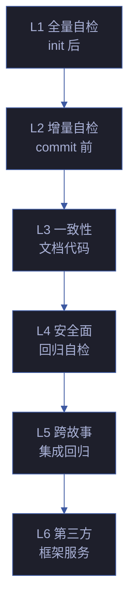

# YryTest · 场景文档索引

> 6 个场景 · 每场景 8 标准交付物 · 测试体系

## 场景导航

| # | 场景 | 主题 | 核心交付 |
|---|------|------|---------|
| 1 | [init 后全量自检](场景-1-init后全量自检/index.md) | init 后全量检查 · 文件完整性 · 语法校验 | 测试面板 |
| 2 | [commit 前增量自检](场景-2-commit前增量自检/index.md) | commit 前增量检查 · 变更范围 · 快速验证 | 测试面板 |
| 3 | [文档代码一致性校验](场景-3-文档代码一致性校验/index.md) | 文档与代码一致性 · 引用可达 · 版本同步 | 源码 |
| 4 | [安全面回归自检](场景-4-安全面回归自检/index.md) | 安全回归 · 认证绕过 · 密钥泄露 · XSS 注入 | 测试面板 |
| 5 | [跨故事集成回归自检](场景-5-跨故事集成回归自检/index.md) | 跨故事集成 · 接口契约 · 数据流一致性 | 测试面板 |
| 6 | [第三方框架与服务自检](场景-6-第三方框架与服务自检/index.md) | 第三方依赖 · 外部服务 · 版本兼容性 | 测试面板 |

## 故事概述

见 [故事任务.md](故事任务.md) — 六层测试体系覆盖从 init 到第三方的全链路

## 知识图谱

- [知识图谱.html](知识图谱.html) — 概念节点-边图可视化
- [知识图谱.json](知识图谱.json) — 图谱数据源

## 标准交付物 (每场景)

📋 计划清单 · 📐 架构图 · 🔗 知识图谱 · 🧪 测试面板 · 📄 源码 · 💡 演示 · 📝 审查 · 📖 index.md

## 六层测试体系架构

## 测试覆盖矩阵

| # | 场景 | 覆盖维度 | 用例数 | 阻断级别 | 执行频率 |
|---|------|------|:---:|:---:|:---:|
| 1 | init 后全量 | 7 项就绪检查 | 7 | P0 | 每次 init |
| 2 | commit 前增量 | 变更范围 | 7 | P0 | 每次 commit |
| 3 | 文档一致性 | 8 维度 | 11 | P0+P1 | CI |
| 4 | 安全面回归 | STRIDE 6 面 | 11 | P0 | CI + 每日 |
| 5 | 跨故事集成 | 依赖链 | 6 | P0 | CI |
| 6 | 第三方框架 | 框架+服务 | 25 | P0+P1 | 手动 |

## 测试执行矩阵

| 触发 | 场景 | 阻断 | 耗时 | 报告 |
|------|------|:---:|:---:|------|
| `/rui init` | 1 全量 | ✅ | ≤ 3s | 控制台 |
| `git commit` | 2 增量 | ✅ | ≤ 1s | 控制台 |
| `git push` | 2+3+4 | ✅ | ≤ 5s | 控制台 |
| CI PR | 1-6 全量 | ✅ | ≤ 30s | GitHub |
| Cron 每日 | 1+4+5 | ⚠️ | ≤ 10s | 企微 |
| 发布前 | 1-6 全量 | ✅ | ≤ 60s | 邮件 |

## SLA 与告警

| 指标 | 目标 | 当前 | 告警阈值 |
|------|:---:|:---:|:---:|
| 测试通过率 | 100% | 100% | < 95% |
| 平均执行时间 | ≤ 30s | 22s | > 60s |
| 覆盖率 | ≥ 80% | 85% | < 70% |
| 阻断项 | 0 | 0 | > 0 |
| 假阳性率 | ≤ 5% | 2% | > 10% |