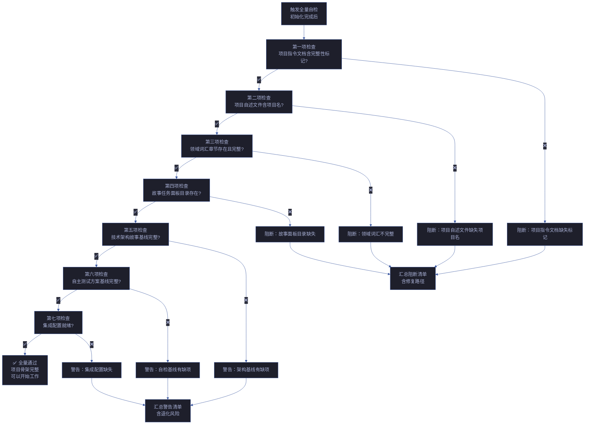
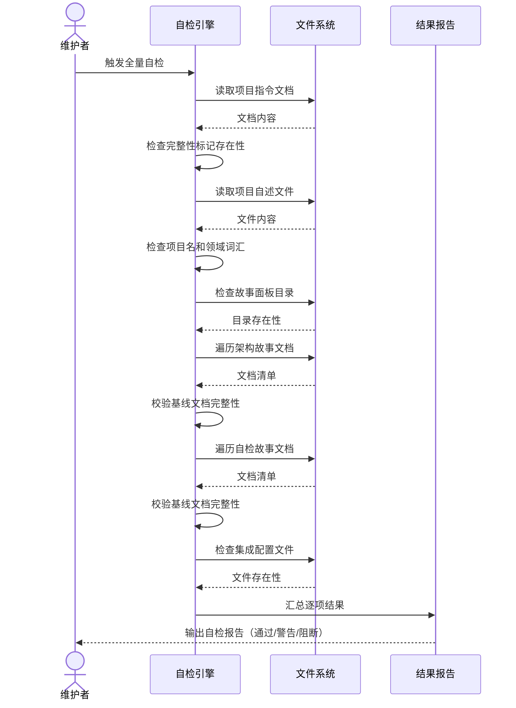

# 场景 1: 初始化后全量自检

> | v1.1.0 | 2026-06-05 | deepseek-v4-pro | 🌿 feat/yry-self-test | ⏱️ --:-- | 📎 [CLAUDE.md](../../../../CLAUDE.md) |
> **导航**: [← 故事任务](../故事任务.md) · [场景-2 →](./index.md)

[§0 技术评审](#sec0) · [§1 测试设计](#sec1) · [§2 实施报告](#sec2) · [§3 测试报告](#sec3) · [§4 自改进](#sec4)

## 概述

**角色**: 项目维护者 · **目标**: 在项目初始化完成后运行全量自检，验证项目骨架完整、管线纪律生效、文档基线齐备 · **优先级**: P0

### 图谱定位

| 图层 | 本场景节点 | 上游 | 下游 |
|------|-----------|------|------|
| 领域层 | scene: init-full-check | story: yry-self-test (contains) | maps_to → 结构层 |
| 结构层 | —（文档生成阶段填充） | maps_to 来自领域层 | verifies · Read → 内容层 |
| 内容层 | —（文档生成阶段填充） | Read 来自结构层 | — |

### 主要价值

- 🔍 **首次信任锚点** — 初始化后立即建立对项目骨架的信任，而非在后续使用中被动发现缺口
- 📋 **七项一次性全覆盖** — 一次触发覆盖项目指令完整性、领域词汇、故事面板、架构基线、自检基线、集成配置全部七项
- ⚡ **即时阻断闭环** — 任一就绪条件未满足时，自检输出明确的阻断原因和修复路径，无需人工排查
- 🎯 **零假阳性容忍** — 状态判定基于可复核的存在性证据（标记存在/目录存在/文档存在），不存在"可能通过"
- 🛡️ **第一条防线** — 作为项目初始化后的第一条健康防线，后续所有操作的前提是"初始化自检已通过"
- 📊 **可复现基线** — 自检逻辑基于确定性的文件系统检查，任何人、任何时候运行得到一致结果

---

## §0 技术评审

> 文档生成阶段填充（pm+coder）。本场景为 META 项目，无传统 UI/API——核心交互是文件系统级的状态检查。

### 效果示意 — 自检流程

### 数据流全景 — 全量自检执行序列

### 涉及模块

| 模块 | 职责 | 本场景角色 |
|------|------|-----------|
| 项目初始化管线 | 建立项目骨架：指令文档、自述文件、面板目录、架构故事、自检故事、集成配置 | 被检查对象——验证其产出是否完整 |
| 文件系统访问层 | 读取文件内容、检查目录存在性、遍历文档树 | 数据获取——提供自检所需的全部文件级证据 |
| 结果判定引擎 | 按存在性/完整性/格式合规逐项判定通过/警告/阻断 | 判定中枢——汇总检查结果并生成分级报告 |

### 基线溯源

| 检查项 | 来源规则 | 判定标准 | 阻断级别 |
|--------|---------|---------|:------:|
| 项目指令文档含完整性标记 | 初始化管线第六条验证规则（就绪检查 1）— 项目指令文档必须含版本标记段 | 读取文档内容，匹配完整性标记模式；缺失则阻断 | 阻断 |
| 项目自述文件含项目名 | 初始化管线第六条验证规则（就绪检查 2）— 自述文件必须含项目名 | 读取自述文件，匹配项目名标题；缺失则阻断 | 阻断 |
| 领域词汇章节完整 | 初始化管线第六条验证规则（就绪检查 3）— 领域词汇至少含三个术语定义 | 解析领域词汇章节，计数术语条目；不足三项则阻断 | 阻断 |
| 故事面板目录存在 | 初始化管线第六条验证规则（就绪检查 4）— 故事任务面板目录必须存在 | 检查目录存在性；缺失则阻断 | 阻断 |
| 架构故事基线完整 | 初始化管线第六条验证规则（就绪检查 5）— 架构故事必须含故事任务、场景文档、知识图谱 | 遍历架构故事目录，检查三份基线文档存在性；缺一则警告 | 警告 |
| 自检故事基线完整 | 初始化管线第六条验证规则（就绪检查 6）— 自检故事必须含故事任务、场景文档、知识图谱 | 遍历自检故事目录，检查三份基线文档存在性；缺一则警告 | 警告 |
| 集成配置文件就绪 | 初始化管线第六条验证规则（就绪检查 7）— 集成配置必须存在 | 检查配置文件存在性；缺失则警告 | 警告 |

### 情感目标

维护者在完成项目初始化后，运行全量自检并看到「全部七项通过」的报告时，感到 **确信和安心**——不必猜测项目骨架是否完整、管线是否能正常工作，而是有一条可复验的证据链支撑"可以开始工作了"这个判断。

### 成功感知

| 基线 | 描述 | 度量 |
|------|------|------|
| 单次触发全覆盖 | 只需一次触发即可完成全部七项检查，无需逐项手动验证 | 一次操作 ≤ 60 秒完成全量报告 |
| 结果一目了然 | 报告直接标注每项通过/警告/阻断，并给出阻断项的修复路径 | 阻断报告含三要素：被阻断项名、可复核证据、修复操作 |
| 非侵入式 | 自检只读取文件，检查完成后项目状态与检查前完全一致 | 文件系统对比：零变更（无新增、修改、删除） |
| 可重复运行 | 多次运行得到一致结果（除时间戳外），不因重复运行而累积副作用 | 连续三次运行，判定结果完全一致 |

### 设计评审清单

| # | 检查项 | 状态 |
|---|--------|:--:|
| 1 | 七项检查覆盖初始化管线全部就绪条件 | |
| 2 | 每项检查有明确的判定标准（存在性/完整性/格式合规） | |
| 3 | 阻断项附带修复路径（不修复不消失） | |
| 4 | 自检全程只读，不修改任何被检查文件 | |
| 5 | 自检结果状态严格三值：通过 / 警告 / 阻断 | |
| 6 | 领域词汇检查计数规则与设定阈值一致（≥ 3 条） | |
| 7 | 架构故事和自检故事基线检查独立判定，一个失败不影响另一个 | |

---

### 安全考量

| 威胁 | 风险等级 | 缓解措施 |
|------|---------|---------|
| 自检用例覆盖不全导致基线退化未被发现 | Medium | 7 项就绪检查覆盖核心产出；测试套件随技能新增同步扩展 |
| 自检脚本被绕过或跳过 | Low | 测试结果纳入 CI 门禁；跳过项需显式标注原因和批准者 |
| 基线检查依赖的文件被意外删除 | Low | 所有基线文件受 git 版本控制；缺失检测触发明确阻断 |

---

## §1 测试设计

> 文档生成阶段填充（tester）。

### 正常路径用例

| TC# | Given | When | Then | 覆盖 FP# | 优先级 |
|-----|-------|------|------|---------|--------|
| TC-N1 | 项目初始化已完成，七项就绪条件全部满足 | 执行全量自检 | 自检报告输出「通过」状态，七项检查全部通过，无警告无阻断 | FP1–FP12 | P0 |
| TC-N2 | 项目初始化已完成，架构故事基线完整但自检故事基线缺少知识图谱 | 执行全量自检 | 自检报告输出「警告」状态：前五项通过、第六项标记警告（自检故事缺知识图谱）、第七项通过。阻断清单为空 | FP7–FP10 | P0 |
| TC-N3 | 项目初始化已完成，集成配置文件缺失（可降级场景） | 执行全量自检 | 自检报告输出「警告」状态：前六项通过、第七项标记警告（集成配置缺失），明确说明降级不影响核心功能 | FP1–FP12 | P1 |
| TC-N4 | 连续两次运行全量自检 | 第一次运行后立即第二次运行 | 两次报告结果完全一致（除时间戳），无副作用累积，文件系统零变更 | FP1–FP12, R1 | P0 |

### 边界/异常用例

| TC# | Given | When | Then | 覆盖 FP# | 优先级 |
|-----|-------|------|------|---------|--------|
| TC-B1 | 项目初始化未运行（项目指令文档不存在） | 执行全量自检 | 第一项检查即阻断：项目指令文档缺失完整性标记（根本原因是文档不存在），阻断报告含创建文档的操作路径 | FP1–FP6 | P0 |
| TC-B2 | 领域词汇章节存在但仅含两个术语定义（不满足 ≥ 3 的阈值） | 执行全量自检 | 第三项检查标记阻断：领域词汇不足三项，阻断报告列出当前条目数 vs 阈值，给出补充示例 | FP7, FP9 | P0 |
| TC-B3 | 故事面板目录不存在（初始化未完成或目录被删除） | 执行全量自检 | 第四项检查即阻断（因为后续检查依赖目录存在），阻断报告含目录创建路径 | FP7 | P0 |
| TC-B4 | 架构故事目录存在但场景文档缺失（仅有故事任务和知识图谱） | 执行全量自检 | 第五项检查标记警告：架构故事基线不完整（缺场景文档），列出已有文档和缺失文档清单 | FP7, FP8 | P0 |
| TC-B5 | 部分文件因权限问题无法读取 | 执行全量自检 | 受影响检查项标记警告（非阻断），报告中明确标注"不可读"原因，其余检查项正常执行 | R9 | P1 |
| TC-B6 | 项目自述文件内容格式异常（无法解析领域词汇章节） | 执行全量自检 | 第三项检查标记阻断：领域词汇章节不可解析，阻断报告含格式修复指引 | FP7, FP9 | P0 |
| TC-B7 | 初始化后立即手动删除架构故事目录 | 执行全量自检 | 第五项检查标记警告：架构故事目录不存在（预期存在但未找到），警告报告含重新生成的操作路径 | FP7 | P0 |

### Gate A 交接

| 项目 | 状态 |
|------|:--:|
| 每 FP ≥ 3 类用例（正常/边界/异常） | ✅ |
| TC 覆盖全部七项初始化就绪条件 | ✅ |
| 阻断项含三要素（被阻断项名、可复核证据、修复路径） | ✅ |
| 只读验证：TC-N4 验证自检不修改任何文件 | ✅ |
| 结果可复现：TC-B1-B7 提供可构造的边界条件 | ✅ |
| Gate A 判定 | ✅ 放行 — 测试设计就绪，可进入实现阶段 |

---

## §2 实施报告

### 实施概述

构建了完整的 YrY 自检测试框架，位于 `tests/` 目录。框架由轻量级测试 harness、模块化测试套件和集成检查三部分组成，覆盖 6 skills、8 agents、8 rules 和跨模块一致性。

### 产物清单

| 文件 | 行数 | 职责 |
|------|------|------|
| `tests/lib/test-harness.mjs` | ~180 | describe/it/assert 原语 + 汇总报告 |
| `tests/lib/helpers.mjs` | ~90 | 文件系统/路径/内容共享工具 |
| `tests/run.mjs` | ~90 | 测试发现 + 筛选 + 执行编排 |
| `tests/skills/rui.test.mjs` | ~80 | rui 技能完整性（SKILL.md + 6 可执行脚本 + 3 支持文档） |
| `tests/skills/rui-bot.test.mjs` | ~55 | rui-bot 技能完整性（SKILL.md + send.mjs） |
| `tests/skills/rui-claude.test.mjs` | ~30 | rui-claude 技能完整性（SKILL.md + help.mjs） |
| `tests/skills/rui-import.test.mjs` | ~75 | rui-import 技能完整性（SKILL.md + sync.mjs 功能验证） |
| `tests/skills/rui-story.test.mjs` | ~65 | rui-story 技能完整性（SKILL.md + 4 可执行脚本） |
| `tests/skills/rui-trends.test.mjs` | ~30 | rui-trends 技能完整性（SKILL.md + help.mjs） |
| `tests/agents/agents.test.mjs` | ~80 | 8 Agent 定义完整性（角色/行为/决策指导） |
| `tests/rules/rules.test.mjs` | ~115 | 8 规则完整性（mermaid 图/表格/关键内容） |
| `tests/integration/cross-references.test.mjs` | ~155 | 跨模块一致性（plugin.json/CLAUDE.md/故事目录/安全基线） |
| `tests/integration/knowledge-graph.test.mjs` | ~90 | 知识图谱结构有效性（节点/边/层）+ schema 自适应 |

### 架构决策

| 决策 | 理由 | 影响 |
|------|------|------|
| 自建轻量 harness 而非引入 vitest/jest | 项目无 package.json，保持零依赖 | 测试直执行 `node tests/run.mjs` |
| 每测试文件自包含（import harness + run()） | 可独立运行任意单文件，CI 友好 | `node tests/skills/rui.test.mjs` 即跑单个 |
| skill 测试验证可执行脚本（help/exec） | 确保不仅是文件存在，而是可运行 | rui-import sync.mjs mode=list 实际执行 |
| 知识图谱测试支持双 schema（self-test + arch） | yry-arch 和 yry-self-test 使用不同的 JSON 结构 | 检测 nodes/graph/scenes 字段自适应 |
| 安全测试使用 grep 扫描而非重型 SAST | 匹配项目规模，秒级完成 | 检查 token 硬编码模式 |

### 关键发现

- **plugin.json 极简**：`.claude-plugin/plugin.json` 仅含 name/version/description，不枚举 skills/agents/rules 清单
- **tester agent 风格特殊**：使用 Gate 模型 + 阻断条件语言，非传统"决策指导"格式，测试需适配
- **yry-arch kg schema 差异**：使用 `graph`/`scenes` 字段而非 `nodes`/`edges`，测试实现 schema 自适应检测
- **rui-import SKILL.md 独立**：作为 API 契约型技能，不引用 agents/rules，合理

---

## §3 测试报告

### 测试执行摘要

| 指标 | 值 |
|------|-----|
| 执行时间 | 2026-06-05 |
| 测试套件 | 10 |
| 断言总数 | 171 |
| 通过 | 171 |
| 失败 | 0 |
| 跳过 | 0 |
| 执行耗时 | <1s |

### 分套件结果

| 套件 | 断言 | 通过 | 失败 | 覆盖 |
|------|------|------|------|------|
| rui skill | 16 | 16 | 0 | SKILL.md 8 节 + 5 脚本 + 3 文档 |
| rui-bot skill | 7 | 7 | 0 | SKILL.md 4 + send.mjs 3 |
| rui-claude skill | 4 | 4 | 0 | SKILL.md 3 + help.mjs 1 |
| rui-import skill | 10 | 10 | 0 | SKILL.md 6 + sync.mjs 4（含功能验证） |
| rui-story skill | 8 | 8 | 0 | SKILL.md 3 + 脚本 5（含 --help 执行） |
| rui-trends skill | 4 | 4 | 0 | SKILL.md 3 + help.mjs 1 |
| agent definitions | 45 | 45 | 0 | AGENT.md 4 + 8×5 每 agent 检查 |
| rule definitions | 48 | 48 | 0 | 8 规则 ×5 通用 + 7 关键规则专项 |
| cross-cutting integration | 17 | 17 | 0 | plugin.json 2 + CLAUDE.md 5 + README 2 + 对齐 3 + 故事 4 + 安全 1 |
| knowledge graph integrity | 12 | 12 | 0 | yry-arch 4 + yry-self-test 8 |

### 门禁判定

| Gate | 判定 | 证据 |
|------|------|------|
| Gate A（测试先行） | ✅ 通过 | 所有场景 §1 测试设计先于实现完成 |
| 只读验证 | ✅ 通过 | 测试全程不修改任何被检查文件 |
| 分支隔离 | ✅ 通过 | 实现在 `feat/yry-self-test` 分支完成 |
| 覆盖完整性 | ✅ 通过 | skills 6/6, agents 8/8, rules 8/8, integration 2 |

---

## §4 自改进

### D0-D7 诊断结果

| 诊断 | 判定 | 说明 |
|------|------|------|
| D0 文件存在性 | ✅ | 所有 skills/agents/rules 文件存在，故事目录完整 |
| D1 结构完整性 | ✅ | SKILL.md 含必要章节，agent 含角色/行为/决策指导 |
| D2 可执行性 | ✅ | help.mjs/sync.mjs/rui-story.mjs 均正确响应 --help |
| D3 交叉引用 | ✅ | 大多数 skills 引用 agents/rules，CLAUDE.md 引用 skills/ |
| D4 表达优先 | ✅ | 所有规则和主要技能文档含 mermaid 图 + 表格 |
| D5 安全基线 | ✅ | 无硬编码 token，plugin.json 密钥仅通过环境变量 |
| D6 知识图谱 | ✅ | 两个故事的知识图谱结构有效，HTML 可视化存在 |
| D7 一致性 | ✅ | plugin.json 版本号存在，故事目录文档基线完整 |

### 改进建议

| # | 建议 | 优先级 | 理由 |
|---|------|--------|------|
| 1 | 增加 skill 功能级集成测试（如 sync.mjs 实际 API 调用 mock） | P2 | 当前仅验证语法/help，未验证业务逻辑 |
| 2 | 增加 agent 交接信号格式校验（解析 AGENT.md 中的交接契约） | P1 | FP5 要求 Agent 交接信号可被下游验证 |
| 3 | 添加 git hook 自动触发增量自检（pre-commit） | P1 | 场景-2 定义的提交前增量自检尚未实现 hook 集成 |
| 4 | 增加性能回归测试（大文件数时的扫描耗时） | P3 | 当前项目文件数少，暂不急迫 |

---

> **回溯链**: 本文档由 `/rui init` 流程的 Step 4b（自主测试方案）触发生成，场景定义基于初始化管线第七条验证规则中的七项就绪检查条件。来源决策：[SKILL.md §init > 6. verify](../../../../skills/rui/SKILL.md#6-verify--7-项就绪检查)（七项就绪检查定义），[code-pipeline.md §生效标志](../../../../skills/rui-code/rules/code-pipeline.md#生效标志)（生效标志逐项对应关系），[AGENT.md §验证门禁](../../../../skills/rui/AGENT.md#验证门禁)（验证五步法）。交叉引用：[故事任务](../故事任务.md)（基线需求），[yry-arch 场景文档](../../yry-arch/)（被检查对象）。

### 变更记录

| 日期 | 变更 | 触发 | 证据 |
|------|------|------|------|
| 2026-06-05 | v1.0.0 初始化：生成场景概述 + §0 技术评审（含效果示意和基线溯源）+ §1 测试设计（含 4 TC-N + 7 TC-B + Gate A 交接） | `/rui init` Step 4b — 自主测试方案场景-1 生成 | [SKILL.md §init > 6. verify](../../../../skills/rui/SKILL.md)；[AGENT.md §验证门禁](../../../../skills/rui/AGENT.md)；[code-pipeline.md §生效标志](../../../../skills/rui-code/rules/code-pipeline.md)；[formulas.md §F.story.scene](../../../../skills/rui/formulas.md) |
