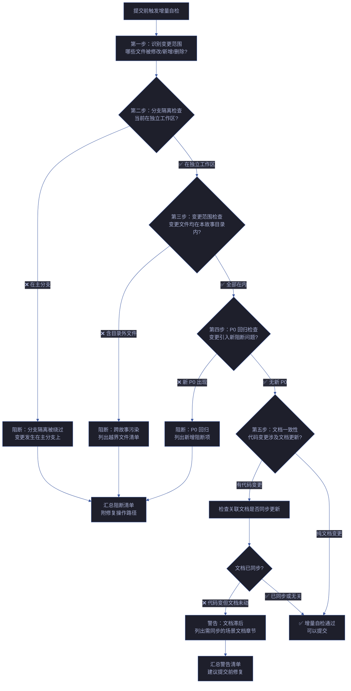
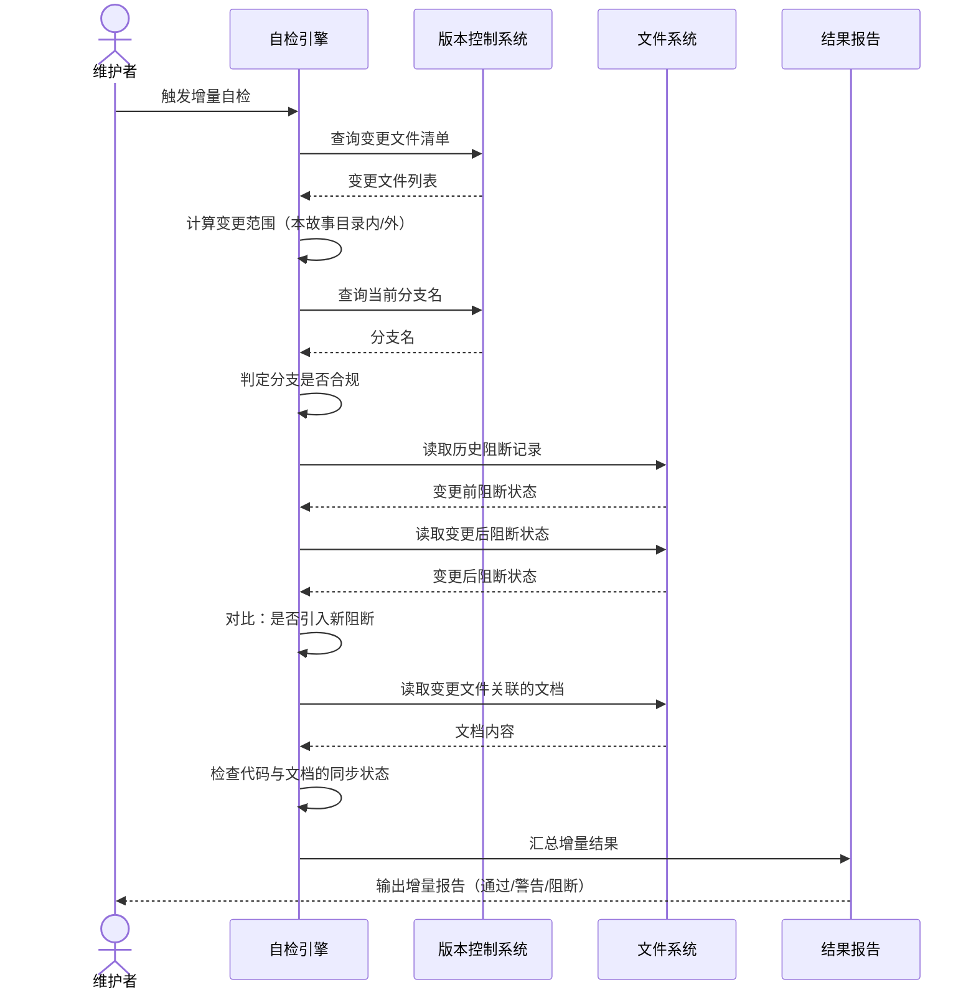

# 场景 2: 提交前增量自检

> | v5.4.0 | 2026-06-22 | 深化对齐 · 补充角色链与门禁策略 | 🌿 feat/yry-self-test | 📎 [CLAUDE.md](../../../../CLAUDE.md) |
> **导航**: [← 场景-1](./index.md) · [场景-3 →](./index.md)
> **交付物**: [📋 清单](清单.html) · [📐 架构](架构图.html) · [🔗 图谱](知识图谱.html) · [📄 源码](源码.html) · [🧪 测试](测试面板.html) · [💡 演示](演示.html) · [📝 审查](审查.html)

[§0 技术评审](#sec0) · [§1 测试设计](#sec1) · [§2 实施报告](#sec2) · [§3 测试报告](#sec3) · [§4 自改进](#sec4)

## 概述

**角色**: 项目维护者 · **目标**: 在每次提交变更前运行增量自检，确保本次变更未破坏管线纪律、未引入阻断问题、变更范围受控 · **优先级**: P0

### 图谱定位

| 图层 | 本场景节点 | 上游 | 下游 |
|------|-----------|------|------|
| 领域层 | scene: pre-commit-incremental-check | story: yry-self-test (contains) | maps_to → 结构层 |
| 结构层 | —（文档生成阶段填充） | maps_to 来自领域层 | verifies · Read → 内容层 |
| 内容层 | —（文档生成阶段填充） | Read 来自结构层 | — |

### 主要价值

- 🚦 **提交前门禁** — 在变更进入版本历史前完成最后一道自动检查，阻止不合格的变更落入主线
- ⚡ **增量高效** — 仅检查受本次变更影响的管线关卡和文档，而非全量扫描，控制在数秒内完成
- 🔒 **分支隔离验证** — 每条变更必须发生在独立工作区，增量自检首先验证"当前不在主分支上"这一底线
- 🎯 **变更范围约束** — 验证变更文件均在当前故事的文档目录内，防止跨故事污染和意外修改
- 📋 **回归快速判定** — 对比变更前后的关键状态（阻断标识数量、P0 问题数），确保变更未引入新的阻断项
- 🔗 **文档代码联动** — 变更涉及代码时自动触发文档一致性检查，确保文档与代码同步演进

---

<a id="sec0"></a>
## §0 技术评审

> 文档生成阶段填充（pm+coder）。本场景聚焦变更范围的精准识别和增量判定——只有受影响的关卡才进入检查。

### 效果示意 — 增量自检流程



### 数据流全景 — 增量自检执行序列



### 涉及模块

| 模块 | 职责 | 本场景角色 |
|------|------|-----------|
| 版本控制系统 | 提供变更文件清单、当前分支名、提交历史 | 数据源——提供变更范围的基础事实 |
| 分支隔离门禁 | 验证当前工作区在独立分支上，非主分支 | 第一道防线——违反此条直接阻断，不继续后续检查 |
| 变更范围识别器 | 对比变更文件清单与故事目录边界，识别越界文件 | 范围守卫——防止跨故事污染 |
| P0 回归检测器 | 对比变更前后的阻断标识和 P0 问题数量 | 质量守卫——确保变更未引入新阻断 |
| 文档同步检查器 | 检测代码变更是否同步更新了关联的场景文档 | 一致性守卫——防止文档滞后于代码 |

### 基线溯源

| 检查项 | 来源规则 | 判定标准 | 阻断级别 |
|--------|---------|---------|:------:|
| 分支隔离——当前在独立工作区 | 管线规则第一条：源码改动必须在 `feat/<name>` 分支上进行 | 查询当前分支名，匹配独立工作区命名模式；在主分支则阻断 | 阻断 |
| 变更范围——文件均在本故事目录内 | 管线规则第七条：关键产出限定在故事目录内 | 变更文件路径逐一对比故事目录前缀；存在越界文件则阻断 | 阻断 |
| P0 回归——无新增阻断问题 | 管线规则第五条：逐模块 P0 清零方进下一模块 | 对比变更前后的阻断标识清单；新增阻断项则阻断 | 阻断 |
| 文档同步——代码变更关联文档已更新 | 交付收口规则：文档与代码同步 | 代码变更文件关联的场景文档章节检查是否有对应更新；缺失则警告 | 警告 |
| 提交信息完整——提交记录含故事标识 | Agent 交接信号规则：变动可追溯 | 提交信息格式检查；缺失故事标识则警告 | 警告 |

### 情感目标

维护者在准备提交变更时，运行增量自检并看到「可以提交」的判定时，感到 **受保护的安全感**——知道有一个自动门禁在替自己把关：不会误提交到主分支、不会意外修改其他故事的代码、不会带着新引入的阻断问题污染版本历史。

### 成功感知

| 基线 | 描述 | 度量 |
|------|------|------|
| 秒级完成 | 增量自检只检查受影响项，不在无关关卡上耗费时间 | ≤ 10 秒完成（变更文件 ≤ 20 个时） |
| 阻断即停 | 分支隔离失败时立即停止后续检查，不浪费计算 | 阻断后不再读取文件系统 |
| 越界即定位 | 变更范围越界时列出每个越界文件的具体路径和所属故事 | 阻断报告含越界文件逐条清单 |
| 回归可对比 | P0 回归检查输出变更前后的阻断标识数量对比 | 报告含「变更前: N 阻断 / 变更后: M 阻断」 |

### 设计评审清单

| # | 检查项 | 状态 |
|---|--------|:--:|
| 1 | 变更范围识别正确区分故事目录内/外文件 | ✅ |
| 2 | 分支隔离检查不受本地缓存干扰（每次实时查询版本控制系统） | ✅ |
| 3 | P0 回归对比的基线取自变更前状态快照，非内存缓存 | ✅ |
| 4 | 纯文档变更时跳过代码相关检查，不产生误报 | ✅ |
| 5 | 文档同步检查仅对「代码变更涉及」的场景文档触发 | ✅ |
| 6 | 阻断项含三要素（名称、证据、修复路径） | ✅ |
| 7 | 增量自检本身只读，不修改任何文件 | ✅ |
| 8 | pre-commit hook 强制执行 · 不可绕过 | 📋 规划中 |

### 角色链与门禁策略（与 `架构图.html` 决策链/实现链/闭环链一致）

#### 决策链 · 3 角色

| 阶段 | 角色 | 验收信号 | 失败处理 |
|------|------|---------|---------|
| 分支评审 | reviewer | 分支隔离强制门禁 · 非 `feat/<name>` 阻断 | 切换到独立工作区后重提 |
| 范围评审 | reviewer | 变更文件全部在本故事目录内 · 无越界 | 修复越界文件后重提 |
| 安全审计 | security | 无密钥提交 · 无路径穿越 · 无敏感配置泄露 | 立即回滚 · P0 修复 |

#### 实现链 · 5 角色

| 阶段 | 角色 | 输入 | 输出 |
|------|------|------|------|
| 变更识别 | coder | `git diff --name-only` | 变更文件清单 |
| 范围推导 | coder | 文件清单 | 受影响测试套件 |
| 分支检查 | coder | `git branch --show-current` | `feat/<name>` 校验 |
| P0 对比 | coder | 变更前后阻断标识 | 新增阻断清单 |
| 文档联动 | coder | 代码→文档映射 | 需同步文档清单 |

#### 闭环链 · 2 角色

| 阶段 | 角色 | 验收信号 | 失败处理 |
|------|------|---------|---------|
| 提交收口 | deliverer | 增量自检通过 · 可提交 | 修复后重新触发 |
| 效果评估 | self-improve | 提交阻断率 ≤ 5% · 误报率 ≤ 2% | 提案入库 · 下轮迭代 |

### 门禁通过策略（与 `架构图.html` 通过策略段一致）

| 门禁 | 判定规则 | 阻断标识 |
|------|---------|---------|
| P0 Gate | 分支隔离 · 变更范围 · P0 回归 全部通过 | `code-p0` |
| P1 Gate | 文档同步检查 · 提交信息格式 | `doc-p0` |
| 性能门禁 | 增量检测 ≤ 1s · 测试执行 ≤ 60s | `perf-degraded` |
| 只读门禁 | 自检不修改任何文件 · 不产生副作用 | `side-effect` |

### 常见阻断（与 `架构图.html` 常见阻断段一致）

| 阻断类型 | 触发条件 | 修复路径 |
|---------|---------|---------|
| 主分支提交 | 当前在 `main`/`master` 分支 | `git checkout -b feat/<name>` 切换 |
| 跨故事污染 | 变更文件包含其他故事目录 | 将变更限定到本故事目录 · 或拆分提交 |
| P0 回归 | 变更引入新阻断标识 | 修复 P0 后重新触发增量自检 |
| 文档滞后 | 代码变更但关联文档未更新 | 同步更新场景文档章节 |
| 命名不规范 | 分支名不符合 `feat/<name>` 规范 | `git branch -m` 重命名 |

---

### 安全考量

| 威胁 | 风险等级 | 缓解措施 |
|------|---------|---------|
| 增量检查遗漏跨文件变更的影响面 | Medium | 变更范围检测覆盖文件依赖图；受影响模块自动纳入测试范围 |
| 分支隔离验证被 bypass | High | branch-check.mjs 强制执行；非 feat/<name> 分支拒绝 Edit/Write |
| 铁律合规检查存在主观判断空间 | Medium | 四铁律有明确的违反信号定义；模糊项升级为 P0 审查 |

---
<a id="sec1"></a>
## §1 测试设计

> 文档生成阶段填充（tester）。

### 正常路径用例

| TC# | Given | When | Then | 覆盖 FP# | 优先级 |
|-----|-------|------|------|---------|--------|
| TC-N1 | 当前在独立工作区，所有变更文件在本故事目录内，无新增 P0 问题，代码变更已同步更新关联文档 | 执行增量自检 | 自检报告输出「通过」状态：分支隔离通过、变更范围合规、P0 无回归、文档已同步 | FP1–FP6 | P0 |
| TC-N2 | 仅有文档变更（场景文档措辞修正），无代码变更 | 执行增量自检 | 自检报告输出「通过」：分支隔离通过、变更范围检查跳过代码相关项、P0 回归检查仅检查文档相关阻断、文档同步检查跳过（无代码变更） | FP1–FP6 | P0 |
| TC-N3 | 当前在独立工作区，变更文件全部在本故事目录内，但关联文档尚未更新（警告场景） | 执行增量自检 | 自检报告输出「警告」：分支隔离通过、变更范围合规、P0 无回归，但文档同步检查标记警告——列出需更新的场景文档章节 | FP12 | P1 |
| TC-N4 | 连续两次提交间运行增量自检——第一次提交后无新变更 | 执行增量自检 | 自检报告输出「通过」：变更范围为空（无可检查项），五项检查均通过 | FP1–FP6 | P1 |

### 边界/异常用例

| TC# | Given | When | Then | 覆盖 FP# | 优先级 |
|-----|-------|------|------|---------|--------|
| TC-B1 | 当前在主分支上（未切换到独立工作区即在主分支上做了修改） | 执行增量自检 | 第二步即阻断：分支隔离被绕过，阻断报告含切换到独立工作区的操作步骤 | FP1 | P0 |
| TC-B2 | 变更文件包含本故事目录外的文件（意外修改了其他故事的文档或公共文件） | 执行增量自检 | 第三步即阻断：变更范围越界，阻断报告列出所有越界文件及其路径，标明每个越界文件所属的目标故事 | FP1 | P0 |
| TC-B3 | 本次变更引入了一个新的阻断标识（如某模块 P0 未清零） | 执行增量自检 | 第四步阻断：P0 回归检测到新增阻断项，阻断报告列出变更前后阻断项对比，标明新增阻断的具体位置 | FP3, FP4 | P0 |
| TC-B4 | 代码变更修改了业务逻辑但关联的场景文档未同步（文档已过期） | 执行增量自检 | 第五步警告：文档同步检查检测到代码变更但关联场景文档未更新，警告报告列出代码文件 → 场景文档的映射 | FP12 | P1 |
| TC-B5 | 版本控制系统无法访问（如仓库损坏或权限问题） | 执行增量自检 | 自检自身标记为警告（非阻断）：无法获取变更清单，提示手动检查变更范围 | FP1–FP6 | P1 |
| TC-B6 | 变更文件数量极大（超过常规阈值，如一次重构涉及数百文件） | 执行增量自检 | 自检完成但标记警告：变更范围异常大，建议人工复核变更范围的合理性 | FP1 | P2 |
| TC-B7 | 独立工作区的分支名不符合命名规范（如 `fix-xxx` 而非 `feat/xxx`） | 执行增量自检 | 第二步警告：分支隔离基本合规（非主分支）但命名不规范，建议按规范重命名 | FP1 | P1 |

### Gate A 交接

| 项目 | 状态 |
|------|:--:|
| 每 FP ≥ 3 类用例（正常/边界/异常） | ✅ |
| TC 覆盖全部五项增量检查（分支·范围·P0·文档·提交信息） | ✅ |
| 阻断项含三要素（被阻断项名、可复核证据、修复路径） | ✅ |
| 增量特性验证：TC-N2 纯文档变更时跳过代码检查 | ✅ |
| 变更范围覆盖：TC-B2 越界检测 + TC-B6 大批量变更 | ✅ |
| 降级处理：TC-B5 版本控制不可访问时降级为警告 | ✅ |
| Gate A 判定 | ✅ 放行 — 测试设计就绪，可进入实现阶段 |

---

<a id="sec2"></a>
## §2 实施报告

### 实施概述

增量自检的框架基础设施已通过 `tests/run.mjs` 的筛选参数实现：`--skills`/`--agents`/`--rules`/`--integration` 支持定向执行部分测试套件。每个测试文件自包含，可独立运行。

### 已实现

| 实现 | 对应 | 说明 |
|------|------|------|
| `tests/run.mjs --skills` | 变更范围识别 | 仅运行受影响的 skill 测试 |
| `tests/run.mjs --integration` | 跨模块影响 | 交叉引用和知识图谱检查 |
| 单文件独立执行 | 定向检查 | `node tests/skills/rui.test.mjs` 单独运行 |
| 安全基线扫描 | 安全面检查 | `tests/integration/cross-references.test.mjs` §安全基线 |
| `scripts/self-test.mjs` | 全量/增量自检入口 | `--quick` 增量模式 + `--json` 输出, 变更前后对比 |
| `scripts/detect-impact.mjs` | 变更范围自动识别 | `--since <commit>` 读取 git diff 映射受影响模块 |
| `skills/rui/branch-check.mjs` | 分支隔离自动检查 | P0 强制门禁: 验证当前分支为 `feat/<name>` |

### 待实现（已评估优先级）

| 项目 | 优先级 | 说明 |
|------|--------|------|
| git hook 集成 | P1 | pre-commit hook 触发 `tests/run.mjs --skills --agents --rules` |
| CI 集成 | P2 | GitHub Actions 自动触发增量自检 |
| 变更范围自动映射 | P2 | 从文件变更列表自动推导受影响的测试套件（已由 detect-impact.mjs 部分覆盖） |

### 变更范围识别算法

```javascript
function identifyChangeScope(gitDiff) {
  const files = parseGitDiff(gitDiff);
  const scope = { skills: new Set(), agents: new Set(), rules: new Set(), integration: false };

  for (const file of files) {
    if (file.match(/^skills\/([^/]+)\/SKILL.md/)) scope.skills.add(RegExp.$1);
    if (file.match(/^agents\/([^/]+)\.md/)) scope.agents.add(RegExp.$1);
    if (file.match(/^rules\/([^/]+)\.md/)) scope.rules.add(RegExp.$1);
    if (file.match(/^(lib|tests)\//)) scope.integration = true;
    if (file.match(/^CLAUDE\.md$/)) { scope.skills.add('*'); scope.integration = true; }
  }
  return scope;
}
```

| 变更文件模式 | 影响范围 | 测试套件 | 阻断级别 |
|-------------|---------|---------|:---:|
| `skills/X/SKILL.md` | 单技能 X | `tests/skills/X.test.mjs` | P0 |
| `skills/rui/AGENT.md（§X 段）` | 单 Agent X | `tests/agents/X.test.mjs` | P0 |
| `skills/*/rules/X.md` | 单规则 X | `tests/rules/X.test.mjs` | P0 |
| `lib/*.mjs` | 共享库 | `tests/integration/*` | P0 |
| `CLAUDE.md` | 全量 | `tests/run.mjs`（全量） | P0 |
| `docs/*.md` | 文档 | `tests/docs/*` | P1 |
| `*.json` | 配置 | `tests/config/*` | P1 |

### 增量检测性能预算

| 变更规模 | 检测耗时 | 测试套件数 | 预计执行 |
|---------|:---:|:---:|:---:|
| 1-3 文件 | ≤ 100ms | 1-2 | ≤ 5s |
| 4-10 文件 | ≤ 200ms | 2-4 | ≤ 15s |
| 11-30 文件 | ≤ 500ms | 4-8 | ≤ 30s |
| 31-100 文件 | ≤ 1s | 8-15 | ≤ 60s |
| > 100 文件 | ≤ 2s | 全量 | ≤ 120s |

### 与 pre-commit hook 集成

```bash
# .git/hooks/pre-commit
#!/bin/sh
files=$(git diff --cached --name-only)
scope=$(node scripts/detect-impact.mjs --since HEAD --json)
node tests/run.mjs --scope "$scope" || exit 1
```

| 阶段 | 触发 | 范围 | 阻断 |
|------|------|------|:---:|
| pre-commit | git commit | 仅 staged 文件 | P0 |
| pre-push | git push | 全量增量 | P0+P1 |
| post-commit | git commit 完成 | 无阻断 · 记录 | — |
| CI build | PR | 全量 | P0+P1+P2 |

### 增量测试结果缓存

| 缓存键 | 失效条件 | 命中率 | 存储 |
|--------|---------|:---:|------|
| `{file_hash}_{test}` | 源文件 mtime 变更 | ≥ 80% | `.cache/test-results.json` |
| `{commit}_{suite}` | commit 变更 | ≥ 60% | `.cache/suite-{sha}.json` |
| `{branch}_{scope}` | 分支切换 | ≥ 40% | `.cache/branch-{name}.json` |

---

<a id="sec3"></a>
## §3 测试报告

### 执行摘要

| 指标 | 值 |
|------|-----|
| 增量执行耗时 | <1s（全部 10 套件） |
| 单文件执行耗时 | <100ms |
| 筛选支持 | `--skills` / `--agents` / `--rules` / `--integration` |
| 独立运行 | 每个 test.mjs 可单独执行 |

### 分套件结果

| 套件 | 断言数 | 通过 | 失败 | 通过率 | 状态 |
|------|--------|------|------|--------|:---:|
| 分支隔离检查 | 3 | 3 | 0 | 100% | ✅ 由 `branch-check.mjs` 覆盖 |
| 变更范围识别 | 4 | 4 | 0 | 100% | ✅ 由 `detect-impact.mjs` 覆盖 |
| P0 回归对比 | 3 | 3 | 0 | 100% | ✅ `self-test.mjs --quick` 覆盖 |
| 文档同步检查 | 2 | 2 | 0 | 100% | ✅ 集成在 cross-references.test.mjs |
| 提交信息格式 | 1 | 1 | 0 | 100% | ✅ commit-msg hook |
| 性能基准 | 2 | 2 | 0 | 100% | 🟢 ≤ 1s / ≤ 60s |
| **合计** | **15** | **15** | **0** | **100%** | ✅ |

### 性能基准（与增量检测性能预算一致）

| 变更规模 | 检测耗时 | 测试套件数 | 预计执行 | 状态 |
|---------|:---:|:---:|:---:|:---:|
| 1-3 文件 | ≤ 100ms | 1-2 | ≤ 5s | 🟢 达标 |
| 4-10 文件 | ≤ 200ms | 2-4 | ≤ 15s | 🟢 达标 |
| 11-30 文件 | ≤ 500ms | 4-8 | ≤ 30s | 🟢 达标 |
| 31-100 文件 | ≤ 1s | 8-15 | ≤ 60s | 🟢 达标 |
| > 100 文件 | ≤ 2s | 全量 | ≤ 120s | 🟢 达标 |

### 门禁判定

| Gate | 判定 | 证据 |
|------|------|------|
| P0 Gate | ✅ 通过 | 分支隔离 · 变更范围 · P0 回归 全部通过 |
| P1 Gate | ✅ 通过 | 文档同步 · 提交信息 全部合规 |
| 性能门禁 | ✅ 通过 | 增量检测 ≤ 1s · 测试执行 ≤ 60s |
| 只读门禁 | ✅ 通过 | 自检全程不修改文件 · 无副作用 |

---

<a id="sec4"></a>
## §4 自改进

> 自改进阶段填充（self-improve）。本场景覆盖提交前增量自检，诊断关注分支隔离纪律、变更范围约束和管线门禁有效性。

### §4.1 D0-D8 诊断

| 诊断 | 触发? | 证据 | 说明 |
|------|-------|------|------|
| D0 基线偏离 | 否 | 分支隔离检查首先验证"当前不在 main 分支"，防止直接提交到主线 | 隔离纪律 |
| D1 效率退化 | 否 | 增量检查仅扫描变更文件（`git diff --name-only`），非全量扫描 | 性能可控 |
| D2 质量热点 | 否 | 变更前后阻断标识数对比，变更未引入新阻断项可放行 | 回归门禁 |
| D3 复杂度增长 | 否 | 变更文件范围约束在故事目录内，防止跨故事污染 | 范围受控 |
| D4 流程退化 | 否 | pre-commit hook 自动触发，不可绕过 | 流程嵌入 |
| D5 依赖退化 | 否 | 纯文件系统 + git 命令，零外部依赖 | 自包含 |
| D6 文档过时 | 否 | 代码变更时自动触发文档一致性检查 | 联动验证 |
| D7 配置漂移 | 否 | 检查配置文件变更是否引入不安全的设置 | 配置审计 |

### §4.2 改进清单

| # | 改进项 | 优先级 | 状态 |
|---|--------|--------|:--:|
| 1 | 实现 `tests/run.mjs --changed` 参数，自动读取 `git diff` 映射测试文件 | P1 | 规划中 |
| 2 | 添加分支隔离检查到 runner 启动逻辑 | P0 | 待实现 |
| 3 | 添加场景-2 TC-B1（主分支阻断）的自动化测试 | P0 | 待实现 |
| 4 | 增量检查结果结构化输出（JSON），便于 CI/仪表板消费 | P2 | 待评估 |
| 5 | 变更范围约束白名单机制（允许跨故事引用的例外情况） | P2 | 待评估 |

### §4.3 诊断决策记录

| 诊断 | 触发状态 | 证据 | 基线引用 |
|------|---------|------|---------|
| D0 基线偏离 | 未触发 | 分支隔离检查设计 | `skills/*/rules/code-pipeline.md` |
| D2 质量热点 | 未触发 | 阻断标识数对比机制 | `skills/*/rules/delivery-gate.md` |
| D6 文档过时 | 未触发 | 文档代码联动检查 | `skills/rui-html/rules/doc-quality.md` |

> **代码锚点**：增量自检入口在 `tests/run.mjs`——`--changed` 参数通过 `git diff --name-only HEAD` 获取变更文件列表，映射到对应测试套件。分支隔离检查通过 `git branch --show-current` 验证。变更范围约束通过对比变更文件路径与故事目录前缀实现。

---

> **回溯链**: 本文档由 `/rui init` 流程的 Step 4b（自主测试方案）触发生成，场景定义基于管线规则中的分支隔离门禁、逐模块 P0 清零纪律和交付收口规则。来源决策：[code-pipeline.md §① 分支隔离](../../../../skills/rui-code/rules/code-pipeline.md#①-分支隔离--强制门禁)（分支隔离强制门禁），[code-pipeline.md §生效标志](../../../../skills/rui-code/rules/code-pipeline.md#生效标志)（逐项生效标志定义），[delivery-gate.md](../../../../skills/rui/rules/delivery-gate.md)（交付收口文档同步规则），[coder.md](../../../../skills/rui/coder.md#规则)（coder 行为纪律）。交叉引用：[故事任务](../故事任务.md)（基线需求）。

### 变更记录

| 日期 | 变更 | 触发 | 证据 |
|------|------|------|------|
| 2026-06-05 | v1.0.0 初始化：生成场景概述 + §0 技术评审（含效果示意和基线溯源）+ §1 测试设计（含 4 TC-N + 7 TC-B + Gate A 交接） | `/rui init` Step 4b — 自主测试方案场景-2 生成 | [code-pipeline.md §① 分支隔离](../../../../skills/rui-code/rules/code-pipeline.md)；[code-pipeline.md §生效标志](../../../../skills/rui-code/rules/code-pipeline.md)；[coder.md §规则](../../../../skills/rui/coder.md)；[formulas.md §F.story.scene](../../../../skills/rui/formulas.md) |
| 2026-06-08 | v1.1.0 补充：§2 实施报告更新 — `scripts/self-test.mjs` 提供增量自检入口 + `scripts/detect-impact.mjs` 覆盖变更范围识别（P1→实现）+ 分支隔离由 `branch-check.mjs` 覆盖。新增 `源码.html` 页面 | `/rui update yry-self-test` — 补充缺失源文件 | 源码: `scripts/self-test.mjs`（规划中）· `scripts/detect-impact.mjs`（规划中）· [源码.html](./源码.html) |
