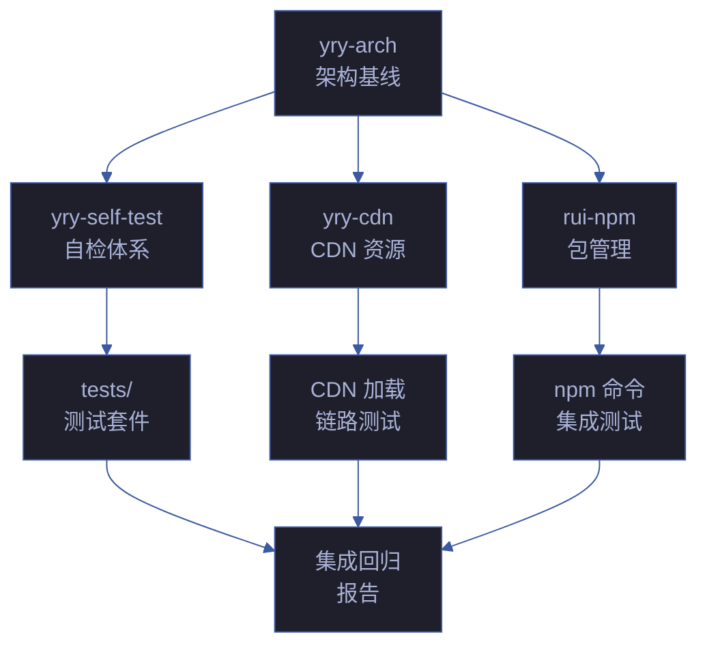
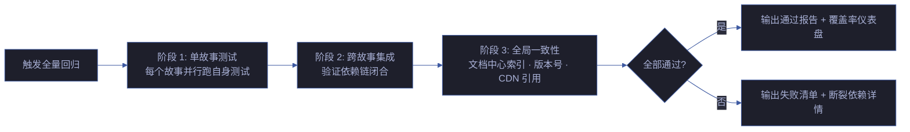

# 场景 5: 跨故事集成回归自检

> | v1.0.0 | 2026-06-08 | deepseek-v4-pro | 🌿 feat/yry-self-test | 📎 [CLAUDE.md](../../../../CLAUDE.md) |
> **导航**: [← 场景-4](../场景-4-安全面回归自检/index.md) · [知识图谱 →](./知识图谱.html)

[§0 技术评审](#sec0) · [§1 测试设计](#sec1) · [§2 实施报告](#sec2) · [§3 测试报告](#sec3) · [§4 自改进](#sec4)

## 概述

**角色**: 集成测试者（tester agent、自改进循环、pm agent） · **目标**: 验证多个故事之间的协同一致性——当一个故事产出的文档或代码发生变更时，依赖它的其他故事不会被静默破坏 · **优先级**: P0

### 主要价值

- 🔗 **跨故事依赖可验证** — 每个故事的上下游依赖关系已编目在故事任务.md 中，本场景验证这些依赖链在变更后仍然闭合
- 📋 **全量回归可执行** — 一条命令运行所有故事的测试套件，输出统一的通过/失败/跳过报告
- 🚨 **集成断裂可定位** — 当场景-3（文档代码一致性）在单故事内通过但跨故事引用断裂时，本场景负责捕获
- 📊 **健康度可量化** — 每个故事的测试覆盖率、场景完整度、依赖闭合率汇总为总览仪表盘

### 图谱定位

| 图层 | 本场景节点 | 上游 | 下游 |
|------|-----------|------|------|
| 领域层 | scene: cross-story-integration | story: yry-self-test (contains) | maps_to → 结构层 |
| 结构层 | — | maps_to 来自领域层 | — |
| 内容层 | — | Read 来自结构层 | — |

---

## §0 技术评审

> 文档生成阶段填充（pm+coder）。本场景定义跨故事集成测试的架构和执行策略。

### 跨故事依赖拓扑

### 集成测试矩阵

| # | 源故事 | 目标故事 | 依赖类型 | 验证方式 | 阻断级别 |
|---|--------|---------|---------|---------|---------|
| 1 | yry-arch → yry-self-test | 模块拓扑 | 场景-1 依赖 yry-arch 的模块清单 | node tests/integration/cross-story.test.mjs | P0 |
| 2 | yry-arch → yry-cdn | 架构基线 | CDN 演示页引用 yry-arch 知识图谱 | node tests/integration/cdn-deps.test.mjs | P1 |
| 3 | yry-arch → rui-npm | 架构基线 | npm 演示页引用 yry-arch 知识图谱 | node tests/integration/npm-deps.test.mjs | P1 |
| 4 | yry-self-test → yry-arch | 测试覆盖 | yry-arch 场景文档覆盖率 | scene-coverage-check | P0 |
| 5 | 全部故事 | 文档中心 | docs/index.html 索引完整性 | cross-ref-validator | P1 |

### 全量回归执行流程

---

## §1 测试设计

> tester agent 填充。

### 测试场景

| # | 测试项 | 类型 | 验证方式 | 预期结果 |
|---|--------|------|---------|---------|
| FP1 | 全量回归 — 所有故事测试套件 | 集成 | `node tests/run-all.mjs` | 全部通过或已知跳过 |
| FP2 | 跨故事依赖闭合 — 验证每个故事声明的上下游关系 | 功能 | 读取全部故事任务.md → 解析依赖 → 逐条验证目标存在 | 无断裂引用 |
| FP3 | 文档中心索引完整性 — docs/index.html 覆盖所有故事和场景 | 功能 | 解析 index.html 故事/场景链接 → 验证目标文件存在 | 所有链接可达 |
| FP4 | 版本号一致性 — 项目版本 vs 文档内嵌版本 | 一致性 | grep 全仓库版本号 → 与 plugin.json 比对 | 全部一致 |
| FP5 | CDN 引用版本 — 所有 HTML 的 CDN 版本引用 vs cdn/package.json | 一致性 | grep yry-cdn-lib@ → 与 cdn/package.json 比对 | 版本匹配 |
| FP6 | 跨故事知识图谱完整性 — 每个故事的知识图谱.json 有效 | 结构 | 逐文件 JSON.parse → 验证三层 schema | 全部有效 |

### 门禁判定

| 门禁 | 条件 | 阻断标识 |
|------|------|---------|
| P0 Gate | 全量回归有失败 · 跨故事依赖断裂 | code-p0 |
| P1 Gate | 文档索引链接断裂 · 版本号不一致 | doc-p0 |

---

## §2 实施报告

> coder agent 填充。

### 实施项

| # | 实施内容 | 状态 | 备注 |
|---|---------|------|------|
| 1 | 全量回归入口 tests/run-all.mjs | ⬜ 待实施 | 串联所有测试套件 |
| 2 | 跨故事依赖验证 tests/integration/cross-story.test.mjs | ⬜ 待实施 | 解析故事任务.md 依赖声明 |
| 3 | 文档索引完整性检查 | ⬜ 待实施 | 可集成到 scene-3 validate-doc-consistency.mjs |
| 4 | 版本一致性自动检查 | ⬜ 待实施 | 可集成到 scene-3 或独立脚本 |

---

## §3 测试报告

> tester agent 填充。

| 指标 | 值 |
|------|-----|
| 可回归故事数 | 4 (yry-arch · yry-self-test · yry-cdn · rui-npm) |
| 跨故事依赖关系数 | 4 (arch→self-test · arch→cdn · arch→npm · self-test→arch) |
| 全量回归入口 | tests/run-all.mjs（待实施） |
| 当前单故事测试覆盖 | tests/ 下 10 套件 171 断言（yry-self-test scene-2 实施报告） |

---

## §4 自改进

> self-improve agent 填充。

### 诊断摘要

| 诊断 | 信号 | 判定 |
|------|------|------|
| D0 基线偏离 | 跨故事集成测试尚未实现，与 init 规约要求 ≥5 场景一致 | 未触发 |
| D3 复杂度增长 | 随故事数量增加，依赖关系呈 O(n²) 增长 | 观察中 |
| D5 依赖退化 | 全量回归入口 tests/run-all.mjs 待实施 | 待推进 |

### 改进提案

| # | 提案 | 类型 | 优先级 |
|---|------|------|--------|
| 1 | 实现 tests/run-all.mjs — 串联所有测试套件的统一入口 | quality | P1 |
| 2 | 实现跨故事依赖验证 — 自动解析故事任务.md 依赖声明并验证闭合 | quality | P1 |
| 3 | 将版本一致性检查集成到 update-version.mjs 后置验证步骤 | process | P2 |
