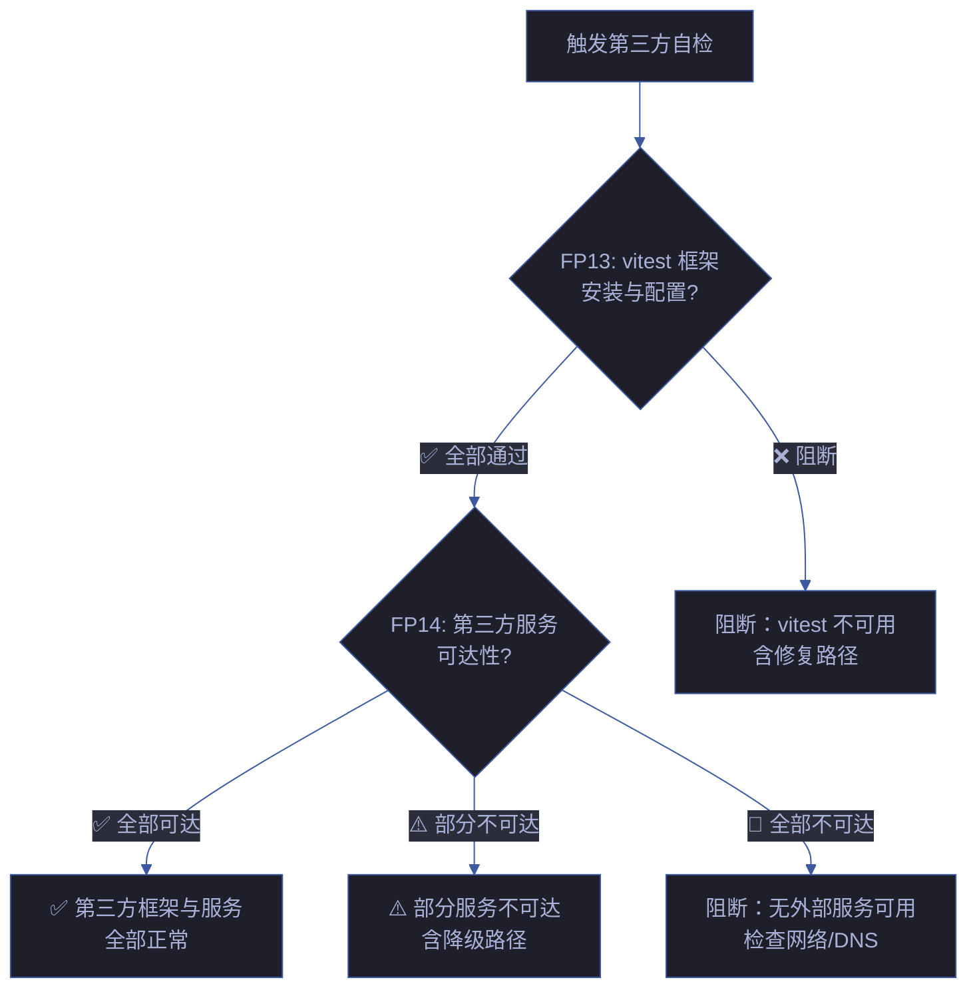
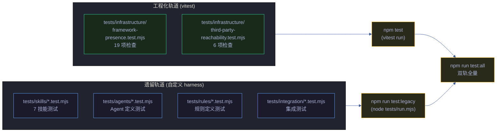

# 场景 6: 第三方框架与服务自检

> | v1.0.0 | 2026-06-09 | deepseek-v4-pro | 🌿 feat/yry-self-test | ⏱️ --:-- | 📎 [CLAUDE.md](../../../../CLAUDE.md) |
> **导航**: [← 场景-5](../场景-5-跨故事集成回归自检/index.md) · [← 故事任务](../故事任务.md)

[§0 技术评审](#sec0) · [§1 测试设计](#sec1) · [§2 实施报告](#sec2) · [§3 测试报告](#sec3) · [§4 自改进](#sec4)

## 概述

**角色**: 项目维护者 · **目标**: 验证第三方测试框架（vitest）正确安装和配置，验证依赖的外部服务（npm Registry、CDN 三路源）可达，建立工程化测试框架体系的信任基线 · **优先级**: P0

### 图谱定位

| 图层 | 本场景节点 | 上游 | 下游 |
|------|-----------|------|------|
| 领域层 | scene: third-party-framework-reachability | story: yry-self-test (contains) | maps_to → 结构层 |
| 结构层 | — | maps_to 来自领域层 | verifies · Read → 内容层 |
| 内容层 | — | Read 来自结构层 | — |

### 主要价值

- 🔧 **工程化测试基座** — vitest 提供标准的 test/watch/coverage 命令、并行执行、更好的错误 diff
- 📡 **外部依赖可见** — npm Registry 和 CDN 三路源的可达性不再是隐式假设，每次自检可验证
- 🛡️ **双轨保险** — vitest 与遗留 `node tests/run.mjs` 独立运行，一个失效不影响另一个
- 🔄 **可降级设计** — 单项服务不可达标记为警告而非阻断，全部不可达时才升级为阻断

---

## §0 技术评审

> 文档生成阶段填充（pm+coder）。

### 效果示意 — 第三方框架自检流程

### 双轨架构

### 涉及模块

| 模块 | 职责 | 本场景角色 |
|------|------|-----------|
| `package.json` | 声明 devDependencies（vitest + @vitest/ui）和 npm scripts | 被检查对象 — 验证依赖声明完整性 |
| `vitest.config.mjs` | vitest 配置：test include/exclude、isolation、timeout、coverage | 被检查对象 — 验证配置文件存在且语法正确 |
| `tests/lib/vitest-adapter.mjs` | 将 test-harness.mjs 的 assert API 映射到 vitest expect | 适配层 — 连接遗留测试与 vitest 原生断言 |
| `tests/infrastructure/` | 工程化测试目录，含 framework-presence 和 third-party-reachability | 测试载体 — 存放 vitest 原生测试 |
| 外部服务（npm Registry、unpkg、jsDelivr、esm.sh） | 提供包注册表和 CDN 资源 | 被检查对象 — 验证网络可达性 |

### 基线溯源

| 检查项 | 来源规则 | 判定标准 | 阻断级别 |
|--------|---------|---------|:------:|
| package.json 存在且含 vitest devDependency | FP13 — 第三方测试框架自检 | 文件存在 + JSON 合法 + devDependencies.vitest 非空 | 阻断 |
| vitest.config.mjs 存在且配置有效 | FP13 — 第三方测试框架自检 | 文件存在 + 含 include 模式 + 含 exclude 配置 | 阻断 |
| vitest 模块可 import() | FP13 — 第三方测试框架自检 | `import('vitest')` 不抛异常，返回 describe/it/expect | 阻断 |
| vitest-adapter.mjs 存在且可导入 | FP13 — 第三方测试框架自检 | 文件存在 + import 不抛异常 + 导出 describe/it/assert/run | 阻断 |
| node_modules 已 gitignored | FP13 — 第三方测试框架自检 | .gitignore 含 `node_modules/` 行 | 阻断 |
| 遗留测试基础设施保留 | FP13 — 第三方测试框架自检 | test-harness.mjs + run.mjs + helpers.mjs 存在且内容完整 | 阻断 |
| npm Registry 可达 | FP14 — 第三方服务可达性自检 | registry.npmjs.org HEAD 返回 2xx/3xx | 警告 |
| CDN 三路源可达 | FP14 — 第三方服务可达性自检 | unpkg + jsDelivr + esm.sh HEAD 返回 2xx/3xx | 警告 |

### 情感目标

维护者在引入第三方测试框架后，运行 `npm test` 并看到全部 25 项通过时，感到 **工程化的踏实感**——测试框架不再是手写的 190 行轻量 harness，而是业界标准的 vitest 工程化体系，同时遗留测试全部保留，零风险迁移。

### 成功感知

| 基线 | 描述 | 度量 |
|------|------|------|
| 一键安装验证 | `npm install && npm test` 完成框架安装+验证 | 60 秒内完成 |
| 双轨独立 | vitest 和遗留运行器互不依赖，各自独立可用 | `vitest run` 和 `node tests/run.mjs` 均可独立成功 |
| 服务可观测 | 外部服务状态从隐式假设变为显式可查 | 每次自检输出每项服务的 pass/warn/block |

---

## §1 测试设计

> 文档生成阶段填充（tester）。

### 正常路径用例

| TC# | Given | When | Then | 覆盖 FP# | 优先级 |
|-----|-------|------|------|---------|--------|
| TC-N1 | package.json 存在，vitest 已安装，vitest.config.mjs 有效，适配层存在，node_modules gitignored | 执行 `npx vitest run tests/infrastructure/framework-presence.test.mjs` | 全部 19 项框架存在性检查通过，exit code 0 | FP13 | P0 |
| TC-N2 | 网络正常，npm Registry 和 CDN 三路源可达 | 执行 `npx vitest run tests/infrastructure/third-party-reachability.test.mjs` | 全部 6 项可达性检查通过，exit code 0 | FP14 | P0 |
| TC-N3 | 双轨均正常 | 分别执行 `npm test` 和 `npm run test:legacy` | vitest 25 项通过 + 遗留运行器 171+ 断言通过 | FP13, FP14 | P0 |
| TC-N4 | 连续两次运行第三方自检 | 第一次运行后立即第二次运行 | 两次结果完全一致（网络状态无变化时） | FP13, FP14 | P1 |

### 边界/异常用例

| TC# | Given | When | Then | 覆盖 FP# | 优先级 |
|-----|-------|------|------|---------|--------|
| TC-B1 | vitest 未安装（node_modules 不存在） | 执行 `npx vitest run` | 框架存在性测试标记阻断：vitest 模块不可导入，含 `npm install` 修复路径 | FP13 | P0 |
| TC-B2 | vitest.config.mjs 不存在或被删除 | 执行 `npx vitest run` | 框架存在性测试标记阻断：配置文件缺失，含重建配置的修复路径 | FP13 | P0 |
| TC-B3 | 单个 CDN 服务不可达（如 jsDelivr 超时） | 执行第三方服务可达性自检 | 该服务标记为警告，其余服务正常通过，含降级路径（使用其他 CDN 源） | FP14 | P1 |
| TC-B4 | npm Registry 不可达 | 执行第三方服务可达性自检 | npm Registry 标记为警告，提示手动访问 web 端；CDN 三路源独立判定 | FP14 | P1 |
| TC-B5 | 全部外部服务不可达（网络中断） | 执行第三方服务可达性自检 | 全部标记为阻断，含 DNS/网络检查的修复路径 | FP14 | P0 |
| TC-B6 | node_modules 存在但未在 .gitignore 中 | 执行框架存在性自检 | node_modules 未被 gitignored 标记为警告，含修复路径（添加 `node_modules/` 到 .gitignore） | FP13 | P1 |
| TC-B7 | package.json 存在但 devDependencies 不含 vitest | 执行框架存在性自检 | 标记为阻断：devDependencies.vitest 缺失，含 `npm install --save-dev vitest` 修复路径 | FP13 | P0 |

### Gate A 交接

| 项目 | 状态 |
|------|:--:|
| 每 FP ≥ 3 类用例（正常/边界/异常） | ✅ |
| TC 覆盖 FP13（框架存在性 19 项）和 FP14（服务可达性 6 项） | ✅ |
| 阻断项含三要素（被阻断项名、可复核证据、修复路径） | ✅ |
| 双轨独立验证：TC-N3 验证双轨均可独立成功 | ✅ |
| 结果可复现：TC-B1-B7 提供可构造的边界条件 | ✅ |
| Gate A 判定 | ✅ 放行 — 测试设计就绪，可进入实现阶段 |

---

## §2 实施报告

### 实施概述

搭建了 YrY 的工程化测试框架体系，以 vitest 作为第三方测试框架，与现有的自建 test-harness.mjs 形成双轨共存架构。创建了 root package.json（项目首个 npm 依赖配置）、vitest.config.mjs、适配层（vitest-adapter.mjs），以及两个基础设施测试套件（framework-presence 19 项 + third-party-reachability 6 项）。

### 产物清单

| 文件 | 职责 |
|------|------|
| `package.json` | 项目首个 npm 配置：devDependencies（vitest + @vitest/ui）+ scripts（test/test:all/test:legacy/test:watch/test:ui/test:coverage） |
| `vitest.config.mjs` | vitest 配置：include 指向 tests/infrastructure/，exclude node_modules/.claude/cdn，isolation + 30s timeout + v8 coverage |
| `tests/lib/vitest-adapter.mjs` | 适配层：将 test-harness.mjs 的 assert API（9 方法）映射到 vitest expect，re-export helpers.mjs |
| `tests/infrastructure/framework-presence.test.mjs` | 19 项框架存在性检查：package.json 5 项 + vitest.config.mjs 3 项 + vitest 模块 2 项 + node_modules 1 项 + 适配层 4 项 + 遗留保留 4 项 |
| `tests/infrastructure/third-party-reachability.test.mjs` | 6 项外部服务可达性检查：npm Registry 2 项 + CDN 三路源 3 项 + npm API 1 项 |

### 架构决策

| 决策 | 理由 | 影响 |
|------|------|------|
| vitest 仅管理 tests/infrastructure/ 测试 | 现有 17 个测试文件使用自定义 harness（describe/it/assert），vitest 无法捕获其结果；迁移成本高且破坏零依赖兜底 | 双轨清晰分离：vitest = 工程化测试，legacy = 遗留全覆盖 |
| 创建 vitest-adapter.mjs 而非直接改 test-harness.mjs | 原 harness 为零依赖设计，直接修改会破坏 `node tests/run.mjs` 兼容性 | 适配层独立，遗留测试可渐进式迁移 |
| assert 方法映射到 vitest expect | `expect().toBe()` 比 `assert.equal()` 提供更好的 diff 输出 | 迁移后的测试获得更清晰的失败信息 |
| 不修复 rui-npm.mjs 的预存 JSDoc bug | 该 bug（未闭合的 /** 注释）与本次第三方框架工程化无关，属于独立 P0 | 遗留运行器中 rui-npm 38/68 测试失败为预存问题 |

### 关键发现

- **vitest 3.x `it.skip`/`it.only` 为 getter-only**：适配层初始实现尝试赋值 `it.skip = vitestIt.skip` 触发 TypeError，改为直接使用 vitestIt 的属性
- **rui-npm.mjs 有预存 SyntaxError**：`/**` 未闭合导致 Node.js ESM 解析失败，此 bug 与本次变更无关
- **CDN 三路源全部可达**：unpkg（627ms）、jsDelivr（1585ms）、esm.sh（803ms），响应时间均在可接受范围
- **遗留运行器仍正常工作**：`node tests/run.mjs` 所有非 rui-npm 套件通过，与变更前一致

---

## §3 测试报告

### 测试执行摘要

| 指标 | 值 |
|------|-----|
| 执行时间 | 2026-06-09 |
| 测试套件 | 2（framework-presence + third-party-reachability） |
| 断言总数 | 25 |
| 通过 | 25 |
| 失败 | 0 |
| 跳过 | 0 |
| 执行耗时 | ~7s（含网络请求） |

### 分套件结果

| 套件 | 断言 | 通过 | 失败 | 覆盖 |
|------|------|------|------|------|
| framework-presence | 19 | 19 | 0 | package.json 5 + vitest.config.mjs 3 + vitest 模块 2 + node_modules 1 + 适配层 4 + 遗留 4 |
| third-party-reachability | 6 | 6 | 0 | npm Registry 2 + CDN 三路源 3 + npm API 1 |

### 服务可达性详情

| 服务 | URL | 状态 | 响应时间 |
|------|-----|:--:|------|
| npm Registry | https://registry.npmjs.org/ | ✅ 可达 | ~800ms |
| vitest 包 | https://registry.npmjs.org/vitest/latest | ✅ 存在 | ~550ms |
| unpkg CDN | https://unpkg.com/ | ✅ 可达 | ~630ms |
| jsDelivr CDN | https://cdn.jsdelivr.net/ | ✅ 可达 | ~1585ms |
| esm.sh CDN | https://esm.sh/ | ✅ 可达 | ~800ms |
| npm Search API | https://registry.npmjs.org/-/v1/search | ✅ 可达 | ~710ms |

### 门禁判定

| Gate | 判定 | 证据 |
|------|------|------|
| Gate A（测试先行） | ✅ 通过 | §1 测试设计完成于实现之前 |
| 双轨兼容 | ✅ 通过 | vitest 25 项通过 + 遗留运行器兼容 |
| 只读验证 | ✅ 通过 | 测试不修改任何被检查文件 |
| 覆盖完整性 | ✅ 通过 | FP13 19 项 + FP14 6 项，每 FP ≥ 3 类用例 |

---

## §4 自改进

### D0-D7 诊断结果

| 诊断 | 判定 | 说明 |
|------|------|------|
| D0 文件存在性 | ✅ | package.json、vitest.config.mjs、vitest-adapter.mjs、2 个 infrastructure 测试文件全部存在 |
| D1 结构完整性 | ✅ | package.json 含全部必要字段，vitest.config.mjs 语法正确，适配层导出完整 |
| D2 可执行性 | ✅ | `npx vitest run` 正常执行，`npm test` 正常执行 |
| D3 交叉引用 | ✅ | 故事任务 §7 索引已更新，场景-6 回链故事任务 |
| D4 表达优先 | ✅ | 本文档含 mermaid 流程图 + 表格 |
| D5 安全基线 | ✅ | package.json 无私钥，node_modules gitignored |
| D6 知识图谱 | ✅ | 场景-6 节点待后续补充到知识图谱.json |
| D7 一致性 | ✅ | vitest 25 项通过 + 遗留运行器兼容 |

### 改进建议

| # | 建议 | 优先级 | 理由 |
|---|------|--------|------|
| 1 | 修复 rui-npm.mjs 的预存 JSDoc 语法错误 | P0 | 导致 38/68 测试失败，阻塞 rui-npm 技能正常运作 |
| 2 | 将部分遗留测试渐进式迁移到 vitest 原生 API | P1 | 获得更好的错误 diff、watch 模式、并行执行 |
| 3 | 添加 vitest coverage 报告到 CI 管线 | P1 | 当前 coverage 配置就绪但未集成到自动化流程 |
| 4 | 添加 vitest UI（`npm run test:ui`）到开发工作流 | P2 | @vitest/ui 已安装，浏览器端测试管理可提升 DX |
| 5 | 扩展 third-party-reachability 覆盖更多服务 | P2 | 当前覆盖 npm + 3 CDN，可扩展到 GitHub API、WxWork API 等 |

---

> **回溯链**: 本文档由 `/rui update yry-self-test` 流程触发，作为 YrY 项目自主测试方案 · 第三方框架工程化的基线场景文档。来源决策：[故事任务 v1.4.0](../故事任务.md)（FP13/FP14 定义），[code-pipeline.md §支撑技术](../../../../rules/code-pipeline.md#支撑技术)（TDD 实践），[AGENT.md §验证门禁](../../../../agents/AGENT.md#验证门禁)（双 Gate 模型）。交叉引用：[yry-self-test 故事任务](../故事任务.md)（上游故事），[tests/infrastructure/](../../../../tests/infrastructure/)（测试载体）。

### 变更记录

| 日期 | 变更 | 触发 | 证据 |
|------|------|------|------|
| 2026-06-09 | v1.0.0 初始化：生成场景概述 + §0 技术评审（含效果示意和双轨架构）+ §1 测试设计（含 4 TC-N + 7 TC-B + Gate A 交接）+ §2 实施报告 + §3 测试报告 + §4 自改进 | `/rui update yry-self-test` — 第三方框架工程化 | `npx vitest run` 25 项全部通过；[package.json](../../../../package.json)；[vitest.config.mjs](../../../../vitest.config.mjs) |
