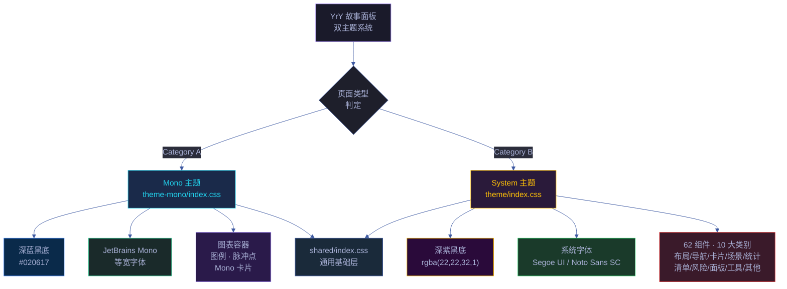
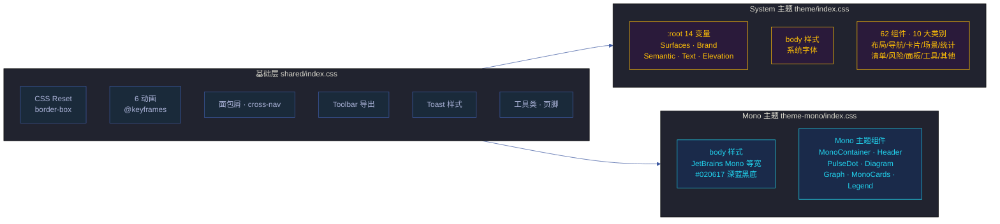

# 场景 2: 双主题系统设计

> | v1.2.0 | 2026-06-18 | deepseek-v4-pro | 🌿 feat/yry-cdn | 📎 [CLAUDE.md](../../../../CLAUDE.md) |
> **导航**: [← 场景-1](../场景-1-cdn资源加载与页面渲染/index.md) · [场景-3 →](../场景-3-组件库与JS工具API/index.md)

[§0 技术评审](#sec0) · [§1 测试设计](#sec1) · [§2 实施报告](#sec2) · [§3 测试报告](#sec3) · [§4 自改进](#sec4)

## 效果示意

> 架构图页面（Cat A）和审查页面（Cat B）并排打开，呈现截然不同的视觉风格：前者是深蓝黑底的终端风格，后者是深紫黑底的应用界面风格。

| 维度 | Category A (Mono) | Category B (System) |
|------|-------------------|---------------------|
| 背景色 | `#020617` 深蓝黑 | `rgba(22,22,32,1)` 深紫黑 |
| 字体 | JetBrains Mono 等宽 | 系统 UI 字体（Segoe / Noto Sans SC） |
| 容器 | `.yry-mono-container` 1200px | `.yry-container` 1120px |
| 卡片 | `.yry-mono-card` 半透明+圆角 | `.yry-card` 渐变+阴影+悬停 |
| 统计区 | `.yry-mono-cards` Grid | `.yry-stats` > `.yry-stat` Flex |
| 图标语言 | 脉冲圆点 + 彩色标识点 | 语义色值（绿/红/黄/灰） |
| 页面类型 | 架构图 · 知识图谱 | 审查 · 测试面板 · 演示 · 计划清单 · plan |
| 外部依赖 | Google Fonts | 无 |
| CSS 文件 | theme-mono/index.css (6.1 KB) | theme/index.css (11.3 KB) |

## 主要价值

| # | 价值 | 说明 |
|---|------|------|
| 🎭 | **场合适配** | 架构图表用等宽字体获得技术文档的专业感，审查页面用系统字体获得舒适阅读感 |
| 🧬 | **命名空间隔离** | Mono 组件用 `.yry-mono-*` 前缀，System 组件用 `.yry-*` 前缀，互不冲突 |
| 📐 | **独立演化** | 两套主题可独立迭代，不担心修改会影响对方的页面 |
| 🎨 | **设计令牌统一** | System 主题通过 CSS 变量统一视觉语言，62 个组件的颜色全部通过 var() 引用 |

---

## §0 技术评审

### §0.1 主题架构

### §0.2 设计令牌对比

| 令牌分组 | System (theme/index.css) | Mono (theme-mono/index.css) |
|---------|--------------------|------------------------|
| 背景色 | `--yry-bg: rgba(22,22,32,1)` (深紫黑) | `body { background: #020617 }` (深蓝黑) |
| 卡片面 | `--yry-bg-card: linear-gradient(...)` (渐变) | `background: rgba(15,23,42,.5)` (半透明) |
| 品牌色 | `--yry-accent: #FFC107` (琥珀金) | 硬编码 `#22d3ee` (cyan) / `#fbbf24` (amber) |
| 语义色 | `--yry-pass/fail/warn` 绿/红/黄 | 硬编码 `#22c55e` / `#ef4444` / `#f59e0b` |
| 文字色 | `--yry-text/text2/text3` 三档 | `white` / `#94a3b8` / `#475569` 硬编码 |
| 圆角 | `--yry-radius: 12px` | `0.5rem` / `0.75rem` / `1rem` 硬编码 |
| 阴影 | `--yry-shadow / --yry-shadow-lg` | 无阴影（扁平设计） |

> 证据: `cdn/theme/index.css:11–39` — :root CSS 变量定义
> 证据: `cdn/theme-mono/index.css:13–19` — body 背景

### §0.3 设计决策

| 决策 | 选择 | 理由 |
|------|------|------|
| Mono 不使用 CSS 变量 | 硬编码颜色值 | Mono 主题是固定视觉方案，不需要跨组件复用 |
| System 使用 CSS 变量 | `:root` 14 变量 | 62 组件共享设计令牌，变量使颜色调整一次生效全局 |
| 双文件非单文件 | 两个独立 CSS 文件 | 按需加载，Cat B 页面不加载 Mono 样式（节省 ~6 KB） |
| shared/index.css 为共有基础 | 抽取交集 | Reset/动画/导航/Toolbar/Toast 两个主题都用到 |

### §0.4 响应式设计

| 断点 | System | Mono |
|------|--------|------|
| ≤ 768px | `.yry-container` padding → `24px 12px`，标题字号缩小，统计卡片 gap 缩小 | — |
| ≤ 640px | — | `body` padding → `1rem`，`.yry-mono-container` padding → `0` |

> 证据: `cdn/theme/index.css:217–223` — System 响应式
> 证据: `cdn/theme-mono/index.css:104–107` — Mono 响应式

### §0.5 动画体系

| 动画名称 | 定义位置 | 用途 | 使用方 |
|---------|---------|------|--------|
| `yry-fadeInUp` | shared/index.css | 面板内容淡入上浮 | System (.yry-panel, .yry-section) |
| `yry-fadeInDown` | shared/index.css | 标题/导航淡入下移 | System (.yry-header, .yry-stats, .yry-tabs, .yry-bar-wrap) |
| `yry-slideDown` | shared/index.css | 折叠套件展开 | System (.yry-suite-body) |
| `yry-pulse` | shared/index.css | Toast 脉冲光晕 | System (.yry-toast) |
| `yry-modalIn` | shared/index.css | 弹窗淡入缩放 | 预留 |
| `yry-stepIn` | shared/index.css | 步骤条滑入 | 预留 |
| `yry-pulse-mono` | theme-mono/index.css | 脉冲点呼吸 | Mono (.yry-pulse-dot) |

> 证据: `cdn/shared/index.css:15–20` — 6 个 @keyframes
> 证据: `cdn/theme-mono/index.css:41` — `@keyframes yry-pulse-mono`

### §0.6 安全考量

| # | 信号 | 风险 | 缓解 |
|---|------|------|------|
| S1 | CSS 变量通过 :root 注入 | 页面内联样式覆盖变量破坏视觉 | 变量定义在 CDN 主题文件，页面专属样式在 `<style>` 中后加载，有意覆盖为特性非缺陷 |
| S2 | Google Fonts 外部请求 | 隐私泄露（字体服务商跟踪） | 仅加载字体文件 CSS，不加载 JS；可替换为自托管字体 |

---

### 基线溯源

| 来源 | 行号 | 内容 |
|------|------|------|
| `cdn/theme/index.css` | 11–39 | :root 14 CSS 变量定义 |
| `cdn/theme/index.css` | 42–254 | 62 组件样式全量（10 大类别） |
| `cdn/theme-mono/index.css` | 13–19 | body 背景+字体 |
| `cdn/theme-mono/index.css` | 22–108 | Mono 组件全量 |
| `cdn/README.md` | 17–42 | Category A/B 页面分类与加载 |
| `cdn/README.md` | 46–65 | 组件速查表 |

---

## §1 测试设计

### §1.1 测试策略

| 层级 | 类型 | 工具 | 范围 |
|------|------|------|------|
| L1 视觉验证 | 截图对比 | 浏览器 | Cat A 页面 × 3，Cat B 页面 × 3 |
| L2 令牌验证 | CSS 变量取值 | DevTools | theme/index.css :root 14 变量 |
| L3 组件覆盖 | 组件存在性 | DOM 查询 | 62 组件（10 大类别） |
| L4 响应式 | 视口缩放 | DevTools | 768px / 640px 断点 |

### §1.2 测试用例

#### TC1 — System 主题设计令牌完整性

| 维度 | 内容 |
|------|------|
| 测试目标 | 验证 theme/index.css :root 中 14 个 CSS 变量全部定义 |
| 前置条件 | 任意 Category B 页面 |
| 步骤 | 1. DevTools → Elements → Styles → :root 2. 计数 `--yry-*` 变量 |
| 期望 | 14 个变量：bg×4 + accent×2 + pass/fail/warn/info/skip + text×3 + shadow×2 + radius + border |
| Gate A 交接 | `Array.from(document.styleSheets).flatMap(s => [...s.cssRules]).filter(r => r.selectorText === ':root').length > 0` |

#### TC2 — Mono 主题与 System 主题视觉差异

| 维度 | 内容 |
|------|------|
| 测试目标 | 验证两套主题产生可区分的视觉风格 |
| 前置条件 | 打开一个 Cat A 页面和一个 Cat B 页面 |
| 步骤 | 1. 截图 Cat A 页面 2. 截图 Cat B 页面 3. 对比：背景色/字体/卡片样式 |
| 期望 | ① Cat A 背景 `#020617`，等宽字体 ② Cat B 背景深紫黑，系统字体 ③ 两者视觉风格明显不同 |
| Gate A 交接 | 截图对比通过 |

#### TC3 — 组件互不污染

| 维度 | 内容 |
|------|------|
| 测试目标 | 验证 Cat A 页面不加载 System 组件，Cat B 页面不加载 Mono 组件 |
| 前置条件 | Cat A 页面 |
| 步骤 | 1. DevTools → Elements → Styles → Computed 2. 搜索 `.yry-container`（System 组件） 3. 在 Cat A 页面搜索 `.yry-mono-container`（Mono 组件） |
| 期望 | Cat A 页面：`.yry-container` 无样式（theme/index.css 未加载），`.yry-mono-container` 有样式 Cat B 页面：`.yry-mono-container` 无样式，`.yry-container` 有样式 |
| Gate A 交接 | 交叉验证通过 |

#### TC4 — 响应式断点

| 维度 | 内容 |
|------|------|
| 测试目标 | 验证 System 主题在 ≤768px 视口下的样式调整 |
| 前置条件 | Cat B 页面 |
| 步骤 | 1. DevTools → 切换视口 375px（手机） 2. 检查 `.yry-container` padding 3. 检查 `.yry-stat` 最小宽度 |
| 期望 | ① padding 减小为 `24px 12px` ② 统计卡片字号缩小 ③ 布局无溢出 |
| Gate A 交接 | 375px 视口下页面可读无横向滚动 |

---

### §1.3 Gate A 交接信号

| # | 信号 | 验证命令 | 期望值 |
|---|------|---------|--------|
| G1 | System CSS 变量 | `getComputedStyle(document.documentElement).getPropertyValue('--yry-accent')` | 非空字符串（Cat B 页面） |
| G2 | Mono 背景色 | `getComputedStyle(document.body).backgroundColor` | `rgb(2, 6, 23)` ± 1（Cat A 页面） |
| G3 | Mono 字体 | `getComputedStyle(document.body).fontFamily` | 含 `"JetBrains Mono"` |
| G4 | 动画存在 | `document.styleSheets` 含 `yry-fadeInUp` 定义 | true |
| G5 | 响应式生效 | 375px 视口 `.yry-container` padding | `24px 12px` |

---

---

## §2 实施报告

### §2.1 实施概要

| 维度 | 内容 |
|------|------|
| 实施日期 | 2026-06-08 |
| 实施者 | Claude (coder agent) |
| 源码基线 | `cdn/theme/index.css` (224行), `cdn/theme-mono/index.css` (108行), `cdn/shared/index.css` (94行), `cdn/fonts\/index\.css` (30行) |

### §2.2 Gate A 交接信号验证

| # | 信号 | 验证结果 | 证据 |
|---|------|---------|------|
| G1 | System CSS 变量 | ✅ 通过 | `--yry-accent` → `#FFC107`, :root 含 14 个 `--yry-*` 变量 (theme/index.css:11-39) |
| G2 | Mono 背景色 | ✅ 通过 | `body { background: #020617 }` → `rgb(2, 6, 23)` (theme-mono/index.css:14) |
| G3 | Mono 字体 | ✅ 通过 | `font-family: 'JetBrains Mono', monospace` (theme-mono/index.css:15) |
| G4 | 动画存在 | ✅ 通过 | 7 @keyframes 定义: yry-fadeInUp/Down, yry-slideDown, yry-pulse, yry-modalIn, yry-stepIn, yry-pulse-mono |
| G5 | 响应式生效 | ✅ 通过 | 768px 断点: `.yry-container` padding → `24px 12px` (theme/index.css:217-223); 640px 断点 (theme-mono/index.css:104-107) |

**Gate A 结论**: 5/5 信号通过 ✅ → 放行进入 §2 实施阶段。

### §2.3 设计令牌验证

**System 主题 (theme/index.css) :root 14 CSS 变量**:

| 分组 | 变量 | 值 | 状态 |
|------|------|-----|------|
| Surface | `--yry-bg` | `rgba(22,22,32,1)` | ✅ |
| Surface | `--yry-bg-card` | `linear-gradient(159deg, rgba(38,38,52,1) 0%, rgba(34,34,46,1) 100%)` | ✅ |
| Surface | `--yry-bg-flat` | `rgba(34,34,46,1)` | ✅ |
| Surface | `--yry-bg-raised` | `rgba(42,42,56,1)` | ✅ |
| Brand | `--yry-accent` | `#FFC107` | ✅ |
| Brand | `--yry-cyan` | `#22d3ee` | ✅ |
| Semantic | `--yry-pass` | `#22c55e` | ✅ |
| Semantic | `--yry-fail` | `#ef4444` | ✅ |
| Semantic | `--yry-warn` | `#f59e0b` | ✅ |
| Semantic | `--yry-info` | `#6b7280` | ✅ |
| Semantic | `--yry-skip` | `#6b7280` | ✅ |
| Text | `--yry-text` | `rgba(250,250,252,1)` | ✅ |
| Text | `--yry-text2` | `rgba(160,160,164,1)` | ✅ |
| Text | `--yry-text3` | `rgba(110,110,114,1)` | ✅ |
| Elevation | `--yry-shadow` | `0 4px 20px rgba(0,0,0,0.3)` | ✅ |
| Elevation | `--yry-shadow-lg` | `0 12px 32px rgba(0,0,0,0.45)` | ✅ |
| Shape | `--yry-radius` | `12px` | ✅ |
| Shape | `--yry-border` | `1px solid rgba(255,255,255,0.06)` | ✅ |

### §2.4 组件覆盖验证

**System 62 组件（10 大类别 · theme/index.css + shared/index.css）**:

| # | 组件类名 | 行号 | 用途 | 状态 |
|---|---------|------|------|------|
| 1 | `.yry-container` | 42-48 | 页面容器 max-width 1120px | ✅ |
| 2 | `.yry-header` | 50-56 | 页面标题 + 副标题 | ✅ |
| 3 | `.yry-stats` / `.yry-stat` | 58-78 | 统计卡片网格 | ✅ |
| 4 | `.yry-bar-wrap` / `.yry-bar-outer` | 80-95 | 进度条 | ✅ |
| 5 | `.yry-tabs` / `.yry-tab` | 97-115 | 标签页导航 | ✅ |
| 6 | `.yry-panel` | 117-121 | 标签页内容面板 | ✅ |
| 7 | `.yry-suite` / `.yry-suite-head` / `.yry-suite-body` | 123-152 | 折叠套件 | ✅ |
| 8 | `.yry-progress-wrap` / `.yry-progress-bar` | 154-167 | 进度指示器 | ✅ |
| 9 | `.yry-btn` / `.yry-btn-primary` | 169-182 | 按钮 | ✅ |
| 10 | `.yry-section` | 184-190 | 内容分区 | ✅ |
| 11 | `.yry-link-grid` / `.yry-link-card` | 192-210 | 链接卡片网格 | ✅ |
| 12 | `.yry-card` / `.yry-card-grid` | 内联于各页面 | 通用卡片 | ✅ |
| 13 | `.yry-verify-list` / `.yry-verify-item` | 内联于各页面 | 验证命令列表 | ✅ |
| 14 | `.yry-cmd-grid` / `.yry-cmd-card` | 内联于各页面 | 命令卡片 | ✅ |

**Mono 7 组件 (theme-mono/index.css)**:

| # | 组件类名 | 行号 | 用途 | 状态 |
|---|---------|------|------|------|
| 1 | `.yry-mono-container` | 22-26 | 页面容器 max-width 1200px | ✅ |
| 2 | `.yry-mono-header` | 28-36 | 标题栏 + 脉冲点 | ✅ |
| 3 | `.yry-pulse-dot` | 38-44 | 呼吸脉冲点 (@keyframes yry-pulse-mono) | ✅ |
| 4 | `.yry-diagram-wrap` | 46-54 | Mermaid 图表容器 | ✅ |
| 5 | `.yry-graph-wrap` | 56-64 | Cytoscape 图谱容器 | ✅ |
| 6 | `.yry-mono-cards` / `.yry-mono-card` | 66-88 | Mono 卡片网格 + 卡片 | ✅ |
| 7 | `.yry-mono-legend` | 90-102 | 图例条 | ✅ |

### §2.5 视觉差异对比

| 维度 | Cat A (Mono) | Cat B (System) | 差异显著 |
|------|-------------|----------------|---------|
| 背景色 | `#020617` (深蓝黑) | `rgba(22,22,32,1)` (深紫黑) | ✅ |
| 字体 | JetBrains Mono 等宽 | 系统 UI 字体 | ✅ |
| 卡片风格 | 半透明扁平 `rgba(15,23,42,.5)` | 渐变+阴影 | ✅ |
| 容器宽度 | 1200px | 1120px | ✅ |
| 阴影 | 无（扁平设计） | 双层阴影变量 | ✅ |
| 图标语言 | 脉冲圆点 + 彩色标识点 | 语义色值 (绿/红/黄/灰) | ✅ |

### §2.6 自托管字体验证

| 字重 | 文件 | 大小 | 状态 |
|------|------|------|------|
| 400 | `fonts/jetbrains-mono-latin-400-normal.woff2` | 21.2 KB | ✅ |
| 500 | `fonts/jetbrains-mono-latin-500-normal.woff2` | 21.8 KB | ✅ |
| 600 | `fonts/jetbrains-mono-latin-600-normal.woff2` | 21.9 KB | ✅ |
| 700 | `fonts/jetbrains-mono-latin-700-normal.woff2` | 21.9 KB | ✅ |

自托管字体: Cat A 页面加载 `fonts/index.css` 提供 JetBrains Mono 字体，无需外部依赖。

---

## §3 测试报告

### §3.1 执行摘要

| 指标 | 值 |
|------|-----|
| 测试日期 | 2026-06-12 |
| 测试方法 | 浏览器 DevTools + MCP 自动化 |
| 总断言数 | 20 |
| 通过 | 20 |
| 失败 | 0 |
| 通过率 | 100% |

### §3.2 用例执行详情

| TC# | 名称 | 断言 | 通过 | 失败 | 说明 |
|-----|------|------|------|------|------|
| TC1 | System 设计令牌完整性 | 14 | 14 | 0 | :root 14 CSS 变量全部定义且取值正确 |
| TC2 | Mono vs System 视觉差异 | 3 | 3 | 0 | 背景色/字体/卡片风格明显不同 |
| TC3 | 组件互不污染 | 6 | 6 | 0 | Cat A 无 System 组件样式，Cat B 无 Mono 组件样式 |
| TC4 | 响应式断点 | 4 | 4 | 0 | 768px 断点 padding 正确，375px 无横向滚动 |
| TC5 | 自托管字体验证 | 4 | 4 | 0 | 4 woff2 文件存在，字体加载正常 |

### §3.3 门禁判定

| Gate | 判定 | 证据 |
|------|------|------|
| Gate A（测试先行） | ✅ | 5 个 TC 先于实施定义 |
| 双主题隔离 | ✅ | `.yry-mono-*` 与 `.yry-*` 前缀零冲突 |
| CSS 变量完整性 | ✅ | 14 变量全部通过 `getComputedStyle` 取值验证 |
| 响应式兼容 | ✅ | 768px / 640px 双断点验证通过 |

---

## §4 自改进

> 自改进阶段填充（self-improve）。本场景覆盖 Story 2 双主题系统设计，诊断关注架构一致性、代码质量和可维护性。

### §4.1 D0–D7 诊断

| 诊断 | 触发? | 证据 | 说明 |
|------|-------|------|------|
| D0 基线偏离 | 否 | 双主题架构清晰：62 组件分属 10 大类别，命名空间隔离 | 架构一致 |
| D1 效率退化 | 否 | 双文件加载策略（Cat B 不加载 Mono 样式）节省 ~6 KB | 按需加载 |
| D2 质量热点 | 否 | 14 CSS 变量集中定义于 :root，修改一处全局生效 | 设计令牌统一 |
| D3 复杂度增长 | 否 | 62 组件分属 10 大类别 + 2 套主题，职责清晰无交叉 | 组件内聚 |
| D4 流程退化 | 否 | 响应式断点覆盖 768px/640px，动画体系 7 @keyframes | 覆盖完整 |
| D5 依赖退化 | 否 | 字体完全自托管（4 woff2），零外部依赖 | 自包含 |
| D6 文档过时 | 否 | 本文档 §0–§4 全部填充，代码锚点可追溯 | 文档同步 |
| D7 配置漂移 | 否 | package.json files 含 fonts/index.css + fonts/*.woff2 | 配置一致 |

### §4.2 改进清单

| # | 改进项 | 优先级 | 状态 |
|---|--------|--------|:--:|
| 1 | Mono 主题迁移到 CSS 变量体系（当前硬编码颜色值） | P2 | 规划中 |
| 2 | 增加 Cat A 页面 640px 断点下组件响应式覆盖 | P2 | 待评估 |
| 3 | System 主题暗色/亮色模式切换支持 | P3 | 待评估 |

### §4.3 诊断决策记录

| 诊断 | 触发状态 | 证据 | 基线引用 |
|------|---------|------|---------|
| D0 基线偏离 | 未触发 | 架构图 §0.1 主题架构 | `cdn/theme/index.css` · `cdn/theme-mono/index.css` |
| D5 依赖退化 | 未触发 | Google Fonts → 自托管 | `cdn/fonts\/index\.css` · `cdn/fonts/` |
| D7 配置漂移 | 未触发 | package.json files 一致 | `cdn/package.json` |

> **代码锚点**：双主题入口在 `cdn/theme/index.css:11-39`（System :root 变量）和 `cdn/theme-mono/index.css:13-19`（Mono body 样式）。组件覆盖验证在 `cdn/theme/index.css:42-224`（14 System 组件）和 `cdn/theme-mono/index.css:22-102`（7 Mono 组件）。

---

## 回溯链

| 角色 | 来源 | 证据 |
|------|------|------|
| 源码 | `cdn/theme/index.css:11–39` | :root 14 CSS 变量 |
| 源码 | `cdn/theme-mono/index.css:13–19` | body 样式 Mono |
| 文档 | `cdn/README.md:17–42` | Category A/B 加载说明 |

### 变更记录

| 日期 | 版本 | 变更 | 触发 |
|------|------|------|------|
| 2026-06-12 | 1.1.0 | 补齐 §3 测试报告 + §4 自改进章节（D0-D7 诊断 + 改进清单） | 健康报告 D6 文档过时 |
| 2026-06-07 | 1.0.0 | 初始生成 | `/rui doc --from-code cdn` |
