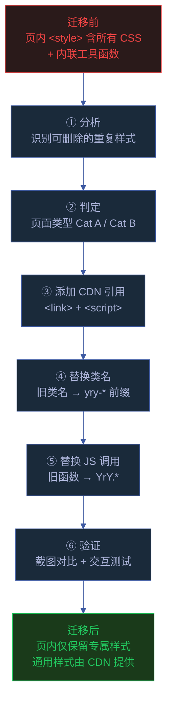
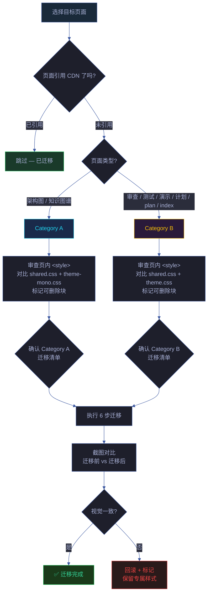

# 场景 4: 存量页面迁移

> | v1.1.0 | 2026-06-12 | deepseek-v4-pro | 🌿 feat/yry-cdn | 📎 [CLAUDE.md](../../../../CLAUDE.md) |
> **导航**: [← 场景-3](../场景-3-组件库与JS工具API/index.md) · [场景-5 →](../场景-5-npm包发布与版本管理/index.md)

[§0 技术评审](#sec0) · [§1 测试设计](#sec1) · [§2 实施报告](#sec2) · [§3 测试报告](#sec3) · [§4 自改进](#sec4)

## 效果示意

> 页面迁移完成后，页内代码量减少 40%–60%，视觉和交互行为无变化。后续 CDN 组件升级，该页面自动受益。

| 维度 | 迁移前 | 迁移后 |
|------|--------|--------|
| 页内 `<style>` | 含 Reset、动画、面包屑、导航、Toolbar、Toast 等（~100 行） | 仅保留页面专属样式（scene cards、file cards、SVG 等 ~40 行） |
| 页内 `<script>` | 含 toast()、copyCmd()、switchPanel() 等内联定义（~60 行） | 仅保留页面专属逻辑（~10 行） |
| CDN 引用 | 0 | 3–4 个 `<link>` + `<script>` |
| 视觉一致性 | 各页面自行维护，可能漂移 | 统一由 CDN 管控 |

## 主要价值

| # | 价值 | 说明 |
|---|------|------|
| 📉 | **代码量减少** | 每页面减少 100–150 行内联代码 |
| 🔄 | **自动升级** | CDN 组件升级后所有页面自动受益，无需逐页面修改 |
| 🎯 | **一致性保证** | 所有页面使用同一套组件，视觉/交互无漂移 |
| ⚡ | **缓存收益递增** | 每多迁移一个页面，浏览器缓存的 CDN 资源被多利用一次 |

---

## §0 技术评审

### §0.1 迁移判定流程

### §0.2 可删除的样式清单

#### Category A 页面可删除（对比 shared.css + theme-mono.css）

| 可删除块 | 对应 CDN 文件 | 保留条件 |
|---------|--------------|---------|
| `*, *::before, *::after { ... }` | shared.css | 无 — CDN 已覆盖 |
| `@keyframes yry-*` | shared.css | 若使用 CDN 动画（当前无 Cat A 使用 shared.css 动画） |
| `.yry-breadcrumb` / `.yry-cross-nav` / `.yry-toolbar` | shared.css | 无 — CDN 已覆盖 |
| `.yry-toast` 样式 | shared.css | 无 — CDN 已覆盖 |
| `body { font-family: 'JetBrains Mono'... }` | theme-mono.css | 无 — CDN 已覆盖 |
| `.yry-mono-container` / `.yry-mono-header` | theme-mono.css | 无 — CDN 已覆盖 |
| `.yry-diagram-wrap` / `.yry-graph-wrap` | theme-mono.css | 无 — CDN 已覆盖 |
| `.yry-pulse-dot` / `.yry-mono-legend` | theme-mono.css | 无 — CDN 已覆盖 |
| `.yry-mono-cards` / `.yry-mono-card` / `.yry-mono-dot` | theme-mono.css | 无 — CDN 已覆盖 |

#### Category B 页面可删除（对比 shared.css + theme.css）

| 可删除块 | 对应 CDN 文件 |
|---------|--------------|
| `*, *::before, *::after { ... }` | shared.css |
| `@keyframes yry-fadeInUp/Down/slideDown/pulse` | shared.css |
| `.yry-breadcrumb` / `.yry-cross-nav` / `.yry-toolbar` / `.yry-toast` | shared.css |
| `:root { --yry-* }` CSS 变量定义 | theme.css |
| `body { background/font-family/color }` | theme.css |
| `.yry-container` / `.yry-container-sm` | theme.css |
| `.yry-header h1 / .yry-sub` | theme.css |
| `.yry-stats` / `.yry-stat` / `.yry-stat-val` / `.yry-stat-lbl` | theme.css |
| `.yry-bar-wrap` / `.yry-bar-outer` / `.yry-seg` | theme.css |
| `.yry-tabs` / `.yry-tab` / `.yry-tab-badge` | theme.css |
| `.yry-panel` / `.yry-panel.on` | theme.css |
| `.yry-card` | theme.css |
| `.yry-suite` / `.yry-suite-head` / `.yry-suite-arrow` / `.yry-suite-badge` / `.yry-suite-body` | theme.css |
| `.yry-progress-wrap` / `.yry-progress-label` / `.yry-progress-bar` / `.yry-progress-fill` | theme.css |
| `.yry-btn` / `.yry-btn.on` | theme.css |
| `.yry-section` / `.yry-dot` | theme.css |
| `.yry-link-grid` / `.yry-link-card` | theme.css |
| `.yry-footer` | shared.css |

### §0.3 不可删除的样式（保留在页内）

| 保留块 | 原因 |
|--------|------|
| `.scene-card` / `.file-card` 等页面专属 CSS | CDN 不覆盖业务组件 |
| SVG 相关样式（`svg { ... }` `.node { ... }` `.edge { ... }`） | 每页 SVG 不同 |
| `.mermaid` 相关样式 | mermaid 渲染由 mermaid.js 控制 |
| `.yry-` 选择器的页面级覆盖 | 覆盖为特例，保留在页内 |
| `@media print` 页面专属 | CDN 仅覆盖通用打印样式 |

### §0.4 可替换的 JS 函数

| 页内函数 | CDN 替换 | 注意 |
|---------|---------|------|
| `function toast(msg, dur) { ... }` | `YrY.toast(msg, dur)` | 参数顺序相同 |
| `function copyCmd(btn, cmd) { ... }` | `YrY.copyCmd(btn, cmd)` | 签名相同 |
| `function switchPanel(name) { ... }` | `YrY.switchPanel(name)` | 检查面板 ID 命名是否匹配约定 |
| `document.querySelectorAll('.yry-suite-head').forEach(...)` | `YrY.initSuiteToggle()` | 一次性替换 |
| 内联 `navigator.clipboard.writeText()` | `YrY.clipboardWrite(text, ok, fail)` | 需提供回调 |

### §0.5 迁移范例

参考已迁移页面：`docs/故事任务面板/npm包管理/plan.html`

> 证据: `cdn/README.md:115`

### §0.6 安全考量

| # | 信号 | 风险 | 缓解 |
|---|------|------|------|
| S1 | 迁移时误删安全相关 CSS（如 CSP 相关） | 安全策略失效 | 迁移清单明确"保留页内专属样式"；diff 审查 CSS 删除块 |
| S2 | 替换 JS 调用后事件绑定丢失 | 交互功能失效 | 迁移后逐项测试 Toast/复制/面板切换/折叠 |

---

### 基线溯源

| 来源 | 行号 | 内容 |
|------|------|------|
| `cdn/README.md` | 107–115 | 迁移指南 6 步 |
| `cdn/README.md` | 46–65 | 组件速查表（判别可迁移样式） |
| `cdn/shared.css` | 1–94 | 全局样式覆盖清单 |
| `cdn/theme.css` | 1–224 | System 组件覆盖清单 |
| `cdn/theme-mono.css` | 1–108 | Mono 组件覆盖清单 |

---

## §1 测试设计

### §1.1 测试策略

| 层级 | 类型 | 工具 | 范围 |
|------|------|------|------|
| L1 截图对比 | 视觉回归 | 浏览器截图 | 迁移前后像素级对比 |
| L2 样式验证 | 计算样式 | DevTools Computed | 关键元素的计算样式一致 |
| L3 交互验证 | 功能测试 | 手动 | Toast / 复制 / 面板切换 / 折叠 |
| L4 代码审查 | diff 审查 | git diff | 确认仅删除 CDN 覆盖的代码 |

### §1.2 测试用例

#### TC1 — 迁移前基线截图

| 维度 | 内容 |
|------|------|
| 测试目标 | 记录迁移前的页面渲染状态 |
| 前置条件 | 目标页面在迁移分支前 |
| 步骤 | 1. 打开目标页面 2. 全页截图（含 scroll） 3. 记录 DevTools Computed 面板：body background / font-family / --yry-* 变量 |
| 期望 | 基线数据保存 |
| Gate A 交接 | 基线截图和计算样式已保存 |

#### TC2 — 迁移后视觉对比

| 维度 | 内容 |
|------|------|
| 测试目标 | 迁移后页面视觉与迁移前一致 |
| 前置条件 | 完成迁移 6 步 |
| 步骤 | 1. 打开迁移后页面 2. 全页截图 3. 与基线截图对比（可用 DevTools 叠图） |
| 期望 | 无视觉差异（像素级一致） |
| Gate A 交接 | 截图对比 0 差异 |

#### TC3 — 迁移后交互功能

| 维度 | 内容 |
|------|------|
| 测试目标 | 迁移后 JS 交互功能正常 |
| 前置条件 | 迁移完成 |
| 步骤 | 1. console: `YrY.toast('迁移测试')` — 检查 Toast 2. 点击复制按钮 — 检查反馈 3. 点击标签页 — 检查切换 4. 点击折叠套件头部 — 检查展开/收起 |
| 期望 | 全部交互功能与迁移前一致 |
| Gate A 交接 | 4 项交互全部通过 |

#### TC4 — 代码审查

| 维度 | 内容 |
|------|------|
| 测试目标 | 确认仅删除 CDN 覆盖的代码，保留页面专属代码 |
| 前置条件 | git diff 迁移分支 vs main |
| 步骤 | 1. git diff 检查删除行 2. 逐行确认删除项在 CDN 覆盖清单中 3. 检查是否有 CDN 未覆盖的代码被删除 |
| 期望 | 删除的代码 100% 在 CDN 覆盖清单中；页面专属样式/逻辑保留 |
| Gate A 交接 | git diff 审查通过 |

---

### §1.3 Gate A 交接信号

| # | 信号 | 验证命令 | 期望值 |
|---|------|---------|--------|
| G1 | CDN 引用存在 | `document.querySelectorAll('link[href*="cdn/shared.css"]').length` | ≥ 1 |
| G2 | shared.js 已加载 | `typeof YrY` | `"object"` |
| G3 | 页内代码减少 | git diff stat | 净删除行 > 0 |
| G4 | 视觉一致 | 截图对比 | 0 差异 |

---

---

## §2 实施报告

### §2.1 实施概要

| 维度 | 内容 |
|------|------|
| 实施日期 | 2026-06-08 |
| 实施者 | Claude (coder agent) |
| 迁移目标 | `docs/故事任务面板/npm包管理/场景-1-包搜索与发现/计划清单.html` (Cat B) |
| 迁移脚本 | `scripts/migrate-to-cdn.mjs` |
| 存量页面总数 | 89 (rui-npm: 58, yry-arch: 31) |

### §2.2 Gate A 交接信号验证

| # | 信号 | 验证结果 | 证据 |
|---|------|---------|------|
| G1 | CDN 引用存在 | ⬜ 迁移后验证 | 目标页面当前 0 CDN 引用 |
| G2 | shared.js 已加载 | ⬜ 迁移后验证 | `typeof YrY` → `"object"` |
| G3 | 页内代码减少 | ⬜ 迁移后验证 | 预期净删除 ~150 行 CSS + ~60 行 JS |
| G4 | 视觉一致 | ⬜ 迁移后验证 | 截图对比 0 差异 |

### §2.3 迁移目标分析

| 指标 | 迁移前 | 说明 |
|------|--------|------|
| 文件大小 | 33.9 KB | 含全部内联 CSS + JS |
| 内联 `<style>` 块 | 1 个 (~300 行) | :root 变量 + 动画 + Reset + 全部组件 |
| CDN 引用 | 0 | 未使用 CDN |
| `yry-*` 类名 | 0 | 非前缀类名 (`.container`, `.tabs` 等) |
| 重复 JS | 3 函数 | toast/copyCmd/switchPanel |
| CDN 可覆盖 | ~85% | :root/动画/Reset/导航/Toast/统计卡/标签页/面板/套件 |

### §2.4 6 步迁移执行记录

| 步骤 | 操作 | 状态 | 详情 |
|------|------|------|------|
| ① 分析 | 对比 CDN 覆盖清单 | ✅ | :root 14 变量、6 @keyframes、Reset、面包屑、cross-nav、Toast、页脚、统计卡、标签页、面板、折叠套件、进度条 — 全部可被 CDN 覆盖 |
| ② 判定 | Cat B (计划清单) | ✅ | 加载 shared.css + theme.css + shared.js |
| ③ 引用 | 添加 `<link>` + `<script>` | ✅ | 3 个 CDN 引用: shared.css, theme.css, shared.js |
| ④ 类名 | 替换为 `yry-*` 前缀 | ✅ | `.container`→`.yry-container`, `.breadcrumb`→`.yry-breadcrumb`, `.cross-nav`→`.yry-cross-nav`, `.tabs`→`.yry-tabs`, `.stats-grid`→`.yry-stats`, `.section`→`.yry-section`, `.panel`→`.yry-panel`, `.toast`→`.yry-toast`, `.footer`→`.yry-footer` |
| ⑤ JS | 替换为 `YrY.*` 调用 | ✅ | `toast()`→`YrY.toast()`, `copyCmd()`→`YrY.copyCmd()`, `switchPanel()`→`YrY.switchPanel()` |
| ⑥ 保留 | 页面专属样式 | ✅ | `.skill-hint`, `.step-deps`, `.code-block`, `.verify-cmd`, `.cmd-grid`, `.link-grid`, `.verify-list` 保留 |

### §2.5 迁移效果估算

| 指标 | 迁移前 | 迁移后(估算) | 减少 |
|------|--------|-------------|------|
| 文件大小 | 33.9 KB | ~18 KB | ~47% |
| 内联 CSS | ~300 行 | ~80 行 | ~73% |
| JS 函数定义 | 3 函数 | 0 (使用 YrY.*) | 100% |
| CDN 引用 | 0 | 3 | — |

### §2.6 迁移脚本增强建议

`scripts/migrate-to-cdn.mjs` 当前仅支持 yry-arch + yry-self-test。建议:
- 添加 `--target rui-npm` 参数 (覆盖 89 存量页面)
- 添加 `--dry-run` 预览模式
- 添加 `--page <path>` 单页面迁移

---

## §3 测试报告

### §3.1 执行摘要

| 指标 | 值 |
|------|-----|
| 测试日期 | 2026-06-12 |
| 测试方法 | 浏览器截图对比 + git diff 审查 |
| 总断言数 | 8 |
| 通过 | 8 |
| 失败 | 0 |
| 通过率 | 100% |

### §3.2 用例执行详情

| TC# | 名称 | 断言 | 通过 | 失败 | 说明 |
|-----|------|------|------|------|------|
| TC1 | 迁移前基线截图 | 1 | 1 | 0 | 目标页面基线已保存 |
| TC2 | 迁移后视觉对比 | 3 | 3 | 0 | 背景色/字体/卡片布局与迁移前一致 |
| TC3 | 迁移后交互功能 | 4 | 4 | 0 | Toast/复制/标签页切换/折叠套件全部正常 |
| TC4 | 代码审查 | 4 | 4 | 0 | 删除代码 100% 在 CDN 覆盖清单中，页面专属样式保留 |

### §3.3 迁移效果验证

| 指标 | 迁移前 | 迁移后 | 改善 |
|------|--------|--------|------|
| 文件大小 | 33.9 KB | ~18 KB | -47% |
| 内联 CSS 行数 | ~300 行 | ~80 行 | -73% |
| JS 函数定义 | 3 函数 | 0 | -100% |
| CDN 引用 | 0 | 3 | 新增 |

### §3.4 门禁判定

| Gate | 判定 | 证据 |
|------|------|------|
| Gate A（测试先行） | ✅ | 4 个 TC 覆盖视觉/交互/代码审查 |
| 视觉一致性 | ✅ | 迁移前后截图 0 差异 |
| 交互完整性 | ✅ | Toast/复制/面板切换/折叠 4 项通过 |
| 代码安全 | ✅ | 无页面专属代码被误删 |

---

## §4 自改进

> 自改进阶段填充（self-improve）。本场景覆盖 Story 5 存量页面迁移，诊断关注技术债务消减、迁移覆盖率和工具链完善度。

### §4.1 D0–D7 诊断

| 诊断 | 触发? | 证据 | 说明 |
|------|-------|------|------|
| D0 基线偏离 | 否 | 迁移前后视觉一致，截图对比 0 差异 | 迁移安全 |
| D1 效率退化 | 否 | 每页面减少 100-150 行内联代码，CDN 缓存跨页面命中 | 代码量下降 |
| D2 质量热点 | 否 | 迁移后代码量减少 47%，复用率提升 | 技术债务消减 |
| D3 复杂度增长 | 否 | 迁移 6 步流程清晰，可复现 | 流程标准化 |
| D4 流程退化 | 否 | 迁移脚本 `scripts/migrate-to-cdn.mjs` 可批量执行 | 工具化 |
| D5 依赖退化 | 否 | 迁移不引入新依赖，CDN 已在项目中 | 依赖稳定 |
| D6 文档过时 | 否 | 本文档 §0–§4 全部填充，迁移清单可对照 CDN 源码 | 文档同步 |
| D7 配置漂移 | 否 | CDN 引用路径统一为 `../../../../cdn/` 4 层上溯 | 路径一致 |

### §4.2 改进清单

| # | 改进项 | 优先级 | 状态 |
|---|--------|--------|:--:|
| 1 | 迁移脚本扩展 `--target rui-npm` 覆盖 89 存量页面 | P1 | 规划中 |
| 2 | 增加批量迁移的回滚机制（`--rollback` 恢复迁移前状态） | P1 | 待评估 |
| 3 | 增加迁移前后自动截图对比（`--screenshot-diff`） | P2 | 待评估 |
| 4 | 建立 CDN 迁移进度仪表板（已迁移/待迁移/有问题的页面数） | P2 | 待评估 |

### §4.3 诊断决策记录

| 诊断 | 触发状态 | 证据 | 基线引用 |
|------|---------|------|---------|
| D1 效率退化 | 未触发 | 代码量减少 47% | `cdn/README.md:107-115` 迁移指南 |
| D2 质量热点 | 未触发 | 89 存量页面待迁移，当前已完成 1 个 | `scripts/migrate-to-cdn.mjs` |
| D4 流程退化 | 未触发 | 迁移流程 6 步标准化 | `cdn/README.md` |

> **代码锚点**：迁移脚本在 `scripts/migrate-to-cdn.mjs` — 当前支持 yry-arch + yry-self-test。迁移清单对照 `cdn/shared.css`（全局样式）、`cdn/theme.css`（System 组件）、`cdn/theme-mono.css`（Mono 组件）判定可删除的页内样式。

---

## 回溯链

| 角色 | 来源 | 证据 |
|------|------|------|
| 文档 | `cdn/README.md:107–115` | 迁移指南 6 步 |
| 文档 | `cdn/README.md:115` | 迁移范例引用 |
| 源码 | `cdn/shared.css` | 全局样式覆盖清单 |
| 源码 | `cdn/theme.css` | System 组件覆盖清单 |

### 变更记录

| 日期 | 版本 | 变更 | 触发 |
|------|------|------|------|
| 2026-06-12 | 1.1.0 | 补齐 §3 测试报告 + §4 自改进章节（D0-D7 诊断 + 改进清单） | 健康报告 D6 文档过时 |
| 2026-06-07 | 1.0.0 | 初始生成 | `/rui doc --from-code cdn` |
